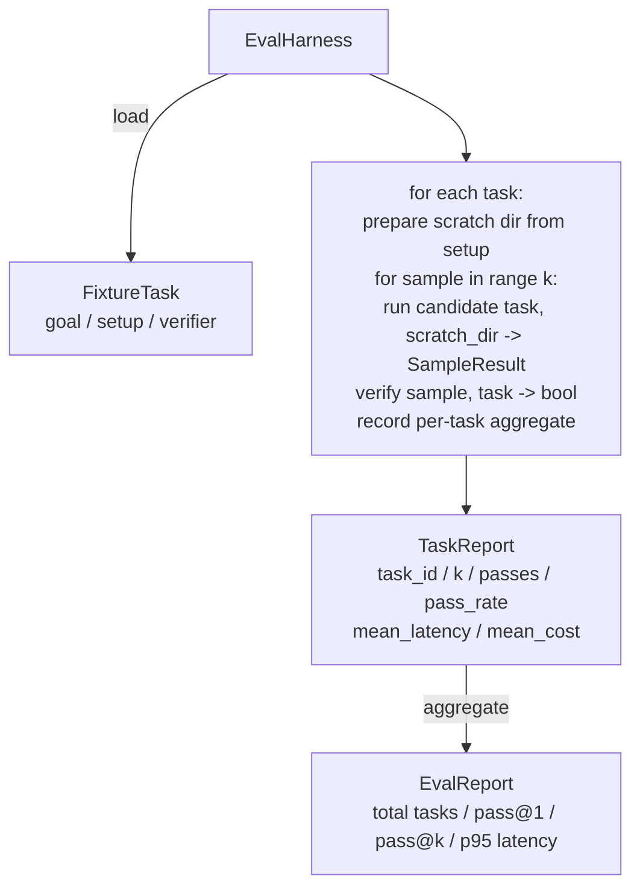

# Capstone Lesson 27: 带 Fixture Tasks 的 Eval Harness

> 一个 coding agent 的水平，取决于你用来衡量它的任务套件。本课会构建一个 evaluation harness：它接收一个 fixture tasks 文件夹，让候选 agent 逐个运行这些任务，通过确定性的 verifier 评定 pass 或 fail，并把结果聚合为 pass@1、pass@k、平均 latency 和平均 cost。harness 是事实来源，让你能区分 regression 和 refactor。

**Type:** Build
**Languages:** Python (stdlib)
**Prerequisites:** Phase 19 · 25 (verification gates), Phase 19 · 26 (sandbox runner), Phase 14 · 30 (eval-driven agent development), Phase 14 · 19 (SWE-bench and GAIA benchmarks)
**Time:** ~90 minutes

## Learning Objectives

- 将 fixture task 定义为 goal、setup 和 verifier 的三元组。
- 为每个任务的多次 sample runs 打分，并计算 pass@1 和 pass@k。
- 将 latency 和 cost 聚合为 mean 与 95th-percentile metrics。
- 将确定性 verifiers（file diff、exit code、regex match）接入可复用函数。
- 输出结构化 JSON report，供 regression-tracking script 摄取。

## The Problem

没有 eval harness 就构建 agent benchmarks，会遇到三类失败模式。

第一类是未经验证的 pass。agent 说它修好了 bug，人类瞥一眼 diff，就把套件标成绿色，三周后 regression test 暴露出同一个 bug。agent 的推理看似合理，但实际上什么也没修好。

第二类是未被发现的 regression。prompt template 的一次改动，让 agent 在显眼任务上提升 4%，却在安静任务上下降 14%。没有 goldset 和逐任务 score，regression 会进入 main，直到客户抱怨时才浮现。

第三类是逐任务漂移。eval 周一用 100 个任务运行，周五只用其中 95 个，因为有人重命名了 5 个 fixtures。pass rate 看起来提升了 5%。事实并非如此。

harness 是把这些失败转成事实的程序。它每次都以可复现顺序运行每个 fixture，并使用一个 verifier，根据确定性检查返回 true 或 false。

## The Concept

```mermaid
flowchart LR
  F1[fixtures/task_001/<br/>task.json + expected/] --> Harness
  F2[fixtures/task_002/<br/>...] --> Harness
  Harness[Harness<br/>for each task:<br/>setup / run agent k samples /<br/>verify each sample /<br/>record latency, cost]
  Harness --> Report[EvalReport<br/>pass@1 / pass@k<br/>mean ms / p95 ms<br/>mean cost]
```

`FixtureTask` 是一个小型 JSON 文件，加上一个可选的 `expected/` 目录。JSON 声明 `id`、`goal`（喂给 agent 的 prompt）、`setup` 块（要放入 scratch dir 的文件）以及 `verifier` 块。verifier 块指定 harness 的 verifier registry 中的一个函数，并提供其参数。

三种 verifier 形态覆盖大多数有用任务。

第一种是 `file_equals`。agent 运行后，将指定文件与 expected content 比较。这能捕捉“以这种精确方式修复这个 bug”的任务。

第二种是 `regex_match`。将指定文件内容与 regex 匹配。这能捕捉“函数必须存在并返回 X”的任务，其中可能有很多可接受解法。

第三种是 `shell_exit_zero`。harness 运行一个 shell command（通过 lesson 26 的 sandbox），只有当命令以 zero 退出时才让任务 pass。这能捕捉“tests must pass”的任务。

harness 将每个任务运行 `k` 次。Pass@k 是 `1 - (1 - p)^k`，其中 p 是经验 pass rate；harness 也报告 raw counts，方便你发现 variance。Latency 是每个 sample 的 wall-clock。Cost 是 agent 自行报告的任何内容（token count、USD，或两者）；harness 会跨 samples 求和，并呈现逐任务和聚合数字。

## Architecture



candidate 是一个 callable：`Callable[[FixtureTask, str], SampleResult]`。harness 通过 `tempfile.mkdtemp()` 创建 scratch directory，并把其路径作为普通字符串传入。harness 不关心 candidate 如何工作。candidate 可以是确定性的 patch applier（对 harness self-tests 很有用）、真实 LLM agent、fuzzer。契约是 SampleResult。

## What you will build

`main.py` 提供：

1. `FixtureTask` dataclass。
2. `SampleResult` dataclass：success_self_reported、latency_ms、cost_units、edits。
3. 带 `to_dict()` 的 `TaskReport`、`EvalReport` dataclasses。
4. 将 verifier name 映射到 function 的 `VerifierRegistry`。内置 verifiers：file_equals、regex_match、shell_exit_zero。
5. `EvalHarness` class。用一个 candidate 运行一个任务目录。返回 EvalReport。
6. 捆绑在 `tasks/` 中的五个 fixture tasks：
   - `fizzbuzz` 中的 off-by-one
   - `factorial` 中缺少 return
   - error message 中的 typo
   - 空 function body
   - linked-list traversal 中的 off-by-one
7. 一个确定性 reference candidate（`apply_known_fixes`），harness 用它演示干净的 pass@1 = 1.0。
8. Demo 打印 EvalReport JSON 并以 zero 退出。

fixture tasks 以 `tasks/` 中的 JSON 文件形式捆绑，并配有 `tasks/<id>/buggy/` 和 `tasks/<id>/expected/` 中的源文件。harness 将 buggy 复制到 scratch dir，把它交给 candidate，并依据 expected 验证。

## Why pass@k and not just pass@1

真实 LLM agents 是随机的。pass@1 为 0.6 看起来像失败。pass@5 为 0.95 表明 agent 大多数时候能得到正确答案，但在早期 samples 上选错了。修复方式是 sampling 和 ranking，而不总是更多 training。Pass@k 让这一点可见。

Pass@k 会和 pass@1 一起报告，因为 pass@k 会掩盖真实失败：如果 model 二十次里只有一次得到正确答案，你并没有一个有用的 agent。harness 会同时展示两者。

## How this composes with the rest of Track A

Lesson 25 产出了 gate chain。Lesson 26 产出了 sandbox。harness 对任何 `shell_exit_zero` verifier 使用 sandbox。Lesson 28 会把每次 harness run 包进 OTel trace。Lesson 29 针对其中一个捆绑 fixtures 运行 end-to-end demo，并断言 reference candidate 的 pass@1 = 1.0。

## Running it

```bash
cd phases/19-capstone-projects/27-eval-harness-fixture-tasks
python3 code/main.py
python3 -m pytest code/tests/ -v
```

demo 以 JSON 打印 EvalReport，包括 pass@1、pass@5、mean latency 和逐任务 breakdown。exit code 为 zero。tests 覆盖 verifier functions、pass@k math、fixture loading，以及 harness 针对捆绑 reference candidate 的 end-to-end 行为。

```figure
pass-at-k
```
