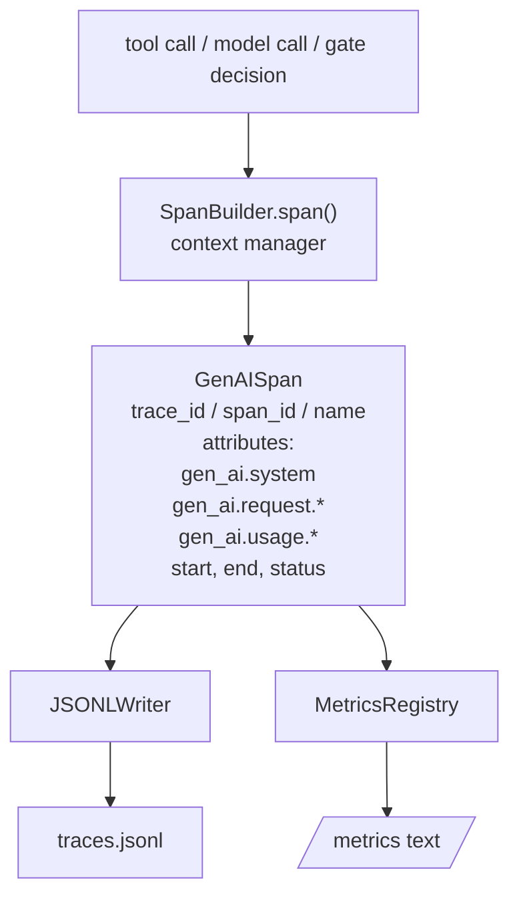
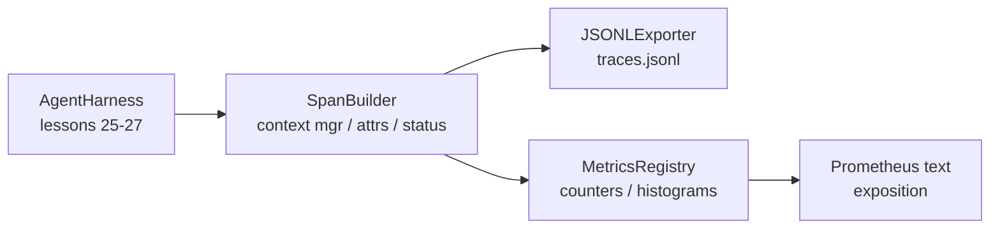

# Capstone Lesson 28: 使用 OTel GenAI Spans 和 Prometheus Metrics 实现 Observability

> 没有 observability 的 agent harness 是一个会花钱的黑箱。本课会手写一个 span builder，发出符合 OpenTelemetry GenAI semantic conventions 的 records，把它们写入 JSON-Lines 文件，每行一个 span，并以 Prometheus text format 暴露 counters 和 histograms。整个实现都是 stdlib Python，并且可离线运行。

**Type:** Build
**Languages:** Python (stdlib)
**Prerequisites:** Phase 19 · 25 (verification gates), Phase 19 · 26 (sandbox), Phase 19 · 27 (eval harness), Phase 13 · 20 (OpenTelemetry GenAI), Phase 14 · 23 (OTel GenAI conventions)
**Time:** ~90 minutes

## Learning Objectives

- 构建一个符合 OpenTelemetry GenAI semantic conventions 形态的 span data class。
- 实现一个 JSONL exporter，每行写入一个自包含 span。
- 构建带 labels 和 Prometheus text-format exposition 的 counters 与 histograms。
- 用 span context manager 包装任意 callable，记录 duration、status 和 exceptions。
- 验证发出的 spans 可通过 `json.loads` roundtrip，并匹配 spec shape。

## The Problem

生产中的 coding agent 每一轮都会产出三类 artifact：一次 model call、一次 tool execution，以及一个 verification gate decision。没有 structured telemetry，这些都没有用。

第一类失败模式是 missing trace。周二出了问题，但唯一记录是一份 500 行 chat log。没有记录哪个 tool 被运行、耗时多久、prompt 中有多少 tokens，或者 gate 是否拒绝了什么。agent 作者只能猜。

第二类失败模式是 unparseable trace。harness 写了 spans，但使用自己的 ad-hoc field names。Grafana、Honeycomb、Jaeger 或本地 CLI 都读不了。团队 stack 中已有的任何 tooling 都被浪费了，因为 spans 是非标准的。

第三类失败模式是 unaggregated metric。你能在 trace 中看到一次很慢的 tool call，但无法回答“过去一小时 read_file calls 的 p95 latency 是多少？”，因为没有 metrics，只有 traces。

OpenTelemetry GenAI semantic conventions 正是为此而存在。它们定义了一小组标准 attributes，供各类 LLM frameworks 的 span emitters 共享。如果你的 harness 写入这些 attributes，所有兼容 OTel 的 backend 都能读取它们。

## The Concept



harness 中的每个 operation 都会产生一个 span。span 具有 trace id（整个 agent invocation）、span id（这一个 operation）、name（例如 `gen_ai.chat`、`gen_ai.tool.execution`）、遵循 GenAI conventions 的 attributes、start 和 end time，以及 status。

GenAI conventions 标准化了这些 attribute keys：`gen_ai.system`（哪个 provider，例如 `anthropic`、`openai`）、`gen_ai.request.model`（model id）、`gen_ai.request.max_tokens`、`gen_ai.usage.input_tokens`、`gen_ai.usage.output_tokens`、`gen_ai.response.model`、`gen_ai.response.id`、`gen_ai.operation.name`，以及 tool-specific keys `gen_ai.tool.name` 和 `gen_ai.tool.call.id`。

exporter 写 JSONL。每行一个 JSON object。这是下游 tooling 可以 stream、grep 和 import 的最简单格式。真实 OTel exporter 会使用 OTLP gRPC；本课的 JSONL exporter 是离线等价物，并且在每台 workstation 上都以 zero 退出。

Metrics 与 traces 并列存在。每次 tool call 都会递增一个 counter：`tools_called_total{tool="read_file"}`。histogram 记录观察到的 latency：`tool_latency_ms{tool="read_file"}`。两者都会序列化为 Prometheus text exposition format，这是 pull-based metrics 的事实标准。

## Architecture



span builder 是一个小 class，带有 `span(name, attrs)` method，返回一个 context manager。context manager 在 enter 时记录 start time，在 exit 时记录 end time，如果抛出了 exception 就附加该 exception，并把 finalised span 推送给 exporter。

metrics registry 是两个 dicts。Counters 是 `{(name, frozen_labels): int}`。Histograms 将 raw samples 保存在 list 中，并在 exposition 时序列化为 Prometheus histogram buckets。

## What you will build

`main.py` 提供：

1. `GenAISpan` dataclass：trace_id、span_id、parent_span_id、name、attributes、start_unix_nano、end_unix_nano、status、status_message、events。
2. 带 `span(name, attrs, parent=None)` context manager 的 `SpanBuilder` class。
3. 带 `export(span)` 的 `JSONLExporter` class，追加写入一行。
4. `Counter` 和 `Histogram` classes，以及 `MetricsRegistry`。
5. 生成 text-format output 的 `prometheus_exposition(registry)`。
6. 发出 span 并更新 metrics 的 `wrap_tool_call(name)` decorator。
7. Demo：合成一次完整 agent invocation（tool spans 外层包 gen_ai.chat span），写入 traces.jsonl，打印 Prometheus exposition，并以 zero 退出。

span id 和 trace id 是 16-byte hex strings，由 `os.urandom` 生成。这符合 OTel 的 W3C trace context。exporter 永不抛出；IO errors 会被浮现，但 harness 会继续运行。

histogram 有一组固定 buckets（OTel 对毫秒 latency 的默认值：5、10、25、50、100、250、500、1000、2500、5000、10000、+Inf）。Samples 以 list 保存；exposition 会按需计算每个 bucket 的 counts。

## Why hand-rolled instead of opentelemetry-sdk

OTel Python SDK 是一个真实 dependency。它也有数千行代码、OTLP exporter 的多个进程，以及会淹没一节课预算的 runtime cost。手写版本教授 wire format。在生产中，你把相同 attributes 接入真实 SDK，就能免费得到 OTLP exporter、batching 和 resource detection。

conventions 是稳定的。本课发出的 wire format 到 2030 年仍会继续可解析，因为 OTel 从不破坏 GenAI attribute names；它们只会添加新的 names。

## How this composes with the rest of Track A

Lesson 25 产出了 gate chain。Lesson 26 产出了 sandbox。Lesson 27 产出了 eval harness。Lesson 28 让这三者都可观测。Lesson 29 会把 end-to-end demo 的每一步都包进 spans，并在最后打印 Prometheus text。

## Running it

```bash
cd phases/19-capstone-projects/28-observability-otel-traces
python3 code/main.py
python3 -m pytest code/tests/ -v
```

demo 会在本课的 working dir 中发出一个 `traces.jsonl`（最后清理），然后打印三个 spans 的 sample，再打印 counters 和 histograms 的 Prometheus exposition。tests 验证 spans 可 round-trip 序列化、canonical GenAI attributes 存在、counters 正确递增，并且 histogram exposition 包含 expected bucket counts。
