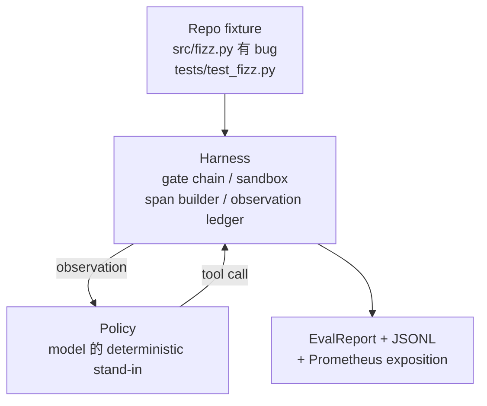
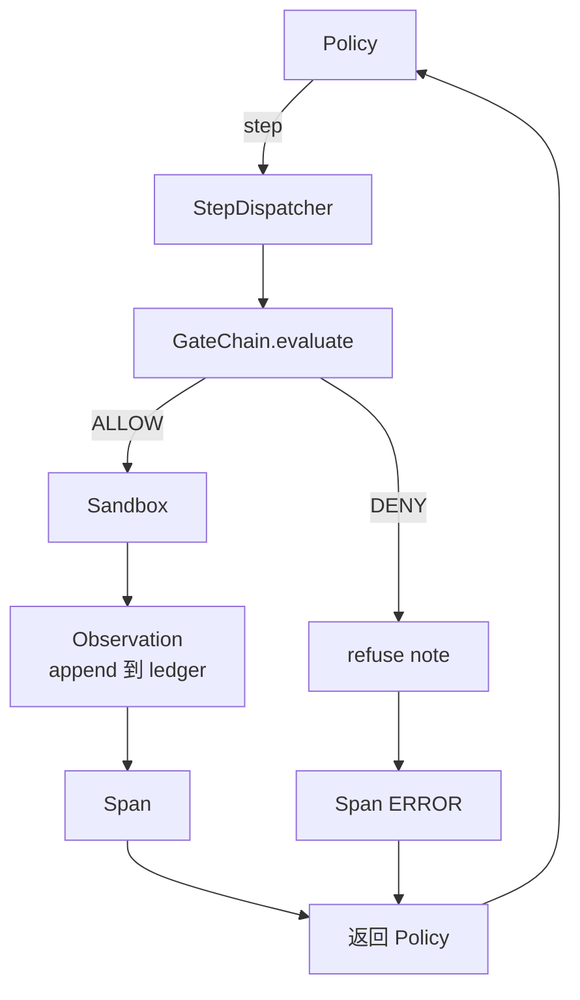

# Capstone 课程 29：Harness 上的端到端 Coding Agent

> Track A 的成果。本课程把 gate chain、sandbox、eval harness 和 OTel spans 串接成一个可工作的 Coding Agent，用来修复一个多文件 Python project 中真实的（小型 fixture 规模）bug。这个 agent 是 deterministic policy，不是 LLM；这个替换让课程可复现，并说明 harness 才始终是最关键的部分。contract 完全相同：真实模型可以插入 policy seam。

**Type:** Build
**Languages:** Python (stdlib)
**Prerequisites:** Phase 19 · 25 (verification gates), Phase 19 · 26 (sandbox), Phase 19 · 27 (eval harness), Phase 19 · 28 (observability), Phase 14 · 38 (verification gates), Phase 14 · 41 (workbench for real repos), Phase 14 · 42 (agent workbench capstone)
**Time:** ~90 minutes

## Learning Objectives

- 将 gate chain、sandbox、eval harness 和 span builder 组合成单个 agent loop。
- 实现一个使用 read_file、run_tests 和 write_file 修复 fixture bug 的 deterministic policy。
- 在一次端到端运行中强制执行全局 step budget 和 observation token budget。
- 为完整运行发出完整的 OTel GenAI traces 和 Prometheus metrics。
- 验证 agent 在少于 12 steps 内解决 fixture，并且合法 tools 上没有 gate trips。

## The Problem

大多数 agent demo 都是孤立工作的：单独一个 sandbox、单独一个 eval harness、单独一个 span emitter。它们看起来没问题。一旦组合起来，seams 就会暴露。

gate chain 给出 ALLOW，但 sandbox 因为 chain 没有预料到的原因拒绝。eval harness 记录 pass，但 OTel spans 显示 gate 拒绝了 agent 声称使用过的 tool。Prometheus counter 本应增加一次，却增加了两次。observation budget 已经超出，但 agent 继续运行，因为 budget 只在 chain 中追踪，而 sandbox 并不知道。

本课程是整个 track 的 integration test。agent 必须按顺序完成四件事：读取 project、运行 tests、从 test failure 中识别 bug、写入 fix、重新运行 tests，然后停止。每个 operation 都经过 gate chain。每次 tool execution 都经过 sandbox。每个 step 都包在 span 中。eval harness 最终为整体打分。

## The Concept



agent 的 policy 是一个 state machine。五个 states。

`SURVEY`：agent 读取 project listing。下一个 state 是 RUN_TESTS。

`RUN_TESTS`：agent 运行 test command。如果 tests pass，state machine 以 success 停止。否则下一个 state 是 INSPECT。

`INSPECT`：agent 读取失败的 source file。下一个 state 是 FIX。

`FIX`：agent 写入修正后的 file。下一个 state 是 VERIFY。

`VERIFY`：agent 再次运行 test command。如果 tests pass，则 halt success。否则 halt with failure。

每个 state 都对应一次 tool call。每次 tool call 都经过 gate chain。如果某个 tool call 被拒绝，agent 会在 trace 中报告拒绝并停止。

fixture bug 是 `fizz.py` 中的 off-by-one。deterministic policy 通过 regex 从 test failure message 中检测出 bug，并发出修正后的 file。把 policy 替换成 LLM 不会改变 harness contract。

## Architecture



本课程是自包含的。每个 prior-lesson primitive 都在 `main.py` 中以最小规模重新实现（gate、sandbox、ledger、span），所以本课程无需导入 sibling 就能运行。这些名称与 lessons 25-28 完全一致，因此概念映射是明确的。

## What you will build

`main.py` 提供：

1. 最小 harness primitives，名称与 lessons 25-28 相同：`GateChain`、`Sandbox`、`ObservationLedger`、`SpanBuilder`、`MetricsRegistry`。
2. `CodingAgentPolicy` class：包含五个 states 的 state machine。
3. `Repo` helper：准备一个 scratch dir，其中包含 bundled buggy fixture。
4. `AgentRun` class：驱动 policy，通过 harness dispatch，并返回 `AgentRunReport`。
5. 一个 bundled fixture（`fixture_repo/`），包含 src/fizz.py、tests/test_fizz.py，以及用于 eval harness 的 expected/ tree。
6. Demo：端到端运行 policy，打印逐步 trace，断言 pass，并打印 metrics。

bundled fixture 与 lesson 27 的 task structure 形状相同：一个 buggy file 和一个 tests file。test failure message 包含足够信息，让 deterministic policy 能识别 fix。真实 LLM 会做同样的工作，只是更慢并拥有更广的 recall，但它不会改变 harness 的 expectations。

## Why the policy is not an LLM

真实 LLM 需要 API key、network call，以及无法验证的 stochasticity。harness 才是本课程关心的部分。替换为 deterministic policy 能让课程在任何 developer laptop 上运行，零外部依赖，并让 test suite 断言精确的 step counts。

本课程的 policy 是 LLM agent 所做事情的严格子集。policy 读取 repo，看到 failing test，识别对应行，然后发出 fix。LLM 通过相同 loop 和相同 harness contract 完成工作；bookkeeping 完全一致。

## What the demo asserts

端到端 demo 在退出时断言五件事，test suite 也会以编程方式重新断言它们。

policy 在少于 12 steps 内解决了 fixture。

observation budget 从未超出。

合法 tools 上触发了零次 gate denials。（agent 从未凭空发明一个被拒绝的 tool name。）

traces.jsonl 中每个 step 都有对应的 span。

Prometheus exposition 包含一个 `tools_called_total{tool="read_file"}` entry 和一个 `tool_latency_ms` histogram。

## How this composes with the rest of Track A

本课程是 integration。Lesson 25 编写了 gate chain。Lesson 26 编写了 sandbox。Lesson 27 编写了 eval harness。Lesson 28 编写了 observability。Lesson 29 证明它们作为一个 system 可以工作。真实 agent harness 从这里扩展：把 deterministic policy 换成 model，把 bundled fixture 换成 real-repo task，把 JSONL exporter 换成 OTLP。

## Running it

```bash
cd phases/19-capstone-projects/29-end-to-end-coding-task-demo
python3 code/main.py
python3 -m pytest code/tests/ -v
```

demo 会打印 per-step trace、final eval report 和 Prometheus exposition。退出码为零。tests 覆盖 policy state transitions、synthetic tool calls 上的 gate refusals、bundled fixture 上的 end-to-end run，以及 step-budget invariants。
