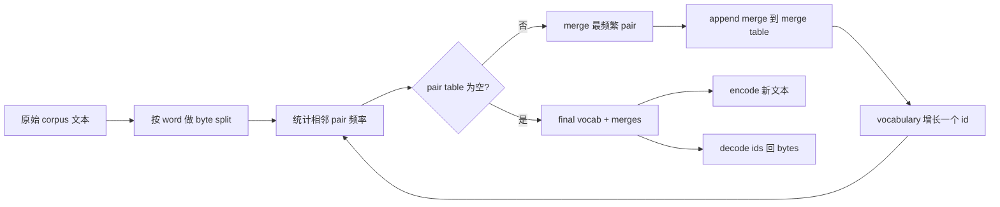
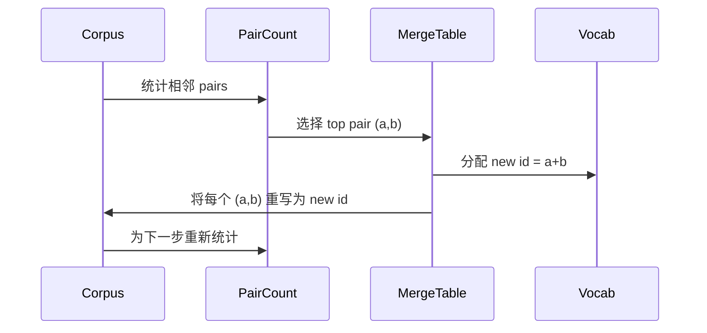

# 从零构建 BPE Tokenizer

> 字节进，ids 出，ids 再回到相同字节。构建每个现代文本模型仍然起步于此的 Tokenizer。

**Type:** Build
**Languages:** Python
**Prerequisites:** Phase 04 lessons, Phase 07 transformer lessons
**Time:** ~90 minutes

## Learning Objectives
- 通过反复 merge 最频繁的相邻 symbol pair，从原始 text corpus 训练 Byte-Pair Encoding vocabulary。
- 实现 deterministic merge table，并将其应用到新文本上，生成 subword ids 流。
- 将任意 UTF-8 input 往返转换为 ids 并还原，且不丢失信息。
- 保留并保护 special tokens（`<|endoftext|>`、`<|pad|>`），让它们能在 training 和 decoding 后保持不变。
- 推理为什么 byte-level alphabet 是通用 Tokenizer 的正确下限。

## The frame

language model 永远看不到文本。它看到的是 integers。把 string 映射为 integers list 并再映射回来的东西，就是 Tokenizer。这个层做错了，training run 中每条 Loss curve 都在衡量错误的东西。

通用文本模型中占主导的 subword Tokenizers 家族是 Byte-Pair Encoding。想法很小。从一个已知 alphabet 开始。找到 training corpus 中最常出现的相邻 symbol pair。把它 merge 成一个新 symbol。重复，直到 vocabulary 达到目标大小。encoding 新文本会按同样顺序复用相同的 merge list。

我们将构建 byte-level variant。alphabet 是 256 个 raw bytes，而不是 Unicode code points。这个选择让 Tokenizer 能处理任何 UTF-8 input，而无需 fallback 到 unknown Token。

## The pipeline

training side 和 inference side 共享 merge table。这个共享就是 contract。如果你在 inference 时改变 merge order，就会 decode 出不同的 ids 流。

## The byte alphabet

前 256 个 ids 保留给 raw bytes 0x00 到 0xFF。这保证每个 input string 都能在任何 merge 发生之前用 vocabulary 表达出来。在 byte block 之后，我们为 special tokens 保留一小段范围。training loop 永远不会提出这些 ids 作为 merge targets，因为我们会把它们完全排除在 pretokenized stream 之外。

pretokenizer 会在 training 看到 corpus 之前，按 whitespace 和 punctuation boundaries 进行 split。如果没有这个 split，BPE merge step 会很乐意学习跨越 word boundaries 的 merges，vocabulary 会被常见整句短语填满。有了这个 split，merges 会留在 word 内部，结果也更能泛化。

## The training loop

每个 training step 中，loop 做三件事。它遍历 corpus 中的每个 word，统计当前 symbols 的每个相邻 pair 出现的频率，并按 word 本身出现的频率加权。它选择 count 最高的 pair。它把该 pair 的每次出现重写为一个 single new symbol，其 id 是 vocabulary 中下一个空位。然后它记录 merge。

每个 step 的成本与 corpus 作为 symbol sequences list 表达时的大小呈线性关系。对于一百万 words 和一万个 ids 的 target vocabulary，loop 会在几秒内完成，因为 symbol sequences 会随着 merges 落地而缩短。

## Encoding fresh text

inference 不调用 merge counter。它按学习到的相同顺序应用 merge table。对于一个新 word，encoder 从 byte split 开始。它扫描当前 sequence，寻找 rank 最低的 merge（最早学习到且可应用的那个）。它执行该 merge。然后再次扫描。当 table 中没有任何 merge 适用于当前 sequence 时，loop 结束。

按 rank 排序这一属性使 encoding deterministic，并且与 training 在相同 input 上的行为一致。最先学习到的 merge 位于 table 顶部，并最先应用。如果两个 merges 都能在同一位置应用，rank 更低的那个胜出。

## Special tokens

special tokens 是 byte stream 永远无法产生的 ids。我们手动保留它们。本课程两个就足够。

- `<|endoftext|>` 在 pretraining 期间分隔 documents。它告诉 model：“一个新 document 从这里开始，不要让前一个 document 的 context 泄漏进来。”
- `<|pad|>` 填充短 sequences，让 batch 可以成为 rectangular tensor。Loss mask 会在 training 期间隐藏它。

encoder 接受一个 flag，用来允许 input 中出现 special tokens。当 flag 关闭时，字符串 `<|endoftext|>` 和 `<|pad|>` 会按拼写它们的 bytes 来 tokenize。当 flag 打开时，literal strings 会映射到其 reserved ids，并且不会参与任何 merge。

## Round-trip guarantee

Encoding 后再 decoding 必须精确返回 input bytes。decoder 会按顺序拼接每个 id 的 byte expansion。由于每个 id 要么是 raw byte，要么是两个 previously known ids 的 concatenation，recursive expansion 总会终止于 raw bytes。decoding 随后返回这些 bytes 拼出的 UTF-8 string。

本课程的 test suite 会在一个 unseen sentence、一个包含 Unicode emoji 的 sentence，以及一个包含 literal `<|endoftext|>` Token 的 sentence 上检查这个属性。

## What this lesson does not do

它不会构建最大型 production Tokenizers 风格的 regex-driven pretokenizer。这里的 pretokenizer 是一个小型 whitespace 和 punctuation split。它足以在小型 training corpus 上产生合理 merges，而且与课程链后续部分的 contract 保持不变。下一课会把 Tokenizer 当作 black box，并在其上构建 sliding-window dataset。

它不会 parallelize pair counter。在 Python 中对几千个 words 的 corpus 做 loop 会在远低于一秒内完成。对于更大的 corpora，显而易见的做法是并行统计每个 word 的 pairs，然后 reduce。

## How to read the code

`main.py` 定义四个 objects。`BPETokenizer` 持有 vocabulary、merge table 和 special-token table。`train` 是 training loop。`encode` 是 inference path。`decode` 是 byte concatenation。底部的 demo 会在内置 corpus 上训练一个小型 Tokenizer，encode 一个 held-out sentence，将 ids decode 回来，并打印两者。`code/tests/test_bpe.py` 中的 tests 固定了 round-trip property、special-token reservation 和 merge ordering。

运行 demo。然后把 demo 中的 target vocabulary size 从 300 改成 600，观察 held-out sentence 的 encoded length 如何下降。那条曲线就是 BPE compression curve。
