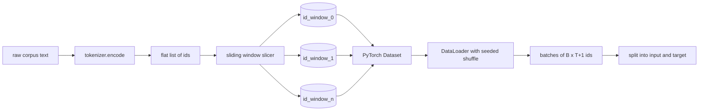
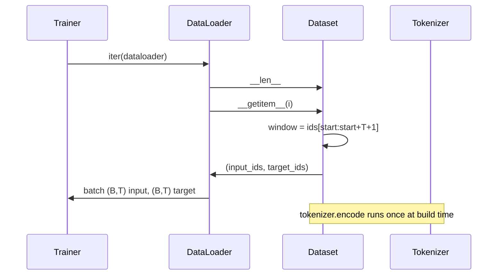

# 使用 Sliding Window 的 Tokenized Dataset

> 一次预训练运行，是一个从 Token ids 到 Gradient 的函数。本课会构建把 ids 送进去的传送带。

**Type:** Build
**Languages:** Python
**Prerequisites:** Phase 04 lessons, Phase 07 transformer lessons, 本 phase 的 Lesson 30
**Time:** ~90 分钟

## Learning Objectives
- 通过只调用一次 Tokenizer，把原始 corpus 转换为 Token ids 流。
- 使用可配置的重叠 stride，把 id 流切成固定长度的 window。
- 构建一个 PyTorch Dataset，为 next-token prediction 返回 input 和 target tensors。
- 用 DataLoader 包装 dataset，并使用按 epoch 设定 seed 的 deterministic shuffle。
- 推理 stride、冗余和有效 dataset size 之间的权衡。

## 框架

一次预训练运行每次读取一批 Token ids，并更新 model。每个 batch 的形状由训练 contract 固定。对于 causal language model，batch 持有 `(B, T)` input ids 和 `(B, T)` target ids，其中 target 是 input 左移一位。data pipeline 的工作，是从可能有数 GB 原始文本的 corpus 中，按需、deterministic 且可复现地产生这个 contract。

本课会构建这条 pipeline。上一课的 Tokenizer 会把文本转换为一个很长的扁平 ids 列表。Sliding Window 会把这个列表切成训练 examples。自定义 Dataset 会把 examples 暴露为 tensors。DataLoader 会把它们组成 batch，并用已知 seed 进行 shuffle。

## 形状 contract

causal LM 消费形状为 `(B, T)` 的 ids，其中 `B` 是 batch size，`T` 是 context length。位置 `t` 的 target 是位置 `t+1` 的 input。这意味着每个训练 example 覆盖 `T+1` 个原始 ids。window stride 控制相邻 examples 之间有多少重叠。

slicer 永远不会跨越 corpus 的边界。如果最后一个 window 没有足够的 ids 填满 `T+1` 个位置，slicer 会丢弃它。用 `<|pad|>` 填充尾部也是有效选择，但它会让 Loss mask 变复杂。本课选择丢弃。

## 为什么使用 Sliding Window

预训练 corpus 是一条很长的 ids 流。如果 model 只看到不重叠的 window，每个训练 example 都会教它相同的 `T` 个边界。调整 stride 会移动这些边界，让 model 看到更多样的 predict-next-token 任务。

stride 为 `T` 会产生不重叠的 window。stride 为 `T // 2` 会产生百分之五十的重叠，并使有效 dataset 翻倍。stride 为 `1` 会产生最大重叠，并让 dataset 增大 `T` 倍。代价是每个 epoch 需要更多 compute。收益是边界多样性更高。大多数预训练运行使用等于 context length 的 stride，因为 corpus 已经远大于 model 在一个 epoch 内能跑完的规模，所以边界多样性的论点更弱。

## Dataset class

PyTorch Dataset 有两个必需方法。`__len__` 返回 examples 数量。`__getitem__` 以一对 tensors 的形式返回一个 example。我们的 Dataset 存储编码后的 id 流和 stride。对它进行索引时，会即时计算 window 的起点，因此无论 stride 产生多少 examples，memory cost 都只是 id 流的一份副本。

shift-by-one 发生在 `__getitem__` 内部。Dataset 返回 `(input, target)`，其中 `input = window[:-1]`，`target = window[1:]`。两者都是 PyTorch long tensors。training loop 会把它们当作 ground truth。

## Deterministic shuffle

使用 `shuffle=True` 的 DataLoader 会从 PyTorch random generator 读取。通过传入一个按 epoch 设定 seed 的显式 `torch.Generator`，每次重启运行时都能得到相同的 shuffle。当你想比较两个只差一个 hyperparameter 的运行时，这个属性很重要。没有 seed 时，两次运行会以不同顺序看到数据，Loss curves 会因为与改动无关的原因而分叉。

本课的 seed contract 很简单。`epoch_seed = base_seed + epoch_index`。base seed 在构造时传入。epoch index 由 trainer 在每个 epoch 顶部递增。使用相同 base seed 重新运行，总会在每个 epoch 中看到相同顺序。

## Batch sampler

PyTorch 的默认 sampler 会无放回地均匀随机选取 indices。这正是预训练需要的。对小 dataset 做 finetuning 时，contract 也是一样。DataLoader 通过调用 `B` 次 `__getitem__` 并 stack 结果来组装一个 batch。因为每个 example 在构造上长度相同，所以不需要 padding logic。

本课为了简单起见保留 `num_workers=0`。在生产运行中，workers 会并行化 `__getitem__` calls。对于我们的 pipeline 来说，这基本是 no-op，因为工作只是对 in-memory tensor 做 slice，但同一个 Dataset API 可以干净地支持 workers。

## 计算 examples

对于长度为 `N` 的 id 流、context length `T` 和 stride `S`，examples 数量是 `max(0, 1 + (N - (T + 1)) // S)`。本课把这个计算暴露为 Dataset 上的 static method，这样 trainer 可以不经过迭代就计算每个 epoch 的 total steps。

## 本课不做什么

它不会从 disk streaming。corpus 会完整编码到 memory 中，并作为单个 tensor 保存。对于几百万 ids 的 corpus，这远低于一百 MB，而且是本课合适的形状。Disk streaming 是另一个关注点，它可以通过替换 storage 接入，同时保持 Dataset contract 不变。

它不处理 multiple documents。corpus 被视为一条连续的 id 流。当 corpus 从多个 documents 构建时，会插入 `<|endoftext|>` ids 来编码 next-document boundary。model 会学习围绕边界进行预测。

## 如何阅读代码

`main.py` 定义了两个 classes 和一个 helper。`SlidingWindowDataset` 是 PyTorch Dataset。`make_dataloader` 返回一个配置好的 DataLoader，并带有 seeded generator。`_encode_corpus_to_ids` 是一次性的 Tokenizer call。底部的 demo 会在进程内构建一个小 Tokenizer，编码内置 corpus，构造 dataset 和 dataloader，打印一个 batch，并断言形状 contract。`code/tests/test_dataset.py` 中的 tests 固定了 window count formula、shift-by-one 属性、deterministic shuffle 和 stride trade-off。

运行 demo。然后把 context length 从 16 改为 32，观察每个 epoch 的 examples 数量如何下降。这个数字就是你的 steps-per-epoch budget。
