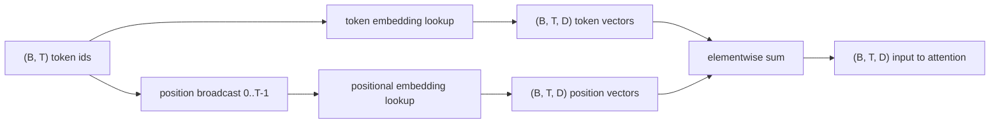
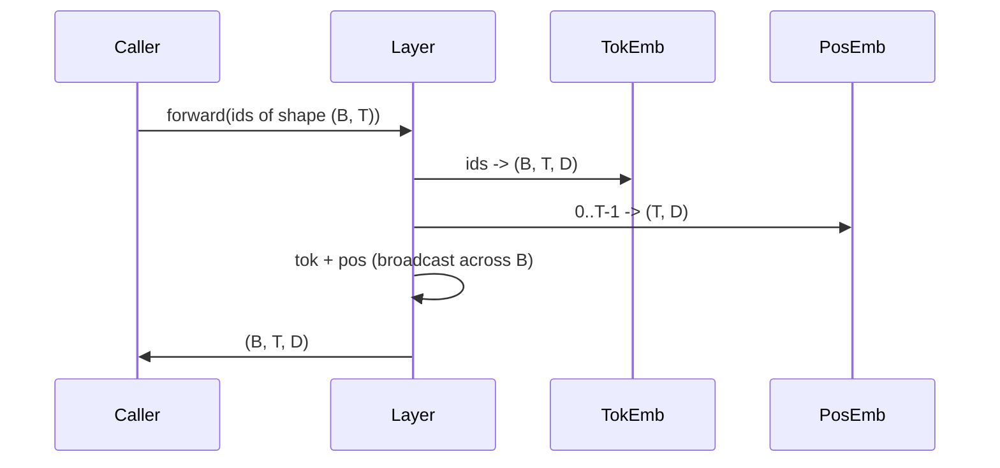

# Token 和 Positional Embeddings

> Ids 是整数。model 需要 Vector。两张 lookup tables 位于二者之间，而 positional table 的选择会塑造 model 能学到什么。

**Type:** Build
**Languages:** Python
**Prerequisites:** Phase 04 lessons, Phase 07 transformer lessons, 本 phase 的 Lessons 30 和 31
**Time:** ~90 分钟

## Learning Objectives
- 构建一个 token-embedding lookup table，把 vocabulary ids 映射到 dense vectors。
- 构建一个按 position 索引的 learned positional-embedding lookup table。
- 构建一个按 position 索引、没有 parameters 的 fixed sinusoidal positional embedding。
- 把 Token 和 positional embeddings 组合成 Transformer block 的单一 input。
- 对比 learned 和 sinusoidal embeddings 在 length generalization 和 parameter count 上的差异。

## 框架

model 与 token id 的第一次接触，是在 token-embedding Matrix 中进行 row lookup。这个 Matrix 每个 vocabulary id 有一行，每个 model dimension 有一列。lookup 返回一个 Vector，model 的其余部分会把它当作该 id 的含义。Backpropagation 会更新 forward pass 中用到的 rows。在训练过程中，这些 rows 的几何结构会学习在方向上编码相似性。

Token ids 本身没有顺序。model 需要第二个信号，告诉它 position one 不同于 position seventeen。这个信号的两种主流选择是 learned positional embedding（第二张 lookup table，每个 position 一行）和 fixed sinusoidal positional embedding（一个没有 parameters 的数学公式）。选择会带来后果。learned table 是 parameter，并且受限于 model 训练时的最大 context length。sinusoidal table 理论上没有 parameters，公式可以扩展到任何 position，但本课的 `SinusoidalPositionalEmbedding` 会在 `max_context_length` 预计算一张固定 table，它的 `forward` 会在超过该边界时 raise；因此这里两个 modules 都会强制执行最大 context length。即使 table 足够大可以索引，当超过训练长度时，model 仍可能表现吃力。

本课会构建两者，并把它们与 token embedding 组合成下一课 attention block 的单一 input。

## 形状 contract

embedding stage 的 input 是形状为 `(B, T)` 的一批 Token ids。output 是形状为 `(B, T, D)` 的 tensor，其中 `D` 是 model dimension。每个 batch element 都有相同的 context length `T`。每个 position 都有相同的 Vector dimension `D`。



组合方式是 sum，不是 concatenation。sum 会让 `D` 在 network 中保持不变，并让 model 基于每个 feature 决定 token meaning 或 position 在每一层中哪个占主导。

## Token embedding Matrix

token embedding 是一个形状为 `(V, D)` 的 parameter tensor，其中 `V` 是 vocabulary size。PyTorch 以 `nn.Embedding(V, D)` 暴露它。init 时 entries 从一个小 Gaussian 中抽取，对于 Transformer-scale models，传统上 mean 为零，standard deviation 约为 `0.02`。精确 init 没那么重要，重要的是它在不同运行之间保持一致。

forward pass 是一次 indexing operation。PyTorch 通过 gather rows，把 `(B, T)` int64 ids 映射为 `(B, T, D)` floats。backward pass 只会把 Gradient 累积到 forward pass 中被触碰过的 rows。两个从未出现在 batch 中的 rows 在该 step 收到零 Gradient。

一个微妙细节。token embedding 和 model 末端的 output projection 经常共享 weights（weight tying）。发生这种情况时，每次 backward pass 都会通过 output side 触碰 embedding 的每一行。本课这里把两者暴露为分离 modules，但在完整 model 中，同一个 Matrix 可以同时扮演两个角色。

## Learned positional embedding

learned positional embedding 是第二个 `nn.Embedding`，形状为 `(max_context_length, D)`。lookup 由 position id `0, 1, 2, ..., T-1` 作为 key。forward pass 会把这个 position Vector broadcast 到 batch dimension 上。

learned table 的缺点是，如果 model 只训练到 position `T-1`，它就不能查询 position `T`。那一行不存在。使用这种方案的生产 decoder-only models 会把最大 context length 烘焙进 architecture，并拒绝处理更长 inputs。

## Sinusoidal positional embedding

sinusoidal positional embedding 是从 position 到 Vector 的函数。Position `p` 和 feature `i` 产生：

```python
angle = p / (10000 ** (2 * (i // 2) / D))
emb[p, 2k]     = sin(angle)
emb[p, 2k + 1] = cos(angle)
```

这个函数没有 parameters。每个 position 都有唯一的 Vector。wavelength 会跨 feature dimensions 按几何方式变化，因此较低 dimensions 编码粗粒度 position，较高 dimensions 编码细粒度 position。

由同时选择 `sin` 和 `cos` 得到的性质是，position `p + k` 处的 Vector 是 position `p` 处 Vector 的线性函数。这给 attention layer 提供了一条学习 relative-position offsets 的简单路径。model 不需要单独的 parameter 来表达“向后看五个 tokens”。

本课会在构造时计算完整 sinusoidal table 一次，并在 forward 时索引它。

## 组合

input pipeline 按顺序做三件事。读取 Token ids。查找 token vectors。加上 positional vectors。返回 sum。



sum step 中的 broadcasting 会沿 batch dimension 复制 `(T, D)` positional tensor。PyTorch 会自动处理，因为 positional tensor 在 unsqueeze 后形状为 `(1, T, D)`。

## 对比分析

本课会在相同 inputs 上运行两种 variants，并打印两个 diagnostics。

第一个是 parameter count。learned variant 会在 token embedding 之上增加 `max_context_length * D` 个 parameters。sinusoidal variant 增加零个。

第二个是相邻 positions 的 embeddings 之间的 cosine similarity。sinusoidal variant 有平滑且可预测的衰减，因为函数是连续的。learned variant 在 initialization 时具有近似随机的 similarity，因为 rows 是独立抽取的。训练后，learned variant 通常也会发展出类似的平滑结构，但它必须从数据中发现这种结构。

## 本课不做什么

它不会构建 rotary positional encoding (RoPE) 或 AliBi。它们是生产 Transformers 中的现代选择。它们都遵循与这里的 embeddings 相同的形状 contract（对形状为 `(B, T, D)` 的 vectors 应用依赖 position 的 transformation），但它们应用在 attention-projection step，而不是 input。下一课会构建 attention block，其中一个 optional extension 是把 rotary 折入那里的 query-key projections。

它不会训练 embedding。训练需要 Loss，Loss 需要 model output，model output 需要 attention 和 LM head。那是下一课和再下一课的内容。

## 如何阅读代码

`main.py` 定义了三个 modules。`TokenEmbedding` 包装 `nn.Embedding(V, D)`。`LearnedPositionalEmbedding` 包装 `nn.Embedding(L, D)`。`SinusoidalPositionalEmbedding` 预计算 table，并把它暴露为 buffer。`EmbeddingComposer` 把 token embedding 和 positional embedding 绑定在一起。底部的 demo 会打印 shapes、parameter counts 和 neighbour-position similarity diagnostic。`code/tests/test_embeddings.py` 中的 tests 固定了 shape、broadcast behaviour、parameter count 和 sinusoidal formula。

运行 demo。然后把 model dimension `D` 从 64 改为 32，观察 sinusoidal wavelength bands 如何变化。
