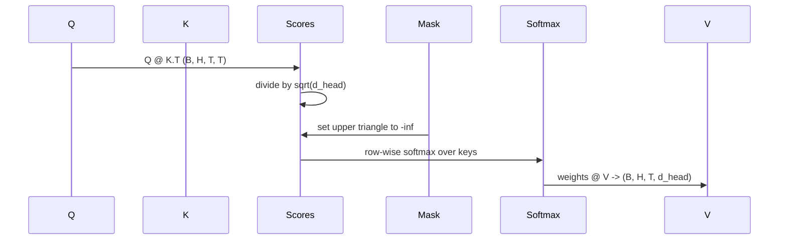

# Multi-Head Self-Attention

> 一个线性投影，三种视图，H 个并行 head，一个 mask。这就是模型实际使用的 Attention block。

**Type:** Build
**Languages:** Python
**Prerequisites:** Phase 04 lessons, Phase 07 transformer lessons, Lessons 30 through 32 of this phase
**Time:** ~90 minutes

## Learning Objectives
- 将批量 Query/Key/Value 投影实现为一个线性层，并拆分为 H 个 head。
- 使用正确的归一化和 dtype 处理计算 scaled dot-product attention。
- 应用 causal mask，防止某个位置关注未来位置。
- 检查固定输入下每个 head 的 Attention weights，并推理每个 head 关注的内容。
- 在 toy task 上训练一个小型 Attention block，观察 Loss 随着各 head 专门化而下降。

## The frame

Attention 是一种函数，它让一个 Token 的表示能够从同一序列中的其他 Token 拉取信息。Self-attention 表示 queries、keys 和 values 都来自同一个输入。Multi-head 表示投影被拆分为 H 个并行的 Attention 问题，它们的输出会被拼接并投影回来。

高效实现模式是使用一个线性层从 `D` 投影到 `3 * D`，再切分为三个视图，然后 reshape 为 H 个 head，每个大小为 `D // H`。matmul、softmax 和加权求和都作为批量 tensor 操作执行，因此各 head 可以在加速器上并行运行。

本课会构建这个 block。它还会加入 causal mask，使同一段代码可以作为 decoder-only language model 中的 Attention layer 使用。下一课会把这个 block 堆叠成完整的 transformer，再下一课会训练它。

## The shape contract

输入是 `(B, T, D)`。输出是 `(B, T, D)`。mask 是 `(T, T)`，或可以 broadcast 到它。在 block 内部，中间 tensor 的 shape 是 `(B, H, T, d_head)`，其中 `d_head = D // H`。约束条件是 `D % H == 0`。

```mermaid
flowchart LR
    A["(B, T, D) 输入"] --> B[Linear D -> 3D]
    B --> C["拆分为 Q, K, V"]
    C --> D["reshape 为 (B, H, T, d_head)"]
    D --> E["scores = Q @ K.T / sqrt(d_head)"]
    E --> F[应用 causal mask]
    F --> G[对 keys 做 softmax]
    G --> H["context = weights @ V"]
    H --> I["reshape 为 (B, T, D)"]
    I --> J[输出 Linear D -> D]
    J --> K["(B, T, D) 输出"]
```

两个线性层（QKV projection 和 output projection）是 block 中唯一的参数。mask、softmax、matmuls 和 reshapes 都没有参数。

## The QKV split

朴素实现会有三个独立的线性层，分别用于 Q、K 和 V。高效实现只有一个层，输出 `3 * D` 个特征并拆分结果。二者在数学上等价，因为三个分别乘以 `(D, D)` 权重的 Matrix multiplications，正好等于一次乘以由它们堆叠而成的 `(3D, D)` 权重的 Matrix multiplication。

高效版本更快，因为加速器只启动一次 matmul，而不是三次。它也更容易初始化，因为三个子 Matrix 位于同一个参数 tensor 中，可以一起初始化。

## The head reshape

拆分之后，Q、K、V 都是 `(B, T, D)`。为了把它变成 H 个并行的 Attention 问题，我们 reshape 为 `(B, T, H, d_head)`，再 transpose 为 `(B, H, T, d_head)`。head 维度现在位于 batch 维度旁边，因此 PyTorch 会把 per-head attention 视为跨 `B * H` 个独立实例的批量操作。

`d_head` 维度保持在最后，因此 score matmul `Q @ K.transpose(-2, -1)` 会在这个维度上收缩。结果是 `(B, H, T, T)` 的 per-head attention scores。

## Scaling

scores 会在 softmax 前除以 `sqrt(d_head)`。如果没有这个 scaling，dot products 会随着 `d_head` 增大而增大，把 softmax 推到一种几乎所有质量都集中在一个条目上、其他条目都接近消失的状态。这个状态下 Gradient 很小，学习会停滞。除以 `sqrt(d_head)` 可以让 scores 的方差在不同 head size 下大致保持恒定。

## The causal mask

decoder-only language model 在预测下一个 Token 时只能依赖过去。mask 会强制这一点。具体来说，在 softmax 之前，`(T, T)` score Matrix 对角线以上的每个条目都会被替换为负无穷。softmax 之后，这些位置的权重会变为零。

我们在构造时把 mask 注册为 buffer，因此它会和模型位于同一 device 上，并且不是 Gradient graph 的一部分。mask 覆盖该 block 可能见到的最大上下文长度。在 forward 时，我们切出左上角的 `(T, T)` 区域。

## The output projection

得到 per-head context vectors `(B, H, T, d_head)` 后，我们 transpose 回 `(B, T, H, d_head)`，reshape 为 `(B, T, D)`，并应用最后一个 `(D, D)` 线性投影。output projection 让模型可以混合各个 head。没有它，H 个 head 只能通过后续层重新组合，block 会受到人为限制。

## Attention weight inspection

本课在 forward pass 上暴露了一个 `return_weights=True` flag。设置后，block 会在输出旁边返回 shape 为 `(B, H, T, T)` 的 per-head Attention weights。demo 会在短输入上打印某个 head 权重的 heatmap，因此你可以看到 causal-triangle 结构和每个位置的关注点。

在训练好的模型中，不同 head 会学到不同模式。有些 head 会关注紧邻的前一个 Token。有些 head 会关注序列开头。有些 head 会把 Attention 几乎均匀地分散开。这个 inspection hook 是开展可解释性工作的入口。

## The training demo

`main.py` 底部的 demo 会把 Attention block 接到一个很小的 LM head，并在 repeat task 上训练整个模型。输入中的每一行都是一个随机 id，在整个上下文中复制。target 是右移一位的输入，所以模型必须学会下一个 Token 与前一个 Token 相同。Loss 是 cross-entropy。使用 H=4、D=32、T=12 和大小为 64 的 vocabulary 时，Loss 会在 CPU 上经过三个 epoch 后从随机水平（约 `log(64) ~ 4.16`）下降到远低于 `1.0`。

demo 的目的不是训练一个有用的模型。目的在于确认 Gradient 能流过 block 的每个部分，并且各 head 能在一个答案显然的问题上学到东西。

## What this lesson does not do

它不会添加 feed-forward block。真实模型中的 transformer layer 是 Attention 后接两层 MLP，并在每个部分周围带有 residual connection 和 layer norm。下一课会添加这些内容。

它不会实现 rotary 或 AliBi positional encoding。二者都在同一个 block 的 QKV projection 步骤中应用，但它们是独立的教学单元。这里构建的 block 与二者都兼容，只需在 matmul 前转换 Q 和 K。

它不会实现 inference 用的 KV cache。跨 forward passes 缓存 keys 和 values 是让 autoregressive decoding 变快的优化。它会改变 K 和 V tensor 的 shape contract，但不会改变 Q。它属于 inference 课程。

## How to read the code

`main.py` 定义了 `MultiHeadSelfAttention`。该 class 包含两个线性层和一个注册的 mask buffer。forward pass 会依次执行 projection、reshape、score、mask、softmax、weight、reshape，并再次 projection。底部的 demo 构建了一个小模型，用 Token 和 positional embeddings 以及 LM head 包装 Attention，在 copy task 上训练三个 epoch，并打印 Loss curve 和 per-head Attention heatmap。`code/tests/test_attention.py` 中的测试固定了 shape contract、causality property、softmax property、head-split property 和 Gradient flow。

运行 demo。然后把 `n_heads` 从 4 增加到 8（保持 `d_model=32`，因此 `d_head=4`），观察 heatmap 如何变化。
