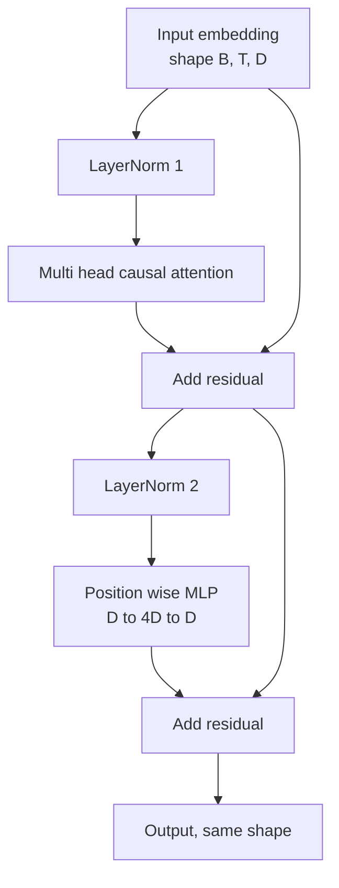
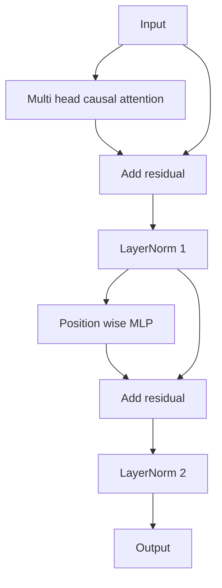

# 从零实现 Transformer Block

> 一个 block 是每个现代 decoder LLM 的基本单元。Layer norm、multi head attention、residual、MLP、residual。pre-LN 变体无需 warmup 也能稳定训练。post-LN 变体是原始论文发布的版本。本课会并排构建二者，并展示在常见 learning rate 下，哪一个能撑过 12 layer stack。

**Type:** Build
**Languages:** Python
**Prerequisites:** Phase 19 lessons 30 to 33 (tokenizer, embeddings, attention math, batched data loader)
**Time:** ~90 minutes

## Learning Objectives

- 从四个运动部件构建 PyTorch 中的 transformer block：LayerNorm、multi head causal attention、residual connections、position wise MLP。
- 将 LayerNorms 放在两种配置中（pre-LN 和 post-LN），并解释为什么其中一种无需 warmup 也能稳定训练。
- 在 multi head attention 内实现 causal masking，使 Token `i` 不能看到 Tokens `j > i`。
- 跟踪 12 layer stack 中两个变体的 Gradient flow，并不靠含糊说法解读结果。
- 在下一课组装 1.24 亿参数 GPT 时，把这个 block 作为可直接替换的单元复用。

## The Problem

transformer 就是重复一个 block。如果这个 block 一开始就错了，再重复十二次，你得到的模型要么在第一个 epoch 就发散，要么一路都需要 warmup hack。本课会看到的两种失败模式并不罕见。学习者第一次天真地堆叠 blocks 时就会遇到它们。一个是 Attention layer 关注了未来。另一个是 LayerNorm 放在了无法在深度上驯服 residual signal 的位置。

一旦看清楚，修复就是机械的。这个 block 恰好有两条 residual paths 和两个 normalization positions。正确选择位置之后，stack 的其余部分只是 bookkeeping。

## The Concept

每个 decoder only transformer block 都是一个函数，它接收 shape 为 `(batch, sequence, embedding)` 的 tensor，并返回相同 shape 的 tensor。内部由两个 sublayers 完成工作。



这是 pre-LN 变体。LayerNorm 位于 residual branch 内部，在 sublayer 之前。residual connection 会把未归一化的 signal 向前传递。

post-LN 变体会把 LayerNorm 移到 residual add 之后。



shape 完全相同。训练行为并不相同。使用 post-LN 时，沿 residual path 反向流动的 Gradient 必须穿过 LayerNorm。在十二层深度和 learning rate `3e-4` 下，这个 Gradient 会缩小得足够快，以至于需要 warmup schedule。Pre-LN 让 residual path 保持未归一化，因此 Gradient 能干净地传播到 Embedding layer。正因如此，GPT-2 之后发布的配置都使用 Pre-LN。

### Causal multi head attention

Attention sublayer 会把输入以三种方式投影成 query、key、value tensors。每个 tensor 都从 `(B, T, D)` reshape 到 `(B, H, T, D/H)`，其中 `H` 是 head count。Scaled dot product attention 会按 head 计算 `softmax(Q K^T / sqrt(d_k))`，把上三角 mask 为负无穷，通过 softmax 应用 mask，然后乘以 `V`。Heads 会被拼接回单个 `(B, T, D)` tensor，并再次投影。mask 是让模型具备因果性的唯一部件。忘记 mask 就是在训练一个会作弊的模型。

### The MLP

position wise MLP 会把同一个两层网络独立应用到每个 Token。hidden width 是 embedding width 的四倍，activation 是 GELU，并且在第二个 linear 后接 dropout。MLP 内部没有 Tokens 相互交流。所有 Token mixing 都发生在 Attention 中。

### Residual connections do two things

它们让跨深度的 Gradient path 变成加法形式，从而保持 Gradient norm 的尺度穿过十二层。它们也让每个 block 学习对运行中 representation 的加性更新，而不是完整替换。这两个效果就是 block 能够扩展的原因。

## Build It

`code/main.py` 实现了：

- `class LayerNorm`，带可学习的 scale 和 shift、biased eps，并应用到每个 Token Vector。
- `class MultiHeadAttention`，带 `num_heads`、`head_dim = d_model // num_heads`、fused QKV projection、注册的 causal mask、Attention dropout 和 residual dropout。
- `class FeedForward`，包含两个线性层、GELU activation 和 dropout。
- `class TransformerBlock`，带 `pre_ln` flag，用于在两个变体之间切换。
- 一个 demo，构建 6 layer pre-LN stack 和 6 layer post-LN stack，使用相同输入，并打印 (a) output shape，(b) 一次 backward pass 后 Embedding 处的 Gradient norm。

运行它：

```bash
python3 code/main.py
```

输出：两个 stacks 的 shape check，以及并排的 Gradient norms。在相同 learning rate 下，pre-LN stack 的 Embedding Gradient 比 post-LN stack 大一个数量级，这是 pre-LN 无需 warmup 也能训练的实证信号。

## Stack

- `torch` 用于 tensor math、autograd 和 `nn.Module` plumbing。
- 不使用 `transformers`，不使用 pretrained weights。这个 block 从 primitives 实现。

## Production patterns in the wild

三种模式会把教科书里的 block 变成可以交付的东西。

**Fused QKV projection.** 三个独立线性层会消耗三次 kernel launches 和三次 matmuls。一个宽度为 `3 * d_model` 的线性层可以在一次 launch 中完成同样工作，然后沿最后一个 axis 拆分输出。fused path 在每种加速器上都更快，并且与 GPT-2、LLaMA 和 Mistral 的 reference implementations 发布方式一致。

**Registered causal mask buffer.** mask 只依赖最大上下文长度。在构造时用 `register_buffer` 分配一次，每次 forward pass 切出 active window，并跳过每次调用的分配。如果忘记这一点，mask 会在长上下文中变成 allocator hot spot。

**Dropout in two places, not three.** Dropout 应该位于 Attention softmax 之后（Attention dropout），以及 MLP 的第二个 linear 之后（residual dropout）。在 residual 本身上做 dropout 会破坏让 Gradient 在深度上传播的 additive identity。一些早期实现犯过这个错误，并为脆弱的训练付出了代价。

## Use It

- 本课中的 block 可以不经修改直接插入 lesson 35 的 GPT 组装。
- pre-LN 变体是每个现代 open weights LLM 使用的形式。post-LN 变体是 2017 年原始 Attention 论文使用的形式。了解二者就足以阅读你会遇到的任何 decoder architecture。
- 把 GELU 换成 SiLU，你就得到 LLaMA 系列 activation。把 LayerNorm 换成 RMSNorm，你就得到 LLaMA 系列 normalization。骨架相同。

## Exercises

1. 给 block 中每个 linear 添加 `bias=False` flag。现代 open weights LLMs 发布时 linear layers 不带 biases。测量在 12 layer、768 dim 模型中能节省多少参数。
2. 用手写 RMSNorm 替换 `nn.LayerNorm`，并验证 output shape 不变。
3. 添加一个 flag，返回第一个 head 的 Attention weights，作为 `(B, T, T)` tensor。绘制上三角，确认 softmax 后它为零。
4. 构建一个 sanity check，把 `(2, 16, 384)` tensor 在 `H=6` 下送入两个变体，并断言在权重初始化相同且 dropout 设为零时，forward outputs 不同（例如 `not torch.allclose`）。

## Key Terms

| Term | What people say | What it actually means |
|------|-----------------|------------------------|
| Pre-LN | "Pre norm" | LayerNorm 位于 residual branch 内部，在每个 sublayer 之前；residual 携带未归一化的 signal |
| Post-LN | "Post norm" | LayerNorm 位于 residual add 之后；这是 2017 年论文发布的形式，并且需要 warmup |
| Causal mask | "Triangle mask" | Attention logits 的上三角被设为负无穷，因此当 j 大于 i 时，Token i 不能读取 Token j |
| Fused QKV | "Combined projection" | 一个宽度为 3D 的 linear，而不是三个宽度为 D 的 linears；一个 kernel，一次 matmul |
| Residual stream | "Skip connection" | 自上而下流过每个 block 的未归一化 tensor；也是每个 block 添加到的对象 |

## Further Reading

- Phase 7 lesson 02（self attention from scratch），了解这个 block 底层的 Attention math。
- Phase 7 lesson 05（full transformer），了解同一骨架的 encoder decoder 版本。
- Phase 10 lesson 04（pre training mini GPT），了解这个 block 要接入的训练过程。
- Phase 19 lesson 35（this track），会把十二个这样的 blocks 堆叠成一个 GPT model。
