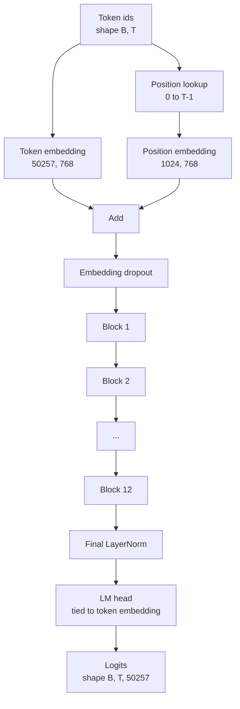
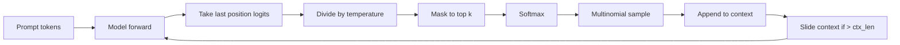

# GPT 模型组装

> 十二个 block 堆叠，一个 Token Embedding，一个学习得到的 Position Embedding，一个最终 LayerNorm，以及一个权重绑定的 language model head。这就是完整的 1.24 亿参数 GPT 模型。本课会把这些组件组装成一个可运行的 class，统计参数以确认模型匹配参考的 124M 形状，并使用 multinomial sampling、temperature 和 top-k 生成文本。

**Type:** Build
**Languages:** Python
**Prerequisites:** Phase 19 lessons 30 到 34
**Time:** ~90 分钟

## Learning Objectives

- 将 lesson 34 中的 transformer block 组装成完整 GPT 模型：Token Embedding、Position Embedding、N 个 block、最终 LayerNorm、language model head。
- 复现 1.24 亿参数配置：vocab 50257、context 1024、embedding 768、十二个 heads、十二层。
- 将 language model head 权重绑定到 Token Embedding，并解释为什么这在此规模下可节省约 3800 万参数。
- 使用 multinomial sampling、temperature scaling 和 top-k truncation 从 prompt 生成文本，并用 sliding window 保持 context length。
- 对照 124M 目标测量 parameter count 和 forward pass 成本。

## The Problem

transformer block 单独存在时什么也做不了。你需要把 token ids 转成 vectors，混入位置信息，让它们穿过 stack，再投影回 vocabulary logits。漏掉这四步中的任意一步，模型要么无法 forward，要么位置信息漂移，要么无法说话。

模型的形状也很重要。参考 GPT-2 small 在上面的精确配置下是 1.24 亿参数。这些数字并不神秘。Vocab 50257 乘以 embedding 768 是 token table。Position 1024 乘以 768 是 position table。十二个 block，每个约 700 万参数，总计 8400 万。最终 head 通过 weight tying 复用 token table。把这些部分相加，你就会得到 1.24 亿。构建出的模型如果 parameter count 与参考不匹配，通常说明你把某处接错了。

## The Concept



Token ids 变成 token vectors。Position ids 变成 position vectors。两者相加后送入 stack。最终 LayerNorm 是 blocks 外部的一块组件，并且在每个现代变体中都保留下来。LM head 复用 Token Embedding Matrix，这就是 weight tying 的含义。

### Weight tying

Token Embedding 的形状是 `(vocab, d_model)`。language model head 需要从 `d_model` 投影回 `vocab`。它们互为转置。将两者绑定，意思是字面上使用同一个 parameter tensor，用两次。在 vocab 50257 和 d_model 768 下，这个 Matrix 有 3800 万参数。不绑定时，你要为它付两次成本。绑定后，你只付一次成本，而且还会得到稍微更干净的 Gradient 信号，因为 Embedding 和 head 会一起更新。

### Position embedding 是学习得到的，不是 sinusoidal

GPT-2 使用学习得到的 Position Embedding。position table 是一个形状为 `(1024, 768)` 的 parameter tensor。模型在每次 forward 时查找 position 0 到 T-1，并把查找结果加到 Token Embedding 上。这是最简单的位置方案（RoPE、ALiBi、T5 relative bias 是替代方案），也是 124M 参考模型使用的方案。

### Generation: temperature, top-k, multinomial

Generation 是 autoregressive 的。每一步，模型都会在每个位置返回完整 vocabulary 上的 logits。你只取最后一个位置，除以 temperature，可选地把 top k logits 之外的所有 logits mask 成 negative infinity，softmax 得到 probabilities，然后从得到的 distribution 中 sample 一个 token。



三个旋钮，对应三种不同行为。Temperature 接近零会退化成 greedy。Temperature 为一时匹配模型的自然 distribution。Top-k 为一就是 greedy。Top-k 为四十会过滤长尾。组合方式很重要；下一课关于训练的内容会把 generation 用作定性 eval 信号。

## Build It

`code/main.py` 实现：

- `class GPTConfig` dataclass，带有 124M 默认值：`vocab_size=50257`、`context_length=1024`、`d_model=768`、`num_heads=12`、`num_layers=12`、`mlp_expansion=4`、`dropout=0.1`、`use_bias=True`、`weight_tying=True`。
- `class GPTModel`，包含 Token Embedding、Position Embedding、Embedding dropout、十二个 `TransformerBlock`、最终 LayerNorm，以及在 flag 打开时绑定到 Token Embedding 的 `lm_head`。
- `count_parameters` helper，返回唯一 parameter count（因此统计时会正确处理 weight tying）。
- `generate` function，执行 temperature、top-k、multinomial 和 sliding window context。
- 一个 demo，构建模型，打印 parameter count 并与参考 124M 对照，然后从固定 prompt 生成一个短序列，展示 pipeline 端到端可运行。

运行它：

```bash
python3 code/main.py
```

输出：parameter count 与 124M 参考值的对照、从随机 prompt 生成的 token ids，以及在 tying 打开时 LM head 和 Token Embedding 共享 storage 的确认信息。

为了让 demo 保持快速，脚本还会端到端运行一个 tiny config（`d_model=64`、`num_layers=2`），并 inline 打印生成的 token 序列。124M config 会被构建，但只执行 parameter count 和一次 forward pass。

## Stack

- `torch` 用于 tensor math、autograd 和 module plumbing。
- `code/main.py` 在本地重新实现 lesson 34 中相同的 block pattern。

## Production patterns in the wild

三个模式决定了一个模型只是能跑，还是能真正交付。

**把 residual projections 初始化得小一些。** Attention 的 output projection 和 MLP 的第二个 linear 都会直接进入 residual add。若用与其他 linear 相同的 standard deviation 初始化它们，residual stream 会随深度增长，并把最终 LayerNorm 推入过热区间。对这两个 projection，将 std 按 `1 / sqrt(2 * num_layers)` 缩放；residual stream 就能在十二层中保持合理范围。

**缓存 position id tensor，不要重复计算。** `torch.arange(T)` 会在每次 forward 时分配新内存。在 `__init__` 中按最大 context 分配一次，每次调用时 slice 前 T 个 entries，跳过 allocator 往返。

**在 parameter 层面 tie weights，而不只是 copy。** 设置 `lm_head.weight = token_embedding.weight` 会共享 tensor；copy 不会。Optimizer 需要更新一个 parameter，autograd graph 也需要一次 accumulation。如果你 copy，head 会从 Embedding 漂走，weight tying 就没有任何收益。

## Use It

- 本课的 model class 与下一课要训练的模型形状相同。
- 将学习得到的 Position Embedding 替换为 RoPE，就能得到 LLaMA family，而无需改 block 或 head。
- 将 GELU 替换为 SiLU，并将 LayerNorm 替换为 RMSNorm，就能得到 LLaMA family 的其余变化。
- generation function 可用于任何 logits 来源，不只限于这个模型。你可以在 lesson 37 中从 pretrained GPT-2 file 拉取 logits，并复用同一个 generation loop。

## Exercises

1. 解除 LM head 与 Token Embedding 的绑定并重新统计参数。验证差值为 50257 乘以 768 = 3800 万。
2. 将学习得到的 Position Embedding 替换为构造时计算的 sinusoidal table。确认模型仍可 forward，且 parameter count 减少 786,432。
3. 为 generation 添加 `greedy=True` flag，跳过 sampling 并选择 argmax。确认序列在多次运行中是 deterministic 的。
4. 添加 `repetition_penalty` 旋钮，在 softmax 之前，将 prompt 或已生成历史中任意 token 的 logit 除以一个常数。用固定 prompt 展示大于一的值会减少输出中的重复次数。
5. 在 `top_k` 旁边添加 `top_p`（nucleus）sampling。用两行检查确认保留 tokens 的 probability 之和超过 `top_p`。

## Key Terms

| Term | What people say | What it actually means |
|------|-----------------|------------------------|
| Weight tying | “Tied embeddings” | LM head 和 Token Embedding 共享同一个 parameter tensor；节省 vocab times d_model 参数，并匹配 GPT-2 参考模型 |
| Position embedding | “Learned positions” | 一个单独的 table，形状为 (context length, d_model)，加到 token vectors 上；端到端学习得到 |
| Sliding window context | “Context cap” | 当 prompt 加生成 tokens 超过 context length 时，丢弃最旧的 tokens，让 active window 能放下 |
| Top-k sampling | “K truncation” | 保留值最高的 K 个 logits，把其余 logits mask 成 negative infinity，并在剩余项上 softmax |
| Temperature | “Sampling temperature” | 在 softmax 前用 T 除以 logits；T 小于 1 会变尖锐，T 等于 1 保持自然 distribution，T 大于 1 会变平坦 |

## Further Reading

- Phase 19 lesson 34，了解本模型堆叠的 block。
- Phase 19 lesson 36，了解用 cross entropy loss 驱动本模型的 training loop。
- Phase 19 lesson 37，了解如何把 pretrained GPT-2 weights 加载到这个精确 architecture 中。
- Phase 7 lesson 07（GPT causal language modeling），了解 next token prediction 的数学。
- Phase 10 lesson 04（pre training mini GPT），了解同一 architecture 上的原始训练过程。
