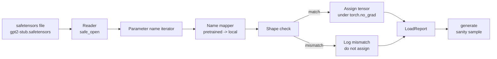

# 加载 Pretrained Weights

> 从零训练一个 124 million parameter model 是预算决策；加载一个公开 checkpoint 则是日常操作。本课会把 safetensors file 中的 pretrained GPT-2 style weights 加载到 lesson 35 的同一个 architecture 中，逐段讲解 parameter name mapping，并通过 sanity generate 一个 continuation 来证明加载成功。无网络、无 third party loaders、无不透明魔法。

**Type:** Build
**Languages:** Python
**Prerequisites:** Phase 19 lessons 30 to 36
**Time:** ~90 minutes

## Learning Objectives

- 使用 `safetensors` Python library 读取 safetensors file，并检查 tensor names 和 shapes。
- 将每个 pretrained parameter name 映射到 lesson 35 GPT model 内部的一个 parameter。
- 处理 published GPT-2 weights 与本 track model 之间不同的两套命名约定：`wte/wpe/h.N.attn.c_attn/c_proj` 和 `mlp.c_fc/c_proj`，对应本地命名的 `tok_embed/pos_embed/blocks.N.attn.qkv/out_proj` 和 `mlp.fc1/fc2`。
- 在任何 weight assignment 发生前，检测并拒绝 shape mismatch，并给出清晰错误。
- 使用 loaded weights 生成一个短 continuation，并确认 tokens 来自 loaded distribution，而不是 random initialized distribution。

## The Problem

Published weights 并不是为你的 architecture 打包的。它们携带的是原始实现使用的名称。Pretrained file 有 shape 为 `(2304, 768)` 的 `transformer.h.0.attn.c_attn.weight`；你的 model 期望 shape 为 `(2304, 768)` 的 `blocks.0.attn.qkv.weight`（这是同一个 Matrix，只是 layout convention 不同），或者你的 model 使用 `nn.Linear`，它会以转置形式存储 Matrix。同一个 parameter 会以三种细微不同的身份出现（name、shape、byte layout），loader 必须调和这三者。

盲目复制的 loader 会把正确 tensor 放到错误位置，得到一个生成胡言乱语的 model。shape 不同时拒绝复制但不记录任何日志的 loader，会让你猜测哪个 tensor 没有落位。本课的 loader 是显式的：每次 assignment 都会记录日志，每个 shape 都会检查，并且 `LoadReport` 会汇总 hits、misses 和 shape mismatches，让你能读懂发生了什么。

## The Concept



Name mapper 只是一个从 string 到 string 的 function。Shape check 是一个 if。Assignment 发生在 `torch.no_grad()` 内部，因此 autograd 不会跟踪加载过程。Report 会保存每个 name 的结果。

### The GPT-2 naming convention

Published GPT-2 weights 使用如下名称：

| Pretrained name | Shape | Meaning |
|-----------------|-------|---------|
| `wte.weight` | (50257, 768) | Token Embedding |
| `wpe.weight` | (1024, 768) | Position Embedding |
| `h.N.ln_1.weight` | (768,) | block N 的 LayerNorm 1 scale |
| `h.N.ln_1.bias` | (768,) | block N 的 LayerNorm 1 shift |
| `h.N.attn.c_attn.weight` | (768, 2304) | 融合 QKV linear weight |
| `h.N.attn.c_attn.bias` | (2304,) | 融合 QKV linear bias |
| `h.N.attn.c_proj.weight` | (768, 768) | Attention output projection |
| `h.N.attn.c_proj.bias` | (768,) | Attention output projection bias |
| `h.N.ln_2.weight` | (768,) | LayerNorm 2 scale |
| `h.N.ln_2.bias` | (768,) | LayerNorm 2 shift |
| `h.N.mlp.c_fc.weight` | (768, 3072) | MLP fc1 weight |
| `h.N.mlp.c_fc.bias` | (3072,) | MLP fc1 bias |
| `h.N.mlp.c_proj.weight` | (3072, 768) | MLP fc2 weight |
| `h.N.mlp.c_proj.bias` | (768,) | MLP fc2 bias |
| `ln_f.weight` | (768,) | Final LayerNorm scale |
| `ln_f.bias` | (768,) | Final LayerNorm shift |

有两个意外点需要提前处理。`c_attn`、`c_proj`、`c_fc` 这些 linears 的 Matrix 存储方式，相对于 `nn.Linear.weight` 期望的方式是转置的。Loader 会在 assignment 时转置。LM head 完全不在 file 中；model 依赖与 `wte` 的 weight tying，因此一旦 `wte` 落位，head 就通过 aliasing 设置好。

### The local naming convention

本 track 的 model 使用描述性名称：

| Local name | Meaning |
|------------|---------|
| `tok_embed.weight` | Token Embedding |
| `pos_embed.weight` | Position Embedding |
| `blocks.N.ln1.scale` | block N 的 LayerNorm 1 scale |
| `blocks.N.ln1.shift` | LayerNorm 1 shift |
| `blocks.N.attn.qkv.weight` | 融合 QKV |
| `blocks.N.attn.qkv.bias` | 融合 QKV bias |
| `blocks.N.attn.out_proj.weight` | Attention output projection |
| `blocks.N.attn.out_proj.bias` | Output projection bias |
| `blocks.N.ln2.scale` | LayerNorm 2 scale |
| `blocks.N.ln2.shift` | LayerNorm 2 shift |
| `blocks.N.mlp.fc1.weight` | MLP fc1 |
| `blocks.N.mlp.fc1.bias` | MLP fc1 bias |
| `blocks.N.mlp.fc2.weight` | MLP fc2 |
| `blocks.N.mlp.fc2.bias` | MLP fc2 bias |
| `final_ln.scale` | Final LayerNorm scale |
| `final_ln.shift` | Final LayerNorm shift |

Mapping 是一个固定 function。本课把它作为 dict 交付，loader 会迭代这个 dict。

### The stub fixture

真实 GPT-2 weights 大约 0.5 GB。Demo 不会下载它们；它会在第一次运行时生成一个小型 safetensors fixture，采用完全相同的 GPT-2 naming convention，并使用适合 12-block model、d_model 192 而不是 768 的 shapes。这个 fixture 具备正确结构，能触发 loader 中的每条 code path。把 fixture 换成真实 file 后，loader 无需修改即可工作。

```figure
cc-weight-remap
```

## Build It

`code/main.py` 实现：

- 一个 lesson 35 `GPTModel` 的小型复刻，使本课自包含。
- `make_pretrained_to_local(num_layers)`，展开每层条目。
- `load_safetensors(model, path)`，迭代 names、映射 names、检查 shape、转置 conv1d-style weights，并在 `torch.no_grad()` 下 assignment。返回 `LoadReport`。
- `make_stub_safetensors(path, cfg)`，生成一个采用精确 pretrained naming convention 的 fixture file。
- 一个 demo：第一次运行时创建 `outputs/gpt2-stub.safetensors`，构建一个 fresh model，捕获 random init 生成的一个 continuation，加载 stub，再捕获另一个 continuation，打印二者，并验证两者不同（加载确实改变了 model）。

运行：

```bash
python3 code/main.py
```

Output：fixture path、逐 name 的 load log、`LoadReport` summary、加载前的 continuation、加载后的 continuation，以及 fixture 中故意注入的单个 bad tensor 引发的 shape mismatch，用于覆盖 failure path。

## Stack

- `safetensors` 用于 on disk format 和 streaming reader。
- `torch` 用于 model 和 assignment math。
- 不使用 `transformers`，不使用 `huggingface_hub`，不进行 network calls。

## Production patterns in the wild

三个 pattern 能让 loader 在面对你没有创建的 weights 时仍然可靠。

**始终在任何 assignment 前验证 file。** 打开 file，列出每个 tensor name 及其 dtype 和 shape，运行完整 mapping 和 shape checks，只在成功后才开始 assignment。半加载 model 是静默失败机器。

**每次 assignment 都记录 source name 和 destination name。** 当某些东西看起来不对时，log 会告诉你哪个 tensor 落到了哪里；替代方案是读 hexdumps。本课中的 `LoadReport` dataclass 会跟踪 `loaded`、`missing`、`unexpected` 和 `shape_mismatch` lists，并在最后打印 summary。

**LM head 是 weight tying alias，不是单独 copy。** 加载 `tok_embed` 后设置 `model.lm_head.weight = model.tok_embed.weight` 是规范 pattern。把 Embedding Matrix 复制到新的 `lm_head.weight` parameter 会破坏 tying，并悄悄让 parameter count 翻倍。

## Use It

- Loader 适用于任何使用 pretrained naming convention 的 safetensors file。真实 GPT-2 files（small / medium / large / xl）无需 code changes 即可工作；只有 model config 不同。
- 一旦更新 name map，同样 pattern 可扩展到 LLaMA、Mistral、Qwen weights。Shape checks 和 report 保持不变。
- 加载后的 sanity generation 是一个快速 gate：如果 post-load samples 看起来像 pre-load samples，说明加载没有改变 model，也意味着 mapping 静默漏掉了每个 tensor。

## Exercises

1. 为 loader 添加 `dtype` argument，在 assignment 时将每个 tensor cast 到 target dtype（`bfloat16`、`float16`、`float32`）。确认 `float32` model 可以 downcast 到 `bfloat16` 并仍可 generate。
2. 添加 `expected_layers` argument，拒绝加载 `h.N` indices 与 model 的 `num_layers` 不匹配的 checkpoint。
3. 把 loader 接入 lesson 35 generation function，并生成两个并排 samples：一个来自 random init，一个来自 loaded fixture。
4. 添加 export path：使用 pretrained naming convention 将当前 model state 写入一个新的 safetensors file。Round trip loader 并确认 report 中 shape mismatches 为零。
5. 扩展 `NAME_MAP` 以处理 LLaMA naming convention（无 biases、RMSNorm、fused qkv layout），并在你生成的 stub LLaMA fixture 上重新运行 loader。

## Key Terms

| Term | What people say | What it actually means |
|------|-----------------|------------------------|
| Name map | "Key remapping" | 从 pretrained tensor names 到 local parameter names 的 function；通常是一个 literal dict，每个 layer index 一个 entry，并在 loop 中展开 |
| Shape mismatch | "Bad shape" | Pretrained tensor 存在于 mapped name 下，但其 dimensions 与 local parameter 不一致；loader 会拒绝 assignment 并记录这对 name |
| Transpose-on-load | "Conv1d layout" | Published GPT-2 将 Attention 和 MLP projections 存储为 nn.Linear 期望形式的转置；loader 会在 assignment 时转置 |
| Weight tying alias | "Shared LM head" | 设置 model.lm_head.weight = model.tok_embed.weight，让 head 和 Embedding 共享 storage；正因为如此，head 不在 file 中 |
| Load report | "Coverage summary" | 一个小型 dataclass，跟踪 loaded、missing、unexpected 和 shape_mismatch lists；打印它可以判断加载是否成功 |

## Further Reading

- Phase 19 lesson 35：接收 weights 的 architecture。
- Phase 19 lesson 36：生成同 shape checkpoint 的 training loop。
- Phase 10 lesson 11（quantization）：memory 紧张时如何处理 loaded weights。
- Phase 10 lesson 13（building a complete LLM pipeline）：load 与 inference 周边的完整 lifecycle。
