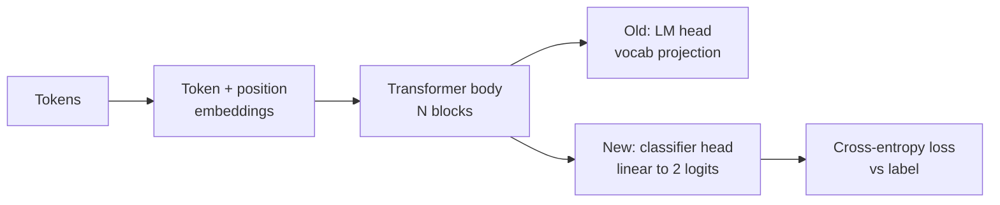
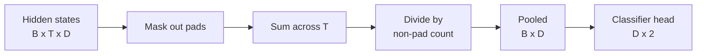
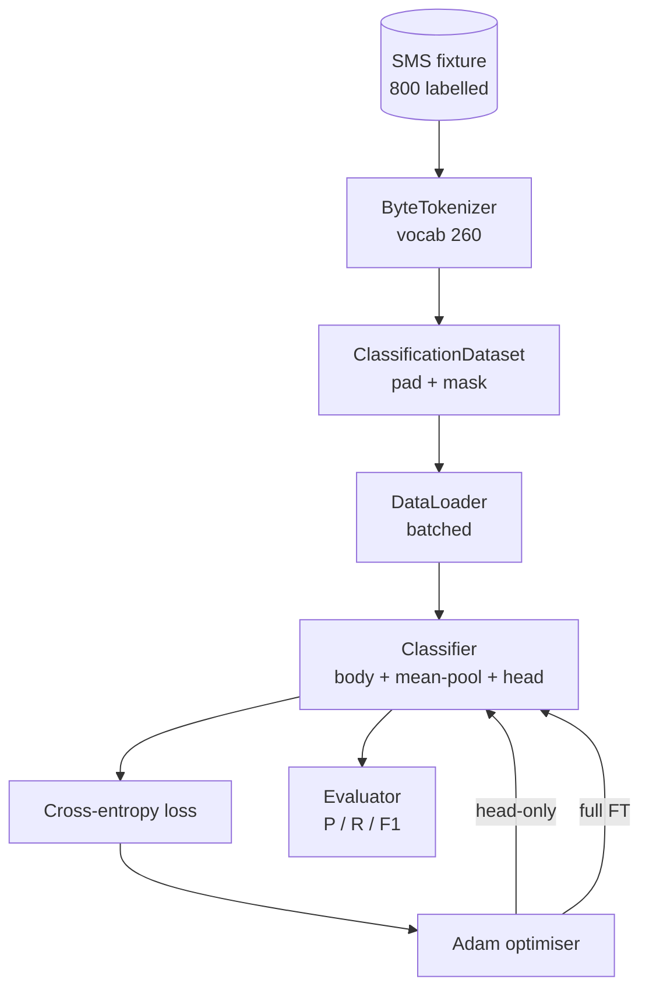

# Capstone Lesson 38：通过 Head Swap 进行 Classifier Fine-Tuning

> Track B 的第一个 capstone。Pretrained language model 是一叠 self-attention blocks，末端是 token-prediction head。当你想做 spam vs ham 时，head 是错的，但 body 基本是对的。本课会拆掉 head，把一个 two-class linear layer 接到 pooled representation 上，并用两种方式训练 classifier：final-layer only 和 full fine-tuning。Eval 使用 held-out split 上的 precision、recall 和 F1。你会学到每种策略带来什么、代价是什么。

**Type:** Build
**Languages:** Python (torch, numpy)
**Prerequisites:** Phase 19 lessons 30-37 (NLP LLM track: tokenizer, embedding table, attention block, transformer body, pre-training loop, checkpointing, generation, perplexity)
**Time:** ~90 minutes

## Learning Objectives

- 在不重新初始化 body 的情况下，把 language-model head 替换为 Classification head。
- 实现两种 training regimes：frozen body（head-only）和 full fine-tuning，并共享同一个 training loop。
- 构建 tokeniser-aware data pipeline，负责 padding、mask padding，并对 Attention output 做 pooling。
- 从 raw logits 计算 precision、recall、F1 和 confusion matrix。
- 推理 parameter count、training time 和 head-room 之间的 trade-off。

## The Problem

你已经在 generic corpus 上 pre-trained 了一个 small transformer。Output head 会把 last hidden state 投影到 1000-token vocabulary。现在你有 800 条标注为 spam 或 ham 的 SMS messages，希望构建一个 binary classifier。这里有三种选择。

错误选择是基于 800 个 examples 从零训练一个 fresh classifier。Pretrained model 的 body 已经编码了有用结构：word identity、position、simple co-occurrence。丢掉它就是浪费构建它时消耗的 compute。

两个正确选择是 head swap 后冻结 body，以及 head swap 后让 body 可训练。Head-only training 很快，memory 几乎免费，在这么少的数据上也不太容易 overfit。Full fine-tuning 更慢，在 small data 上可能 overfit，但当 downstream domain 偏离 pretraining corpus 时可以达到更高 accuracy。

本课会同时构建二者，让你能在同一个 fixture 上比较。

## The Concept



Model 是一个 function：`f_theta(tokens) -> hidden_states`。Head 是一个 function：`g_phi(hidden) -> logits`。Swapping heads 意味着保留 `theta` 并替换 `g_phi`。Body 的 parameters 是昂贵部分。Head 只是一个 linear layer。

有两组 trainable parameters 很重要：

- `theta`（body）：每个 attention block 中有数万 weights。
- `phi`（head）：`hidden_dim * num_classes` weights 加一个 bias。

在 head-only training 中，你针对 `phi` 计算 gradients，并让 `theta` 的 gradients 为零。PyTorch 允许你通过在 body parameters 上设置 `requires_grad=False` 来做到这一点。Optimizer 随后只看到 head，body 保持 frozen。

在 full fine-tuning 中，你允许 gradients 回流穿过整个 stack。Body 的 weights 会漂移以适配 Classification objective。风险是在 small data 上发生 catastrophic forgetting：body 的 pretraining 被 overfitting noise 冲掉。

## The Pooling Question

Classifier 需要每个 sequence 一个 Vector，而不是每个 Token 一个 Vector。三种常见选择：

- **Mean pool**：按 attention mask 加权，对 sequence 上的 hidden states 取平均。
- **CLS pool**：前置一个 special token，并只使用它的 output。这是 BERT 的做法。
- **Last-token pool**：使用最后一个 non-padding token。这是 GPT-class classifiers 的做法。

本课使用带显式 attention-mask weighting 的 mean pooling。它最简单，在不同 sequence lengths 上给出稳定信号，也不要求预训练 CLS token。



## The Data

八百条 SMS messages，400 条 spam 和 400 条 ham，都会在 `code/main.py` 中 deterministic 生成。Generator 使用 fixed seed，选择 templates 并替换 slot fillers，输出长度在 5 到 25 tokens 之间的 messages。真实 datasets 会有这个 fixture 没有的 noise。Fixture 的重点是 reproducibility。

Data 按 80/20 split：640 train，160 test。Splits 使用 stratified，因此 test set 保持 50/50 balance。一个 balance 已知的 held-out set 能让 precision 和 recall 被当作可信 numbers 解读。

## The Metrics

Binary Classification 中 class 1 是 positive class（spam）。计数如下：

- `TP`：预测为 spam，实际是 spam。
- `FP`：预测为 spam，实际是 ham。
- `FN`：预测为 ham，实际是 spam。
- `TN`：预测为 ham，实际是 ham。

三个 headline metrics：

- `precision = TP / (TP + FP)`。在被标记为 spam 的 messages 中，实际为 spam 的比例是多少？
- `recall = TP / (TP + FN)`。在实际 spam 中，model 标记出来的比例是多少？
- `F1 = 2 * P * R / (P + R)`。二者的 harmonic mean。

Confusion matrix 会把四个计数打印为 2x2 grid。Demo 会把两个 training regimes 的结果都写到 stdout。

```figure
cap-classifier-head-swap
```

## Architecture



Body 是一个刻意很小的 transformer：vocab 260、hidden 64、4 heads、2 blocks、max sequence 32。它足够小，可以在 CPU 上 90 秒内把两种 regimes 都训练到 convergence。本课中它不是 pretrained；相反，`pretrain_quick` helper 会在同一个 fixture 的 text 上做五个 epochs 的 LM training，让 body 有一个非平凡起点。这能让本课保持自包含。

## What you will build

Implementation 是一个 `main.py` 加一个 test module（`code/tests/test_main.py`）。

1. `ByteTokenizer`：把 bytes 映射到 ids，并保留一个 pad id。
2. `Block`：一个带 Multi-Head Attention 和 feed-forward layer 的 transformer block。Pre-norm。
3. `LMBody`：Token + position Embeddings 加上一叠 blocks。返回 hidden states。
4. `MeanPool`：沿 sequence axis 做 mask-weighted average。
5. `Classifier`：body、pool、linear head。Body 在不同 regimes 中是同一个 instance。
6. `freeze_body` 和 `unfreeze_body`：切换 body parameters 上的 `requires_grad`。
7. `train_classifier`：一个共享 loop。接收 model 和一个为当前 trainable parameter group 配置的 Optimizer。
8. `evaluate`：运行 test set 并返回 `Metrics(precision, recall, f1, confusion)`。
9. `run_demo`：先简短预训练 body，然后训练并评估 head-only，再训练并评估 full，打印两个 reports，并以 zero 退出。

## Why the comparison matters

Head-only regime 通常训练更快，并以更平滑的方式 underfit。在这个 fixture 上，head-only training 二十个 epochs 后，你通常会看到 precision 接近 0.9、recall 接近 0.85。Full fine-tuning 大约慢三倍，最终结果会在几个点以内上下浮动，取决于 random seed。

本课不选择赢家。它教你读懂 numbers 和 cost。对 800 个 examples 和 tiny body 来说，head-only 是正确选择。对 80,000 个 examples 和更大的 body 来说，full fine-tuning 开始值得投入。你从本课带走的 contract 是 API：同一个 `train_classifier` function 处理两种情况，toggle 只是一次 call。

## Stretch goals

- 添加第三种 regime，只 unfreeze 最后一个 block。这有时称为 partial fine-tuning。它比 full FT 成本更低，比 head-only 学得更多。
- 添加 learning-rate scheduler。对 head 使用 cosine schedule，并对 body 使用更小的 constant rate，是常见 production setup。
- 用 learned attention pool 替换 mean pooling：一个带有一个 learned query 的小 attention layer。在 longer sequences 上它通常优于 mean pool。

Implementation 给了你 hooks。Tests 固定了 contract。Numbers 由你继续推进。
