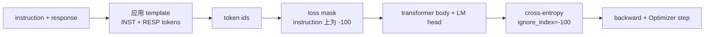
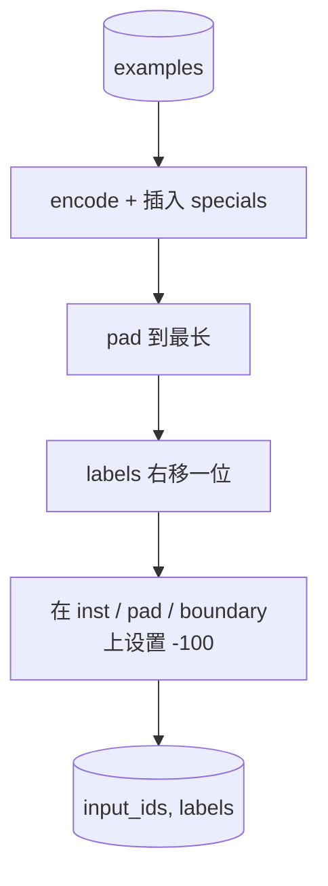
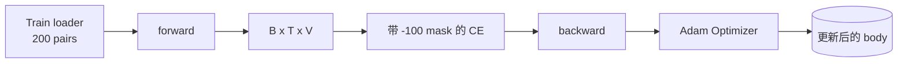

# Capstone 课程 39：通过 Supervised Fine-Tuning 进行 Instruction Tuning

> pretrained base model 可以延续一个序列，但无法遵循一条指令。Supervised fine-tuning 是修正这一点的最小改动：向模型喂入由 instruction 和期望 response 配对组成的样例，并训练主体来预测 response tokens。关键在于你只希望 Loss 计算 response，而不是 instruction。本课会构建一个 Alpaca 风格的 SFT loop，其中包含自定义 collate function，用 `ignore_index=-100` 屏蔽 instruction tokens，在 200 个 instruction-response pairs 上训练，并使用 exact-match 在 held-out split 上评估。

**Type:** Build
**Languages:** Python (torch, numpy)
**Prerequisites:** Phase 19 lessons 30-37 (NLP LLM track: tokenizer, embedding table, attention block, transformer body, pre-training loop, checkpointing, generation, perplexity)
**Time:** ~90 minutes

## Learning Objectives

- 将配对的 instruction-response data 格式化为带有显式 boundary tokens 的单个 causal sequence。
- 构建一个 collate function，屏蔽 instruction tokens，使 cross-entropy 只计算 response tokens。
- 在 SFT objective 下训练一个 tiny transformer body，并观察 eval metric 的变化。
- 实现 greedy 和 temperature-sampled generation，并遵守 response-start boundary。
- 对生成的 completions 计算 held-out exact-match。

## The Problem

使用 next-token prediction 训练的 base model 并不知道什么是 instruction。给它字符串 `"What is the capital of France?"`，它会继续这个问题，或者编造一个新句子。模型有语言能力，但没有 format contract。

SFT contract 是一个 string template。每个训练样例都会变成一个包含三个区域的单一序列：

```text
<INST> What is the capital of France? <RESP> The capital of France is Paris.
```

boundary tokens 是训练时保留的 special tokens。模型会学习到 `<RESP>` 之后的一切都是 response，而 response 才是被评分的部分。base model 的 next-token objective 仍然适用；它只是训练在一个每个样例都具有这种形状的语料上。

但这里有一个陷阱。如果你把整个序列喂给普通的 cross-entropy loss，你也在训练模型预测 instruction tokens。instruction 是已给定的。你希望这些位置上的 Gradient 为零。修复方式就是 mask。

## The Concept



`ignore_index` 是 `torch.nn.functional.cross_entropy` 的一个功能。任何 target position 等于 `ignore_index` 都会贡献零 Loss 和零 Gradient。PyTorch 中的惯例是 `-100`。collate function 为每个样例构建两个 tensors：`input_ids`（完整序列）和 `labels`（`input_ids` 的副本，其中 instruction positions 被覆盖为 `-100`）。

模型在 forward pass 期间看到整个序列；Attention 可以 attend 到 instruction。Loss 只计算 response tokens。这正是你想要的：condition on the instruction, predict the response。

## The Data

`main.py` 中确定性生成了两百个 instruction-response pairs。它们覆盖六种任务类型：

- factual single-shot（X 的首都）
- arithmetic
- list extraction
- one-sentence summary
- code（print, sort）
- definition

每个任务都有一个 templated instruction 和一个 deterministic response。这是刻意保持简单的设计。Exact-match 很脆弱，而本课使用一个 fixture，其中正确答案就是一个特定字符串。真实的 SFT datasets 需要 fuzzy metrics；原理完全相同。

Splits 为 160 train、40 test。test set 覆盖全部六种任务类型，因此可以报告 per-category exact-match。

## Tokenisation and Padding

tokeniser 是 byte-level，并带有三个保留 specials：

- `INST_ID = 256`：标记 instruction region 的开始。
- `RESP_ID = 257`：标记 instruction 与 response 之间的 boundary。
- `PAD_ID = 258`：用于 variable-length batches 的 padding。

序列是 `[INST] inst_bytes [RESP] resp_bytes [PAD]*`。collate function：

1. Tokenises 每个样例。
2. 将 batch 中的每个样例 pad 到该 batch 内最长序列的长度。
3. 构建 `labels` = 右移一位的 `input_ids`（causal LM target），并且：
   - 将 instruction region 替换为 `-100`。
   - 将 padding region 替换为 `-100`。
   - 将 `RESP_ID` boundary position 本身替换为 `-100`（你不训练模型预测 boundary token；它预测后续内容）。



shift 是标准 causal trick：`input_ids` 的 position `i` 预测 position `i+1`，因此 `labels[i] = input_ids[i+1]`（input 丢弃最终位置，target 丢弃第一个位置）。mask 在 shift 之后应用，以落在正确位置上。

## Training



loop 是标准 PyTorch SFT loop。Adam，learning rate 约 3e-4 到 1e-3，在这个 fixture 上训练十到二十个 epochs，不使用 scheduler。模型足够小（hidden 96、2 blocks、max length 64），可以在两分钟内于 CPU 上训练到收敛。

每五个 epoch，loop 会在 held-out set 上运行一个很小的 eval pass 并打印 exact-match。看到 exact-match 从 epoch one 的 0.0 到 epoch fifteen 左右的 0.85，是本课的关键收获：你可以同时看到模型学习格式和答案。

## Generation

eval 时，模型获得 instruction prefix `[INST] inst_bytes [RESP]`，并生成 tokens，直到：

- 序列达到 `max_len`，或
- 模型触发一个 special stop heuristic：连续两个 sentence-ending bytes（`.`、`!`、`?`）。

本课提供 greedy decoding，并附带一个可选 temperature sampler。Exact-match 使用 greedy，因为 temperature 会让 metric 变为 stochastic。真实系统通常会 sample，然后进行 fuzzy judge；这个 pipeline 是 lesson 41。

## Exact-Match Evaluation

Exact-match 是最严格的文本 metric。预测的 response string 会被 normalised（lowercase、strip whitespace、collapse double spaces），并与同样 normalised 的 reference response 比较。每个样例的 metric 要么是 1，要么是 0。aggregate 是 mean。

真实的 SFT pipelines 会用 token-level F1（lesson 41）和 judge model 补充 exact-match。Exact-match 仍然有用，因为它没有歧义；如果它显示 0.7，就表示恰好 70 percent 的 test instructions 逐字符生成了 gold response。

## What you will build

实现由一个 `main.py` 加 tests 组成。

1. `InstructionTokenizer`：带 reserved specials 的 byte-level encoder。编码 instruction prefix 或 full pair。
2. `make_dataset`：使用固定 seed 生成覆盖六种任务类型的 200 pairs。
3. `SFTDataset`：为每个样例返回 `(input_ids, labels)`，并且已经准备好 mask。
4. `sft_collate`：dynamic padding，构建 batch tensor，在 instruction 和 pad positions 上设置 `-100`。
5. `TinyGPT`：transformer body 加 tied 或 untied LM head。
6. `train_sft`：SFT loop，带 per-epoch eval hooks。
7. `generate`：从 prefix 进行 causal decode，greedy 或 sampled，并带 stop heuristic。
8. `exact_match`：normalised string comparison，返回 `[0, 1]` 内的 float。
9. `run_demo`：构建数据，训练二十个 epochs，评估，打印 per-category breakdown，并成功时以 zero 退出。

## Why the mask matters

没有 mask 时，Loss 会把 instruction tokens 当作 targets。模型会学习预测 instruction。这是一个不同的 objective，并会从两方面产生更差的模型。首先，模型容量被浪费用来重构用户总会提供的 inputs。其次，在大多数 batches 中 instruction tokens 数量多于 response tokens，因此 response Loss 在 Gradient 总和中占比更小；Optimizer 在你真正关心部分上的有效 learning rate 比预期更低。mask 不是 polish；它就是 objective。

## Stretch goals

- 添加 learning-rate warmup，随后使用 cosine decay。SFT 对 LR 比 pretraining 更敏感。
- 添加 per-token Loss logging，并绘制训练过程中的 Loss curve。注意早期 epochs 由 template tokens（`<RESP>`、common prefixes）主导，后期 epochs 由真实 answer tokens 主导。
- 将 eval 扩展到 BLEU-1 或 chrF。Exact-match 会低估那些生成同义改写但答案相同的模型。
- 添加带有 multi-turn formatting 的 chat template，并在包含 follow-ups 的 fixture 上训练。

实现会给你 format contract、mask 和 loop。从 base model 到 instruction follower 的 objective 变化，就是一个 collate function。
