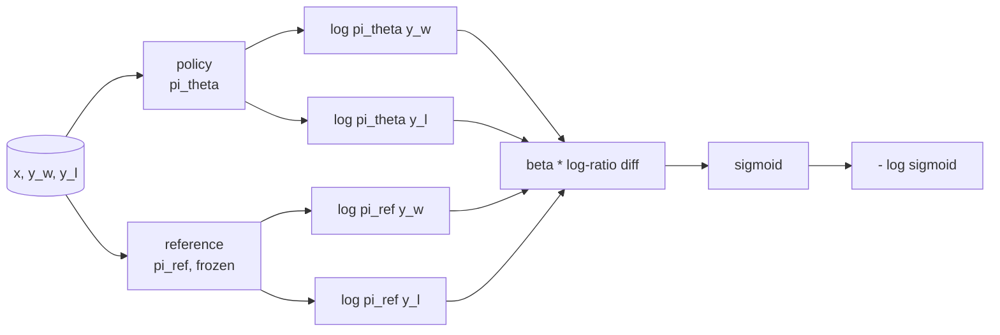
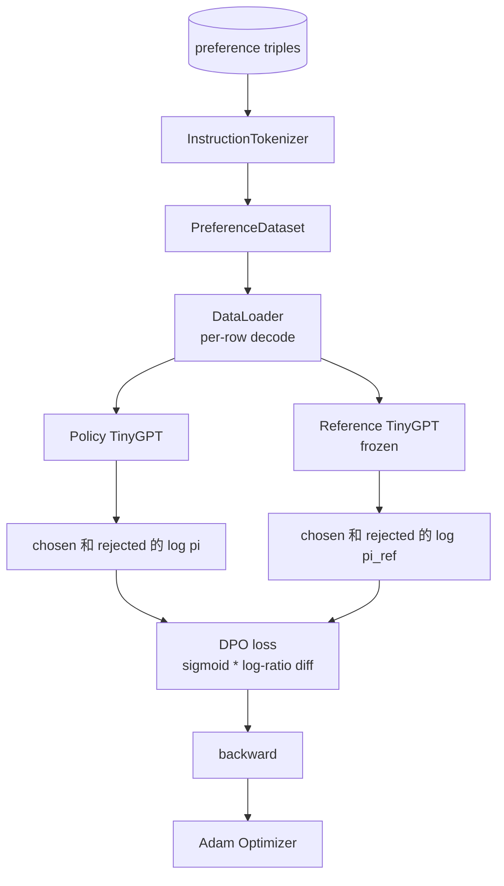

# Capstone 课程 40：从零开始实现 Direct Preference Optimization

> Reward models 和 PPO 是经典 RLHF stack。DPO 将这个 stack 压缩成一个 supervised loss，直接用 preference pairs 拟合 policy。本课会从 reward-difference identity 推导 DPO loss，提供可工作的 reference model 加 policy model，计算 per-token log-probabilities，并在一个由 chosen 和 rejected completions 组成的 preference fixture 上训练 tiny transformer。Tests 会固定 Loss math 和 Gradient direction，让你知道实现与 paper 一致。

**Type:** Build
**Languages:** Python (torch, numpy)
**Prerequisites:** Phase 19 lessons 30-37 (NLP LLM track: tokenizer, embedding table, attention block, transformer body, pre-training loop, checkpointing, generation, perplexity)
**Time:** ~90 minutes

## Learning Objectives

- 将 DPO loss 推导为 scaled log-ratio difference 上的 sigmoid，并把它连接到 implicit reward。
- 构建 reference model + policy model pair，其中 reference frozen、policy trainable。
- 在两个模型下计算 sequence-level log-probabilities，并 mask prompt tokens。
- 在 `(prompt, chosen, rejected)` triples 上训练 policy，并观察 chosen log-prob 相对 rejected 上升。
- 使用 tests 固定 Loss math、Gradient sign 和 reference invariance 的行为。

## The Problem

你有一个 SFT model。它会遵循 instructions，但输出不稳定；有些 completions 清晰，有些冗长或错误。你还有一个小型 preference pairs dataset：对于同一个 prompt，人类将一个 completion 标为 chosen，另一个标为 rejected。

经典 RLHF 答案是两阶段 pipeline。先用 preferences 训练 reward model。再用 PPO 根据 reward 优化 policy。这可行，但成本很高：PPO 期间内存中有两个模型，需要 KL control 来让 policy 接近 reference，且当 reward model 脆弱时会出现 reward hacking。

DPO 用一个 supervised loss 替代这两个阶段。reward model 从未显式存在。policy 直接在 preference pairs 上训练，并带有指向 SFT reference 的显式 KL penalty。在 Bradley-Terry preference model 下具有相同的 optimal solution，但代码少得多。

## The Concept

从 Bradley-Terry model 开始。给定 prompt `x` 和两个 completions `y_w`（chosen）与 `y_l`（rejected），人类偏好 `y_w` 的概率是

```text
P(y_w > y_l | x) = sigmoid( r(x, y_w) - r(x, y_l) )
```

其中 `r` 是某个 latent reward function。RLHF 先从 preferences 拟合 `r`，然后训练 policy `pi`，用 KL anchor 最大化 `r`：

```text
max_pi   E_{x, y~pi} [ r(x, y) ] - beta * KL(pi || pi_ref)
```

DPO 推导观察到，在这个 objective 下，optimal policy `pi*` 可以用 `r` 写成 closed form：

```text
pi*(y | x) = (1/Z(x)) * pi_ref(y | x) * exp( r(x, y) / beta )
```

对 `r` 重新整理：

```text
r(x, y) = beta * ( log pi*(y | x) - log pi_ref(y | x) ) + beta * log Z(x)
```

`log Z(x)` 项对 `y_w` 和 `y_l` 相同（它依赖 `x`，而不是 `y`），因此在计算 preference difference 时会抵消：

```text
r(x, y_w) - r(x, y_l) = beta * ( log pi_theta(y_w|x) - log pi_ref(y_w|x)
                                - log pi_theta(y_l|x) + log pi_ref(y_l|x) )
```

代入 Bradley-Terry sigmoid，并对 preference pairs 取 negative log likelihood：

```text
L_DPO(theta) = - E_{(x, y_w, y_l)} [
  log sigmoid( beta * ( log pi_theta(y_w|x) - log pi_ref(y_w|x)
                       - log pi_theta(y_l|x) + log pi_ref(y_l|x) ) )
]
```

这就是 Loss。它是每个样例一个标量上的 sigmoid，该标量由四个 log-probabilities 计算得到。没有单独的 reward model。没有 PPO。Loss 中没有 KL term；KL constraint 被 baked into closed-form derivation。



## The Sign of the Gradient

任何训练运行之前都有一个有用的 sanity check。对 `log pi_theta(y_w | x)` 求 Gradient：

```text
d L_DPO / d log pi_theta(y_w | x) = - beta * (1 - sigmoid(z))
```

其中 `z` 是 sigmoid 的 argument。它对所有 `z` 都为负，这意味着：提高 policy 对 chosen completion 的 log-probability 会降低 Loss。对称地，关于 `log pi_theta(y_l | x)` 的 Gradient 为正：提高 rejected log-probability 会增加 Loss。训练会把 chosen 往上推，把 rejected 往下推。reference 是 frozen；它不会移动。

## The Data

本课提供十二个 preference triples。每个都是 `(prompt, chosen, rejected)`。chosen completion 短且精确。rejected 冗长、偏题或错误。这些 pairs 覆盖与 lesson 39 相同的任务族（capital、arithmetic、list），因此从 SFT base 开始的 policy 会有一个合理起点。

fixture 被刻意设计得很小。生产中的 DPO 会使用数万对 pairs；这里的重点是 Loss math 和 loop 能够在 tiny dataset 上端到端运行，并且 chosen-versus-rejected log-prob gap 会明显增大。

## Reference Invariance

DPO 实现必须仔细处理 reference model。reference 是固定不动的 SFT model。必须满足三个性质：

- reference parameters 永远不会接收 gradients。
- reference log-probabilities 在 epochs 之间永远不会改变。
- policy 从与 reference 相同的 weights 开始。（optimal `theta` 是 reference 加上 learned update；将 policy 初始化为 reference 的副本是 well-defined start。）

实现通过以下方式强制这些性质：

- forward passes 期间用 `torch.no_grad()` 包裹 reference。
- 对每个 reference parameter 设置 `requires_grad=False`。
- 在 reference 构建后，通过 `policy.load_state_dict(reference.state_dict())` 构造 policy。

```figure
cap-dpo-preference
```

## Architecture



模型与 lesson 39 中使用的 TinyGPT 相同（decoder-only、causal、byte tokeniser）。reference 和 policy 共享 architecture；训练期间 policy 的 weights 从 reference 发生 drift，而 reference 保持 fixed。

## What you will build

实现由一个 `main.py` 加 tests 组成。

1. `InstructionTokenizer`：带 `INST` 和 `RESP` specials 的 byte tokeniser。形状与 lesson 39 相同。
2. `TinyGPT`：decoder-only transformer。形状与 lesson 39 相同，因此即使你跳过了 39，本课也保持 self-contained。
3. `make_preferences`：返回十二个 `(prompt, chosen, rejected)` triples。
4. `sequence_log_prob`：给定 model、prompt prefix 和 completion，返回 completion 上 next-token log-probabilities 的总和（不包含 prompt-position contribution）。
5. `dpo_loss`：接收四个 log-probabilities 和 `beta`，返回 per-example loss tensor 以及用于 logging 的 implicit reward delta。
6. `train_dpo`：per-epoch loop，在 policy 和 reference 下计算 chosen 与 rejected log-probs，应用 Loss，并执行 Adam step。
7. `evaluate_margins`：在任意时刻返回 policy 下 mean chosen-rejected log-probability margin。
8. `run_demo`：从一个小型 warm-up pretrain 构建 reference 和 policy，复制 weights，训练三十步，打印 per-step Loss 和 margin，并成功时以 zero 退出。

## Why DPO works

在 Bradley-Terry preference model 下，DPO 在数学上等价于 RLHF，只差 reward 的 parameterisation。implicit reward `r(x, y) = beta * (log pi(y|x) - log pi_ref(y|x))` 可以从 preferences 中识别出来，最多差一个关于 `x` 的函数，而它会在差值中抵消。closed-form policy 让你跳过显式 reward model。KL constraint 是结构性施加的：`pi` 相对 `pi_ref` 的任何偏离都会让 log-ratio 变大，而 sigmoid 会饱和，从而在 policy 走得太远时 damp Gradient。reference 是你的 safety net。

## Stretch goals

- 给 log-probability sum 添加 length normalisation：除以 completion length。Length bias 是一种已知的 DPO failure mode，模型会优先选择更短的 completions，因为它们的 log-probabilities 在绝对值上更大。
- 添加 Loss 的 IPO variant：用 `(z - 1)^2` 替代 sigmoid + log。比较它在 fixture 上的 convergence。
- 添加一个 label-smoothing parameter，在 hard chosen-rejected label 和 uniform 0.5 之间插值。
- 用更小、更便宜的模型替换 reference（knowledge distillation 风格）。

实现会给你 Loss、reference invariance 和 training loop。math 是本课的核心。code 让 math 具体化。
