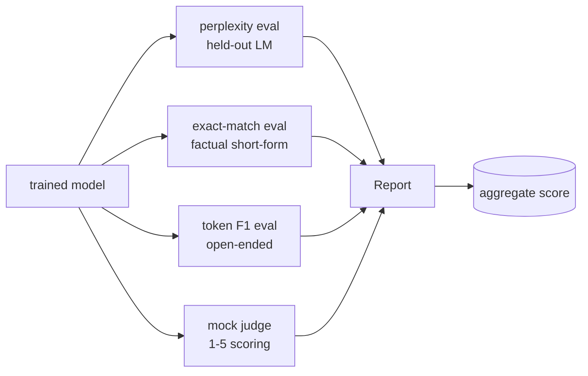
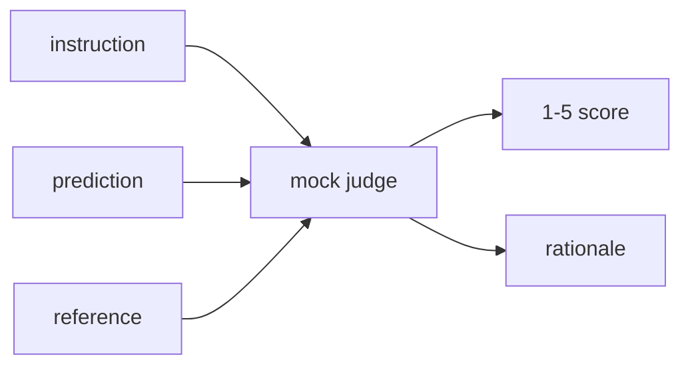
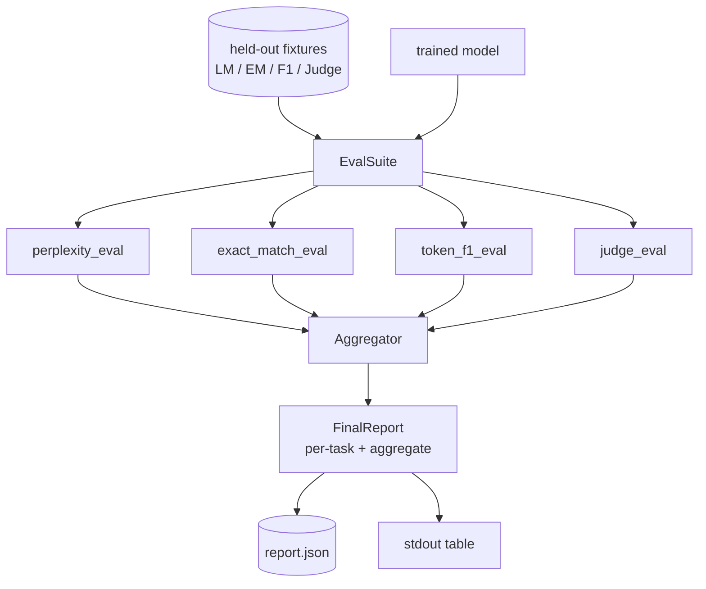

# Capstone Lesson 41: 完整 Evaluation Pipeline

> Training 是你可以用 loss curves 监控的部分。Evaluation 是你必须设计的部分。本课会构建一个统一的 eval pipeline：它接收任意训练好的 language model，在其上运行四种异构 eval，将结果聚合为按任务拆分的 report，并提供一个本地 mock LLM-as-judge，让整个 loop 无需网络也能运行。这四种 eval 覆盖每个要交付的 model 都需要的维度：language modelling（perplexity）、短答案正确性（exact-match）、开放式相似度（token F1）和定性打分（judge）。

**Type:** Build
**Languages:** Python (torch, numpy)
**Prerequisites:** Phase 19 lessons 30-37 (NLP LLM track: tokenizer, embedding table, attention block, transformer body, pre-training loop, checkpointing, generation, perplexity)
**Time:** ~90 minutes

## Learning Objectives

- 在 tiny transformer 上用 masked-token 计数计算 held-out perplexity。
- 在短事实 prompts 上运行 exact-match eval。
- 通过 normalisation 计算 prediction 与 reference 字符串之间的 token-level F1。
- 构建一个本地 mock LLM-as-judge，用 1-5 分制给 model outputs 打分。
- 将四种 eval 聚合成一个带按任务拆分的单一加权 report。

## The Problem

单一 metric 永远无法描述一个 language model。Perplexity 说明 model 对 language distribution 的拟合程度，但不说明它是否能回答问题。Exact-match 说明 model 是否产出 gold string，但会惩罚正确的改写。Token F1 会宽容 paraphrase，却可能被错误内容中的 lexical overlap 欺骗。LLM-as-judge 能捕捉定性维度，但成本高且具有随机性。

你真正想要的 pipeline 同时拥有这四种能力。每个 eval 覆盖其他 eval 漏掉的一个维度。每个 eval 运行在为该 metric 设计的不同 held-out data 子集上。最终 report 会并排展示各任务数字和 aggregate，让 reviewer 一眼看出 model 正在做哪些 trade-offs。

本课会在一个文件中端到端构建这个 pipeline。

## The Concept



每个 eval 都是一个从 `(model, dataset) -> EvalResult` 的函数。结果包含 metric value、用于检查的 per-example details，以及用于 aggregate 的名称。pipeline 通过 config 将它们组合起来，config 指定要运行哪些 eval 以及如何加权。

## Perplexity, properly counted

Perplexity 是 `exp(mean negative log-likelihood per token)`。实现中有两个陷阱：

- mean 必须基于真实 Token positions，而不是 batch * sequence。Padding tokens 必须从 denominator 中排除，否则 perplexity 会看起来比实际更好。
- model 预测下一个 Token，所以位置 `i` 的 logits 预测位置 `i+1` 的 Token。这里的 off-by-one 错误是静默的：loss 仍然会训练，但 metric 会变得毫无意义。

该 eval 会按 batch 计算非 pad positions 上的 `-log p(token)` 总和与 Token count，最后再相除。这比平均 per-batch perplexities 更数值安全（后者会低估短 sequences 的权重），并且符合教科书定义。

## Exact-match, with normalisation

harness 会在比较前 normalise prediction 和 reference：

- 转为 lowercase。
- 去除首尾 whitespace。
- 将内部连续 whitespace 折叠为单个 space。
- 如果两侧只因 punctuation 不同，则去掉末尾终止 punctuation（`.`、`!`、`?`）。

Normalisation 让 exact-match 在实践中有用。model 说 `"Paris"` 是对的；说 `"Paris."` 也是对的；说 `"  paris  "` 也是对的。该 metric 仍然要求 normalisation 后答案是相同字符串。

## Token F1, the right way

Token F1 是基于 bag-of-tokens 计算的 precision 和 recall 的 harmonic mean。步骤：

1. Normalise prediction 和 reference（与 exact-match 相同规则）。
2. 将每个字符串 split 为 tokens 列表（whitespace tokenisation）。
3. 统计 multiset intersection。
4. Precision = `intersection_count / len(pred_tokens)`。Recall = `intersection_count / len(ref_tokens)`。F1 = harmonic mean。

如果 prediction 和 reference 都为空，F1 为 1（vacuous match）。如果只有一侧为空，F1 为 0。这个模式匹配 SQuAD evaluation reference，并能在 paraphrases 上产生稳定数字。

## Local Mock LLM-as-Judge

真实 judge 是 API 后面的 frontier model。本课中的 judge 必须离线运行。mock judge 是一个 deterministic scorer，它接收 instruction、model 的 prediction 和 reference，并返回 `{1, 2, 3, 4, 5}` 中的一个 score 以及一行 rationale。评分规则是明确的：

- 如果 normalised prediction 等于 normalised reference，则为 5。
- 如果 prediction 与 reference 之间的 token F1 至少为 0.8，则为 4。
- 如果 token F1 位于 `[0.5, 0.8)`，则为 3。
- 如果 token F1 位于 `[0.2, 0.5)`，则为 2。
- 其他情况为 1。

这不是真实 judge，但它有正确的 interface。之后只需替换一个函数即可接入真实 model。pipeline 并不关心。



## Aggregation

aggregate 是 normalised eval scores 的 weighted mean。每个 eval 都报告自己在 `[0, 1]` 中的数字：

- Perplexity：normalise 为 `1 / (1 + log(perplexity))`。perplexity 为 1 映射到 1，infinity 映射到 0。
- Exact-match：已经在 `[0, 1]` 中。
- Token F1：已经在 `[0, 1]` 中。
- Judge：除以 5。

Weights 可配置。默认组合是 0.2 perplexity、0.3 exact-match、0.3 token F1、0.2 judge。weights 的选择是一个产品决策；本课暴露这个 knob，方便你实验。

```figure
cg-eval-quadrant
```

## Architecture



`EvalSuite` 是一个很薄的 orchestrator。每个独立 eval 都是一个 free function，接收 `(model, tokenizer, dataset, config)` 并返回 `EvalResult`。`Aggregator` 收集结果并生成最终 report。demo 会打印表格，并写入一份 JSON copy，供 downstream CI ingest。

## What you will build

实现是一个 `main.py` 加 tests。

1. `TinyGPT`：lessons 38-40 中使用的同一个 decoder-only architecture，内置在本课中以便独立运行。
2. `InstructionTokenizer`：带 INST / RESP / PAD specials 的 byte tokeniser。
3. 四个 fixtures：LM corpus、EM set、F1 set 和 judge set。每组二十个 examples，deterministic。
4. `perplexity_eval`：返回包含 perplexity value 和 per-token loss histogram 的 `EvalResult`。
5. `exact_match_eval`：返回 mean EM 和 per-example records。
6. `token_f1_eval`：返回 mean token F1 和 per-example records。
7. `mock_judge` 和 `judge_eval`：per-example score 与 rationale，以及该 set 上的 mean score。
8. `Aggregator.normalise`：per-eval normalisation rule。
9. `Aggregator.aggregate`：weighted mean 和组装后的 report。
10. `run_demo`：短暂训练一个 tiny model，运行全部四种 eval，打印 report table 并写入 JSON，成功时以 zero 退出。

## Reading the report

report 有三层。最上层是 aggregate score。下面是四个 per-eval numbers。再下面是用于 diagnostics 的 per-example breakdowns。失败的 CI run 通常需要 aggregate，但追踪 regression 的 reviewer 需要 per-example breakdown，以查看 model 哪些 inputs 答错了。

JSON dump 使用稳定 keys，让 CI dashboard 可以跨版本绘制 trend lines。pretty-printed table 面向训练运行后盯着 terminal 的人类。

## Stretch goals

- 添加 calibration eval：model 的 softmax probabilities 是否匹配其 accuracy？按 confidence 对 predictions 分桶，并报告每个 bucket 的 empirical accuracy。
- 添加 robustness eval：给每个 example 标注 perturbation（typo、paraphrase、distractor），并报告每类 perturbation 的 metric drop。
- 用 HTTP call 后面的真实 model 替换 mock judge。function signature 不变。
- 添加 per-task weight learning：不使用固定 weights，而是根据 models 上的目标 preference order 拟合 weights。

本实现给你四种 eval、aggregator 和 report。真实 evaluation pipelines 会在此之上叠加更多维度；模式保持不变：每个 eval 一个函数，一个 aggregator，一个 report。
