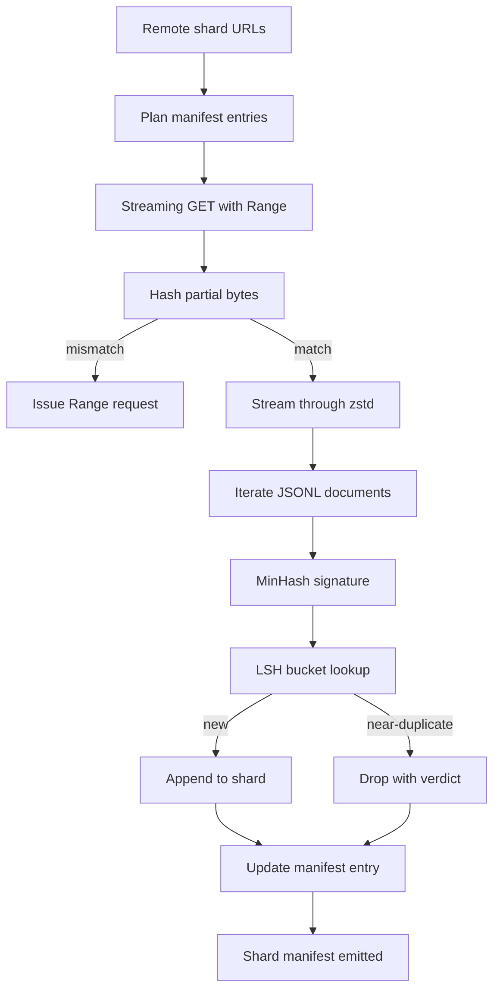

# Large Corpus Downloader

> 训练 language model 早在第一次 forward pass 之前就开始了。corpus 必须落到 disk 上，完成 decompressed、deduplicated，并且可 addressable；在网络 4 percent 处断掉之前，resume story 就已经要设计好。本课会构建一个 streaming downloader：它拉取 compressed shards，用 Zstandard 边下边 decompress，通过 MinHash 加 locality-sensitive hashing 为 near-duplicates 生成 fingerprints，并写出 shard manifest，让 pipeline 的其余部分可以信任。

**Type:** Build
**Languages:** Python
**Prerequisites:** Phase 19 lessons 30-37
**Time:** ~90 minutes

## Learning Objectives

- 使用 `urllib` stream remote shards，并用 `zstandard` decompress，避免将整个文件 buffer 到 memory。
- 针对 verified byte offset 发起 HTTP `Range` requests，以 resume partial downloads。
- 为每个 document 构建 MinHash signature，并用 LSH 分桶，让 near-duplicates 发生 collision。
- 输出包含 content hash、byte size、document count 和 dedup verdict 的 shard manifest。

## The Problem

第一次在 200 GB corpus 上训练时，网络在 percent 41 处断掉，script 以 `urllib` exception 退出。第二次它在 percent 78 处断掉。到了 percent 99，你已经把 loop 重写了三次。你从第一分钟起就必须设计应对的两个失败点是 partial-download resume 和 duplicate document removal。两者都有成熟方案；两者也经常被跳过，因为 pipeline 一开始只是一个长出问题的单行 `requests.get` call。

Resume 是一个 HTTP 问题。server 必须支持 `Range`，client 必须根据 on-disk record 跟踪 verified offset，而 verified offset 必须能在 process death 后保留下来。如果 offset 和 file 哪怕差一个 byte，resumed download 就会写入 garbage，corpus 会以一种只有在 Tokenization 时才暴露的方式损坏。

Deduplication 是一个 signature 问题。Exact-hash dedup 会漏掉 near-duplicates：同一篇 Wikipedia article 带着三个不同 boilerplate footers 出现，同一个 code file 带着不同 license header，同一篇 blog post 的每个 link 都带 tracking parameter。MinHash 加 LSH 能以 sub-linear cost 捕捉这些情况。成本是每个 document 一个 signature，以及每个 signature 一次 bucket lookup。

## The Concept



### Streaming with `urllib`

standard-library `urllib.request.urlopen` 返回 file-like object。将它包在 `zstandard.ZstdDecompressor().stream_reader` 中，bytes 就会从 network 流经 decompressor，再进入 document iterator，完全不需要在 memory 中 materialise compressed shard 或 decompressed shard。唯一的 memory cost 是 line buffer、当前 document 的 MinHash signature，以及 LSH index。

### Resume with `Range`

downloader 为每个 shard 写两个文件：shard 本身和 `.partial.json` checkpoint。checkpoint 记录 `verified_bytes`、`expected_size`、`sha256_prefix`（基于前 `verified_bytes` bytes 计算）和 source URL。启动时，downloader 读取 checkpoint，基于 on-disk bytes 重新计算 `sha256_prefix`，并且只有在重新计算出的 hash 匹配时才 resume。如果 hash 错误，partial 会被丢弃，download 从 byte zero 重新开始。因为 verified bytes 被检查而不是被假定，所以 silent corruption 不可能发生。

### MinHash plus LSH

MinHash 用固定空间估计两个 sets 的 Jaccard similarity。对于 document，这个 set 是其文本的 shingles（overlapping n-grams）。signature 是 `k` 个最小 hash values，每个来自一个 independent hash function。两个 Jaccard similarity 为 `s` 的 documents，在 signature 的任意单个 component 上一致的概率为 `s`。

随后 LSH 将 `k` 个 components 分为 `b` 个 bands，每个 band 有 `r` rows，其中 `k = b * r`。两个 documents 在至少一个 band 中 collision 的概率是 `1 - (1 - s^r)^b`，它会在你用 `(b, r)` 调优的 `s` 值附近形成尖锐 threshold。典型 corpus dedup 的 threshold 是 `s = 0.8`，LSH research literature 用 `k = 128`、`b = 32`、`r = 4` 达到这个点。

### Shard manifest as a contract

downloader 唯一 durable output 是 manifest。manifest 按 shard 保存 URL、decompressed byte count、document count、dedup 后的 unique document count，以及 final shard file 的 sha256。downstream Tokenization 读取 manifest，而不是 directory listing。如果某个 shard 缺失或其 sha256 错误，manifest 会告诉下一阶段拒绝启动。manifest 是 “data 已下载” 与 “data 已下载且可验证” 之间的决定性边界。

```figure
cap-corpus-downloader
```

## Build It

`code/main.py` 实现：

- `ShardPlanner` - 读取 shard URLs 列表并生成 planned manifest entries。
- `StreamingDownloader` - 打开带 optional `Range` 的 `urllib` stream，写入 temporary file，在每个 chunk 更新 `.partial.json` checkpoint，并在 resume 时验证 sha256 prefix。
- `ZstdDocIterator` - 将 file-like stream 包在 `zstandard.ZstdDecompressor` 中，并逐行 yield 一个 document。
- `MinHasher` - 使用固定 hash seeds family 为 string 生成 `k`-component signature。
- `LSHIndex` - 按 band 对 signatures 分桶并报告 collisions。
- `Dedup` - 组合 hasher 和 index，将每个 document 标记为 `keep` 或 `near_duplicate`，并附带 matching shard id。
- `ManifestWriter` - 收集 per-shard stats 并写入 `manifest.json`。

文件底部的 demo 会在 disk 上构建一个小型 synthetic corpus，用 `zstandard` 压缩它，通过 `file://` URL 下载，执行 deduplicate，并打印 manifest。

运行它：

```bash
python3 code/main.py
```

script 以 zero 退出并打印 manifest summary。

## Production Patterns

四个 patterns 可以将本课扩展到真实 corpora。

**Checkpoint before write.** `.partial.json` 必须在 bytes 追加到 shard 之前完成 `fsync`。否则 power loss 会颠倒顺序：shard bytes 在 disk 上，checkpoint 中没有它们，下一次 resume 认为 verified bytes 比实际更少，duplicated suffix bytes 会损坏 file。先 checkpoint，再 write。这与 write-ahead log 是同一种 discipline。

**Sharded LSH index.** 在 200 GB 规模下，覆盖整个 corpus 的单个 LSH index 放不进 RAM。按第一个 band hash 分区 LSH index，将 partitions 存在 disk 上，并且只查询新 signature 会落入的 partition。成本是每个 document 一次额外 disk read；收益是 LSH index 不再是硬 memory ceiling。

**Tombstone, not delete.** 被丢弃的 duplicates 会以 verdict `near_duplicate` 和它们 collision 的 document 的 shard id 记录在 manifest 中。删除它们会丢失 duplicate 与 keeper 之间的 link。Tombstoning 保留 audit trail，并让 downstream pass 之后可以改变 threshold 的决定。

**Per-shard sha256 in the manifest, plus a manifest sha256.** manifest 自身也会获得 content hash。downstream stages 会在信任 per-shard entries 之前验证 manifest hash。没有这个机制，manifest 就是 silent attack surface：能编辑单个文件的 attacker 可以损坏整个 pipeline。

## Use It

Production patterns：

- **Resume on every CI run.** CI runners 是 ephemeral 的。downloader 必须假设每次 run 都是 fresh disk，并从 cache 或 remote 恢复。`--cache-dir` 是 first-class flag。
- **Dedup before tokenization.** Tokenization 很昂贵。在同一个 document 上运行两次，是为了相同 loss curve 支付两倍成本。Dedup 位于 Tokenization 上游，而不是下游。
- **Manifest as merge gate.** training run 从 pinned commit 读取 manifest sha256。新的 dataset version 需要新的 manifest commit。code 与 data 之间的 link 是 git，而不是口口相传。

## Ship It

`outputs/skill-corpus-downloader.md` 在真实项目中会描述哪些 URLs 供给 downloader、checkpoint directory 如何布局、dedup 使用什么 shingle width 和 `(k, b, r)` triple，以及 manifest 在 version control 中的位置。本课交付 engine。

## Exercises

1. 添加 `--shingle-width` flag，并测量 dedup verdict 在 widths 3、5、9 下如何变化。为选择的默认值辩护。
2. 通过嗅探 magic bytes，在 zstd 旁边添加 gzip 支持。downloader 不应要求 caller 指定 codec。
3. 添加 `--resume-only` mode：如果找不到 checkpoint，则拒绝开始 fresh download。在 CI 中很有用，可避免某次 run 意外重新拉取 200 GB。
4. 将 LSH index 移到 shelf 或 sqlite file，并测量 throughput 与 in-memory variant 的差异。
5. 在启动时添加 manifest sha256 check。如果 disk 上的 manifest 与 `manifest.lock` 中的 manifest hash 不一致，downloader 应 fail closed。

## Key Terms

| Term | What people say | What it actually means |
|------|-----------------|------------------------|
| Shard | “一个 file” | corpus 的一个自包含 slice，拥有自己的 sha256，并作为 resume 和 dedup 的单位 |
| MinHash signature | “Fingerprint” | 一个 set 的 `k`-component sketch，其中每个 component 是该 set 上一个 independent hash 的最小值 |
| LSH band | “Bucket” | 一组 `r` 个 signature components，用作 collision detection 的单个 bucket key |
| Verified bytes | “Resume offset” | disk 上 sha256 prefix 与 checkpoint 匹配的 bytes；唯一安全的 resume offset |
| Manifest | “The index” | downloader 产出的单一 durable record，包含 content hashes |

## Further Reading

- [RFC 7233](https://datatracker.ietf.org/doc/html/rfc7233) - HTTP Range requests，即 resume protocol
- [Zstandard format specification](https://datatracker.ietf.org/doc/html/rfc8478) - 让 streaming decompression 安全的 frame format
- [MinHash](https://en.wikipedia.org/wiki/MinHash) - 本课使用的 signature family
- [Locality-sensitive hashing](https://en.wikipedia.org/wiki/Locality-sensitive_hashing) - dedup threshold 背后的 banding scheme
- Phase 19 · 43 - downloader 供给的 HDF5 tokenized corpus
- Phase 19 · 44 - 在 corpus 上训练的 cosine schedule
- Phase 19 · 45 - 消耗该 schedule 的 AMP loop
