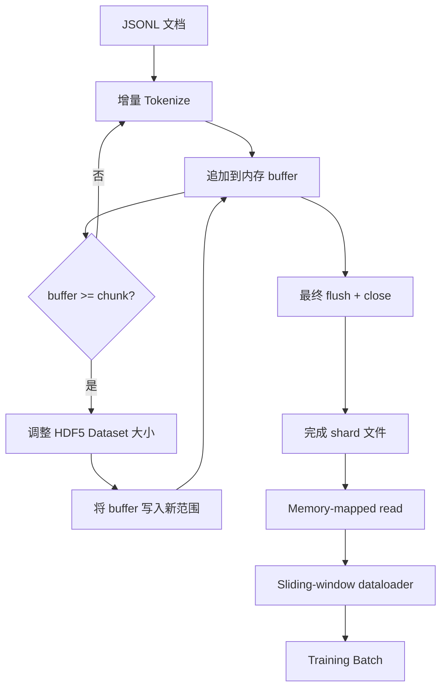

# HDF5 Tokenized Corpus

> 下载的 corpus 必须落盘为 trainer 能够以线速流式读取的布局。磁盘上的 JSONL 无法承受 16 个 dataloader worker。使用可调整大小、分块存储整数 Dataset 的 HDF5 则可以。本课程将构建面向可调整大小 HDF5 Dataset 的流式 Tokenization、跨多个文件的 sharded write、Training 时的 memory-mapped read，以及能够按照正确 packing 方式生成固定长度序列的 sliding-window dataloader。

**Type:** Build
**Languages:** Python
**Prerequisites:** Phase 19 课程 30-37
**Time:** ~90 分钟

## 学习目标

- 通过确定性 chunking 将文档流式写入可调整大小的 HDF5 整数 Dataset。
- 将写入任务分散到多个 HDF5 shard 文件，使故障影响范围有限，并支持并行处理。
- 通过 HDF5 由 page cache 支持的 chunked layout 读回 Token，使 dataloader 仅在组成 Batch 时才将内容复制到 Batch buffer。
- 实现 sliding-window dataloader，根据明确的 packing 规则输出固定长度的 Training 序列。

## 问题

现代语言 Model Training 会通过数十个 worker，以每秒数十万个样本的速度读取 Token。磁盘上的 JSONL 会在第一次 cold-cache page fault 时失效：JSON parser 很慢，文档边界不可寻址，而且定位到“样本 4,217,884”需要扫描整个文件。即使 Parquet 的压缩效果很好，也不适合这一场景，因为 trainer 不需要列；它需要一个支持 O(1) random access 的扁平 Token stream。

HDF5 适合这一场景，因为它提供了 chunked、可调整大小、仅包含整数的 Dataset，其 chunk 在读取时对 page cache 友好。Trainer 请求切片 `tokens[3,200,000 : 3,200,8192]`，HDF5 就会从 page cache 中将请求的 hyperslab 复制到新分配的 NumPy array。每个 worker 的成本是一个打开的文件句柄和一个 chunk 大小的 page-cache 占用；与解析 JSONL 的成本相比，这可以忽略不计。

构建时的关键问题是确保写入端行为可靠。可调整大小的 Dataset 很容易被误用：一次写入一个文档会使 HDF5 文件产生严重碎片，直至无法使用。一次 resize 后写入所有文档，则进程终止时会丢失整个 shard。正确的做法是先缓冲再扩展，使 buffer 大小与 chunk 大小一致，并使用 sharded write 将工作负载拆分到多个文件，从而让一次崩溃最多只损失一个 shard。

## 概念



### 正确实现可调整大小的 HDF5

Token Dataset 使用 `maxshape=(None,)` 和固定的 `chunks=(chunk_size,)` 创建。写入过程会先将 Token 缓冲到长度为 `chunk_size` 的 NumPy array 中。当 buffer 填满时，Dataset 会恰好扩展 `chunk_size`，然后将 buffer 写入新范围。在 shard 末尾，剩余 buffer 会写入最后一个不完整范围。除最后一次写入外，每次写入都是连续且与 chunk 对齐的；reader 会根据 shard 的 HDF5 attribute 中记录的 `token_count` 截断最后一部分。

### Sharded write

单个 HDF5 文件是单点故障。Pipeline 会并行写入多个 shard：Phase 19 课程 42 中的每个 input shard 都会生成一个 HDF5 output shard。`shards.json` 索引会记录每个 shard 的文件路径、Token 数量、文档数量以及基于 Token 计算的 sha256。Trainer 读取 `shards.json` 以计算全局 offset 并验证 corpus。

### Memory-mapped read

Training 时，每个 worker 都会使用 `swmr=True` 模式打开其负责的 HDF5 文件，并请求 `tokens[start:stop]`。一旦 chunk 进入 hot 状态，HDF5 的 chunk layout 会使读取由 page cache 支持。Worker 永远不会将整个文件加载到内存中：切片会被复制到 dataloader 的 Batch buffer，然后 dataloader 在组成 Batch 时将其复制到 pinned-memory Training Tensor。Hot path 在每次 chunk 切换时只进行一次 syscall；其余操作都是 RAM access。

### Sliding-window dataloader

Dataloader 是唯一了解 Training 序列长度的阶段。它在全局 Token stream 中随机选择一个起始索引，读取 `window_size + 1` 个 Token，并返回 `(input, target) = (tokens[:-1], tokens[1:])`。它不会强制遵守文档边界：一个 window 可以跨越两个文档，中间放置明确的 `boundary_token_id`，使 Model 学会使用分隔符。这是标准的 packing 规则；也是初学者容易遗忘的规则，否则最终得到的 corpus 可能包含 8% 的 Training boundary Token 和 92% 的自然文本。

```figure
cc-hdf5-corpus
```

## 构建它

`code/main.py` 实现：

- `Tokenizer` - 一个足以用于 demo 的 byte-level 确定性 Tokenizer。接口为 `encode(text) -> list[int]` 和 `vocab_size`。
- `HDF5ShardWriter` - 打开可调整大小的整数 Dataset，将 Token 缓冲到 chunk 大小，以固定大小的步幅 resize 并写入，在关闭时将 `token_count` 和 `sha256` 记录为 HDF5 attribute。
- `ShardedTokenizationPipeline` - 迭代输入文档，将它们路由到 writer，并生成 `shards.json` 索引。
- `MmapTokenStore` - 打开 shard 文件以执行 memory-mapped read，计算全局 offset，并公开单一的 `get_slice(start, stop)` API。
- `SlidingWindowDataloader` - 从全局 stream 中选择随机 window，并生成 `(input_ids, target_ids)` NumPy array。

文件底部的 demo 会构建一个很小的内存 corpus，将其 Tokenize 到两个 shard 中，通过 memory map 打开它们，使用 dataloader 运行 10 个 Batch，并输出每个 Batch 的 shape 和 checksum。

运行：

```bash
python3 code/main.py
```

脚本以状态码 0 退出，并输出 Batch checksum。

## Production 模式

以下四种模式可将本课程扩展到真实的 Training 任务。

**Chunk 大小等于典型读取大小。** Trainer 每个样本读取 `window_size + 1` 个 Token。将 HDF5 chunk 设置为 `window_size` 的倍数，读取就能与 page cache 对齐。Chunk 大小不匹配会使吞吐量减半，因为每个样本都会访问两个 chunk。

**Token 数量存储在 attribute 中，而不是 Dataset 中。** 由于 chunk 大小无法整除文档边界，Dataset 末尾的切片可能未完全填满。将真实的 `token_count` 存储为 Dataset 的 HDF5 attribute，并让 reader 在该值处截断。否则，reader 会越过末尾读取补零 Token，Model 也会因此学会预测零。

**使用 shard 级 sha256 进行并行验证。** 每个 shard 都有基于 Token byte 计算的独立 sha256。Trainer 可以在 Training 开始前并行验证所有 shard。错误的 sha256 会让任务尽早失败，而不是在第三个 Epoch、运行十六小时后才失败。

**两端都使用 `swmr=True`，writer 使用 `libver="latest"`。** Single-Writer-Multiple-Reader 模式要求 writer 使用 `libver="latest"` 打开文件，预先创建所有 Dataset，然后设置 `file.swmr_mode = True`。此后，writer 必须在每次 resize 后调用 `dataset.flush()`，使以 `swmr=True` 打开的 reader worker 能够看到一致的数据。忽略 `libver="latest"` 或在结构发生变化后才启用 SWMR，是出现“file is locked”故障的常见原因。

## 使用它

Production 模式：

- **每个 source shard 对应一个 HDF5。** Downloader（课程 42）为每个 URL 输出一个 shard；Tokenization（本课程）为每个 source shard 输出一个 HDF5。1:1 映射使恢复执行和局部故障恢复非常简单。
- **Boundary Token ID。** Boundary Token 是 Tokenizer vocab 的一部分，也是 dataloader 唯一注入的 Token。如果 Model 应忽略 boundary Token，Training Loss 会 mask 该 Token；否则，Model 会学会将它用作序列分隔符。
- **将 `shards.json` 作为事实来源。** 添加新 shard 意味着写入 HDF5、计算其 sha256，并追加一个条目。Trainer 在启动时读取一次该文件，之后不再访问目录列表。

## 交付它

在真实项目中，`outputs/skill-hdf5-tokenized-corpus.md` 会说明哪个 Tokenizer 为 Pipeline 提供输入、什么 chunk 大小与 trainer 的 window 匹配、`shards.json` 在版本控制中的位置，以及 dataloader worker 如何跨文件分片。本课程交付底层引擎。

## 练习

1. 为 HDF5 writer 添加 `--compression gzip` flag，并在 demo corpus 上衡量吞吐量成本。说明所选默认值的理由。
2. 为 sliding-window dataloader 添加确定性 seed，并验证使用相同 seed 的两次运行会生成完全相同的 Batch。
3. 添加 `--validate` 模式，读取每个 shard，基于其中的 Token 重新计算 sha256，并与 `shards.json` 比较。CI 应在 Training 开始前运行此模式。
4. 比较 chunk 大小等于 window 大小、为其一半和两倍时的 dataloader 吞吐量。报告 page cache 的影响。
5. 添加 `--max-document-tokens` flag，在写入时截断很长的文档。说明与在读取时决定相比，这一选择的权衡。

## 关键术语

| 术语 | 人们怎么说 | 实际含义 |
|------|-----------------|------------------------|
| Resizable Dataset | “Append-only” | 使用 `maxshape=(None,)`，并通过以 chunk 大小为步幅的 `resize` 调用增长的 HDF5 Dataset |
| Chunked layout | “HDF5 如何存储数据” | 固定大小的磁盘 page，kernel 可以对其进行 memory-map，dataloader 可以连续读取 |
| `swmr` 模式 | “边写边读” | 允许 dataloader worker 安全共享文件的 Single-Writer-Multiple-Reader 模式 |
| Shard index | “shards.json” | 包含 offset 和内容 hash 的所有 Token shard 的持久索引 |
| Sliding window | “Training 样本” | 全局 Token stream 的固定长度切片，trainer 将其与向后移动一个位置的 target 配对 |

## 延伸阅读

- [HDF5 chunking documentation](https://support.hdfgroup.org/documentation/hdf5/latest/hdf5_chunking.html) - 本课程使用的 chunked、可调整大小的 Dataset 布局
- [h5py user guide](https://docs.h5py.org/en/stable/) - HDF5 的 Python binding
- [NumPy memory mapping](https://numpy.org/doc/stable/reference/generated/numpy.memmap.html) - HDF5 通过 h5py 公开的读取端 primitive
- Phase 19 · 42 - 输出由本课程进行 Tokenization 的 downloader
- Phase 19 · 44 - 使用此 dataloader 的 cosine schedule
- Phase 19 · 45 - 包裹 Training step 的 AMP loop
