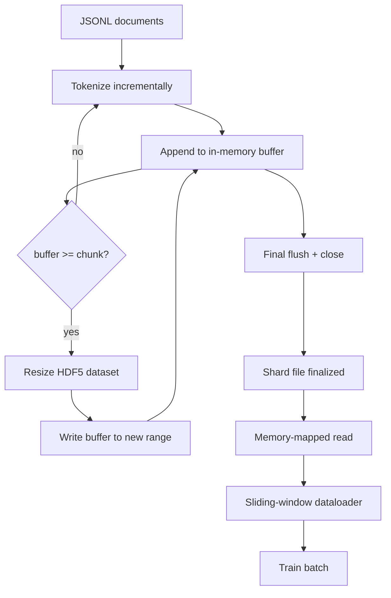

# HDF5 Tokenized 语料库

> 下载好的语料必须落到一种 trainer 能以行速流式读取的布局里。磁盘上的 JSONL 扛不住 16 个 dataloader worker。带可调整大小、分块 integer dataset 的 HDF5 可以。本课会构建流式 tokenization 到可调整大小的 HDF5 dataset、跨多个文件的 sharded write、训练时的 memory-mapped read，以及一个 sliding-window dataloader，用正确的 packing 生成固定长度序列。

**Type:** Build
**Languages:** Python
**Prerequisites:** Phase 19 lessons 30-37
**Time:** ~90 分钟

## Learning Objectives

- 将文档流式写入一个带 deterministic chunking 的可调整大小 HDF5 integer dataset。
- 将写入分片到多个 HDF5 文件，让失败边界可控，并使并行成为可能。
- 通过 HDF5 由 page cache 支撑的 chunked layout 读回 tokens，使 dataloader 只在 batch time 复制到 batch buffers。
- 实现一个 sliding-window dataloader，用显式 packing 规则发出固定长度训练序列。

## The Problem

现代 language-model training run 会在数十个 worker 上以每秒数十万 samples 的速度读取 tokens。磁盘上的 JSONL 在第一次 cold-cache page fault 时就会崩：JSON parser 很慢，文档边界无法寻址，而 seek 到 "sample 4,217,884" 需要扫描文件。即使是压缩效果很好的 Parquet，也不适合这里，因为 trainer 不想要 columns；它想要一个带 O(1) random access 的扁平 token stream。

HDF5 适合，是因为它提供一个 chunked、可调整大小、integer-only dataset，它的 chunks 在读取时对 page cache 友好。trainer 请求 `tokens[3,200,000 : 3,200,8192]` 的 slice，HDF5 就会把请求的 hyperslab 从 page cache 复制到新分配的 NumPy array。成本是每个 worker 一个打开的 file handle，以及一个 chunk 大小的 page-cache footprint；相比解码 JSONL 的成本，这可以忽略。

构建问题在于让写入端诚实可靠。Resizable datasets 很容易被误用：一次写一个文档，HDF5 文件会碎片化到不可用。一次 resize 写入所有文档，进程死亡会丢掉整个 shard。正确的纪律是 buffer-then-extend，buffer size 要匹配 chunk size，并用 sharded write 把工作量拆到多个文件中，这样 crash 最多只会损失一个 shard。

## The Concept



### 正确使用 Resizable HDF5

token dataset 使用 `maxshape=(None,)` 和固定的 `chunks=(chunk_size,)` 创建。写入时，将 tokens 缓存在长度为 `chunk_size` 的 NumPy array 中。当 buffer 填满时，dataset 精确地按 `chunk_size` 扩展，并把 buffer 写入新的 range。在 shard 结束时，剩余 buffer 会写入最后一个 partial range。除了最后一次写入外，每次写入都是 contiguous 且 chunk-aligned；reader 会根据 shard 的 HDF5 attributes 中记录的 `token_count` 截断最后一次写入。

### Sharded write

单个 HDF5 文件是单点故障。pipeline 会并行写入 shards：Phase 19 lesson 42 中的每个 input shard 生成一个 HDF5 output shard。`shards.json` index 会按 shard 记录 file path、token count、document count，以及 tokens 的 sha256。trainer 读取 `shards.json` 来计算 global offsets 并验证语料库。

### Memory-mapped read

训练时，每个 worker 会以 `swmr=True` mode 打开自己负责的 HDF5 files，并请求 `tokens[start:stop]`。一旦 chunk 变热，HDF5 的 chunk layout 就会让这成为 page-cache-backed read。worker 永远不会 materialise 整个文件：slice 会被复制到 dataloader 的 batch buffer，之后 dataloader 在 batch time 将其复制到 pinned-memory training tensor。hot path 在每次 chunk transition 时有一次 syscall；其余都是 RAM access。

### Sliding-window dataloader

dataloader 是唯一知道 training-sequence length 的阶段。它在 global token stream 中随机选一个 start index，读取 `window_size + 1` 个 tokens，然后返回 `(input, target) = (tokens[:-1], tokens[1:])`。不强制遵守文档边界：一个 window 可以跨越两个文档，中间有显式的 `boundary_token_id`，让模型学会使用 separator。这是标准 packing rule；它也是初学者容易忘掉的规则，最后得到的语料库会变成 8 percent training boundary tokens 和 92 percent natural text。

## Build It

`code/main.py` 实现：

- `Tokenizer` - 一个 byte-level deterministic tokenizer，对 demo 足够好。接口是 `encode(text) -> list[int]` 和 `vocab_size`。
- `HDF5ShardWriter` - 打开一个可调整大小的 integer dataset，将 tokens buffer 到 chunk size，按固定大小 stride resize 并写入，在 close 时把 `token_count` 和 `sha256` 记录为 HDF5 attributes。
- `ShardedTokenizationPipeline` - 遍历 input documents，将它们路由到 writer，并输出 `shards.json` index。
- `MmapTokenStore` - 打开 shard files 进行 memory-mapped reads，计算 global offsets，暴露单个 `get_slice(start, stop)` API。
- `SlidingWindowDataloader` - 从 global stream 中选择 random windows，并 yield `(input_ids, target_ids)` NumPy arrays。

文件底部的 demo 会构建一个很小的 in-memory corpus，tokenize 到两个 shards，通过 memory map 打开它们，运行 dataloader 10 个 batches，并打印每个 batch 的 shape 和 checksum。

运行：

```bash
python3 code/main.py
```

脚本以 0 退出并打印 batch checksums。

## Production Patterns

四个 pattern 能把本课扩展到真实 training run。

**Chunk size 等于典型读取大小。** trainer 每个 sample 读取 `window_size + 1` 个 tokens。把 HDF5 chunk 设置为 `window_size` 的倍数，读取就会 page-cache aligned。chunk 不匹配会让吞吐减半，因为每个 sample 都会触碰两个 chunks。

**Token count 放在 attributes 中，而不是 dataset 中。** dataset 的尾部 slice 可能没有完全填满，因为 chunk size 不一定整除 document boundary。把真实的 `token_count` 作为 HDF5 attribute 存在 dataset 上，并让 reader 在该值处截断。否则 reader 会越过真实末尾读到 zero-padded tokens，模型也会学会预测 zero。

**带 parallel verification 的 sharded sha256。** 每个 shard 都有自己的 token bytes sha256。trainer 可以在训练开始前并行验证所有 shards。错误的 sha256 会让 run 提前失败，而不是十六小时后的第三个 epoch 才失败。

**两侧都使用 `swmr=True`，writer 使用 `libver="latest"`。** Single-Writer-Multiple-Reader mode 要求 writer 以 `libver="latest"` 打开，预先创建每个 dataset，然后设置 `file.swmr_mode = True`。之后 writer 必须在每次 resize 后调用 `dataset.flush()`，这样用 `swmr=True` 打开的 reader workers 才能看到一致数据。跳过 `libver="latest"`，或在结构变更后再启用 SWMR，是 "file is locked" 失败的常见来源。

## Use It

Production patterns:

- **每个 source shard 一个 HDF5。** downloader（lesson 42）每个 URL 输出一个 shard；tokenization（本课）每个 source shard 输出一个 HDF5。1:1 mapping 让 resume 和 partial-failure recovery 变得简单。
- **Boundary token id。** boundary token 是 tokenizer vocab 的一部分，也是 dataloader 注入的唯一 token。如果模型应该忽略它，training loss 会 mask 掉 boundary token；否则模型会学会把它用作 sequence separator。
- **`shards.json` 是 source of truth。** 添加新 shard 意味着写入 HDF5、计算它的 sha256，并 append 一个 entry。trainer 在 startup 时读取该文件一次，之后永远不碰 directory listing。

## Ship It

在真实项目中，`outputs/skill-hdf5-tokenized-corpus.md` 会描述哪个 tokenizer 输入 pipeline、哪个 chunk size 匹配 trainer 的 window、`shards.json` 在 version control 中放在哪里，以及 dataloader workers 如何跨 files 分片。本课交付 engine。

## Exercises

1. 给 HDF5 writer 添加 `--compression gzip` flag，并在 demo corpus 上测量吞吐成本。为所选 default 做出辩护。
2. 给 sliding-window dataloader 添加 deterministic seed，并验证相同 seed 的两次 run 会生成相同 batches。
3. 添加 `--validate` mode，读取每个 shard，重新计算其 tokens 的 sha256，并与 `shards.json` 对比。CI 应该在训练开始前运行它。
4. 对比 chunk sizes 等于 window size、一半 window size、两倍 window size 时的 dataloader 吞吐。报告 page-cache effect。
5. 添加 `--max-document-tokens` flag，在写入时截断非常长的文档。为相对于读取时决定的 trade-off 做出辩护。

## Key Terms

| Term | What people say | What it actually means |
|------|-----------------|------------------------|
| Resizable dataset | "Append-only" | 一个带 `maxshape=(None,)` 的 HDF5 dataset，通过按 chunk 大小 stride 调用 `resize` 增长 |
| Chunked layout | "How HDF5 stores it" | 固定大小的 on-disk pages，kernel 可 memory-map，dataloader 可连续读取 |
| `swmr` mode | "Read-while-write" | Single-Writer-Multiple-Reader mode，使 dataloader workers 能安全共享文件 |
| Shard index | "shards.json" | 包含 offsets 和 content hashes 的所有 token shards 的 durable index |
| Sliding window | "Training sample" | global token stream 的固定长度 slice，trainer 会把它与 shift-by-one target 配对 |

## Further Reading

- [HDF5 chunking documentation](https://docs.hdfgroup.org/hdf5/v1_14/) - 本课使用的 chunked、resizable dataset layout
- [h5py user guide](https://docs.h5py.org/en/stable/) - HDF5 的 Python bindings
- [NumPy memory mapping](https://numpy.org/doc/stable/reference/generated/numpy.memmap.html) - HDF5 通过 h5py 暴露的读侧 primitive
- Phase 19 · 42 - 输出由本课 tokenize 的 downloader
- Phase 19 · 44 - 消费这个 dataloader 的 cosine schedule
- Phase 19 · 45 - 包裹 training step 的 AMP loop
