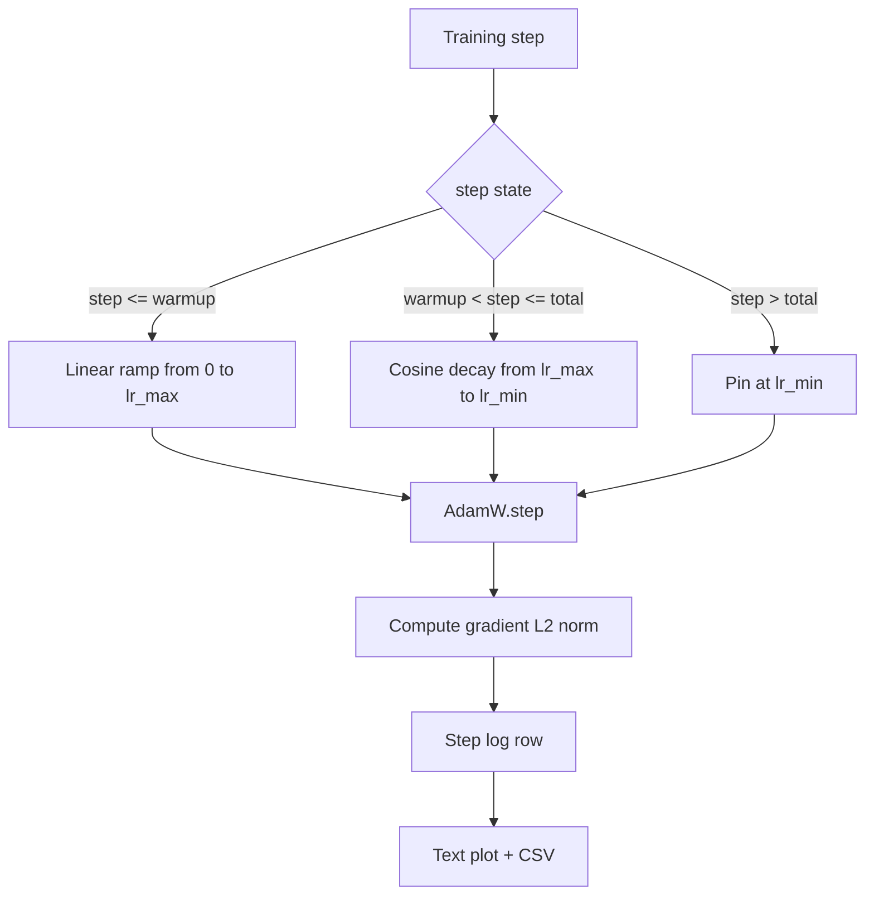

# 带 Linear Warmup 的 Cosine LR

> learning-rate schedule 是仅次于 Loss Function 的第二重要决策。带 cosine decay 和 linear warmup 的 AdamW 是 language-model training 的现代默认选择，因为它让模型在脆弱的前一千次 updates 中看到较小的 effective step size，逐步升到配置的 peak，然后平滑衰减回接近零。本课会构建这个 schedule，绘制 training steps 上的 curve，在 schedule 旁记录 gradient norms，并证明该 schedule 遵守 warmup、peak 和 decay 边界。

**Type:** Build
**Languages:** Python
**Prerequisites:** Phase 19 lessons 30-37
**Time:** ~90 分钟

## Learning Objectives

- 实现一个 AdamW Optimizer，并接入带 linear warmup 的 cosine learning-rate schedule。
- 在任意 step 精确计算 schedule 的值，避免跨 run 出现 floating-point drift。
- 将 gradient L2 norm 与 learning rate 并排记录，让训练健康状态可观察。
- 将 schedule 渲染为人眼可读的 text plot，以及任何工具都可消费的 CSV。

## The Problem

前一千次 training updates 最吵。模型的 weights 仍然接近初始化。Optimizer 的 running second-moment estimate 尚未稳定。gradient norm 又大又 noisy。如果 learning rate 在这些 updates 中就处于 peak，模型要么直接 diverge，要么陷入永远逃不出的 loss plateau。两个众所周知的修复方法是 gradient clipping，也就是 Phase 19 lesson 45 的主题，以及一个从小开始并逐步 ramp up 的 learning-rate schedule。

cosine-with-warmup schedule 有三个区域。从 step zero 到 `warmup_steps`，learning rate 从零线性缩放到配置的 peak `lr_max`。从 `warmup_steps` 到 `total_steps`，learning rate 遵循 cosine curve 的上半段，从 `lr_max` 衰减到 `lr_min`。在 `total_steps` 之后，learning rate 固定在 `lr_min`，这样一个 overshoot 的误配置 trainer 不会静默退出 schedule。

构建问题在于 schedules 很容易出现 off by one。off-by-one 会在 training run 六小时后表现为 learning rate 在模型开始 overfitting 的时刻高出或低出 1 percent；除非对 schedule 的边界做详尽测试，否则这是不可见的。

## The Concept



### Warmup formula

对于 `warmup_steps > 0` 时位于 `[0, warmup_steps]` 的 `step`，learning rate 是 `lr_max * step / warmup_steps`。退化的 `warmup_steps = 0` case 被视为 "no warmup"：schedule 在 step zero 直接从 `lr_max` 开始，并立即进入 cosine decay。一些 test harness 会传入 `warmup_steps = 0`，用于检查 schedule 仍然能生成可用 curve。

### Cosine formula

对于 `(warmup_steps, total_steps]` 中的 `step`，learning rate 是 `lr_min + 0.5 * (lr_max - lr_min) * (1 + cos(pi * progress))`，其中 `progress = (step - warmup_steps) / max(1, total_steps - warmup_steps)`。在 `step = warmup_steps`，cosine 求值为 `cos(0) = 1`，得到 `lr_max`，与 warmup endpoint 精确匹配。在 `step = total_steps`，cosine 求值为 `cos(pi) = -1`，得到 `lr_min`，与 decay endpoint 精确匹配。

两个 endpoint 上的 continuity 不是偶然。正因如此，schedule 被实现为一个关于 `step` 的单一 function，而不是三段不同的 functions 拼接在一起。拼接的 schedule 在第一次改变 `lr_max` 时就会丢掉一个边界。

### Floor after total steps

对于 `step > total_steps`，learning rate 保持在 `lr_min`。contract 是显式的：schedule 不报错，也不 extrapolate；它固定在 floor，并让 trainer 记录 warning。需要延长训练的 trainers 会修改 schedule 的 `total_steps`，而不是修改 loop。

### 将 Gradient norm 与 rate 一起记录

schedule 是训练健康状态的一半。gradient norm 是另一半。training loop 每 step 记录两者。divergent training run 会先出现 gradient norm spike，然后 loss 才会变化；调得好的 warmup 会让 norm 随 rate 线性上升；过于激进的 peak 会表现为 warmup 后 norm 仍然维持高位。磁盘上的 dataset 是 `step, lr, grad_l2_norm, loss`。CSV 是唯一 durable record。

## Build It

`code/main.py` 实现：

- `CosineWithWarmup` - 一个 stateless function，形式为基于配置 schedule 的 `lr(step) -> float`。
- `TrainState` - 将模型、`AdamW` Optimizer 和 schedule 封装成单个 step function。
- `TrainState.step` - 运行一次 forward pass、一次 backward pass，记录 gradient L2 norm，并把 `lr(step)` 应用到 Optimizer。
- `plot_schedule_ascii` - 将 schedule 渲染为人眼可读的 text plot。
- `write_schedule_csv` - 为每个 step 输出一行 learning rate。

文件底部的 demo 会构建一个很小的 `nn.Linear` 模型，在固定 input batch 上训练 20 steps，并打印每 step 的 learning rate、gradient norm 和 loss。schedule 也会被渲染为 text plot，用于 visual sanity check。

运行：

```bash
python3 code/main.py
```

脚本以 0 退出，并打印 per-step training log 和 schedule plot。

## Production Patterns

四个 pattern 能把 schedule 提升为 production artifact。

**Schedule 放在 config 中，而不是 code 中。** trainer 从提交到 git 的 YAML 或 JSON config 读取 `warmup_steps`、`total_steps`、`lr_max`、`lr_min`。schedule 是可复现的，因为 config 是 content-addressed；schedule 是可审计的，因为 config 是 PR diff 的一部分。

**Step counter 是 monotonic，并与 epochs 解耦。** 当 dataset 被 sharded 或 dataloader 重启时，一些 frameworks 会混淆 step 和 epoch。schedule 从 trainer 的 checkpoint 读取 `global_step`，而不是从 local counter 读取。resumed run 会在正确的 schedule 位置继续，因为 step counter 是 durable axis。

**Schedule plot 放在 run directory 中。** 每个 training run 都会把 `outputs/lr_schedule.png`（或本课中的 text plot）写入它的 run directory。reviewer 浏览目录时，无需重新运行任何东西就能 sanity-check schedule。这能在 PR time 捕获 misconfigured-schedule 类 bug。

**Log row schema 固定。** `step, lr, grad_l2_norm, loss`，顺序如此。下游 notebook 或 dashboard 会读取这个 schema；不 bump version 就重命名 column，会让所有现有 dashboard 失效。

## Use It

Production patterns:

- **先 sweep peak，再 sweep 其他任何东西。** `lr_max` 是最敏感的旋钮。先在 small model 上 sweep 它；optimal `lr_max` 与模型大小的 scaling 很弱，所以 small-model sweep 是一个强 prior。
- **Warmup 是 total steps 的 fraction，不是绝对 count。** 一个 200-million-step run 如果只有 2,000 warmup steps，几乎马上就达到 peak；一个 20,000-step run 用同样数量则会 warm up 10 percent。把 warmup 配置为 fraction（典型：1-3 percent），让 schedule 随训练时长缩放。
- **`lr_min` 非零是有意的。** 一个为 `lr_max` 10 percent 的 floor，会让 Optimizer 在 long tail 中继续学习。`lr_min = 0` schedule 会得到一条图上很好看的 training curve，以及一个实际上尚未完成训练的模型。

## Ship It

在真实项目中，`outputs/skill-cosine-warmup.md` 会描述哪个 config 承载 schedule、global counter 从哪个 trainer step 读取，以及什么样的 `lr_max` sweep 产出了 deployed value。本课交付 engine。

## Exercises

1. 添加 schedule 的 inverse-square-root variant，并在 200-step toy training run 上对比。哪条 curve 产生更低的 final loss？
2. 添加 `--restart` flag，在 `total_steps / 2` 增加第二次 warmup。为 warm restarts 在 toy run 上是提升还是伤害做出辩护。
3. 添加一个 unit test 验证 schedule 是 continuous：对于 `[0, total_steps]` 中的每个 step，差值 `|lr(step+1) - lr(step)|` 受 `lr_max / warmup_steps` 约束。
4. 将 schedule 接入 `torch.optim.lr_scheduler.LambdaLR`，使其能与 framework code 组合。本课使用 plain step function；wrapper 改变了什么？
5. 添加 `--plot-png` flag，通过 `matplotlib` 写出真实 plot。为本课的 text plot 和 PNG 哪个更适合作为 CI runs 的 default 做出辩护。

## Key Terms

| Term | What people say | What it actually means |
|------|-----------------|------------------------|
| Warmup | "Slow start" | 在前 `warmup_steps` 次 updates 中，从 zero 到 `lr_max` 的 linear ramp |
| Cosine decay | "Smooth drop" | 在剩余 steps 中，从 `lr_max` 到 `lr_min` 的上半段 cosine curve |
| Floor | "After training" | schedule 在超过 `total_steps` 后固定的 `lr_min` 值 |
| Gradient norm | "L2 of grads" | 拼接后的 gradient vector 的 Euclidean norm，每 step 记录 |
| Global step | "Schedule axis" | 一个能跨 restart 保留的 monotonic step counter，用于驱动 schedule |

## Further Reading

- [Loshchilov and Hutter, SGDR: Stochastic Gradient Descent with Warm Restarts (arXiv 1608.03983)](https://arxiv.org/abs/1608.03983) - cosine schedule 的 reference paper
- [Loshchilov and Hutter, Decoupled Weight Decay Regularization (arXiv 1711.05101)](https://arxiv.org/abs/1711.05101) - AdamW 的 reference paper
- [PyTorch torch.optim.lr_scheduler](https://docs.pytorch.org/docs/stable/optim.html#how-to-adjust-learning-rate) - step functions 如何与 framework schedulers 组合
- Phase 19 · 42 - 产出此 schedule 所消费语料的 downloader
- Phase 19 · 43 - 与此 schedule 共同演进的 dataloader
- Phase 19 · 45 - gradient clipping 和 AMP，也就是 loop 的下一层
