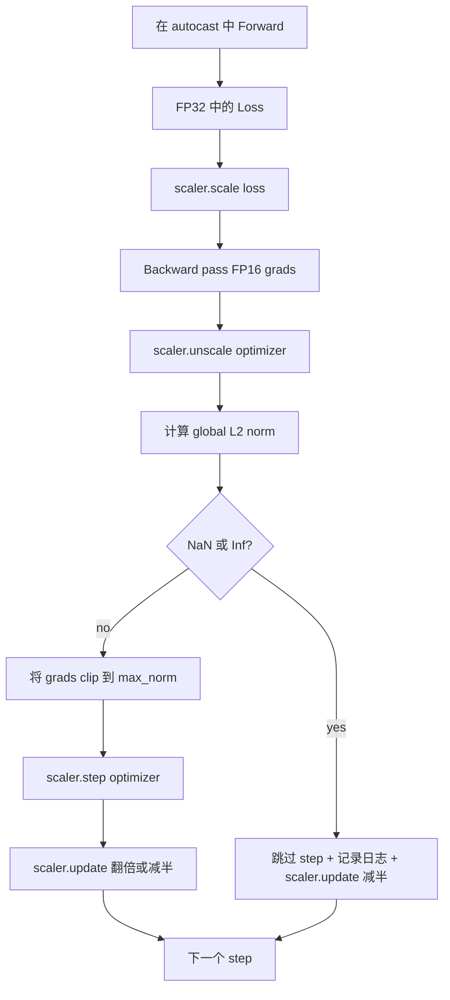

# Gradient Clipping 和 Mixed Precision

> 上一课中的 Optimizer 和 schedule 假设 Gradient 是正常的。它们通常并不正常。一个糟糕 batch 就能让 gradient norm 飙升三个数量级。Mixed-precision training 会通过在 Loss 侧引入 FP16 overflow 放大这个问题。本课构建 production training 缺一不可的两条安全带：将 Gradient Clipping 到配置好的 global L2 norm，以及使用 autocast 和 GradScaler 的 mixed-precision loop，它能检测 NaN 和 Inf，干净地跳过 step，并记录 scaling factor 以便事后分析。

**Type:** Build
**Languages:** Python
**Prerequisites:** Phase 19 lessons 30-37
**Time:** ~90 minutes

## Learning Objectives

- 计算所有 parameter gradients 的 global L2 norm，并在超过配置阈值时原地 clip。
- 用 autocast 加 GradScaler 包裹 training step，让 FP16 forward 和 backward pass 能承受 overflow。
- 检测 Loss 或 Gradient 中的 NaN 和 Inf，跳过 optimizer step，并记录这次 skip。
- 每个 step 报告 GradScaler 的 scaling factor，让连续大量 skip 能立刻可见。

## The Problem

昨天还能干净运行的 training run，在 step 8,217 时 loss curve 突然垂直上升。罪魁祸首是一个 batch，它的 gradient norm 达到 4,200，是此前峰值的二十倍。没有 clipping 时，Optimizer 会执行一次 step，把模型前一小时学到的东西全部重置。使用 norm 1.0 的 global L2 clip 后，同一个 batch 只贡献 unit-norm update；Loss 保持在趋势线上；run 存活下来。

Mixed-precision training 通过用 FP16 计算 forward pass 和大部分 backward pass，将吞吐提升 2-3 倍。代价是 FP16 的 exponent range 很窄。一个在 FP16 中 overflow 的典型 Gradient 会变成 Inf，并在后续层中传播成 NaN，导致下一次 optimizer step 把每个 weight 都设成 NaN。PyTorch 的 GradScaler 通过在 backward pass 前用一个很大的 scaling factor 乘以 Loss，并在 optimizer step 前用同一个 factor 除回 Gradient 来解决这个问题。如果在 unscale 时任何 Gradient 是 Inf 或 NaN，scaler 会跳过 step 并把 scaling factor 减半；如果前 N 个 step 都干净，scaler 会把 factor 翻倍。在训练过程中，这个 factor 会找到 FP16 range 允许的最高值。

构建问题在于正确接线。先 clip 再 unscale，阈值就会作用在 scaled gradients 上；先 unscale 再 clip，GradScaler 上的操作顺序就很重要。正确顺序是：`scaler.scale(loss).backward()`，然后 `scaler.unscale_(optimizer)`，然后 `clip_grad_norm_`，然后 `scaler.step(optimizer)`，最后 `scaler.update()`。任何其他顺序都会产生一个静默损坏的 loop。

## The Concept



### Global L2 norm

Global L2 norm 是拼接后的 gradient vector 的 Euclidean norm，而不是逐 parameter 的 norm。PyTorch 将它实现为 `torch.nn.utils.clip_grad_norm_(parameters, max_norm)`。该函数返回 pre-clip norm，因此本课可以同时记录自然值和 clipped value，这对于诊断“我们每一步都在 clipping”是必要的。

### autocast and GradScaler

`torch.amp.autocast(device_type)` 是一个 context manager，会选择性地用 FP16 运行符合条件的 operation（大多数 matmul 类 operation）。`torch.amp.GradScaler(device_type)` 是一个 helper，会在 backward 前 scale Loss，并在 optimizer step 前 inverse-scale Gradient。二者是一起设计的；只使用其中一个是配置错误，测试应该捕获这种问题。

本课使用 CPU autocast，因为这是 CI 中能运行的内容；同样的 pattern 可以通过把 `device_type="cpu"` 改为 `device_type="cuda"` 原样迁移到 CUDA。CPU 上的 GradScaler 是一个 stub（CPU autocast 默认已经以 BF16 运行，不需要 loss scaling），但本课包含这些 call site，让 wiring 与 GPU loop 完全一致。

### NaN and Inf detection

检测发生在两个位置。首先，Loss 本身会在 backward 前用 `torch.isfinite` 检查；Inf 或 NaN Loss 不会产生有用的 Gradient，会在进入 Optimizer 前被跳过。其次，在 `scaler.unscale_(optimizer)` 之后，本课会用 `has_non_finite_grad(...)` 扫描 unscaled gradients，并把任何 Inf 或 NaN 视为 skip。这两个检查合在一起覆盖 forward-pass 和 backward-pass 两类失败模式。

### Scaling factor diagnostics

Scaling factor 是 GradScaler 的内部状态。每个 step，本课读取 `scaler.get_scale()`，并把它与 learning rate 和 gradient norm 一起记录。健康的 run 会显示 scaling factor 以 2 的幂上升，直到在 `2^17` 或 `2^18` 附近饱和。行为异常的 run 会显示 factor 在高值和低值之间振荡，这说明模型的 Gradient 有时在 range 内，有时不在。不记录日志，这个诊断信号就是不可见的。

```figure
grad-clip-monitor
```

## Build It

`code/main.py` 实现：

- `clip_global_l2_norm` - 对 `torch.nn.utils.clip_grad_norm_` 的 wrapper，返回 pre-clip 和 post-clip norm。
- `has_non_finite_grad` - 扫描 Gradient 中 NaN 和 Inf 的 helper。
- `AmpTrainState` - 包裹一个 model、一个 `AdamW` optimizer、一个 GradScaler，以及一个 autocast device。暴露 `step(inputs, targets)`，运行完整的 clipping、scaling 和 skip-on-NaN pipeline。
- `StepLog` 和 `SkipLog` - 结构化的 per-step record。
- 一个 demo，会训练一个小型 `nn.Linear` model 20 个 step，在 step 5 向 Gradient 注入 Inf 以触发 skip path，并打印得到的日志。

运行：

```bash
python3 code/main.py
```

脚本以 0 退出，并打印 per-step log，每行标记为 `STEP` 或 `SKIP`；其中至少有一行是 `SKIP`。

## Production Patterns

四个 pattern 可以把这个 loop 提升为 production training step。

**Skip counter 应该是 alert，而不是一行 log。** 每次 training run 跳过少量 step 是健康的。每个 epoch 出现数百次 skip 是硬 alert：模型进入了 FP16 无法承载的区域，而 loop 正在静默失败。本课跟踪 1,000-step rolling skip rate；在 production 中，如果 rate 超过 5 percent，就应该 page。

**Clip threshold 放在 config 中。** `max_norm = 1.0` 是现代 language-model training 的默认值。先在小模型上 sweep；更大的 threshold 让模型能从真正困难的 batch 中恢复；更小的 threshold 会约束最坏情况，但代价是 loss curve 更嘈杂。这个 threshold 应该和 lesson 44 的 schedule 位于同一个 YAML 或 JSON config 中。

**Norm log 和 schedule 一起进入 CSV。** CSV columns 是 `step, lr, grad_l2_pre_clip, grad_l2_post_clip, loss, skipped, skip_reason, scaler_scale`。Reviewer 打开文件后，可以在同一行看到 schedule、Gradient 的故事、scaling factor，以及 skip outcome（含原因）。把这些 columns 拆到多个文件中，是制造错位分析的配方。

**`scaler.update()` 每个 step 都运行，即使 skip 也一样。** 在干净 step 上，scaler 读取它的 no-inf counter，递增，并可能把 factor 翻倍。在 skipped step 上，scaler 把 factor 减半并重置 counter。忘记在 skip path 上调用 `update()`，就是产生“scaling factor 从未改变”的 bug。

## Use It

Production patterns：

- **Autocast device 匹配 optimizer device。** GPU training 使用 `torch.amp.autocast(device_type="cuda")`；CPU 使用 `torch.amp.autocast(device_type="cpu")`。混用 device 会产生静默 type error，表面上是 Loss curve 看起来正常，但模型没有学习。
- **Backward 前检查 Loss。** `torch.isfinite(loss).all()` 是一次 tensor reduction；成本可以忽略，而在 NaN Loss 上节省的是完整一个 training step。始终运行它。
- **`zero_grad` 中使用 `set_to_none=True`。** 将 Gradient 设为 `None` 而不是 zero，让 Optimizer 跳过未受影响 parameter group 的计算。这个设置是免费的吞吐提升，也能略微减少 bug surface。

## Ship It

`outputs/skill-clip-amp.md` 在真实项目中会描述 training step 使用哪个 clip threshold 和 autocast device、per-step CSV 在 version control 中的位置，以及 production skip-rate alert threshold 是什么。本课交付 engine。

## Exercises

1. 用真实的 loss spike 替换合成 Inf 注入（把某个 batch 的 target 乘以 1e8），并验证 skip path 会触发。
2. 添加一个 `--bf16` mode，将 autocast 切到 BF16 而不是 FP16。BF16 的 exponent range 比 FP16 更宽，通常很少需要 loss scaling；验证同一个 demo 上 skip rate 降为 zero。
3. 添加一个 unit test，验证在没有 clipping 发生时，gradient-clip wrapper 会正确返回 pre-clip 和 post-clip norm。
4. 添加 rolling-window skip-rate 计算，以及一个 CLI flag：如果 rate 连续 100 个 step 超过配置阈值，就让 run 失败。
5. 将 loop 接到 canonical CSV（`step, lr, grad_l2_pre_clip, grad_l2_post_clip, loss, skipped, skip_reason, scaler_scale`）写入，并通过每行后 flush 确认文件能在 Ctrl-C 后保留下来。

## Key Terms

| Term | What people say | What it actually means |
|------|-----------------|------------------------|
| Global L2 norm | "Clip target" | 所有可训练 parameter 的拼接 gradient vector 的 Euclidean norm |
| autocast | "Mixed precision" | 在 `with` block 内，对符合条件的 operation 选择性执行 FP16（或 BF16） |
| GradScaler | "Loss scaler" | 在 backward 前乘以 Loss，并在 optimizer step 前 inverse-scale Gradient 的 helper |
| Skip | "Bad step" | 因为 Gradient 或 Loss 是 non-finite 而拒绝执行的 optimizer step；scaler 会将 factor 减半 |
| Scaling factor | "Scaler state" | GradScaler 当前的 multiplier；干净区间后翻倍，每次 skip 时减半 |

## Further Reading

- [Micikevicius et al., Mixed Precision Training (arXiv 1710.03740)](https://arxiv.org/abs/1710.03740) - 最初的 loss-scaling proposal
- [Pascanu, Mikolov, Bengio, On the difficulty of training recurrent neural networks (arXiv 1211.5063)](https://arxiv.org/abs/1211.5063) - Gradient Clipping 参考论文
- [PyTorch torch.amp.GradScaler](https://docs.pytorch.org/docs/stable/amp.html) - 本课包裹的 scaler API
- [PyTorch torch.nn.utils.clip_grad_norm_](https://docs.pytorch.org/docs/stable/generated/torch.nn.utils.clip_grad_norm_.html) - 本课使用的 clipping primitive
- Phase 19 · 42 - 为 loop 提供 corpus 的 downloader
- Phase 19 · 43 - loop 消耗的 dataloader
- Phase 19 · 44 - 与本 loop 组合的 schedule
