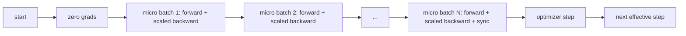
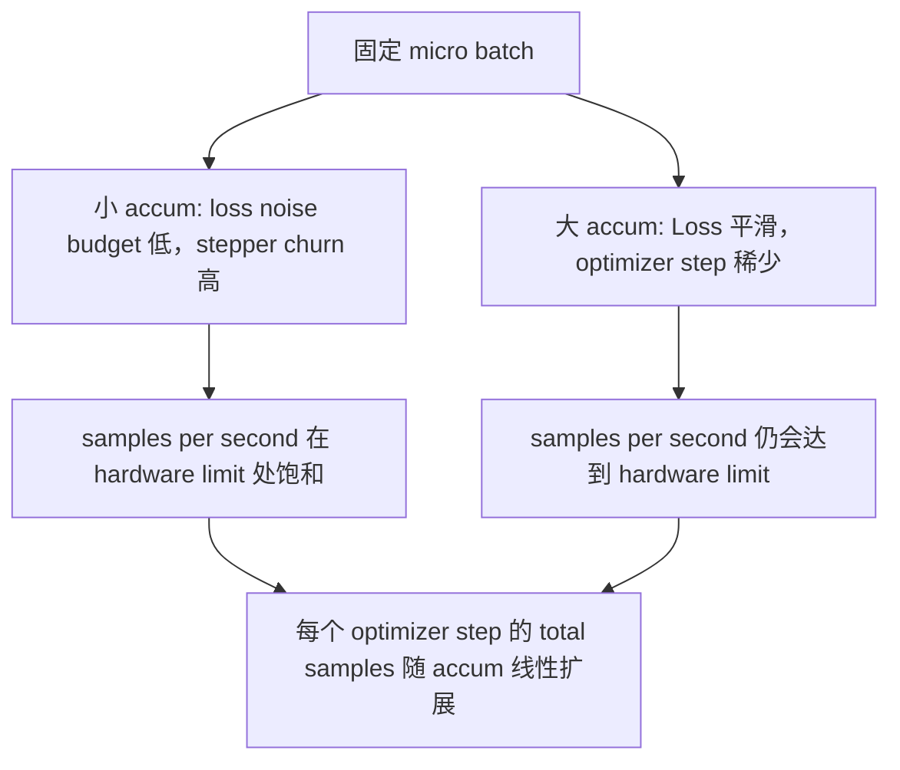

# Gradient Accumulation

> 用一个个 micro-batch，训练出你负担不起的 effective batch。Scale Loss，暂缓 optimizer step，让 Gradient 累积起来。

**Type:** Build
**Languages:** Python
**Prerequisites:** Phase 19 lessons 42 to 45
**Time:** ~90 minutes

## Learning Objectives

- 推导 effective batch 恒等式：`effective_batch = micro_batch * accum_steps`。
- 实现 per-micro-batch loss scaling，让 accumulated Gradient 匹配一次完整 full-batch backward。
- 在最后一个 micro-batch 之前跳过 optimizer synchronization（sync-on-last-step）。
- 读取 throughput against effective batch curve，并解释 diminishing return。

## The Problem

你想用 effective batch 512 训练，因为 Loss curve 更平滑，Optimizer step 在这个规模上更合理。桌上的 accelerator 在耗尽 memory 前只能容纳 32 个 example。加倍 batch 不可行。把 model 减半也不可行。领域在 2017 年开始采用并沿用至今的技巧是：运行 16 次 backward pass，让 Gradient 在 parameter buffer 中累积，并且只在计数达到目标时才执行 optimizer step。

风险在于，Loss 不再是大 batch 时的同一个数值。将 16 个 mini-batch 的 cross entropy 直接相加，会是一个 full batch Loss 的 16 倍。没有 scaling 时，Gradient 方向是正确的，但幅度是错的，Optimizer step 会大 16 倍。修复方法只有一次除法。这个修复也很容易忘记。

## The Concept



Contract 很短：

- 每个 micro-batch 的 Loss 在 `backward()` 前除以 `accum_steps`。PyTorch 默认会把 Gradient 累加到 `param.grad` 中；这次除法会把 running sum 推回正确尺度。
- Optimizer step 每个 effective batch 触发一次，在最后一个 micro-batch 的 backward 之后。中途 step 会扭曲后续整个 run 所依赖的每个 parameter。
- Optimizer 的状态（momentum buffer、Adam moments）每个 effective step 前进一次，而不是每个 micro-batch 前进一次。否则 exponential moving averages 会看到错误频率，并消耗掉 schedule。
- 在单 device 上，这只是 bookkeeping。在 multi-rank cluster 上，同一个 pattern 会把非 final micro-batch 包在 `no_sync` context 中，跳过 Gradient all-reduce；最后一个 micro-batch 会一次性 reduce 完整 accumulated Gradient，而不是支付 N 次网络成本。

### The equivalence proof in code

```python
loss = criterion(model(x_full), y_full)
loss.backward()
opt.step()
```

等价于

```python
for x, y in chunks(x_full, y_full, n):
    scaled = criterion(model(x), y) / n
    scaled.backward()
opt.step()
```

除了 floating point summation order 的差异。Loop 结束时 accumulated gradient buffer 与一次 full-batch backward 会产生的 tensor 相同。Lesson code 在 `equivalence_check` 中用小于 1e-4 的 max-abs difference 断言这一点。

### Where the cost goes

每个 micro-batch 都需要一次 forward 和一次 backward。使用 accumulation 时，你用时间换 memory。`outputs/accum-curve.json` 中的 throughput curve 显示了在固定 micro-batch 下 effective batch 增大时会发生什么：



没有免费的午餐。将 `accum_steps` 翻倍，会让每个 optimizer step 的 wall time 翻倍。变化的是 Gradient estimate 的 variance：在相同 wall budget 下，你执行的 optimizer step 更少，但每一次都在更多 sample 上平均。文献把 large batch 和 small batch 视为不同的 optimization problem；本课关注的是机制，而不是统计。

## Build It

`code/main.py` 是可运行 artifact。它做三件事。

### Step 1: equivalence check

`equivalence_check()` 用相同 seed 构建同一个 network 的两个副本。一个在一次 forward pass 中看到 16-sample batch。另一个看到四个 4-sample chunk，并把 Loss 除以四。函数在 optimizer step 前比较 gradient buffer，在之后比较 parameter。断言是 `max_abs_diff < 1e-4`。

### Step 2: sync-on-last-step pattern

`train_one_optimizer_step` 遍历 micro-batch。除了最后一个 micro-batch，每一个都会进入 `no_sync_context(model)`。在单进程中，这个 context 是 no-op；在 DDP 中，这里会跳过 Gradient all-reduce。无论如何，bookkeeping 都一样。`sync_counter` 记录我们离开 no_sync scope 的次数；对于 N 个 micro-batch，count 是每个 effective step 一次，而不是 N 次。

### Step 3: the throughput curve

`sweep_effective_batches` 使用固定 micro-batch 和一组 accumulation steps 运行同一个 model。每个设置都会记录：

- `samples_per_sec`: 看到的 total samples 除以 wall time
- `median_step_ms`: 每个 effective step 的 50th percentile
- `sync_calls`: 被触发的 collective points
- `avg_loss`: sweep 的 optimizer steps 平均值

输出落在 `outputs/accum-curve.json`，并可从 notebook 复用。

运行：

```bash
python3 code/main.py
```

脚本先打印 equivalence diff，再打印 sweep table，最后打印 JSON path。Exit code zero。

## Use It

在 production training 中，Gradient Accumulation 藏在一个 knob 后面。PyTorch 的 pattern 是 `accumulation_steps = effective_batch // (micro_batch * world_size)`。这里不允许使用的 framework 会包裹同一个 loop，但 step 是一样的：scale Loss，跳过 non-final micros 上的 sync，accumulate，step 一次。

实践中有三个 pattern：

- Micro-batch size 被选择为能撑满 device memory。更小会浪费 accelerator cycles。更大会崩溃。
- Effective batch 从 learning rate schedule 中选择。Large effective batches 需要 scaled learning rates 和 warmup；这就是自 2017 年以来被讨论的 linear scaling rule。
- Accumulation count 是二者之间的桥梁，也是你唯一能在 runtime 自由调节而不重写 data loader 的 knob。

## Ship It

`outputs/skill-gradient-accumulation.md` 捕获这个 recipe，让同伴可以把它放进新 repo：按 `accum_steps` scale Loss，在 non-final micros 上跳过 optimizer sync，每个 effective batch 只 step Optimizer 一次，把 throughput against effective batch 以 JSON 记录，让 trade 可见。

## Exercises

1. 用 `--num-steps 100` 重新运行 sweep，并绘制 samples per second against effective batch。曲线在哪里变平？
2. 添加一个错误 scaling variant（不做除法），并展示 step 1 时相对 reference 的 parameter diff。
3. 将 SGD 换成 AdamW，并确认 optimizer state 每个 effective step 前进一次，而不是每个 micro-batch 前进一次。
4. 引入真实的 `DistributedDataParallel` wrapper，并把 `no_sync_context` 路由到它的方法。确认 sync_calls 每个 effective batch 减少 N-1。
5. 修改 equivalence check，对比两种不同的 micro split（2 by 8 vs 4 by 4），并解释你需要放宽的任何 tolerance。

## Key Terms

| Term | What people say | What it actually means |
|------|-----------------|------------------------|
| Micro batch | 你 forward 的 batch | 单次 forward pass 中能放进 memory 的 slice |
| Accum steps | 每个 step 的 backward pass 数 | 在一次 optimizer step 前累加的 backward 数量 |
| Effective batch | 这个 batch | Micro batch 乘以 accum steps，再乘以 data parallel world size |
| Loss scaling | 除以 N | Per-micro-batch division，使 summed gradients 匹配 full batch |
| Sync on last | 跳过其余部分 | 只在 window 中最后一次 backward 上运行 Gradient collective |

## Further Reading

- PyTorch docs 中关于 `DistributedDataParallel.no_sync` 的内容，介绍 sync-on-last-step 技巧的 production 版本。
- Goyal et al., 2017，关于 large batch training 的 linear scaling，是关心 effective batch 的经典原因。
- PyTorch issue tracker 中关于 Gradient Accumulation 与 mixed precision unscaling 的交互。
- Phase 19 lessons 42 to 45 覆盖本课所假设的 model、data loader、Optimizer 和 trainer scaffolding。
- Phase 19 lesson 47 覆盖 checkpoint 和 resume，让长时间 accumulation run 能在 wallclock cap 下存活。
