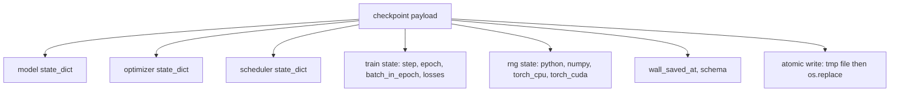
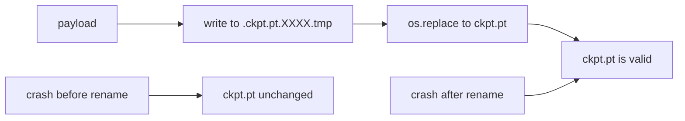
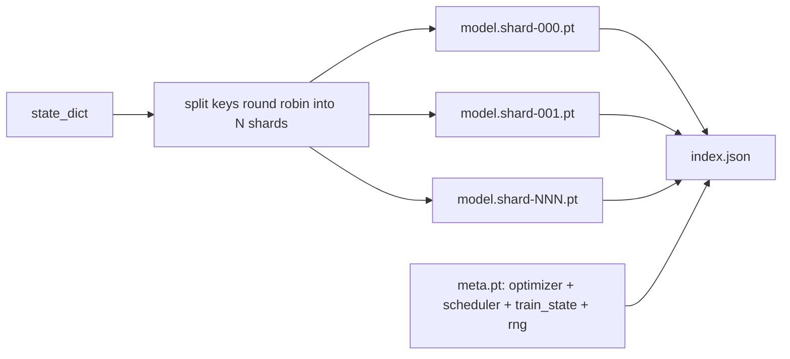

# Checkpoint 保存与恢复

> 训练中断会杀死运行；checkpoint 让它们可以继续。原子化保存 model、Optimizer、scheduler、Loss history、step counter 和 RNG state，这样任何时刻被终止时，磁盘上都会留下一个有效文件。

**Type:** Build
**Languages:** Python
**Prerequisites:** Phase 19 lessons 42 to 45
**Time:** ~90 minutes

## Learning Objectives

- 将完整训练状态捕获到单个 payload 中，使其可以重新加载到一个全新的 process。
- 使用先写入 temp 再 rename 的方式实现 atomic save，确保 crash 永远不会留下写到一半的文件。
- 恢复 Python、NumPy 和 PyTorch 的 RNG state，使 resume 后的 Loss 匹配未中断的 baseline。
- 为不再能放进单个文件的 model 构建 sharded checkpoint layout，包含经过 hash 验证的 shards 和一个 JSON index。

## 问题

你设置了一个训练任务，预计运行 18 小时。wallclock 上限是 4 小时。第 11 小时时，cluster 重启了，因为某个比你薪资等级更高的人批准了 kernel upgrade。没有 checkpoint，你就要从头开始。没有 resume，你还会丢失前 11 小时学到的 Optimizer state，所以即使 model weights 留了下来，AdamW moments 也已经没了，下一步会突然朝训练轨迹早已越过的方向跳去。

正确的 artifact 是一个单文件，其中保存继续训练所需的一切：model parameters、Optimizer state、scheduler state、用于绘图的 Loss history、当前 step 和 epoch 以及 batch-in-epoch counters，还有每个 randomness 来源的 RNG state。没有 RNG state，恢复后的 Loss curve 就会是另一条 curve。同一个 model、同一份 data、不同的 shuffle、不同的 dropout mask、dashboard 上不同的数字。

Atomic save 是这份 contract 的另一半。直接写入最终文件名意味着 crash 发生在写入中途时会留下 corrupt file；resume 会读到 garbage。写入同一目录中的临时文件，然后 rename，意味着 crash 发生在写入中途时，之前的 good file 不会被触碰。rename 在 POSIX file systems 上是 atomic 的。

## 概念



### 五个 state buckets

| Bucket | 为什么重要 |
|--------|------------|
| Model | Weights 和 buffers；也就是 model 本身。 |
| Optimizer | Momentum 和 adaptive moments；没有它们，下一步就是另一个 Optimization 问题。 |
| Scheduler | Learning rate 在 curve 上的位置；cosine schedules 尤其在意这一点。 |
| Train counters | Step、epoch、batch-in-epoch，以及绘制 dashboard 的 Loss history。 |
| RNG state | 为 dropout、data shuffling，以及 model 内部的任何 sampling 提供 determinism。 |

### Atomic save



两条规则。第一，临时文件必须位于 target 所在的同一目录中，这样 rename 才会停留在同一个 file system 内；跨 device rename 不是 atomic 的。第二，临时名称对每次尝试都必须唯一，避免两个 writer 相互覆盖。

### Sharded checkpoints

当 model 变大时，单文件 payload 会变得太大，加载不够快、检查不方便，而且在 network share 读取中途抖动时非常痛苦。解决方法是把 parameter state 拆成 shards，并写入一个小 index 把它们关联起来。



Index 记录 shard count、每个 shard 的 sha256，以及 meta file 的 sha256。当任何 hash 不匹配时，loader 会明确失败。Shards 可以落在不同的物理磁盘上；meta 很小，会先读取。

### Resume 从 epoch 中途继续

把 resume 对齐到下一个 epoch 开始，会浪费从几分钟到一天不等的时间。解决方法是 `(epoch, batch_in_epoch)` 加 RNG state。load 之后，training loop 会将 random number generator 快进越过当前 epoch 中已经消耗的 batches，然后从 `batch_in_epoch` 继续。本课代码精确地完成了这一点；断言是 resume 后的 Loss trajectory 会在 1e-4 范围内匹配未中断的 baseline。

```figure
cc-atomic-checkpoint
```

## Build It

`code/main.py` 提供四个 primitives 和一个 demo driver。

### Step 1: 捕获并恢复 RNG state

`capture_rng_state` 返回一个 dict，包含 Python 的 `random.getstate`、NumPy 的 `np.random.get_state`，以及 PyTorch CPU 和 CUDA RNG bytes。`restore_rng_state` 会反向恢复它。CPU tensor 是一个 uint8 byte buffer，PyTorch 的 RNG 知道如何消费它。

### Step 2: atomic save

`atomic_save` 将 payload 写入 target directory 中的 temp file，然后用 `os.replace` 将其交换到最终名称。`atomic_write_json` 对 sharded index 执行相同操作。

### Step 3: 完整 checkpoint round trip

`save_checkpoint` 将 model、Optimizer、scheduler、train state 和 RNG 打包到一个 dict 中。`load_checkpoint` 反向恢复它，并返回一个 `TrainState`。schema field 是 upgrade hook：未来格式变化会递增 version string，而 loader 会进行 dispatch。

### Step 4: sharded variant

`save_sharded_checkpoint` 以 round-robin 方式把 parameter keys 分配到 N 个 shards 中，用各自的 atomic save 写入每个 shard，写入一个包含 Optimizer、scheduler 和 train state 的 meta file，并写入包含 shard sha256 的 JSON index。`load_sharded_checkpoint` 会在 merge 前验证每个 shard。

### Step 5: resume demo

`run_resume_demo` 会将一个小 model 训练 `total_steps`，在 `interrupt_at` 保存 checkpoint，然后继续运行。第二个 process 会恢复 checkpoint 并运行剩余 steps。该 function 返回 interruption point 之后两条 Loss trajectories 的最大绝对差。有了 RNG 恢复，差异为零或 floating-point noise。

运行它：

```bash
python3 code/main.py
```

单文件和 sharded demos 都断言 max-diff 小于 1e-4。摘要会写入 `outputs/resume-demo.json`。

## Use It

生产训练栈会把 checkpointing 作为 trainer 的一部分交付。形状相同：model + Optimizer + scheduler + counters + RNG，以 atomic 方式写入，并按 step 命名，便于找到最新文件。Sharded layouts 通过 parallel reads 支持 large model loading；`index.json` 正是让这件事成立的部分。

要强制执行三种模式：

- **Schema 是 payload 中的一个 string。** Migrations 根据它分支。没有它，你就无法在不破坏旧运行的情况下演进格式。
- **对每个 shard 计算 Sha256。** 静默截断的 download 是最糟糕的 bug；loader 要么快速失败，要么晚些失败。
- **让 checkpoint cadence 保持诚实。** 每 N steps 保存一次，并且每隔若干 wallclock-minute 保存一次，取更短者。否则，crash 发生在一个很长 step 上时，会浪费整整一个窗口的工作。

## Ship It

`outputs/skill-checkpoint-save-resume.md` 是任何新 training script 的配方：payload shape、atomic write、RNG capture、sharded index。把这个 skill 放进 repo，在 periodic save site 接入 `save_checkpoint`，在 startup 接入 `load_checkpoint`，运行就能挺过 kill。

## Exercises

1. 用按 parameter group 分片替换 round-robin sharding（以 `.weight` 结尾的 layers vs `.bias`）。什么时候每种 layout 更合适？
2. 扩展 save loop，保留最后 K 个 checkpoints，并清理更旧的 ones。当 disk 很小时，合适的 K 是多少？
3. 添加一个 `--ckpt-every-seconds` flag，按 wallclock interval 触发保存，而不只是按 step count。
4. 添加一个 checksum verification path，在 startup 运行，扫描目录中的每个 checkpoint，并报告哪些已 corrupt。
5. 实现一个 `migrate_v1_to_v2` function，向 payload 添加一个新 field，并递增 schema string。让 load 同时兼容两个 versions。

## Key Terms

| Term | 人们常说 | 实际含义 |
|------|----------|----------|
| Atomic save | “写入然后祈祷” | 写入同一目录中的 temp file，然后用 os.replace 放入 target name |
| State dict | “Weights” | Model parameters 和 buffers，按 parameter name 作为 key |
| Sharded checkpoint | “大 model file” | 多个文件，每个 shard 一个，加上一个 meta file 和一个包含 sha256 的 JSON index |
| RNG state | “Random seed” | python random、numpy、torch CPU、torch CUDA 的捕获状态；不只是 seed |
| Mid-epoch resume | “Restart” | 快进 RNG，并从同一 epoch 中的下一个 batch 继续 |

## Further Reading

- POSIX `rename` semantics，用于支撑 `os.replace` 所依赖的 atomicity claim。
- PyTorch 关于 `torch.save` 和 `torch.load` 的文档，包括用于 cross-device restores 的 `map_location`。
- Phase 19 lesson 46 涵盖了本课 checkpoint payload 可以跨越保存的 gradient accumulation。
- Phase 19 lesson 48 涵盖了本方案所兼容的 state dict format 对应的 distributed wrappers。
- Linux kernel `fsync` documentation，用于说明 atomic rename 背后的 durability guarantee。
