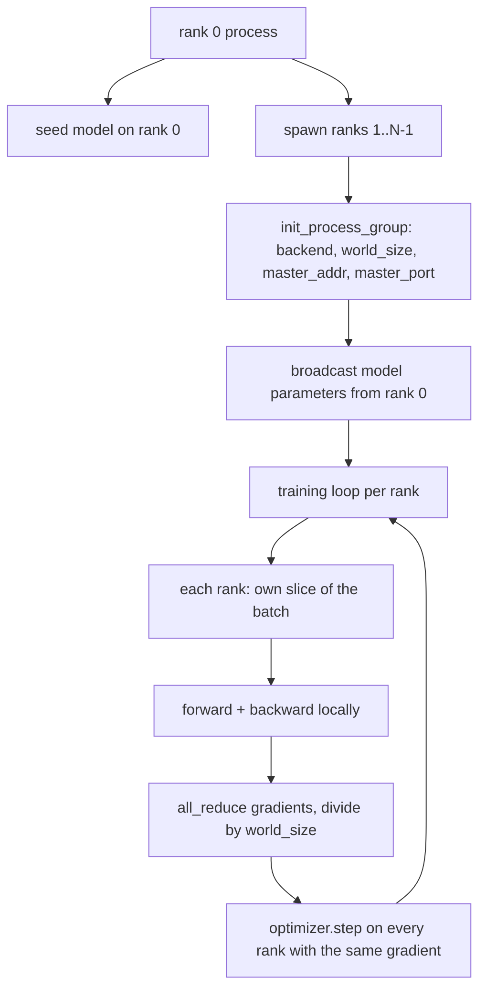
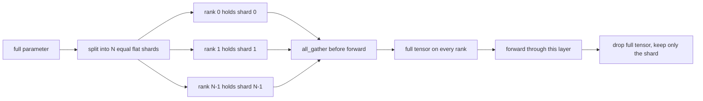

# 从零构建 Distributed Data Parallel 和 FSDP

> Multi-rank training 是两个 collective 和一条规则。启动时 broadcast parameters，backward 后 average gradients，永远不要让各个 rank 对自己处于哪一步产生分歧。

**Type:** Build
**Languages:** Python
**Prerequisites:** Phase 19 lessons 42 to 45
**Time:** ~90 minutes

## Learning Objectives

- 使用 `gloo` backend 启动跨 N 个 rank 的 process group，不需要特殊硬件。
- 实现一个最小 DDP wrapper，在 construction 时 broadcast parameters，并在 backward 后 all-reduce gradients。
- 证明 per-rank gradients 的 all-reduce 匹配 concatenated input 上的 single-process gradient。
- 勾勒 FSDP parameter sharding：每个 rank 持有一个 slice，forward pass 时 gather full tensor，之后 drop。

## 问题

模型能放进一个 device。Dataset 放不下。Optimization budget 要求你在每 wallclock second 看到 N 倍样本。第一个杠杆是 data parallel：每个 rank 在 batch 的不同 slice 上运行同一个模型，然后在 optimizer step 之前 average gradients。第二个杠杆是 FSDP：模型本身也放不进一个 device，所以每个 rank 持有每个 parameter 的一部分，并在 forward pass 期间逐层重建 full tensors。

痛点在 bookkeeping。如果 parameters 在 rank 之间 drift，这次 run 会静默损坏。如果你 average gradients 但没有 average loss，dashboard 就会撒谎。如果 collective backend 无法就 topology 达成一致，run 会永远 hang。修复方法是亲手写一次 collectives，然后永远不要信任你无法复现的 wrapper。

本课在 CPU 上运行。不假设 CUDA。`gloo` backend 随每个 PyTorch build 一起提供，并接受 `torch.multiprocessing` workers；同一份代码切换到 multi-GPU node 上的 `nccl` 时，结构无需改变。

## 概念



### 重要的两个 collectives

| Collective | 做什么 | 何时使用 |
|------------|--------------|------|
| `broadcast` | 将一个 tensor 从一个 rank 复制到所有其他 rank | Parameter init、scheduler state、任何 one-to-all sync |
| `all_reduce` | 在所有 rank 间对一个 tensor 求和（或 mean、或 max），每个 rank 都得到结果 | Backward 后的 Gradient averaging |
| `all_gather` | 每个 rank 贡献一个 tensor，每个 rank 都得到 concatenation | Logits collection、FSDP parameter unshard |

DDP contract 是 construction 时 `broadcast`，backward 后 `all_reduce`。FSDP sketch 在每一层 forward pass 前加入 `all_gather`。

### Gradient averaging 匹配 single-process gradient

在 N 个 rank 上用 B 个样本的 batch 训练的模型，必须产生与 single process 在 N*B 的 batch 上训练相同的 gradient。诀窍是对 per-rank gradients 求和并除以 N，会得到 average loss gradient，这正是 mean reduction 的 cross entropy 在 full batch 上会产生的结果。Lesson code 会在 manual all-reduce gradient 和 reference single-process gradient 之间 assert `max-abs-diff < 1e-3`。

### FSDP sketch



Memory win 是精确的：per-rank parameter memory 降到 1/N。代价是 gather，每次 forward pass 都要支付。Production FSDP 会将 gather 与上一层的 compute overlap，所以 wallclock cost 比朴素核算预测的小得多。本课对每个 parameter 做 round-trip，并 assert reconstruction 与 original bit-equal。

### CPU 与 gloo backend

CUDA 是 production target，但 CPU 上也存在相同 code paths。`gloo` 是 CPU collective backend。它在 GPU 上比 `nccl` 慢几个数量级，但 API surface 完全相同。本课的 process group 用 `backend="gloo"` 初始化，并用 `torch.multiprocessing` spawn ranks，而不是 `torchrun`；两者最终都会调用相同的 `torch.distributed`。在 multi-GPU node 上，唯一变化是 `backend="nccl"`、device tensors，以及用 `torchrun` 启动。

## Build It

`code/main.py` 是可运行 artifact。

### Step 1：启动 process group

```python
os.environ["MASTER_ADDR"] = "127.0.0.1"
os.environ["MASTER_PORT"] = str(port)
dist.init_process_group(backend="gloo", rank=rank, world_size=world_size)
```

`MASTER_ADDR` 和 `MASTER_PORT` 是 rendezvous：每个 rank 都拨到同一 host 上的同一 port。本课通过 bind-and-close 技巧挑选 free port，避免多次 run 共享一台机器时发生 collision。

### Step 2：construction 时 broadcast

`MinimalDDP.__init__` 遍历每个 parameter 和 buffer，并调用 `dist.broadcast(tensor, src=0)`。Rank 0 的值成为 canonical init。没有这一步，每个 rank 会用自己的 seed 初始化，rank 从第一步开始 divergence。

### Step 3：backward 后 all-reduce gradients

```python
def all_reduce_grads_(module, world_size):
    for p in module.parameters():
        if p.grad is None:
            p.grad = torch.zeros_like(p.data)
        dist.all_reduce(p.grad.data, op=dist.ReduceOp.SUM)
        p.grad.data.div_(world_size)
```

每个 rank 最终得到相同的 averaged gradient。Optimizer step 现在是在每个 rank 上基于相同 input 的函数，这就是 parameters 在整个 run 中保持 sync 的原因。

### Step 4：证明等价性

`manual_all_reduce_matches_single_process` 在 rank 0 上构建同一个模型，并将 post-all-reduce gradient 与 single process 在 concatenated input 上会计算出的 gradient 进行比较。max-abs-diff 约为 1e-8。

### Step 5：FSDP round trip

`fsdp_round_trip_sketch` flatten 每个 parameter，pad 到 `world_size` 的倍数，slice，all-gather，再 unpad。每个 rank 的 reconstruction 都等于 original。这是 unshard step；其 inverse（forward 后 re-shard）就是从 gathered tensor 中取一个 slice。

运行：

```bash
python3 code/main.py
```

默认 world size 是 2。两个 CPU process spawn，通过 `gloo` 相互通信，并以 zero 退出。输出 `outputs/ddp-demo.json` 捕获每个 rank 的 parameter sums、all-reduce 后的 gradient norm、FSDP round-trip result，以及 manual-vs-reference gradient diff。

## Use It

Production training stacks 调用相同 primitives。PyTorch 的 `DistributedDataParallel` 增加了：post-backward gradient hooks，用于将 all-reduce 与 backward overlap；bucketed all-reduce，将多个小 gradients 合并为一次 collective；以及 lesson 46 使用过的 `no_sync` context。

PyTorch 的 FSDP 增加了：每层一个 flat parameter view，让每个 rank 持有一个 contiguous buffer；下一层 unshard 与当前层 compute 的 overlap；以及可选的 shard CPU offload。

形状保持不变：启动时 broadcast，backward 后 reduce，parameters 放不下时进行 shard。

## Ship It

`outputs/skill-distributed-fsdp-ddp.md` 携带新 training script 的 recipe：用 `gloo` 启动 CPU 的 process group，用 `nccl` 启动 GPU 的 process group，将 model 包在 DDP shell 中，在 construction 时 broadcast 并在 backward 后 reduce，按需使用 FSDP sketch 中的 all_gather pattern 对 parameters 分片。

## Exercises

1. 使用 `--world-size 4` 运行，并确认整个 run 中 param spread 保持在 1e-3 以下。
2. 将 manual averaging 替换为 `dist.all_reduce(op=dist.ReduceOp.AVG)` 并计时差异。
3. 给 DDP wrapper 添加 post-backward hook，让 all-reduce 与 backward 的其余部分 overlap；测量 wallclock 改善。
4. 实现 FSDP re-shard step：forward pass 后，再次用 local shard 替换 full tensor。确认 per-rank memory 下降。
5. 在 CUDA 机器上将 backend 切换为 `nccl`。记录哪些 environment variables 改变，哪些保持不变。

## Key Terms

| Term | 人们的说法 | 实际含义 |
|------|-----------------|------------------------|
| Backend | "gloo or nccl" | 实现 collective ops 的 library；gloo 是 CPU，nccl 是 GPU |
| World size | "Total ranks" | group 中的 process 数量；group 是 collectives 操作的 unit |
| Rank | "Worker id" | group 内的 process identifier，从零开始索引 |
| All-reduce | "Sum the grads" | 在所有 rank 间对一个 tensor 求和，每个 rank 最终得到相同结果 |
| Unshard | "Gather the params" | 通过 all_gather 从 per-rank slices 重建 full tensor |

## Further Reading

- PyTorch `torch.distributed` documentation，了解本课依赖的 collective semantics。
- `gloo` library 的 collective list，其形状与 CUDA-backed `nccl` primitives 相同。
- Phase 19 lesson 46，了解将 DDP all-reduce 包在 `no_sync` 中的 gradient accumulation pattern。
- Phase 19 lesson 47，了解可在 DDP 和 FSDP run 中存活的 checkpoint layout。
- PyTorch FSDP documentation，了解这里 sketch 的 parameter sharding 的 production implementation。
