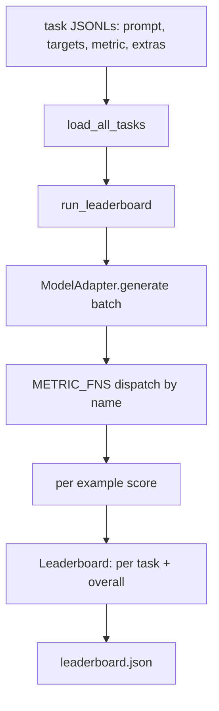
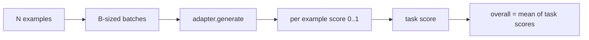

# 语言模型评测 Harness

> 如果一个模型在你无法定义的任务上表现很好，那它只是碰巧表现很好。Harness 把任务定义、metric、runner 和 leaderboard 放进一个简短、可替换的形状里。

**Type:** Build
**Languages:** Python
**Prerequisites:** Phase 19 lessons 42 to 45
**Time:** ~90 minutes

## Learning Objectives

- 将一个任务定义为 JSONL 文件，每个 example 包含 `prompt`、`targets`、`metric`，以及可选的 `extras`。
- 实现五个 metrics：exact match、rouge-l F1、executable check、multiple choice 和 substring contains。
- 构建一个 runner，按 task 批处理 examples，并分发给可替换的 model adapter。
- 输出 leaderboard JSON，包含每个 task 的 score、latency，以及可复现的 overall average。

## 问题

每周都会有新的语言模型出现。营销话术说它表现很好。诚实的问题是：在哪方面表现好？诚实的答案是你自己写的 leaderboard，因为 vendor 的 leaderboard 正是他们调优过的那个。

如果你的 repo 里没有 harness，你只能凭感觉比较两个模型。有了 harness，你就能在固定 task set、固定 metric 上比较它们，并得到可以 diff 的 JSON output。Harness 是昨天运行和今天运行之间的 contract。没有它，regression 就会被发布出去。

陷阱是让 harness 过拟合到单个模型。修复方式是反过来使用同一个陷阱：harness 小到十五分钟能读完，tasks 小到可以随 repo 发布，metrics 从零编写以便同事 audit，而 adapter 是唯一放置模型特定代码的地方。替换 adapter，leaderboard 会变化；替换 tasks，leaderboard 会变化。其他东西都不应该变化。

## 概念



### Task spec

每个 example 是一行 JSONL：

```json
{"id": "arith-00", "prompt": "compute: 2 + 2", "targets": ["4"], "metric": "exact_match"}
```

对于需要 scoring helpers 的 metrics，`extras` 携带旁路 payload：

```json
{
  "id": "code-00",
  "prompt": "python: write a function f that doubles its input",
  "targets": ["ok"],
  "metric": "code_exec",
  "extras": {"io_pairs": [[1, 2], [3, 6]]}
}
```

一个 task 是 `outputs/tasks/` 下的一个 `.jsonl` 文件。文件名就是 task name。一个文件中的所有 examples 共享同一个 metric。

### 五个 fixture tasks

| Task | Metric | 测试内容 |
|------|--------|---------------|
| arithmetic | exact_match | 对确定性答案的 Token 级正确性 |
| summary | rouge_l | 针对单行 reference summary 的 longest common subsequence F1 |
| code-exec | code_exec | 可执行测试：预测出的 function 必须满足一组 input-output pairs |
| multiple-choice | multiple_choice | prediction 的首字母必须匹配允许的 letter |
| generation | substring_contains | Free-form text 必须包含至少一个 target substring |

### Metric contract

每个 metric 都是一个函数：`(prediction, targets, extras) -> float in [0.0, 1.0]`。Harness 对 per-example scores 取平均得到 task score，再对 task scores 取平均得到 overall。Metric functions 都很小：

- `exact_match`：转小写、折叠 whitespace、判断 equality。
- `substring_contains`：相同 normalization，做 substring test。
- `multiple_choice`：取第一个 character 并转为大写。
- `rouge_l`：LCS length 除以 prediction 和 reference 的长度，计算 precision 和 recall 的 F1。
- `code_exec`：在受限 namespace 中执行 prediction，对每个 input-output pair 调用 `f(x)`，统计 matches。

code_exec metric 会在精简后的 builtins namespace 中运行 prediction。本课的 test 断言 `import os` 会失败，因为 `os` 不在 namespace 中；你无法从 code prediction 访问 filesystem。

### Model adapter

```python
class ModelAdapter(Protocol):
    def generate(self, prompts: Sequence[str]) -> List[str]: ...
    @property
    def name(self) -> str: ...
```

Adapter 是衔接点。本课提供 `ToyAdapter`，这是一个确定性的 pattern matcher，会为五个 fixture tasks 中的每个 prompt 返回正确答案。真实 adapter 会调用模型并返回输出。Harness 不关心是哪一个。

### Runner

`run_task` 每次批处理 `batch_size` 个 prompts，并分发给 metric function。`run_leaderboard` 遍历每个 task 并求平均。`write_leaderboard` 输出带 schema string 的 JSON，这样未来 format 变化不会静默破坏 dashboards。




```figure
eval-harness-matrix
```

## Build It

`code/main.py` 是可运行 artifact。

### Step 1：seed fixture tasks

`seed_fixture_tasks(target_dir)` 写入五个 `.jsonl` 文件。第一次运行 `main.py` 时，如果目录为空，它会 seed 这些文件。

### Step 2：load tasks

`load_all_tasks(task_dir)` 读取每个 `.jsonl`，并返回从 task name 到 `Example` records 列表的 dict。以 `#` 开头的 comment lines 和 blank lines 会被跳过，因此贡献者可以注释这些文件。

### Step 3：implement metrics

每个 metric 都是一个小函数，并带有 unit test。本课的 test suite 包含 13 个 cases，覆盖 normalization、partial overlap、code execution 和 unsafe code rejection。

### Step 4：write the runner

`run_task` 迭代 batches，并生成一个 `TaskResult`，其中包含 score、correct count、total count 和 latency。`run_leaderboard` 遍历所有 tasks，并生成带 overall average 的 `Leaderboard`。

### Step 5：emit JSON

`write_leaderboard` 会序列化 board。`--include-per-example` flag 会导出 per-example records，这样当 scores 变化时，你可以把 predictions 与前一次运行做 diff。

运行它：

```bash
python3 code/main.py
```

脚本第一次运行时会 seed fixtures，用 toy adapter（它会答对每个 fixture）打分，并写入 `outputs/leaderboard.json`。使用 toy adapter 时 overall score 是 1.0；`test_main.py` 中的 stub adapter test 展示了当 adapter 无法回答时，同一个 harness 会产生 0.0。

## Use It

要接入真实模型，写一个 adapter。形状如下：

```python
class HttpAdapter:
    name = "vendor.v1"

    def __init__(self, endpoint, api_key):
        self.endpoint = endpoint
        self.api_key = api_key

    def generate(self, prompts):
        out = []
        for prompt in prompts:
            response = http_post(self.endpoint, prompt, self.api_key)
            out.append(response["text"])
        return out
```

在 `main()` 顶部把 `ToyAdapter` 替换成 `HttpAdapter`。Harness、tasks、metrics 和 leaderboard 都保持不变。

在真实项目中发布 harness 时，需要强制执行三个模式：

- **Pin task files。** leaderboard.json 要么携带 hash-pinned task content，要么把 JSONLs 一并携带；否则 task file 一变 score 就会变，而你无法判断是哪一个变了。
- **Diff predictions，不只是 diff scores。** `--include-per-example` flag 可以让你看到 score 下降当天模型到底说了什么。
- **限制 batch size。** 真实 adapters 有 rate limits。小 batch size 可以让 harness 兼容不同 vendors。

## Ship It

`outputs/skill-lm-eval-harness.md` 携带 recipe：JSONL task spec、五个 metrics、可替换 adapter、batched runner、带 schema string 的 leaderboard JSON。`outputs/tasks/` 中的 task files 是 fixtures；把它们复制到真实项目中作为起点。

## 练习

1. 添加第六个 task，并使用你从零编写的 custom metric（类似 BLEU 的 overlap、类似 BLEURT 的 reference scoring，或任何 contract 清晰的东西）。
2. 扩展 `code_exec`，捕获 stdout，并接受一组 expected stdouts 作为 targets。
3. 添加一个 leaderboard diff command：给定两个 `leaderboard.json` 文件，打印哪些 tasks 发生了变化以及变化幅度。
4. 限制每个 example 的 latency。用 timeout 包装 adapter call；在 leaderboard 中暴露一个单独的 `timeouts` column。
5. 在 leaderboard 中用 sha256 pin task content，这样未来的读者可以验证他们评测的是相同 tasks。

## 关键术语

| Term | 人们的说法 | 实际含义 |
|------|-----------------|------------------------|
| Task spec | “eval format” | JSONL 文件，每个 example 包含 prompt、targets、metric 和可选 extras |
| Metric | “你怎么打分” | 从 (prediction, targets, extras) 到 [0, 1] 内 float 的函数 |
| Adapter | “model client” | 带有 generate(prompts) -> list[str] method 的对象；唯一的模型特定代码 |
| Leaderboard | “scoreboard” | 包含 per-task scores、total counts、latency 和 overall average 的 JSON |
| Code exec metric | “运行它并检查” | 在受限 namespace 中执行 prediction，并与 input-output pairs 比较 |

## 延伸阅读

- 原始 lm-evaluation-harness 可作为生产级参考，规模大得多，但形状相同。
- HuggingFace 的 lighteval 是同一 contract 的另一种实现。
- Phase 19 lesson 46 覆盖了 harness 评测的 training stack 中使用的 gradient accumulation patterns。
- Phase 19 lesson 47 覆盖了你评测所针对的 checkpoint format；在 leaderboard 中 pin checkpoint hash。
- Phase 19 lesson 48 覆盖了生成被测模型的 distributed training stack。
