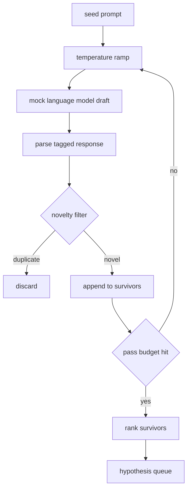

# Hypothesis Generator

> 一个 research agent 如果把同一个问题问两遍，就是在浪费 token。关键是强制每个 draft 落到新的位置。

**Type:** Build
**Languages:** Python
**Prerequisites:** Phase 19 Track A lessons 20-29
**Time:** ~90 分钟

## Learning Objectives
- 从 seed prompt 驱动 sampler，并将它的 output 转成带类型的 hypothesis record。
- 在每一 pass 上提升 sampler temperature，让下一个 draft 比上一个漂移得更远。
- 用一个小型 embedding model 和 cosine distance threshold 过滤近似重复项。
- 用混合 novelty、specificity 和 testability 的 scoring function 对幸存项排序。
- 让每一步都保持确定性，使同一个 seed 总是生成相同的 queue。

## 为什么先生成，再过滤

一个 planner 调用一个 model 一次，只会得到一个 hypothesis。这对 worked example 来说没问题。但对 research loop 来说形状不对。loop 需要一个有深度的 ranked queue，这样当第一个 hypothesis 失败时，runner 已经准备好下一个，而不必再支付一次完整 sampling pass 的成本。

两个想法组合起来产生这个 queue。第一个是 temperature ramping：每次通过 sampler 时都把 temperature 提高一点，让后续 draft 更愿意游走。第二个是 novelty filtering：每个 draft 之后，generator 测量它与每个先前 survivor 的 embedding distance，并拒绝任何落在 cluster 内部的内容。

本课提供一个 mock language model，它会针对固定 prompt 返回脚本化的 token sequence。这个 mock 足以跑完整条路径：seed prompt 输入，应用 temperature ramp，解析 candidate，运行 novelty filter，输出 ranked queue。

## Hypothesis 形状

```text
Hypothesis
  id             : int           (monotonic within a run)
  text           : str           (the claim)
  variables      : list[str]     (what changes between conditions)
  metric         : str           (what the runner will measure)
  baseline_ref   : str | None    (which paper or run the comparison cites)
  draft_pass     : int           (which sampler pass produced this)
  temperature    : float         (the sampler setting at draft time)
  novelty_score  : float         (distance from prior survivors, 0..1)
  rank_score     : float         (weighted sum used for ordering)
```

`variables` 和 `metric` 不是自由文本。parser 会从带 tag 的 response 中提取它们。第五十二课中的 runner 在构建 experiment config 时会直接读取这些字段。

`baseline_ref` 是可选的，但建议提供。第五十三课中的 evaluator 需要一个 baseline 进行比较。如果 hypothesis 省略了它，evaluator 会回退到同一 metric 上的上一次 run。

## 架构



这个 loop 很直接。有意思的是，每个 box 都有严格 contract。

## Temperature ramp

从 `t_min` 开始，到 `t_max` 结束，step 为 `(t_max - t_min) / (n_passes - 1)`。每一 pass 都用当前 temperature 调用 sampler，从 `GeneratorConfig.schedule()` 产生 `n_passes` 个均匀间隔的值。mock model 通过在一小组按 `(prompt, temp_bucket)` 索引的脚本化 response 之间切换来遵守 temperature。bucket 是开区间，因此 temperature 的小幅变化会选择不同 bucket，并产生不同 draft。在 production 中，sampler 会是真实 model，并传入 `temperature=t`。

默认 schedule 是从 `0.2` 到 `1.2` 的六次 pass。六次足以填满 queue，而不必为 novelty filter 反正会拒绝的 sample 付费。低于 `0.2` 时，model 会复述 seed。高于 `1.2` 时，response 往往偏离主题并导致 parser 失败。

## Novelty filter

每个 draft 被解析后，generator 会 embed text，并与每个已接受的 hypothesis 比较。embedding 是小型 hashed bag of word tokens，并 normalised 到 unit length。两个 unit vector 之间的 cosine distance 是 `1 - dot(a, b)`。如果 draft 到任何先前 survivor 的最小距离高于 `novelty_threshold`，它就通过。默认值是 `0.25`。

hashed embedding 并不高级。它是确定性的、零依赖，并足以捕捉显而易见的情况：两个 draft 共享大多数名词。production deployment 会换成小型 sentence model。interface 保持不变。

## Rank score

```text
rank_score = w_novelty * novelty_score
           + w_specificity * specificity_score
           + w_testability * testability_score
```

三个 sub score。`novelty_score` 是与先前 survivor 的最小 embedding distance。`specificity_score` 是 hypothesis 中具体 variable 的数量除以目标数量。`testability_score` 在 hypothesis 同时指定 metric 和 baseline 时为一，只指定 metric 时为二分之一，否则为零。

默认权重是 `0.4`、`0.3`、`0.3`。权重位于 generator config 中，因此下游课程可以调整它们，而不必 fork 代码。

## Mock language model

```python
class MockLLM:
    def sample(self, prompt: str, temperature: float, seed: int) -> str:
        ...
```

给定 `(prompt, temperature, seed)` triple 时，sampler 是确定性的。mock 保留一张按 `(prompt_signature, temperature_bucket)` 索引的脚本化 response table。如果 table 没有某个 key 的 entry，sampler 会返回一个会让 parser 失败的 fallback。其中一个测试会覆盖这条 fallback path。

seed 会混入 response，因此同一个 `(prompt, temperature)` pair 配上不同 seed 会产生不同 draft。测试中我们固定 seed，以保持结果可复现。在真实 deployment 中，seed 会来自 system clock 或 counter。

## Output queue

输出是按 `rank_score` 降序排序的 `Hypothesis` record 列表。第五十二课中的 runner 弹出 head，运行 experiment，第五十三课中的 evaluator 写回 verdict。如果 verdict 说 hypothesis 错了，runner 就弹出下一个。

queue 是有限的。当它为空时，orchestrator 可以扩大 seed prompt 并再次运行 generator，或者停止并报告 budget exhausted。

## 如何阅读代码

`code/main.py` 定义 `Hypothesis`、`MockLLM`、`HypothesisGenerator` 和一个确定性 demo。generator 暴露单一 `run(seed_prompt)` method，返回排序后的 queue；pass count 从 `GeneratorConfig.n_passes` 读取，而不是作为 argument 传入。embedding 是 hashed bag of tokens。novelty filter 是一个单独 function。rank score 是一个单独 function。没有任何东西依赖 `numpy`；embedding math 是纯 stdlib，因此本课保持 portable。

`code/tests/test_generator.py` 覆盖 linear path、duplicate rejection path、parser failure path、temperature ramp boundary 和 rank ordering。

## 它接入哪里

第五十课生成 queue。第五十一课取 queue 的 head 并运行 literature search 来确认或反驳它。第五十二课取同一个 head 并运行实际 experiment。第五十三课读取两者的 output 并写出 verdict。四节课组合成一个没有人参与的 research loop；人可以在任何边界介入。
