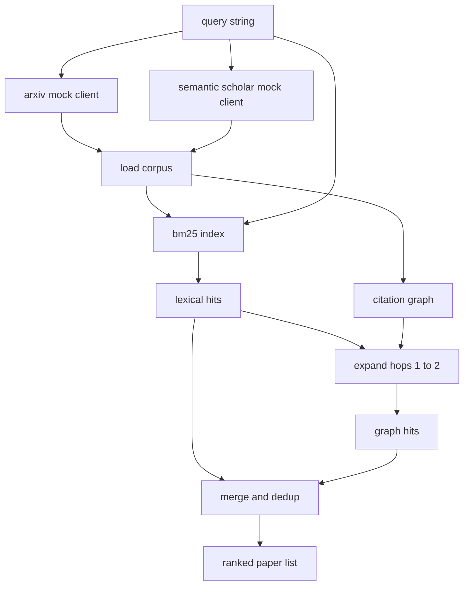

# 文献检索

> 一个 hypothesis 很廉价。知道是否已经有人证明过它，才是昂贵的部分。构建 retrieval layer，在 runner 启动 sandbox 之前回答这个问题。

**Type:** Build
**Languages:** Python
**Prerequisites:** Phase 19 Track A lessons 20-29
**Time:** ~90 分钟

## Learning Objectives
- 用 loop 下游会读取的字段，为一个小型 paper record 建模。
- 只使用 stdlib 数据结构，在 abstracts 上构建 BM25 index。
- 遍历 citation graph，浮现 lexical search 遗漏的 papers。
- 通过稳定的 paper id，对 lexical 和 graph 两轮命中的结果去重。
- 将两个 mock external APIs 包装在单个 client 后面，这样真实 endpoints 接入时，上游 call site 保持不变。

## 为什么需要两轮 retrieval

对 abstracts 做 keyword search，会返回与 query 共享词汇的 papers。这覆盖了大部分表层情况。但它会漏掉两类情况。第一类是 foundational paper 使用了不同词汇；例如，查询 "sparse attention" 会漏掉一篇题为 "block selection in transformer routing" 的 paper。第二类是相关 paper 是引用了某个已知 anchor 的后续工作；找到 anchor 再向前遍历，比 brute force 搜索整个 abstract pool 更高效。

本课会构建这两轮。abstracts 上的 BM25 捕获 lexical hits。citation graph traversal 从 seed set 出发，向前和向后扩展一到两跳。二者的并集按 paper id 去重，并用一个小型 combined score 排序。

## Paper 形状

```text
Paper
  id          : str           (稳定 identifier，mock corpus 中为 "p001")
  title       : str
  abstract    : str
  year        : int
  authors     : list[str]
  references  : list[str]     (这篇 paper 引用的 paper ids)
  citations   : list[str]     (引用这篇 paper 的 paper ids)
  source      : str           (提供它的 mock api，"arxiv" 或 "s2")
```

references 和 citations 字段形成有向 citation graph。两个 mock APIs 返回的字段有重叠但并不完全相同，因此 corpus loader 会按 `id` 对它们取并集。

## Architecture



retrieval client 拥有这两轮和 merge。caller 传入一个 query，并拿回一个 ranked list；其中每个条目都携带 per paper score 字段（`bm25_score`、`graph_distance`、`recency_score`、`final_score`），用于解释排序。

## 从零实现 BM25

实现使用标准 Okapi BM25，默认参数为 `k1=1.5`、`b=0.75`。index 是两个 dictionaries：`term -> doc_frequency` 和 `term -> list of (doc_id, term_count)`。document length 是 abstract 的 Token 数。average document length 在 index 构建时计算一次。对 query 打分时，会对 query terms 求和：`idf * tf_norm`，其中 `tf_norm` 是标准 BM25 长度归一化 term frequency。

tokeniser 是先 `lower`，再按非字母数字字符 split。它没有做 stemming。生产系统会换成一个小型 stemmer。接口保持不变。

```text
idf(t)      = log((N - df + 0.5) / (df + 0.5) + 1.0)
tf_norm(t)  = (f * (k1 + 1)) / (f + k1 * (1 - b + b * dl / avgdl))
score(d, q) = sum over t in q of idf(t) * tf_norm(t)
```

## Citation graph traversal

graph 会从 corpus 构建一次。Forward edges 从一篇 paper 指向它的 references。Backward edges 从一篇 paper 指向它的 citations。traversal 是 breadth first search，以 top BM25 hits 为 seed，最多两跳。

两跳是刻意设置的上限。一跳太浅；agent 常常需要直接 ancestor 或 descendant。三跳会让 connected graph 上的结果规模膨胀，并且容易偏离主题。本课把 hop limit 暴露为一个 config knob，这样下游 loop 可以收紧它。

## Dedup 和 ranking

两轮会返回重叠集合。merge 使用 paper id 作为 key。每篇 paper 的 final score 是一个加权混合。

```text
final_score = w_bm25 * bm25_score_norm
            + w_graph * graph_score
            + w_recency * recency_score
```

`bm25_score_norm` 是 BM25 score 除以 merged set 中的最大 BM25 score（因此该字段落在零到一之间）。`graph_score` 对直接 lexical hits 为一，一跳为 `0.6`，两跳为 `0.3`，否则为零。`recency_score` 是从 corpus 最小年份的零到最大年份的一之间的线性 ramp。

默认 weights 是 `0.5`、`0.3`、`0.2`。weights 是 config；陈旧 topic 可能会调低 recency，而快速变化的 topic 会提高它。

## Mock corpus

corpus 有一百篇 papers，由 `build_corpus()` 生成。每篇 paper 都有一个手写 title 和 abstract，主题来自五类之一：attention sparsity、retrieval augmentation、low rank adapters、dataset distillation 和 evaluation harnesses。References 和 citations 已连线，让每个 topic 都形成一个 connected sub graph，并带有少量 cross topic edges。

两个 mock API clients（`ArxivMockClient`、`SemanticScholarMockClient`）读取同一个 corpus，但暴露不同字段。Arxiv 返回 title、abstract、year、authors。Semantic Scholar 增加 references 和 citations。retrieval client 按 id 取并集；cross client field disagreement handling 留到后续课程。

## Lessons 52 和 53 会读取什么

lesson fifty-two 中的 runner 会读取 `paper.id`、`paper.title`，以及 abstract 的前三个句子，作为 experiment 的 context。lesson fifty-three 中的 evaluator 会读取 `paper.year` 和 `paper.references`，将 baseline 归因到某篇具体 paper。

retrieval client 返回一个 `RetrievalResult`，其中同时包含 ranked list 和 per query metrics：hit count、average score、top score、total wall time。runner 会记录这些内容，这样下游 observability pass 可以绘制随时间变化的质量。

## 如何阅读代码

`code/main.py` 定义了 `Paper`、`ArxivMockClient`、`SemanticScholarMockClient`、`BM25Index`、`CitationGraph`、`RetrievalClient` 和一个 deterministic demo。mock clients 和 corpus 放在同一个文件中，这样课程保持可移植。BM25 实现是一个 class，六十行。graph traversal 是一个 method。

`code/tests/test_retrieval.py` 覆盖 lexical path、graph path、merge、dedup 和 empty query。

## 它放在什么位置

Lesson fifty 产生一个 hypothesis。Lesson fifty-one 搜索 literature，判断该 hypothesis 是否已经有定论。如果没有，Lesson fifty-two 运行 experiment。Lesson fifty-three 读取 retrieval result 和 experiment metrics，写出 verdict。retrieval client 是四个阶段中最便宜的一个，并且会在 orchestrator 中首先运行。
