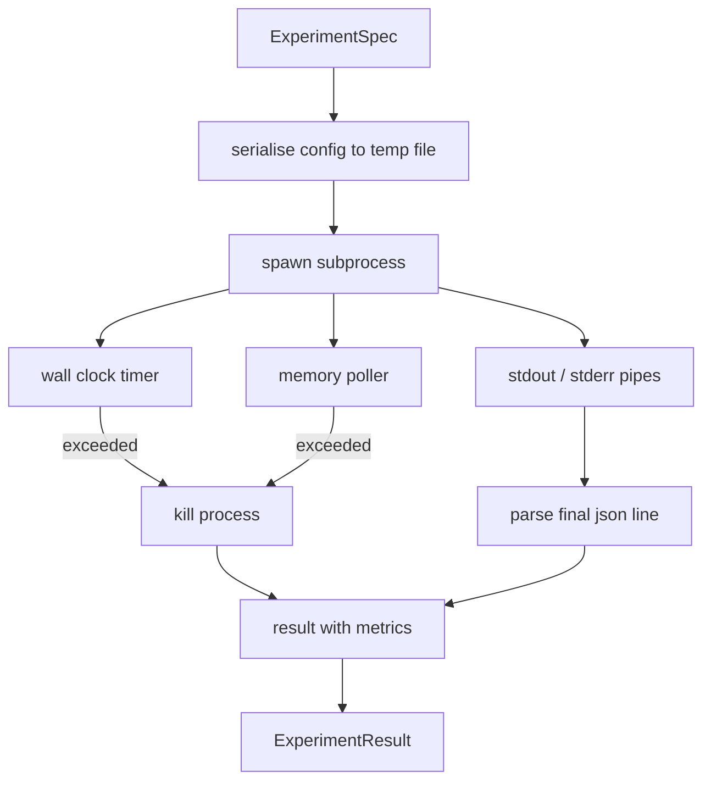

# Experiment Runner

> loop 的诚实程度取决于它的 measurements。构建 runner：它接收一个 spec，在 sandboxed subprocess 中执行，并发出一个 evaluator 可以信任的 json metrics blob。

**Type:** Build
**Languages:** Python
**Prerequisites:** Phase 19 Track A lessons 20-29
**Time:** ~90 分钟

## Learning Objectives
- 将 experiment 编码为一个 typed spec，runner 可以把它 serialise 给 subprocess。
- 启动一个带 hard wall clock timeout 和 soft memory cap 的 subprocess，并将二者都暴露为 terminal conditions。
- 将 stdout、stderr 和 structured metrics blob 捕获到单个 result record 中。
- 构建 ablation table，在固定 base spec 上一次 sweep 一个 configuration knob。
- 给定 seed 时，让每个 result 都保持 deterministic，这样 evaluator 在多次运行中看到相同数字。

## 为什么使用 subprocess

research loop 会运行 untrusted code。hypothesis 来自 sampler，experiment script 也来自同一路径；把其中任一个当作安全的 in-process 代码，都是在等待一次会拖垮 orchestrator 的 crash。Subprocesses 是语言自带的最简单 isolation：一个独立 process、一个独立 address space，以及 parent 侧的 signal handle。

这里的 runner 没有实现完整 sandboxing。没有 cgroup，没有 seccomp filter，也没有 namespace remapping。它拥有的是 wall clock timeout、用于检查 memory growth 的 polling loop，以及在任一 limit 上终止 process 的 kill path。这是所有更复杂 sandbox 都会扩展的 runtime contract。本课把 contract 保持到足够小，可以一次读完。

## ExperimentSpec 形状

```text
ExperimentSpec
  spec_id        : str            (stable id，"exp_001")
  hypothesis_id  : int            (链接回 lesson 50 中的 queue)
  script_path    : str            (要运行的 python script 路径)
  config         : dict           (作为一个 json arg 传给 script)
  seed           : int            (experiment 的 deterministic seed)
  wall_timeout_s : float          (hard timeout，超出则 kill)
  memory_cap_mb  : int            (soft cap，轮询；超出则 kill)
  metric_keys    : list[str]      (evaluator 会读取的字段)
```

script 存在磁盘上；runner 会把 config 写入一个 temp file path，script 再读取它。script 应该在 stdout 上打印单个 json line，其 keys 是 `metric_keys` 的 superset。stdout 上的其他内容都会被捕获，但 metrics parser 会忽略它们。

## Architecture



runner 是一个 class，带一个 main method。poller 是一个小 thread，每隔一个 poll interval 醒来一次，并在可用时从 proc filesystem 读取 subprocess 的 `psutil` equivalent；当平台不暴露它时，退化为 no op。

## 为什么是 soft memory cap

Hard memory caps 需要 `resource.setrlimit`，并且只在 POSIX 上工作。本课提供一种 portable approach：从平台轮询 resident set size，如果超过 cap 就 kill subprocess。cap 是 soft 的，因为 poller 有非零 interval；process 可能在两次轮询之间 spike 到 cap 以上，然后又降回来。runner 会记录 observed maximum RSS，这样 evaluator 可以看到这次 run 离 limit 有多近。

在没有 process inspection support 的系统上，poller 会记录一次性 warning 并禁用自身。wall clock timeout 仍然生效。本课 tests 覆盖这两条 paths。

## 捕获 stdout 和 stderr

runner 会在完成时读取并排空两条 pipes。Stdout 会逐行扫描；最后一个能够解析为 json 且包含所有必需 `metric_keys` 的 line 会被视为 metrics blob。更早的 json lines 会保留在 result 中作为 `intermediate_metrics`；evaluator 可以用它们绘制 learning curves。

Stderr 会原样捕获到 result 中。runner 永远不会因为非零 exit code 而 raise；它会把 code 记录在 result 中。任何非零 exit 都标记为 `"crash"`，即使 script 打印了 metrics，因此 evaluator 默认会把 partial runs 当作 failures。

## Ablation table

```python
def ablate(base: ExperimentSpec, knob: str, values: list[Any]) -> list[ExperimentSpec]:
    ...
```

给定 base spec 和 knob name，该 helper 会返回每个 value 对应的一个 spec，并覆盖 `config[knob]`。每个 spec 都会获得一个派生 `spec_id`（`f"{base.spec_id}_{knob}_{value}"`）。runner 提供一个 `AblationRunner`，按顺序运行这些 spec，并返回一个以 knob value 为 key 的 `AblationTable`。

为什么一次只改一个 knob。Full factorial sweeps 会指数级膨胀，并产生 evaluator 无法解释的结果。一次一个 knob 会产生 evaluator 能绘制的清晰 axis。本课只把 multi knob sweeps 支持为由 caller 组合的 repeated single knob ablations。

## Determinism

每个 spec 都携带一个 seed。runner 会通过 config dict 将 seed 转发给 script（`config["__seed"] = spec.seed`）。`code/experiments/` 中的 mock experiment scripts 会尊重 seed，并跨 runs 产生相同 metrics。lesson fifty-three 中的 evaluator 依赖这一点；没有 determinism，所谓 "regression" 可能只是不同的 random initialisation。

## Mock experiment script

本课提供一个 experiment script：`code/experiments/sparsity_experiment.py`。它是一个真实 script，会读取自己的 config file，使用 numpy random pass 模拟一个小型 training run，并打印一个 json metrics blob。script 支持 `sleep_s` knob 用于测试 timeouts，也支持 `allocate_mb` knob 用于测试 memory poller。

simulation 并没有真的训练任何东西。它是一个 numerical computation，模仿 training loop 的形状：loss curve、final perplexity、wall time。本课重点是 runner，而不是 simulation。真实 experiment script 会 import 一个 model。

## Result 形状

```text
ExperimentResult
  spec_id              : str
  hypothesis_id        : int
  exit_code            : int
  terminal             : "ok" | "timeout" | "oom" | "crash"
  wall_time_s          : float
  peak_rss_mb          : float | None
  metrics              : dict
  intermediate_metrics : list[dict]
  stdout_tail          : str
  stderr_tail          : str
```

evaluator 会先读取 `metrics` 和 `terminal`。如果 terminal 不是 `"ok"`，experiment 会计为 failed run，evaluator 的 verdict 会自动生成。否则，metrics 会传入 significance test。

## 如何阅读代码

`code/main.py` 定义了 `ExperimentSpec`、`ExperimentResult`、`ExperimentRunner`、`AblationRunner` 和一个 deterministic demo。subprocess management 是一个 class。memory poller 是一个小 thread。ablation helper 是一个单独 function。

`code/experiments/sparsity_experiment.py` 是 tests 使用的 mock experiment。它从 argv 读取 config file path，并在完成时写出单个 json metrics line。

`code/tests/test_runner.py` 覆盖 success path、timeout path、crash path、ablation table，以及跨两次 runs 的 determinism check。

## 它放在什么位置

Lesson fifty 生成 hypothesis。Lesson fifty-one 过滤掉 literature 已经解决的内容。Lesson fifty-two 针对剩余部分运行 experiment。Lesson fifty-three 读取 result，运行 significance test，并写出 orchestrator 存储到 hypothesis id 上的 verdict。
