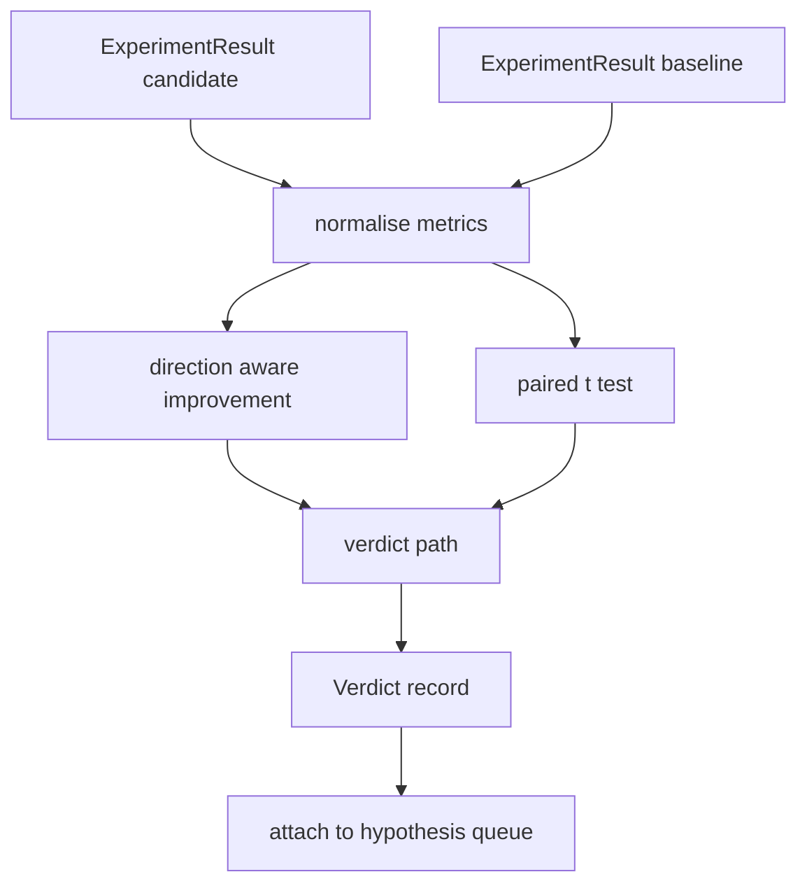

# 结果评估器

> runner 产出了数字。evaluator 判断这些数字代表改进、regression，还是 noise。构建一条 verdict 路径，把 metrics 转换成一句结论。

**Type:** Build
**Languages:** Python
**Prerequisites:** Phase 19 Track A lessons 20-29
**Time:** ~90 minutes

## Learning Objectives
- 使用带 direction 的 improvement 和固定 threshold，将 candidate run 与 baseline 进行比较。
- 从头在每个 seed 的 metrics 上运行 paired t test，并读取得到的 p value。
- 对 log scaled metrics 做 normalise，让下游 report 可以把它们与 linear metrics 混合。
- 输出每个 hypothesis 的 verdict，让 orchestrator 可以将其附加到第五十课的 queue。
- 让每一步都保持 pure，使相同输入始终产生相同 verdict。

## Why a paired test

runner 给出的单个数字无法说明变化是否真实。同一个配置换一个 seed 会得到不同的 perplexity。变化可能只是 noise。正确的比较方式是 paired：相同 seeds、相同 data，一次用 candidate 运行，一次用 baseline 运行。每个 seed 贡献一个差值。这些差值的 mean 是 effect。这些差值的 standard error 是 noise floor。

本课从头实现 test。没有 `scipy.stats`。数学足够小，一屏就能读完。

```text
diffs    = [a_i - b_i for i in seeds]
mean     = sum(diffs) / n
variance = sum((d - mean) ** 2 for d in diffs) / (n - 1)
t_stat   = mean / sqrt(variance / n)
df       = n - 1
p_value  = two_sided_p(t_stat, df)
```

two sided p value 使用 regularised incomplete beta function。本课附带一个小实现，使用 Lentz continued fraction。整个实现只是六十行 stdlib math。

## Direction aware improvement

有些 metrics 变大时表示改进（accuracy、throughput）。另一些变小时表示改进（loss、perplexity、wall time）。evaluator 在每个 metric 上携带一个 `direction` 字段。

```text
if direction == "higher_is_better":
    improvement = (candidate - baseline) / abs(baseline)
elif direction == "lower_is_better":
    improvement = (baseline - candidate) / abs(baseline)
```

Improvement 是有符号的。对于 higher is better metric，负的 improvement 表示 candidate 更差。verdict 路径会同时读取符号和幅度。

一个固定 threshold（`improvement_threshold=0.02`，百分之二）决定变化是否足够大，可以给出判断。低于该 threshold 时，无论 p value 如何，verdict 都是 "noise"；这个 loop 不关心用户测不出来的变化。

```figure
cg-paired-verdict
```

## Architecture



evaluator 运行三个独立计算，并在 verdict 路径中把它们合并。每个计算都是没有 shared state 的 pure function。

## Log normalisation

Perplexity 相对于 loss 是指数关系。loss 降低 0.1 会让 perplexity 出现大得多的下降。直接在两个配置之间比较 perplexity 没问题，但如果要在单个 report 中把它与 linear metrics 混合，就需要 normalisation。

本课会对 `scale` 字段为 `"log"` 的任何 metric 在计算 improvement 前取 natural log。threshold 随后会在 log space 中应用。perplexity 从 32 降到 28，在 lower is better metric 上是 `log(28) - log(32) = -0.133`，远高于百分之二的 threshold。

```text
if scale == "log":
    a = log(candidate)
    b = log(baseline)
else:
    a = candidate
    b = baseline
```

`scale="linear"`（默认）的 metrics 会跳过该 transform。同一条 code path 同时处理两者。

## Per seed paired test

第五十二课的 runner 会为每个 run 输出一个最终 metrics blob。对于 paired test，evaluator 需要 candidate 每个 seed 一个 blob，baseline 每个 seed 一个 blob。orchestrator 会在一组 seeds 上用两个配置运行相同 experiment，然后把两组 `ExperimentResult` records 交给 evaluator。

evaluator 按 seed 配对（seed 位于 `result.metrics["seed"]`），然后遍历请求的 metric。如果两组列表中的 seeds 不匹配，evaluator 会抛出 `PairingError`。orchestrator 应该重新运行。

## The Verdict shape

```text
Verdict
  hypothesis_id          : int
  metric                 : str
  direction              : "higher_is_better" | "lower_is_better"
  scale                  : "linear" | "log"
  candidate_mean         : float
  baseline_mean          : float
  improvement            : float       (signed, fraction; see direction rules)
  p_value                : float | None  (None if n < 2)
  significance_threshold : float
  improvement_threshold  : float
  verdict                : "improved" | "regressed" | "noise" | "failed"
  rationale              : str
```

verdict 路径是一张小 decision table：

```text
1. If any candidate result has terminal != "ok": verdict = "failed"
2. else if |improvement| < improvement_threshold:  verdict = "noise"
3. else if p_value is None or p_value > significance: verdict = "noise"
4. else if improvement > 0:                          verdict = "improved"
5. else:                                             verdict = "regressed"
```

Rationale 是一句 human readable 句子，orchestrator 可以将其按 hypothesis id 记录到 log。

## How to read the code

`code/main.py` 定义了 `MetricSpec`、`Verdict`、`Evaluator`、t statistic 和 incomplete beta helpers，以及一个 deterministic demo。t test 用纯 stdlib math 实现；numpy 只用于读取 metrics list 并计算 means 和 variances。

`code/tests/test_evaluator.py` 覆盖 improved 路径、regressed 路径、noise 路径（小 improvement）、noise 路径（低 n）、failed terminal 路径、log normalised 路径、与已知 reference value 对比的 t test，以及 pairing error。

## Where this slots in

第五十课产出了 hypothesis queue。第五十一课过滤掉 literature 已有定论的内容。第五十二课在多个 seeds 上用 candidate 和 baseline 配置运行 experiment。第五十三课读取这些 runs 并写出 verdict。orchestrator 把四者缝合在一起：

```text
for hypothesis in queue:
    literature = retrieval.search(hypothesis.text)
    if literature_settles(hypothesis, literature):
        attach(hypothesis, verdict="settled")
        continue
    candidates = runner.run_all(specs_for(hypothesis))
    baselines  = runner.run_all(baseline_specs_for(hypothesis))
    metric_spec = MetricSpec("perplexity", direction=LOWER, scale=LOG)
    verdict = evaluator.evaluate(hypothesis.id, metric_spec, candidates, baselines)
    attach(hypothesis, verdict)
```

这个 orchestrator 不在本课中；这四课通过各自定义的 dataclasses 组合进去，不需要任何额外 glue。
