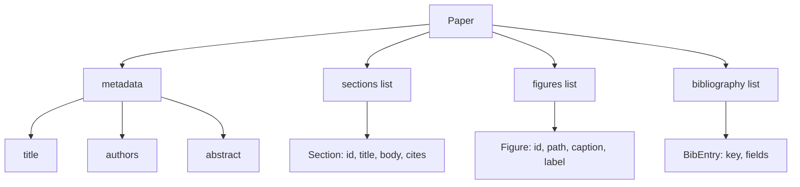
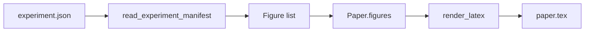
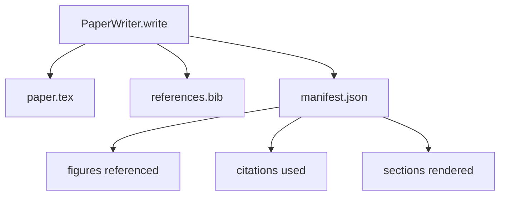

# 论文写作器

> LaTeX skeleton 是 researcher 与 typesetter 之间的 contract。如果 contract 被破坏，document 就无法 compile，而且 failure 会很明显。先构建 skeleton，再填充它。

**Type:** Build
**Languages:** Python
**Prerequisites:** Phase 19 lessons 50-53
**Time:** ~90 minutes

## Learning Objectives

- 将 research paper 视为具有已知 section graph 的 structured artifact，而不是 freeform document。
- 在写任何 prose 之前，生成一个声明 abstract、sections、figure slots 和 bibliography keys 的 LaTeX skeleton。
- 通过 deterministic slot mechanism，将 experiment outputs（paths 和 captions）中的 figures 注入 skeleton。
- 接入一个 mocked prose generator，它从 structured outline 填充每个 section，让 harness 可以在没有 model 的情况下测试。
- 输出单个 `paper.tex`、一个 `references.bib`，再加一个列出每个 referenced figure 和每个 used citation 的 manifest。

## Why a skeleton first

从 prose 开始的 draft 会积累 structural debt。introduction 增长出三段本该放到 related work 的内容。某个 figure 在定义之前就被引用。bibliography 最终为同一篇 paper 产生三个 keys。等 author 注意到时，rewriting cost 已经高于 writing cost。

skeleton 会反转这一点。structure 先以 data 形式声明。Sections 是带 names 和 order 的 slots。Figures 是带 ids 和 captions 的 slots。Bibliography keys 在顶部声明，并带有它们指向的 entries。Prose 会一次一个 slot 地生成进去。harness 可以在写任何 prose 之前验证：每个 figure 都有 slot，每个 citation 都有 entry，每个 section 都出现在 table of contents 中。

这与前面课程应用到 plans、tool calls 和 traces 上的 discipline 相同。structure 就是 contract。

## The Paper shape

每个 field 都是普通 Python data。renderer 是从 `Paper` 到 LaTeX string 的 pure function。harness 可以在 render 前 introspect paper：统计 sections，列出 missing figure files，检查每个 `\cite{key}` 都有匹配的 `BibEntry`。

## The render contract

renderer 保证三个 properties。第一，skeleton 中的每个 figure slot 都输出一个 `\begin{figure}` block，并带有稳定 label，格式为 `fig:<id>`。第二，每个 section 都输出一个 `\section{}`，并带有稳定 label，格式为 `sec:<id>`，这样 cross-references 可以工作。第三，bibliography 输出一个 `\bibliography` block，其 `references.bib` 精确包含 paper 上声明的 entries，不多也不少。

违反任何一条都是 render error，而不是 warning。skeleton 就是 contract；一个静默丢弃 figure 的 render 就是 contract break。

## Figure injection from experiments

本 track 前面的课程把 experiment outputs 生成为 JSON manifests。每个 manifest 携带一个 artifacts list，包含 paths 和 short captions。paper writer 读取该 manifest 并生成 `Figure` records。

injection 是 deterministic 的。Figure ids 由 experiment name 加上 monotonic counter 派生。Captions 来自 manifest。Paths 会相对于 paper 的 output directory 做 normalise，因此即使 experiment outputs 位于磁盘其他位置，LaTeX 也能 compile。

## The mocked prose generator

本课不会调用 model。`MockProseGenerator` 读取 outline shape，并 deterministic 地输出 prose。outline shape 是每个 section 一条短字符串。generator 会把该字符串扩展成两个短段落，并把 section title 编织进去。生成的 prose 只会在 outline 声明时 name-drop figures 和 citations。

这足以测试 writer 的每个 behaviour。真实实现会把 generator 换成 model call。它周围的 harness 不需要改变。这就是把 prose generator 声明为 callable 的价值：test 替换为 deterministic 的 generator，production 替换为 model 版本，pipeline 其余部分保持一致。

## The manifest output

writer 会向 output directory 输出三个文件。

manifest 是下游 evaluator 或 critic loop 读取的内容。它不 parse LaTeX；它读取 manifest。下一课 critic loop 会将这个 manifest 作为 input，并生成 feedback list。这就是为什么 manifest 是 contract 的一部分，而 LaTeX 不是。

## Validation gates

writer 在写入任何 file 之前运行四个 gates。

1. paper 内每个 figure id 都是唯一的。
2. 每个 section 的 `cites` 字段引用的 bibliography key 都已在 paper 上声明。
3. abstract 非空。
4. title 非空。

失败的 gate 会抛出 `PaperValidationError`，并给出精确原因。harness 将该原因作为 failure mode 暴露出来。没有 partial write：要么输出全部三个 files，要么一个也不输出。

## How to read the code

`code/main.py` 定义了 `Paper`、`Section`、`Figure`、`BibEntry`、`PaperValidationError`、`MockProseGenerator`、`PaperWriter`，以及一个 `render_latex` function。`write` method 接收 output directory，并输出 `paper.tex`、`references.bib` 和 `manifest.json`。`read_experiment_manifest` helper 会将 experiment manifests list 转换为 `Figure` records。

`code/tests/test_paper_writer.py` 覆盖：没有 sections 时的 skeleton render、带两个 sections 和两个 figures 的 full render、missing-citation gate、duplicate-figure-id gate、manifest content，以及 LaTeX-string contract（每个 section 输出一个 `\section{}`，每个 figure 输出一个 `\begin{figure}`）。

## Going further

真实实现会需要两个 extensions。第一，multi-format render：同一个 `Paper` shape 可以 compile 为博客文章用的 Markdown，以及 preview 用的 HTML。renderer 变成 `Paper` 上的 strategy。第二，citation enrichment：给定本地 DOI cache，writer 从 citation key 获取 BibTeX entries。两者都有价值，也都可以在不触碰 skeleton contract 的情况下添加。

skeleton 是这次下注。Sections、figures 和 citations 以 data 形式声明，prose 生成到 slots 中，manifest 与 LaTeX 一起输出。其他每个改进都可以在其上组合。
