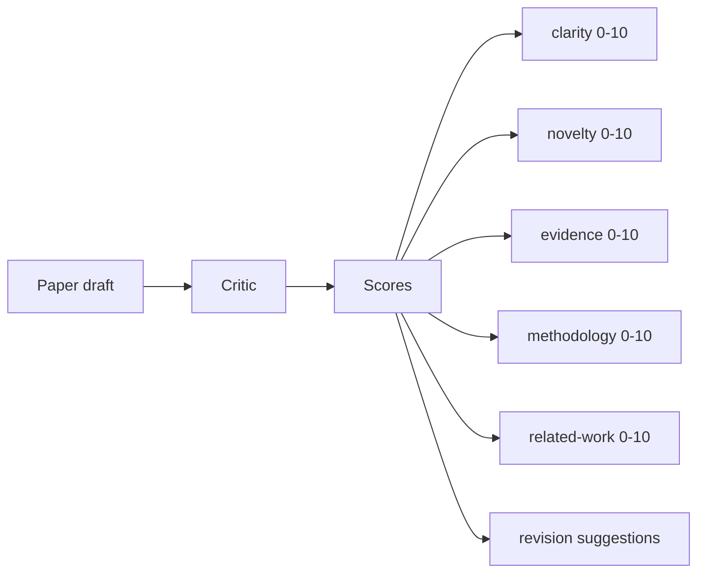
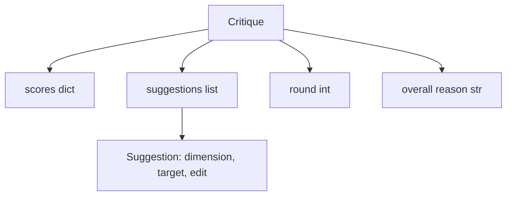
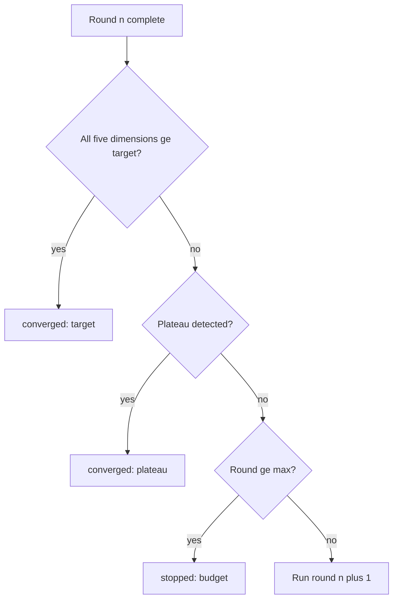
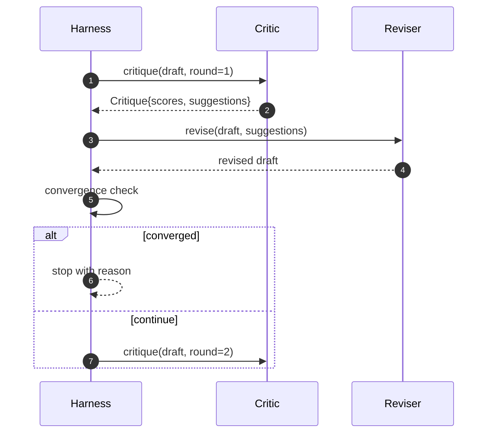

# Critic Loop

> 第一次就返回 "looks good" 的 critic 是坏的。永远返回 "needs work" 的 critic 也是坏的。有意思的 critic 是会收敛的那个，而你必须工程化地实现这种收敛。

**Type:** Build
**Languages:** Python
**Prerequisites:** Phase 19 lessons 50-53
**Time:** ~90 minutes

## Learning Objectives

- 按五个固定维度为论文草稿打分：clarity、novelty、evidence、methodology、related-work。
- 将每一轮 critique 应用为结构化 revision diff，而不是自由形式的重写。
- 通过比较多轮分数检测收敛；在 plateau、达到目标或预算耗尽时停止。
- 用 max-iteration 预算限制轮数，避免不收敛的 critic 永远运行。
- 输出逐轮 trace，让 dashboard 或下一阶段可以渲染分数轨迹。

## 为什么使用五个固定维度

自由形式的 critic 是一个返回建议段落的模型。下一轮 revision 会把这个段落当作环境上下文。rewrite 是否回应了批评无法验证，因为批评本身从未具备结构。

五个维度给 harness 一个契约。



分数是一个 Vector。harness 会观察每个维度在多轮中的变化。一个提高 clarity 但让 evidence 大幅下降的 revision，是 evidence 上的 regression，convergence check 会看到它。只靠模型的 critic 无法提供这种保证。

## Critique 结构



每条 suggestion 都携带它改进的维度、目标 section，以及 reviser 可以应用的 `edit` 指令。reviser 也是一个 callable。本课提供一个确定性 reviser，它把 edit 指令解释为对 section 的 append-to-section 操作。由模型驱动的 reviser 会把同一个字段解释为 prompt。契约不变。

## Convergence 规则，按顺序执行

critic loop 会在三个条件中的任意一个触发时终止。



target 是最严格的情况：五个维度（clarity、novelty、evidence、methodology、related_work）中的每一个都必须达到 `>= target_score`（默认 `8.0`），loop 才会返回 success。均值很高但有一个弱维度并不够。Plateau detection 会比较当前轮均值和上一轮均值。如果连续两轮 improvement 低于 `plateau_epsilon`（默认 `0.1`），loop 会以 `plateau` 退出。budget 是轮数的硬上限（默认 `5`），并以 `budget` 退出。

顺序很重要。target 优先于 plateau，plateau 优先于 budget。如果第三轮在同一次迭代中既达到 target 又会触发 plateau，结果是 `target`，不是 `plateau`。

## 为什么 plateau detection 跨两轮运行

单轮 plateau 是噪声。真实的 critic 即使面对固定 draft，每次迭代也会返回略有不同的分数，因为确定性 scoring 仍然取决于应用了哪些 suggestions 以及应用顺序。要求连续两轮 plateau 可以过滤这种噪声。如果 harness 报告 plateau，说明 draft 确实已经停止改进。

## 本课中的确定性 critic

本课不调用模型。提供的 critic 是一个 callable，会基于三个信号给 draft 打分：平均 section 正文长度（clarity）、figure count 和 citation count（evidence），以及 paper metadata 上的 `originality_tag` 字段（novelty）。reviser 知道如何把每个分数向上推。

```text
clarity      在平均 section 正文长度增加时增长
novelty      在 originality_tag 设置为 "high" 时增长
evidence     在某个 section 的 figure_refs 非空时增长
methodology  在存在标题为 "Method" 且有正文的 section 时增长
related-work 在存在标题为 "Related Work" 且有正文的 section 时增长
```

reviser 会把每条 suggestion 解释为定向追加。第一轮之后，harness 可以观察到分数上升。tests 利用这个性质来断言 loop 会缩小差距。

## 完整 loop 契约



harness 拥有 round counter、trace 和 convergence check。critic 拥有 score。reviser 拥有 diff。三者都不会触碰彼此的 state。

## Trace 输出

每一轮都会输出一个 trace event，包含 round number、score vector、suggestion count 和 convergence verdict。完整 trace 会与 final draft 一起返回。下游 dashboard 可以渲染逐轮分数图。下一课 iteration scheduler 会读取 trace，决定这个 branch 是否值得保留。

## 防止坏 critic 的预算

一个产生永远无法提升分数的 suggestions 的 critic，会把 loop 锁到 max-iteration 上限。trace 会让这一点可见：五轮、scores 持平、verdict 为 `budget`。用户会把它解读为 critic bug，而不是 draft bug。替代方案是只暴露 final draft，但这会隐藏诊断。trace-first 设计会把它暴露出来。

## 如何阅读代码

`code/main.py` 定义了 `Critique`、`Suggestion`、`Critic` protocol、`Reviser` protocol、`CriticLoop`，以及一个 `make_deterministic_critic_pair` factory，它会返回确定性 critic 和匹配的 reviser。还包含一个最小 `Paper` 结构，让本课可以独立运行。

`code/tests/test_critic_loop.py` 覆盖：第一轮后的单调改进、tuned draft 上的 target convergence、两轮持平后的 plateau detection、没有 suggestion 能改进时的 budget exhaustion、reviser 对 suggestion 的应用，以及 trace 结构。

## 进一步探索

真实实现会需要两个扩展。第一，dimension weights：workshop 论文会更重视 novelty 而不是 methodology；journal 则相反。convergence check 会变成加权均值。第二，paired critics：一个 critic 负责打分，第二个 critic 在 reviser 看到 suggestions 之前对它们进行裁决。两者都有价值，并且都可以组合在同一个 `Critique` 结构之上。

关键赌注是 score vector。一旦 critique 被结构化，其他所有改进、convergence rule、dashboard、paired critic，都可以在不改变 loop 的情况下接入。
