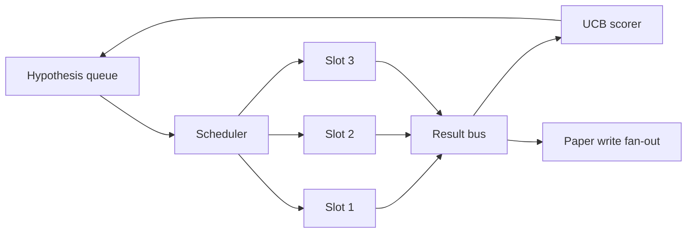
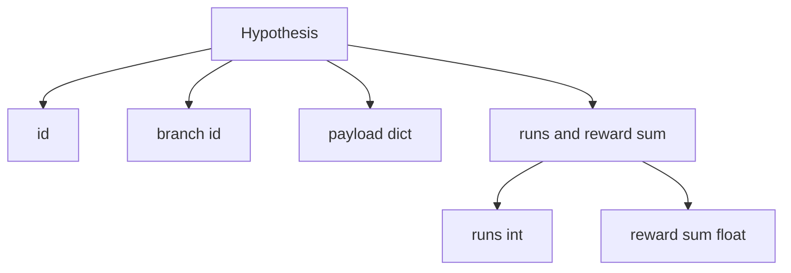
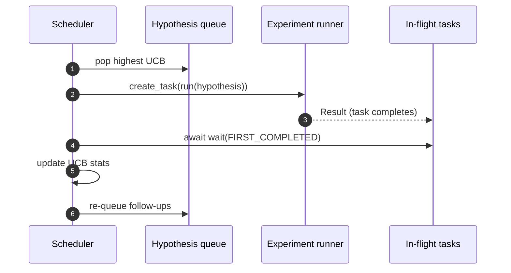

# Iteration Scheduler

> 没有 scheduler 的 research loop，就是一个带着妄想的 queue。scheduler 是 loop 决定停止探索什么的地方，而这个决定就是整场游戏的核心。

**Type:** Build
**Languages:** Python
**Prerequisites:** Phase 19 lessons 50-53
**Time:** ~90 minutes

## Learning Objectives

- 将 research workflow 建模为一个 hypothesis queue，它会喂给并行 experiment slots，结果再 fan back in。
- 用 asyncio 并发运行多个 experiments，让 scheduler 可以保持所有 slots 忙碌。
- 用 UCB 为每个 hypothesis branch 打分，让 scheduler 可以在不放弃 exploration 的情况下 pruning 低产出 branches。
- 将完成的 results fan out 到 paper-write stage 和 re-queue stage，让高产出 branch 生成 follow-up hypotheses。
- 暴露逐 iteration trace，包含 branch scores、slot occupancy 和 pruning decisions。

## 为什么是 scheduler，而不是 worklist

扁平 worklist 会按提交顺序运行 jobs。当每个 job 都独立时，这没有问题。research 不是独立的：experiment three 的 finding 会改变 experiments four 和 five 的优先级。一个会读取 result fan-in 并重排 queue 的 scheduler，可以在单位 compute 内完成更有用的工作。

有意思的设计选择是 scoring rule。贪心 scorer 总是选择当前 leader，永远不探索。均匀 scorer 永远不利用。UCB（upper confidence bound）是中间路径：利用 leader，同时为尝试较少的 branches 保留容量。

## 系统结构



queue 保存 hypotheses。scheduler 在 slot 释放时选择 UCB 最高的 hypothesis。每个 slot 异步运行一个 experiment。完成的 experiments 会把 result fan 到 bus 上。bus 会更新来源 branch 上的 UCB statistics，并在某个 branch 的 yield 跨过 threshold 时 fan out 到 paper-write stage。

## Hypothesis 结构



`branch` 是 UCB statistics 的 key。多个 hypotheses 可以共享一个 branch（branch 是 research direction；hypothesis 是其中一次 trial）。`runs` 是该 branch 已完成 experiments 的计数，`reward_sum` 是累计 reward。UCB 会读取二者。

## UCB scoring

本课使用的 UCB 公式是经典 UCB1。

```text
ucb(branch) = mean_reward(branch) + c * sqrt( ln(total_runs) / runs(branch) )
```

`total_runs` 是所有 branches 上已完成 experiments 的总数。`c` 是 exploration weight；本课默认值为 `sqrt(2)`。runs 为零的 branch 会得到 `+inf`，所以未尝试的 branches 总是先被调度。mean reward 高的 branch 会保持高 score，直到其他 branches 追上；运行很多次但 reward 不高的 branch 会被运行次数更少的 alternatives 超过。

pruning gate 与 picker 分离。当某个 branch 在至少 `prune_after_runs` 次 trials（默认 `3`）后 mean reward 低于绝对 floor（默认 `0.2`）时，pruning 会把该 branch 从未来 scheduling 中移除。这会让 queue 保持有界。

## 使用 asyncio 的并行 slots

scheduler 使用 `asyncio.create_task` 驱动 experiments。每个 task 运行 experiment runner（一个 `async def` callable），并返回一个 `Result`。主 loop 使用 `asyncio.wait(..., return_when=asyncio.FIRST_COMPLETED)` 等待 in-flight tasks 集合，并在每次完成时触发 scoring update。



三个 slots 并发运行。主 loop 永远不会阻塞在单个 experiment 上。scheduler 会在 slot 一释放时立即启动新 tasks，直到 queue 为空且没有 tasks in flight。

## Fan-out：paper triggers

当某个 branch 的 mean reward 跨过 `paper_threshold`（默认 `0.7`），且该 branch 尚未产出 paper 时，scheduler 会把一个 `paper.trigger` event fan 到 output list。下游会由第五十四课的 paper writer 接手它。在本课中，trigger 会被捕获为 list，方便 tests 断言。

## Fan-out：follow-up hypotheses

当高产出 result 到达时，scheduler 可以调用用户提供的 `expander`，在同一个 branch 上生成一个或多个 follow-up hypotheses。expander 是一个从 `Result` 到 `list[Hypothesis]` 的纯函数。本课提供一个确定性 expander，会为任何 reward 超过 paper threshold 的 result 生成两个 follow-ups。

## Budgets

两个 budgets 会保护 scheduler，避免 runaway loops。

```text
max_experiments    : 跨所有 branches 运行的 experiments 总数
max_seconds        : wall-clock cap (asyncio time)
```

当任意一个触发时，scheduler 会停止调度新 tasks，等待 in-flight tasks 完成，并返回 final trace。trace 包含一个 `stop_reason`。

## Trace 和 final report

每个 scheduling decision（pick、dispatch、result、prune、fan-out）都会输出一个 event。final report 会汇总 per-branch stats、total runs、total wall-clock，以及触发的 paper triggers。下一课 end-to-end demo 会读取这个 report 来驱动 paper writer。

## 如何阅读代码

`code/main.py` 定义了 `Hypothesis`、`Result`、`BranchStats`、`IterationScheduler`，以及一个 `make_deterministic_runner` factory，它会返回一个带有可预测 rewards 的 asyncio experiment runner。runner 会 sleep 固定的 `delay_ms`（默认 `5ms`），让 concurrency 可观察。

`code/tests/test_scheduler.py` 覆盖：UCB 优先选择未尝试 branches、parallel slot occupancy、跨过 threshold 时的 paper triggers、低产出 trials 后的 branch pruning、fan-out follow-up hypotheses，以及 budget exit（experiment count 和 wall clock 两者）。

## 进一步探索

真实实现会需要三个扩展。第一，跨 sessions 的持久化 UCB stats：当前 statistics 存在内存里；真实 scheduler 会 checkpoint 它们，让 restart 保留已经花掉的 exploration budget。第二，multi-objective scoring：每个 result 不再输出一个 scalar reward，而是输出一个 Vector，UCB 变成 Pareto-style picker。第三，contextual bandits：picker 基于 hypothesis features（length、complexity）进行条件化，让相似 hypotheses 共享 exploration。

scheduler 是 research 超越 worklist 的地方。一旦 UCB 接好、slots 并行运行，其他所有改进都可以叠加在其上。
