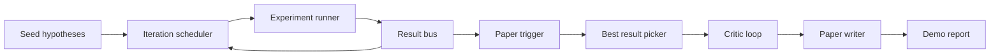
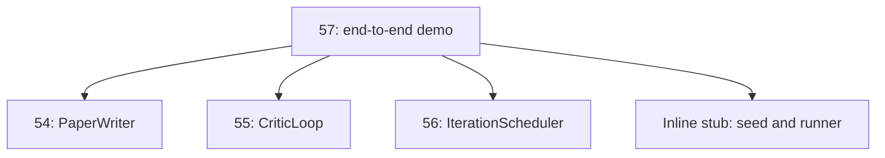
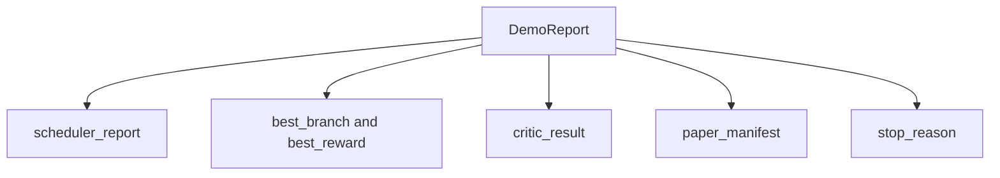

# End-to-End 研究 Demo

> Demo 是你之前写下的每一个 contract 都必须组合起来的地方。只要其中任何一个泄漏，Demo 就是抓住它的那一课。

**Type:** Build
**Languages:** Python
**Prerequisites:** Phase 19 lessons 50-53
**Time:** ~90 minutes

## Learning Objectives

- 将 auto-research loop 端到端串接起来：hypothesis seed、experiment runner、scheduler、critic loop、paper writer。
- 通过普通 Python imports 组合前四节 Track D 课程中的 primitives，而不是通过 framework。
- 运行 loop 直到自行终止，并输出一份列出每个 stage 输出的单一 Demo report。
- 保持 Demo deterministic，使 test suite 可以断言最终形状。
- 当任意 stage 的 contract 破坏时，暴露清晰的 failure mode，避免下一个 stage 使用破损 input 继续运行。

```figure
ch-research-pipeline
```

## 这里组合了什么



五个 stages。seed 是三条 hypotheses 的列表。scheduler 用三个 parallel slots 在它们之间运行六个 experiments。bus 报告一个或多个 paper triggers。picker 选择单个最佳 result。critic loop 基于该 result 构建的 draft 进行迭代。paper writer 输出最终的 LaTeX、BibTeX 和 manifest。

## 为什么 import，而不是 copy

前面的每节课都会交付一个带有 public dataclasses 和 functions 的 `main.py`。Demo 通过调整 `sys.path` 到每节课的父目录来 import 它们。这不是 framework wiring；它与前面课程中 test files 已经使用的 import 相同。



inline stub 代表第 50 到第 53 课：一个小型 seed hypotheses generator 和一个 synchronous reward function。用户可以通过调整两个 imports，将 inline stub 替换为那些课程中的真实 primitives。

## Determinism 保证

Demo 在构造上就是 deterministic。experiment runner 使用 seeded NumPy。critic loop 的 reviser 按固定顺序遍历固定 dimensions。paper writer 的 prose generator 是第 54 课中的 mocked 版本。scheduler 的 UCB picker 在 iteration order 上打破 ties，而不是随机选择。

给定相同 seed，Demo 会输出相同 report。test 通过运行 Demo 两次并比较 manifest 来断言这一属性。

## Demo report 的形状



每个 field 都逐字来自 upstream stage。Demo 不转换任何 output；它只是组合它们。这就是 Demo 本身所承担的 test。

## Failure mode 处理

每个 stage 要么成功，要么 raise 一个 typed error。

```text
Scheduler ........ returns SchedulerReport with stop_reason
                   in {queue_empty, max_experiments, deadline}
Best-result pick . raises NoTriggerError if no paper trigger fired
Critic loop ...... returns LoopResult with status converged or stopped
Paper writer ..... raises PaperValidationError on contract break
```

任意 stage 的 failure 都会用 typed exception short-circuit Demo。tests 固定了这个 contract：`test_no_triggers_raises_typed_error` 和 `test_best_picker_raises_when_no_triggers` 断言当没有 branch 触发 trigger 时，picker 会 raise `NoTriggerError` / `BestResultError`，并且 writer 永远不会被调用。

## best-result picker

scheduler 会按 branch 输出 paper triggers。picker 选择所有 triggers 中 mean reward 最高的 branch。ties 按 branch id 的字母顺序打破，使 Demo deterministic。picker 是一个小型 pure function；test 使用固定的 scheduler report 固定它的行为。

## 串接 critic loop

第 55 课中的 critic loop 作用于 `MiniPaper`。Demo 通过 picked branch 构建一个 `MiniPaper`：用 branch id 填充 abstract，seed 两个 sections（Introduction 和 Results），并根据 branch 的 mean reward 设置 `originality_tag`（如果 `>= 0.8` 为 high，如果 `>= 0.6` 为 medium，否则为 low）。

随后 reviser 将 draft 迭代到 convergence。output 会进入 paper writer。

## 串接 paper writer

第 54 课中的 paper writer 作用于包含 figures 和 bibliography 的完整 `Paper` shape。Demo 通过 `mini_to_full_paper` 升级 converged `MiniPaper`，它会为 selected branch 附加一个 figure，并根据 critic 建议的 cite keys 并集构建一个小型 synthetic bibliography。Demo 添加的每一个 cite 也会被加入 bibliography list，因此 validation 会通过。

## 如何阅读代码

`code/main.py` 定义了 `BestResultError`、`NoTriggerError`、`DemoReport`、`pick_best_branch`、`build_mini_paper`、`mini_to_full_paper` 和 `run_demo`。顶部的 imports 会调整一次 `sys.path`，并从各自课程中拉取 `PaperWriter`、`CriticLoop` 和 `IterationScheduler`。

`code/tests/test_e2e.py` 覆盖：Demo 端到端运行并输出一份五个 fields 全部填充的 report；两次运行之间的 determinism；没有 branch 越过 threshold 时的 NoTriggerError；writer contract 破坏时的 PaperValidationError；paper manifest 包含 picked branch 的 figure；以及 scheduler stop reason 是预期值之一。

## 继续扩展

当 Demo 变绿后，有三个值得串接的扩展。第一，persistent state：每个 stage 的 result 写入一个小型 JSON store，使 restart 可以不重新运行便宜的 stages 就恢复。第二，dashboard：scheduler 和 critic loop 的 trace events 渲染为单一 timeline。第三，真实 model calls：将 mocked prose generator 和 deterministic critic 替换为 model-driven 版本；wiring 不需要改变。

Demo 的任务是证明 composition 就是 architecture。五节课，四个 imports，一份 report。下次你添加一个 stage，wiring 只会精确增加一行。
