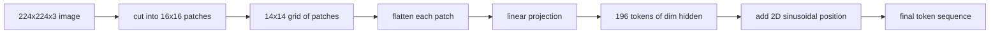

# 视觉编码器 Patches

> 读取像素的视觉模型需要像素Tokenizer。补丁Embedding就是那个Tokenizer。将图像切割成正方形网格，展平每个正方形，将其投影到一个线性层，然后添加 2D 位置信号，以便Transformer知道每个正方形在原始图像中的位置。

**Type:** Build
**Languages:** Python
**Prerequisites:** 第19期第30-37课（B轨基础）
**Time:** ~90 分钟

## 学习目标

- 将图像转换为固定长度的补丁Embedding序列。
- 实现基于 `Conv2d` 的面片投影，该投影与展开然后线性的数学相匹配。
- 构建确定性 2D 正弦位置Embedding，以便token顺序编码空间位置。
- 验证合成 fixture 上的 patch 数量、Embedding形状和 `Conv2d`/展开等效性。

## 问题

Transformer 接收一系列Vector。图像是一个 3 通道网格。将每个像素作为token读取会导致序列长度爆炸：224x224 RGB 图像是 150,528 个token，这是 12 层 Transformer 无法承受的。将图像读取为一个巨大的平面Vector会丢弃局部性，而注意力层无法从中恢复。编码器前端的工作是将像素网格压缩为数百个token，每个token概括一个正方形区域。

补丁Embedding通过一个线性投影解决了这个问题。将 224x224 图像切割成 16x16 块会生成包含 196 个块的 14x14 网格。每个补丁都从 `(3, 16, 16) = 768` 像素值展平为一个Vector，然后线性层将其映射到模型的隐藏维度。Transformer 看到 196 个维度为 `hidden`（通常为 768）的 token加上一个 CLS token。这是网络其余部分可以借鉴的序列。

## 概念



### 为什么是补丁，而不是像素

注意力是序列长度的二次方。 196 个 token 的序列每层每头花费 `196 * 196 = 38,416` 注意力分数； 150,528 个token序列的成本为 `150,528 * 150,528 = 22.6 billion`。补丁可以将注意力计算量减少 590,000 倍，并且单个 16x16 区域可以承载足够的信号来执行高级视觉任务。代价是一个补丁内细粒度空间细节的损失，这就是为什么下游Multimodal堆栈通常在精细定位很重要时运行第二个高分辨率分支。

### 为什么线性投影就足够了

每个补丁都被视为一个独立的Vector。投影学习基础：边缘检测器、滤色器、简单纹理。单个线性层很小（ViT-Base 的 `768 * 768 = 589,824` 参数）并且训练速度很快。存在更深的卷积茎（“混合”ViT），但平坦的线性投影是标准，并且大多数现代开放重量编码器都具有这种精确的形状。

### `Conv2d` 技巧

没有填充的 `Conv2d(in_channels=3, out_channels=hidden, kernel_size=patch_size, stride=patch_size)` 给出与展开然后线性相同的数值结果，因为每个输出位置将补丁像素与一个滤波器进行点积。卷积是补丁投影，大多数生产代码库都以这种方式提供，因为它在 GPU 上速度更快，并且使用的重塑次数更少。

### 位置Embedding

token不携带投影之外的任何顺序。 2D 正弦Embedding为每个token提供了一个固定信号，用于编码其 `(row, col)` 位置。Embedding维度的一半用正弦/余弦在多个频率下对行位置进行编码；另一半编码列位置。编码是确定性的，因此您可以交换分辨率而无需重新训练，并且它可以干净地插值到模型在训练时从未见过的网格。

|组件|形状|参数|
|-----------|-------|------------|
|补丁投影（`Conv2d`）| `(hidden, 3, patch, patch)` | `3 * P * P * hidden + hidden` |
|位置Embedding（固定）| `(num_patches, hidden)` | 0（计算，未学习）|
| CLS token（已学习）| `(1, hidden)` | `hidden` |

对于 224 分辨率的 ViT-Base/16：投影中有 590,592 个参数，CLS token 中有 768 个参数，正弦位置为零。下一课 (59) 在该前端顶部堆叠一个 12 层Transformer。

### 作为健全性检查的等效性

补丁步骤有两种拼写：`Conv2d` 投影和显式展开然后线性。它们必须以相同的重量产生相同的输出。如果不这样做，则展开数学是错误的，编码器的其余部分是建立在沙子上的。本课中的测试练习了这种等价性。

```figure
ch-patch-tokenizer
```

## 构建它

`code/main.py` 实现：

- `PatchEmbed`，`nn.Module` 包装 `Conv2d` 用于补丁投影。
- `sinusoidal_2d(grid_h, grid_w, dim)`，一个构建 2D 位置表的​​无状态函数。
- `VisionFrontEnd`，它将补丁Embedding、CLS 前置和位置添加组合到一次前向传递中。
- 一个 `synthesize_image(seed)` helper，可从 `numpy.random` 构建确定性 224x224x3 fixture。
- 一个演示，通过 encoder front-end 运行一张 fixture 图像，并打印输出形状、CLS token 范数和一行位置Embedding。

运行它：

```bash
python3 code/main.py
```

输出：224x224 fixture 被编码为形状 `(1, 197, 768)` 的序列。第一个 token 是 CLS；接下来的 196 个是补丁 token。位置Embedding范数在一行内是统一的，这就是正弦签名。

## 使用它

相同的补丁前端出现在每个现代视觉语言模型中：CLIP ViT-L/14、SigLIP、DINOv2、Qwen-VL 系列和 InternVL 堆栈都从 `Conv2d` 补丁投影加上位置信号开始。下游各系列之间的差异（CLS 与无 CLS 池化、注册token、不同的补丁大小 14 与 16、通过插值位置进行动态分辨率）。本课程中的前端是每个模型所依赖的基础。

## 测试

`code/test_main.py` 涵盖：

- 补丁数量匹配 `(image_size / patch_size) ** 2`
- 输出形状匹配`(batch, num_patches + 1, hidden)`
- `Conv2d` 投影等于在小型 fixture 上手动展开然后线性投影
- 正弦位置表在调用之间具有确定性
- CLS token跨批次dim广播而不会泄漏

运行它们：

```bash
python3 -m unittest code/test_main.py
```

## 练习

1. 用学习到的 `nn.Parameter` 替换正弦位置，并比较小型综合分类任务的第一纪元损失。学习的位置以固定分辨率获胜；当您在训练后更改分辨率时，正弦曲线会获胜。

2. 将 `Conv2d` 替换为显式 `nn.Unfold` 加 `nn.Linear`，并断言输出匹配在浮动容差范围内。同样的数学，有两种拼写方法。

3. 添加对非方形补丁大小的支持（例如，宽屏输入为 32x16），并验证位置表处理非方形网格。

4. 以批量大小 1、8、64 分析补丁步骤。补丁投影很少是瓶颈；下游的注意力层占主导地位。

5. 在 4 类合成形状数据集（圆形、正方形、三角形、星形）上将前端训练为冻结特征提取器。 CLS token输出应线性分离。

## 关键术语

|术语 |这意味着什么 |
|------|---------------|
|补丁|图像的方形子区域，通常为 14x14 或 16x16 |
|补丁Embedding |一个扁平面片到hidden dim区域的线性投影 |
|序列长度|补丁token化后的 token数量，通常加上 CLS |
|正弦位置 |修复了编码 2D 网格坐标的 sin/cos 信号 |
| CLS token |学习Vector作为池化头添加到序列前面 |

## 进一步阅读

- 对于原始补丁Embedding框架，图像值得 16x16 个字（ViT，2021）。
- Attention Is All You Need (2017) 的正弦位置公式在此适用于 2D。
- 用于注册token 的 DINOv2 论文，您可以添加一个扩展作为练习 6。
