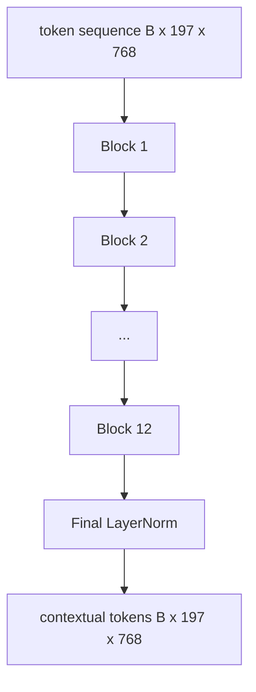

# 视觉 Transformer 编码器

> 补丁单独看不到。具有 12 个注意力头的 12 层预 LN Transformer将补丁token序列转换为上下文token序列，其中 CLS token在其最终隐藏状态中池化整个图像特征。本课程是每个现代视觉语言模型的引擎室。

**Type:** Build
**Languages:** Python
**Prerequisites:** 第19期第30-37课（B轨基础）
**Time:** ~90 分钟

## 学习目标

- 实现具有多头自注意力和前馈子层的预 LN Transformer块。
- 堆叠 12 个具有 12 个头的块，形成 ViT-Base 编码器。
- 将第 58 课中的补丁前端连接到编码器并运行前向传递。
- 验证 CLS token是否聚合了每个补丁的信息。

## 问题

补丁嵌入生成一系列 197 个token，每个token都是一个向量，不知道任何其他补丁。一张猫的图片需要每个补丁才能知道哪些补丁包含胡须，哪些包含背景，哪些包含眼睛。Transformer是建立这种意识的机制，一次一个注意力层。没有它，补丁前端就是一个无法理解的聪明的分词器。

标准配方为 12 个块深、12 个头宽，具有预 LayerNorm 放置、GELU 激活和 4 倍前馈扩展。该配方是 CLIP ViT-L、SigLIP、DINOv2、Qwen-VL 系列、InternVL 以及 2025-2026 年所有其他开放权重视觉编码器的支柱。该配方足够稳定，您可以阅读任何这些论文并假设该块形状，除非他们明确另有说明。

## 概念




### LN 前与 LN 后

原始 Transformer 将 LayerNorm 放置在残差之后。 Pre-LN（每个子层之前的 LayerNorm）是每个现代视觉语言模型使用的版本，因为它无需学习率预热技巧即可稳定训练。区别在于前向通道中的一条线，深度 12+ 处的梯度流是夜间和白天。

### 多头自注意力

每个头将token向量投影到其自己的维度为 `head_dim = hidden / num_heads` 的 `(query, key, value)` 三元组。有`hidden = 768`和`heads = 12`，每个头有`dim = 64`。 12 个头并行参与，然后它们的输出连接回 768 维并通过输出投影。多头的要点在于，一个头可以学习“注意猫眼”，而另一个头则可以在不受干扰的情况下学习“注意背景梯度”。

### 为什么要进行 4 倍前馈扩展

FFN 为 `hidden -> 4 * hidden -> hidden`，GELU 位于中间。因子 4 是经验性的，自 2017 年以来一直适用于语言和视觉Transformer。较小 (2x) 欠拟合；固定数据预算下较大 (8x) 的过度拟合。 MLP 是模型存储大部分学到的事实的地方，而更广泛的中间部分是它们所在的地方。

|组件| ViT-Base 规模的参数 |
|-----------|------------------------------|
|每个块的 qkv 投影 | `3 * 768 * 768 = 1.77M` |
|每个块的输出投影| `768 * 768 = 590K` |
|每块 FFN（4 倍扩展）| `2 * 768 * 4 * 768 = 4.72M` |
|每块的 LayerNorm | `4 * 768 = 3K` |
|每块总计 |约 710 万 |
| 12 块 |约85M |
|加前端|总计约86M |

ViT-Base 是一个 86M 参数编码器。按照 2026 年标准，这个值很小（SigLIP-So400M 为 400M，Qwen-VL ViT 为 675M），但架构在宽度和深度上是相同的。

### 因果面具与否？

Vision Transformer 仅包含编码器且是双向的：token `i` 可以参与任何对的 token `j`。没有面具。第 61 课中的解码器端交叉注意力将使用因果掩码，但在视觉编码器内部，注意力是完全连接的。

### CLS token学到了什么

CLS token从学习参数开始，没有自己的补丁内容，并通过每个块的注意力来积累信息。到最后一层，CLS行是整幅图像的向量总结；下游头将这个单一向量投影到类逻辑、对比嵌入或文本解码器的交叉注意键中。

## 构建它

`code/main.py` 实现：

- `MultiHeadSelfAttention`，具有 `qkv` 和输出投影、缩放点积注意力数学和形状断言。
- `FeedForward`，4 倍扩展 GELU MLP。
- `Block`，一个预 LN 块，由注意力和带有残差的前馈子层组成。
- `ViT`，12 个块的堆栈，具有最终的 LayerNorm。
- `VisionEncoder`，它将 `VisionFrontEnd` 从第 58 课连接到 `ViT` 堆栈，并公开返回上下文序列和池化 CLS 向量的 `forward()`。
- 一个演示，通过完整 encoder 运行合成的 224x224 fixture 图像，并每隔一层打印输入形状、输出形状、参数计数和 CLS 范数。

运行它：

```bash
python3 code/main.py
```

输出：fixture 被编码为 `(1, 197, 768)` 张量。CLS 范数随着层的组合向上漂移，然后稳定在最终 LayerNorm。总参数报告约为 86M。

## 使用它

这里定义的编码器在宽度和深度上与 2025-2026 年每个开放重量 VLM 中提供的块堆栈相同。差异在于：

- **宽度和深度。** ViT-Large 为 `hidden=1024, depth=24, heads=16`； SigLIP So400M 是 `hidden=1152, depth=27, heads=16`。同一个块。
- **池化头。** CLS池（本课）与平均池（SigLIP）与注意力池（后来的VLM）。
- **位置处理。** 固定正弦曲线（第 58 课）与学习的 1D、ALiBi 与 2D RoPE。块数学没有改变。
- **注册token。** DINOv2 前置 4 个额外学习的 token。一行代码。

该块堆叠是基板。接下来的课程（60-63）将在此基础上进行。

## 测试

`code/test_main.py` 涵盖：

- 单个块保留形状并且对于输入批量大小不变
- 沿着关键轴的注意力分数总和为 1（softmax 理智）
- 剩余路径已连接（零输入仍通过 CLS token产生非零输出）
- 4 层堆叠前向传递产生正确的形状
- 梯度从 CLS 输出流向面片投影

运行它们：

```bash
python3 -m unittest code/test_main.py
```

## 练习

1. 添加寄存器token（CLS 后添加 4 个学习向量）并重新运行。通过最后一层的 softmax 分布的熵来比较注意力图的平滑度。

2. 将 LN 前替换为 LN 后，并在合成形状分类器上训练一个 epoch。观察哪一个在没有 LR 热身的情况下训练稳定。

3. 将因果屏蔽实现为 `attn_mask` 参数，以便同一块可以重新用作解码器块。掩模形状为`(seq, seq)`，下三角形。

4. 使用 `torch.profiler` 分析批量大小为 1、8、64 的前向传递。 MLP 层主导着 wall time，而不是注意力。

5. 用低阶 LoRA 适配器替换一个注意力头的 q-k-v 投影，冻结其余部分，并验证梯度仅在您期望的位置流动。

## 关键术语

|术语 |这意味着什么 |
|------|---------------|
|预 LN | LayerNorm 应用在每个子层之前而不是之后 |
|自我关注 |每个token都以相同的顺序关注其他所有token |
|多头|隐藏的dim分布在 `H` 独立注意头中 |
| FFN 扩展 |前馈层在收缩之前加宽至 `4 * hidden` |
| CLS 池 |使用第一个token 的最终隐藏状态作为图像摘要 |

## 进一步阅读

- 对于编码器配方来说，一张图像值得 16x16 个单词（ViT，2021）。
- DINOv2 (2023) 用于注册token和自监督预训练目标。
- SigLIP (2023)，用于第 62 课中使用的平均池变体和 sigmoid 对比损失。
