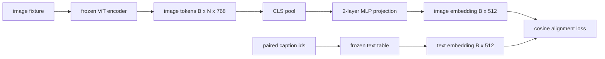

# 用于模态对齐的投影层

> 视觉编码器生成图像token。文本解码器消耗文本token。两者生活在不同的Vector空间中。一个小型的两层 MLP 将图像token投影到文本Embedding空间中，并且针对配对标题的余弦对齐损失使两个空间保持一致。该投影是视觉语言模型中最小的部分，也是对迁移最重要的部分。

**Type:** Build
**Languages:** Python
**Prerequisites:** 第19期第30-37课（B轨基础）
**Time:** ~90 分钟

## 学习目标

- 构建一个两层 MLP 投影，将图像特征映射到文本Embedding空间。
- 构造一个模拟文本Embedding表（没有预训练的Tokenizer，没有真正的语料库）。
- 计算投影图像token和配对标题Embedding之间的余弦对齐损失。
- 使用冻结视觉编码器和冻结文本表单独训练投影。

## 问题

您有一个视觉编码器（第 58-59 课），可生成维度 `vision_hidden = 768` 的 token。您有一个文本解码器，您想要将Embedding尺寸固定在 `text_hidden = 512` 之上（任何其他数字也同样合理）。解码器需要文本形状的 token。图像token不是文本形状的：它们存在于编码器在仅视觉预训练期间学习的基础中，与解码器的词Vector没有关系。

两层 MLP 投影（线性、GELU、线性）弥补了这一差距。它足够小（大约 `768 * 1024 + 1024 * 512 = 1.3M` 参数），可以在单个 GPU 上在几分钟内进行训练，并且它是唯一需要在对齐阶段学习的部分。视觉编码器保持冻结状态。文本Embedding表保持冻结状态。只有投影在移动。这是 LLaVA 于 2023 年推出的配方，BLIP-2 将其重新构建为 Q-Former，此后每个开放重量的 VLM 都以某种形式采用。

## 概念



### 投影前池化

视觉编码器发出 197 个token。文本侧具有单个标题级Embedding。为了对齐它们，每个样本需要一个图像级Vector。 CLS 池化是最简单的：从编码器获取第一个token并对其进行投影。对所有 197 个token进行平均池是另一种选择，也是 SigLIP 使用的方法。要么将 197 个Vector合并为一个。

### 为什么是两层而不是一层

单个线性投影可以旋转和重新缩放，但如果两个空间曲率不匹配，则无法固定基础。两个线性层之间的 GELU 为投影提供了一个非线性弯曲，这在经验上足以将 CLIP 风格的特征与语言模型Embedding对齐。更深层次的投影（LLaVA-NeXT 使用 GLU；Qwen-VL 使用一堆注意力层）是扩展；两层 MLP 是规范基线，也是 BLIP-2 的 Q-Former 投影头附带的内容。

|层|形状|参数|
|-------|-------|------------|
| FC1 | `(vision_hidden, projection_hidden)` | `768 * 1024 + 1024` |
|激活|格鲁| 0 |
| FC2 | `(projection_hidden, text_hidden)` | `1024 * 512 + 512` |

一个 `768 -> 1024 -> 512` 头大约有 1.3M 个参数。

### 余弦对齐损失

对齐并不意味着`image_emb == text_emb`。对齐意味着`image_emb`在关节空间中与`text_emb`指向相同的方向。余弦损失为`1 - cos_sim(image, text)`，范围从0（完全对齐）到2（相反）。训练将其推向每对为零。第 62 课概括为对比批次 (InfoNCE)，其中每个图像必须比批次中的任何其他标题更接近其自己的标题；本课程使用每对版本，因此动态可见。

### 冻结编码器是窍门

视觉编码器有86M参数。文本表还有几百万。从模拟语料库中训练所有这些人是不可能的。冻结两者意味着投影的 1.3M 参数是唯一改变的，并且合成对上的几百步就足以降低损失。这正是每个基于适配器的 VLM 的操作形状：重型部件保持冻结状态，轻型桥梁列车。

```figure
ch-projection-bridge
```

## 构建它

`code/main.py` 实现：

- `MLPProjector(in_dim, hidden_dim, out_dim)`，具有 GELU 激活的两层线性 MLP。
- `MockTextEmbedding(vocab_size, dim)`，一个冻结Embedding表，具有来自种子的确定性初始化。
- `make_pair(seed, vocab_size)`，合成一对（图像、标题）样本。标题是短 id 序列；标题Embedding是对tokenEmbedding进行均值池化的。
- `cosine_alignment_loss(image_emb, text_emb)`，每对 `1 - cos_sim` 物镜。
- 一个训练循环，在 32 个合成对（循环）上运行 200 个步骤的投影，视觉编码器和文本表冻结，并每 25 个步骤打印一次损失。

运行它：

```bash
python3 code/main.py
```

输出：训练报告在 200 步内从初始损失约 1.07 下降到约 0.80，表明仅靠投影就可以将图像token拉向文本空间。还打印每对的最终余弦相似度。

## 使用它

每个开放权重 VLM 中都会出现相同的模式：

- **LLaVA 1.5.** 从 CLIP-ViT-L 隐藏到 LLaMA Embeddingdim的两层 GELU MLP 投影。冻结视觉编码器，冻结 LLM，仅训练投影（然后在第二阶段解冻 LLM）。
- **BLIP-2.** Q-Former 通过针对图像token 的交叉关注获取 32 个学习查询token，然后投影到 LLM Embeddingdim。 Q-Former 最后的投影头类似于本课的 MLP。
- **MiniGPT-4.** 从 BLIP-2 Q-Former 输出到 Vicuna Embeddingdim的单线性投影。
- **Qwen-VL.** 具有多层的交叉注意力适配器，但最后一块仍然是到 LM Embeddingdim的投影。

形状各不相同，但作用是相同的：池图像token、投影到文本Embeddingdim、单独训练。

## 测试

`code/test_main.py` 涵盖：

- 投影仪输出形状与配置的 `out_dim` 匹配
- 冻结文本Embedding表的 `requires_grad` 参数为零
- 余弦损失在相同Vector上为零，在反平行Vector上为 2
- 一次向后传递后投影仪梯度流动
- 训练循环减少了步骤 0 和步骤 200 之间的损失

运行它们：

```bash
python3 -m unittest code/test_main.py
```

## 练习

1. 将 CLS 池化替换为 196 个 patch token 上的均值池化，并比较 200 个步骤后的最终损失。平均池化通常在合成数据上训练得更快； CLS 在自然图像上的样本效率更高。

2. 将习得的标量温度添加到余弦损失 (`cos / tau`) 中，并观察当 `tau` 太小（梯度噪声）或太大（损失稳定高）时会发生什么。

3. 将两层 MLP 替换为单个线性层并量化损失差距。非线性对自然图像特征影响更大，而对合成图像特征影响较小。

4. 在投影仪权重上添加一个小的 L2 惩罚，并观察它如何与余弦对齐交互（余弦是尺度不变的，因此惩罚主要缩小未使用的方向）。

5. 保留投影仪权重，然后重新加载并运行推理，无需视觉编码器向后传递，以验证在部署时仅需要投影仪。

## 关键术语

|术语 |这意味着什么 |
|------|---------------|
|模态对齐 |使图像和文本Embedding在一个共享空间中具有可比性的行为 |
|投影头|将一个空间映射到另一个空间的小模块，通常是 2 层 MLP |
|余弦相似度 |点积除以 L2 范数的乘积 |
|冻结编码器|视觉（或文本）模型的所有参数均带有 `requires_grad=False` |
|模拟语料库|使用合成对，因此训练不依赖于数据集下载 |

## 进一步阅读

- 用于两阶段训练的 LLaVA 论文（项目，然后解冻 LM）。
- Q-Former 的 BLIP-2 论文作为可学习的投影替代方案。
- Qwen-VL 技术报告，将交叉注意力适配器用作更深的投影头。
