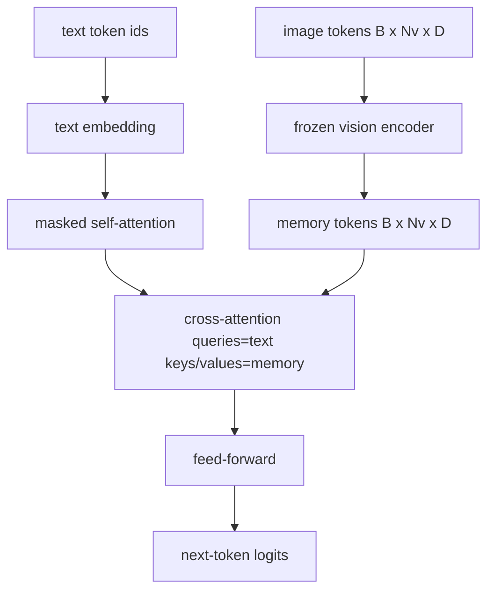
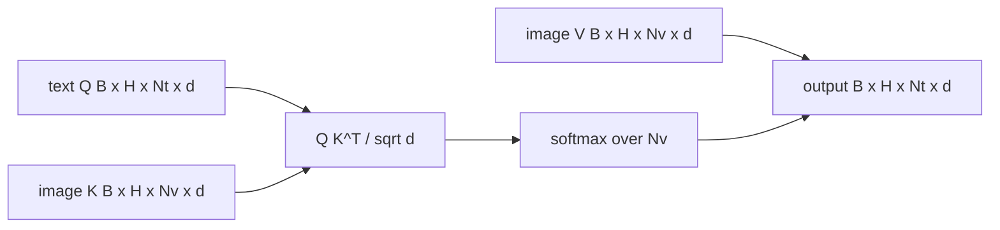

# 交叉注意力融合

> 投影层将一个图像向量与一个标题向量对齐。真正的视觉语言解码器需要每个文本token都参与每个补丁token，因此模型可以将每个单词放在一个区域中。交叉注意力就是这种接地的发生方式。文字查询；愿景关键和价值观给出了答案。本课构建了交叉注意力块、因果文本自注意力以及保持两者合法的掩码形状。

**Type:** Build
**Languages:** Python
**Prerequisites:** 第19期第30-37课（B轨基础）
**Time:** ~90 分钟

## 学习目标

- 实现多头交叉注意力，其中查询流是文本，键/值流是视觉。
- 组成解码器块：因果自注意力+交叉注意力+前馈。
- 获得正确的掩模形状：用于自注意力的因果掩模，用于交叉注意力的无掩模。
- 使用批量文本token和固定图像token池运行前向传递。

## 问题

将图像token和文本token连接成一个序列是一种融合选项（早期融合，Chameleon 和 Emu3 采用的路径）。交叉注意力是另一个（后期融合，Flamingo 引入的路径以及此后每个 Flamingo 型解码器都复制的路径）。在后期融合中，文本解码器在纯文本token上运行，并通过每一层的交叉关注延伸到图像流。

后期融合有两个优点。首先，文本流保持干净，模型保留纯文本功能。其次，图像流对每个图像计算一次，并在每个解码步骤中重复使用，因此即使对于长标题，生成也很便宜。成本是每个块一个额外的注意力子层。

## 概念





### 面具形状

解码器块内的两个注意力需要不同的掩码：

|注意|查询长度 |密钥长度|面膜|为什么 |
|-----------|--------------|------------|------|-----|
|自我关注 | `Nt`（文本）| `Nt`（文本）|因果：下三角 `(Nt, Nt)` |自回归期间文本token可能不会向前看 |
|交叉注意力| `Nt`（文本）| `Nv`（愿景）|没有口罩|整个图像对每个文本位置都是可见的 |

本课程包括一个形状验证函数，因此将它们混合起来作为 `ValueError` 的错误，而不是默默破坏的损失曲线。

### 为什么交叉注意力没有掩模

在生成任何文本之前，先充分观察图像。标题的 token`t`可以关注图像的任何补丁；图像块没有时间顺序。一些 Flamingo 变体在交错多个图像和文本段时添加了每个样本的掩蔽模式，但对于单个图像加上标题，交叉注意力可以看到一切。

### 键/值缓存

图像键和值在解码开始时计算一次并保存在缓存中。每个新的文本token都使用缓存而无需重新计算。这就是推理时字幕快速运行的原因：重型 ViT 运行一次；交叉注意力在每一步中重用其键和值。本课程公开缓存并测试缓存命中路径。

### 块组成

解码器块运行：预 LN -> 自注意力 -> 残差 -> 预 LN -> 交叉注意力 -> 残差 -> 预 LN -> 前馈 -> 残差。三个子层，每个子层都有自己的 LayerNorm。 Flamingo 论文添加了一个关于交叉注意力的学习门，因此模型可以以训练时稳定性为代价选择退出图像路径；规范基线（此处使用）没有门。

```python
class DecoderBlock:
  def forward(self, text_tokens, image_tokens, text_mask, cross_mask):
      text_tokens = text_tokens + self.self_attn(self.ln1(text_tokens),
                                                 mask=text_mask)
      text_tokens = text_tokens + self.cross_attn(self.ln2(text_tokens),
                                                  image_tokens,
                                                  mask=cross_mask)
      text_tokens = text_tokens + self.ffn(self.ln3(text_tokens))
      return text_tokens
```

## 构建它

`code/main.py` 实现：

- `CrossAttention(hidden, heads)`，具有单独的 `q` 和 `kv` 投影的多头交叉注意力。
- `CausalSelfAttention(hidden, heads)`，来自标准解码器的屏蔽自注意力。
- `DecoderBlock`，用预 LN 残差组成三个子层。
- `VisionLanguageDecoder`，由模拟视觉编码器输出和小型文本嵌入表提供的四层解码器。
- `causal_mask(length)` 返回 `(length, length)` 下三角布尔张量。
- 一个演示，它向一批长度为 10 的两个文本序列提供长度为 197 的图像内存，并打印输出形状、自注意力掩模形状和每个位置的交叉注意力输出范数。

运行它：

```bash
python3 code/main.py
```

输出：解码器产生 `(2, 10, text_vocab)` logits 张量。面罩形状为`(10, 10)`。 KV 缓存重用检查确认缓存和未缓存路径之间的相同逻辑。

## 使用它

交叉注意力出现在两个生产系列中：

- **Flamingo 和 IDEFICS。** 每 K 个语言模型块插入一个交叉注意力子层，并使用冻结的 LM。视觉语言适配器是交叉注意力块及其门。
- **BLIP-2.** Q-Former 使用来自一组固定的 32 个查询token 的交叉注意力到图像特征中，然后将查询投影到 LM 嵌入空间中。

本课程中的块的形状直接映射到两者上。面具纪律（自我因果关系，交叉因果关系）是相同的。

## 测试

`code/test_main.py` 涵盖：

- 因果掩码是下三角的并且与预期的布尔形状匹配
- 无论密钥长度如何，交叉注意力输出形状都是 `(B, Nt, hidden)`
- KV 缓存路径与未缓存路径匹配以浮动容差
- 文本和图像流之间的形状不匹配引发了明显的 `ValueError`
- 完整的解码器前向传递产生正确的批次和序列形状

运行它们：

```bash
python3 -m unittest code/test_main.py
```

## 练习

1. 将学习的 tanh 门添加到交叉注意残差（Flamingo 技巧），并验证训练从接近零的初始门收敛。门从 0 开始；该模型在混合图像流之前恢复纯文本行为。

2. 实现交错注意力，其中同一解码器消耗多个图像和多个文本段。构建每个样本的交叉注意力掩码，以防止文本段 2 关注图像 1。

3. 在 `Nt=64, Nv=576`（更高分辨率的 24x24 网格）上分析交叉注意力与自注意力层。交叉注意力成本为 `Nt * Nv`，并且在高图像分辨率下占主导地位。

4. 在交叉注意力图上添加查询端 dropout，并测量演示中的标题多样性（标题样本方差随着交叉图中的 dropout 的增加而增加）。

5. 将交叉注意力层替换为 Q-Former 风格的注意力块，其中固定的 32 个token查询池每层关注一次图像特征。

## 关键术语

|术语 |这意味着什么 |
|------|---------------|
|后期融合|文本和视觉位于不同的流中；交叉注意力在每个区块上架起了桥梁|
|交叉注意力| Q 来自一个流，K 和 V 来自另一个流 |
|因果面具|下三角布尔掩码，可防止在自回归过程中向前看 |
| KV缓存|图像键和值存储一次并在每个解码步骤中重复使用 |
|记忆token|解码器进入的冻结图像token |

## 进一步阅读

- Flamingo (2022) 用于具有门控交叉注意力的规范后期融合设计。
- Q-Former 的 BLIP-2 (2023)，它是一个装扮成学习查询池的交叉注意力块。
- IDEFICS (2023) 用于 Flamingo 配方的开放重量复制品。
