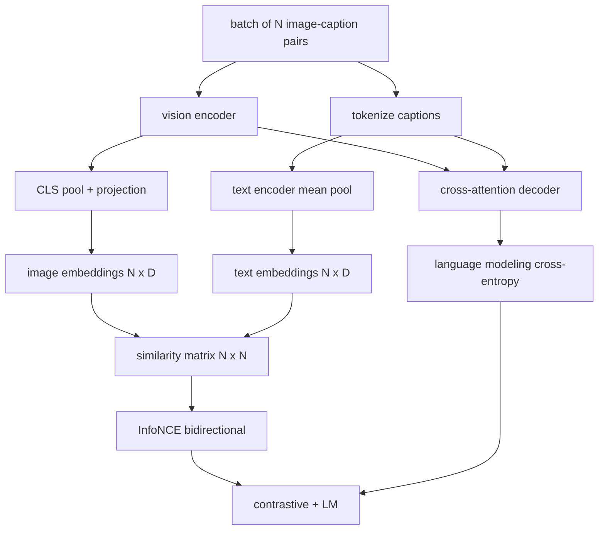

# 视觉语言预训练

> 编码器、投影和解码器已接线。现在一起训练他们。两个目标驱动学习：对比图像文本损失（InfoNCE），将匹配对在联合嵌入空间中拉到一起，以及语言建模损失，要求解码器为每个图像添加标题。结合起来，它们教会网络找到合适的图像作为标题并为图像编写标题。

**Type:** Build
**Languages:** Python
**Prerequisites:** 第19期第30-37课（B轨基础）
**Time:** ~90 分钟

## 学习目标

- 在一批图像标题对中实现 InfoNCE 对比损失。
- 将对比损失与自回归语言建模损失组合起来。
- 合成 200 对模拟图像字幕语料库，无需下载真正的数据集。
- 运行 50 步演示训练循环并观察损失的减少。

## 问题

视觉语言模型需要两项技能。它必须排名：给定标题，在众多图像中找到正确的图像。它必须生成：给定一个图像，写一个标题。仅针对一项技能对模型进行预训练就可以得到半个系统。 CLIP 确定了排名，但无法提供字幕。 GPT-4V 可以添加字幕，但使用单独的检索头进行排名。多目标预训练一次即可实现这两个目标。

InfoNCE 负责排名的一半。对于一批 N 对，模型将 N 个匹配对视为正例，将 `N^2 - N` 不匹配对视为负例，然后对生成的 `(N, N)` 相似度矩阵运行交叉熵损失。 LM 损失处理生成的一半：以图像为条件的标准下一个token预测。两种损失都是可微分的，并且可以共享编码器、投影仪和解码器的权重。

## 概念



### InfoNCE 在一段话中

将 N 个图像嵌入堆叠为行，将 N 个文本嵌入堆叠为行。 L2-将两者归一化。计算 `N x N` 矩阵 `S = I T^T / tau`，其中 `tau` 是学习温度。对角线条目是匹配对；非对角线条目是负数。应用交叉熵，目标 `argmax` 沿对角线运行：行 `i` 应该在列 `i` 中具有最高条目。沿列对称地执行相同操作。总数是两者的平均值。这是八行中的 CLIP 损失。

### 温度很重要

温度 `tau` 控制 softmax 的峰值程度。太小（例如 `tau = 0.01`）并且梯度仅来自最难的负值，训练有噪音。太大，softmax 会变平并且梯度消失。 CLIP学习`tau`作为参数；这里的演示也做了同样的事情。

### 语言建模损失

解码器通过交叉注意力消耗图像内存token，并预测每个位置的下一个文本token。损失是与下一个位置目标的标准交叉熵。填充位置被掩盖在损失之外。

### 合并损失

`total = contrastive + lm_weight * lm`，其中 `lm_weight` 是标量（通常为 1.0）。这两个损失共享编码器和投影的梯度；只有解码器接收 LM 损失梯度。这是 CoCa、BLIP 和 SigLIP 类型模型都使用的多任务配方，具有不同的权重。

|组件|损失面|影响|
|-----------|--------------|---------|
|信息NCE |联合空间中的配对排名 |编码器+投影+文字头|
| LM |以图像为条件的 token预测 |编码器+投影+解码器 |
|合并|多任务 |全栈|

### 为什么 50 个步骤对于演示来说就足够了

模拟语料库是一个合成的 200 对集，包含随机图像和随机标题 ID。在批量大小为 16 的 50 个 SGD 步骤之后，即使绝对值保持在实际数据模型所能达到的水平之上，两种损失也会明显下降。演示的目的是确认梯度管道端到端地工作，并且添加 LM 损失不会破坏对比目标的稳定性。

## 构建它

`code/main.py` 实现：

- `MultimodalModel`，结合了一个小型 ViT 编码器、MLP 投影仪、一个小型文本侧编码器（嵌入式 id 上的均值池）以及第 61 课中的交叉注意解码器。
- `info_nce_loss(image_emb, text_emb, temperature)`，双向 CLIP 式对比损失。
- `lm_loss(logits, target_ids, padding_id)`，屏蔽的下一个token交叉熵。
- `make_mock_corpus(seed, n_pairs)`，返回 200 个确定性（图像、caption_ids）对。
- 训练循环运行 50 个步骤，批量大小为 16，Adam 优化器和学习的对数温度参数。每 5 步打印一次这两个损失。

运行它：

```bash
python3 code/main.py
```

输出：对比损失从大约 `ln(16) = 2.77` 下降到 2.4； LM 损失从 `ln(512) ≈ 6.24` 的随机均匀基线下降到约 4.7。两次下降都证明梯度连接正确。真实模型训练数百万步；动态是相同的。

## 使用它

这是相同的损失配方：

- **CLIP (2021)。** 仅图像-文本对比，具有单独的冻结编码器字幕探针。
- **CoCa (2022).** 一个模型中的图像文本对比加上图像标题 LM 损失。本课构建的确切模式。
- **BLIP (2022) 和 BLIP-2.** 对比加 LM 加图文匹配头。三场损失加起来。
- **SigLIP (2023).** 将 InfoNCE 切换为 sigmoid 对损失；相同的对比作用，不同的功能形式。
- **LLaVA 系列。** 两阶段训练，其中第一阶段是对齐（冻结 LM 上的余弦），第二阶段使用未冻结的 LM 添加 LM 损失。第 60 课对应第一阶段；本课对应第二阶段。

## 测试

`code/test_main.py` 涵盖：

- InfoNCE 损失在图像/文本行之间是对称的
- 当相似度矩阵是大正数的完美对角线时，InfoNCE 损失返回 0
- LM损失正确掩盖了填充位置
- 模型前向传递产生两种损失且没有错误
- 5步训练循环减少了组合损失

运行它们：

```bash
python3 -m unittest code/test_main.py
```

## 练习

1. 将 InfoNCE 替换为 SigLIP 风格的 sigmoid 对损失，并在模拟语料库上比较收敛性。

2.添加硬负挖掘步骤：每隔一批，从前一批中选择最难的非对角对并将其附加。训练并检查对比损失是否下降得更快。

3. 在联合嵌入的顶部添加图像-文本匹配的二进制头（真/假：这些匹配吗？）作为第三个损失，复制 BLIP 的三头设置。

4. 将模拟语料库替换为从马尔可夫链中提取的标题 ID 序列，该马尔可夫链的转换矩阵以图像哈希为条件。由于存在实际的可学习信号，字幕损失应该进一步下降。

5. 使用 `lm_weight = 0` 训练相同的模型，然后使用 `lm_weight = 1` 再次训练。比较对比损失； LM 损失不应影响排名目标。

## 关键术语

|术语 |这意味着什么 |
|------|---------------|
|信息NCE |噪声对比估计：相似度矩阵上的交叉熵 |
|温度|控制对比 softmax 的峰值程度的标量 |
|硬阴性|模型发现的非对角线对令人困惑，但对于采样很有用 |
| LM 损失 |字幕侧的标准下一个token交叉熵 |
|联合嵌入空间|投影后图像和文本向量所在的共享空间 |

## 进一步阅读

- 用于原始对比配方的夹纸。
- CoCa 纸，用于在一个模型中进行对比和字幕。
- SigLIP 论文，介绍了 sigmoid 对损失变体及其扩展性更好的原因。
