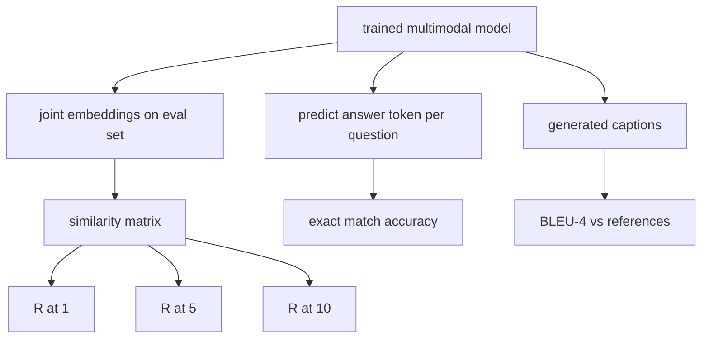

# 多模态评估

> 培训是循环的一半。另一半是测量。本课程从基元构建三个评估表面：图像标题检索报告为 R@1、R@5、R@10；视觉问答报告为精确匹配准确度；图像字幕报告为 BLEU-4。每个指标都是模型输出的函数和在几秒钟内运行的综合评估套件。

**Type:** Build
**Languages:** Python
**Prerequisites:** 第19期第58-62课（Track E基础：编码器、Transformer、投影、交叉注意力融合、预训练）
**Time:** ~90 分钟

## 学习目标

- 根据图像和标题嵌入之间的相似性矩阵计算 Recall@K。
- 根据将（图像、问题）对映射到固定答案词汇的模型计算精确匹配的 VQA 准确度。
- 从生成的和参考token序列计算 BLEU-4，无需任何外部库。
- 针对构建在第 62 课训练模型之上的综合套件运行所有三个评估。

## 问题

当训练损失趋于稳定时，我们很可能会宣布多模态模型已完成。训练损失度量适合训练分布；它不能衡量模型是否可以对保留的批次中的对进行排名、回答问题或编写人类会接受的标题。三个评估表面是标准的：

- **检索（R@1，R@5，R@10）。**为查询标题构建联合嵌入；按余弦对评估池中的每个图像进行排名；报告匹配图像是否位于前 1、前 5、前 10 名。对称（图像到文本）形式的运行方式相同。
- **视觉问答（完全匹配）。** 给定（图像，问题），模型输出一个答案token。精确匹配是每个样本一位：预测答案是否等于参考答案？评估集的平均值。
- **字幕 (BLEU-4)。** 生成字幕。根据参考标题计算 1 克到 4 克精度的几何平均值，并牺牲简洁性。多重参考是标准形式（一张图像，多个参考标题）。

每个度量都是一个薄函数。本课程将它们全部用代码构建，因此数学是具体的，并且表面仍然在您的控制之下。真正的基准测试套件（MS-COCO、VQA v2、GQA、OK-VQA）可插入相同的函数形状中。

## 概念



### 从相似度矩阵中调用@K

构建图像和标题嵌入之间的 `(N, N)` 余弦相似度矩阵。对于每一行，按相似度降序对列进行排序。 Recall@K 是对角列索引位于前 K 个位置内的行的分数。 Symmetric Recall@K（标题到图像）是在转置矩阵上计算的。这两个数字均已报告。对于 N=100 的评估，R@1 = 0.6 意味着 100 个字幕中的 60 个检索到了正确的图像作为最佳匹配。

### VQA 精确匹配

对于每个（图像、问题、答案），对图像进行编码，嵌入问题，通过解码器融合，并读出下一个token。将预测的 token id 与参考 id 进行比较；如果相等则正确。评估集的平均值。真实的 VQA 数据集每个问题附带多个人工注释的答案，并使用软精度公式（如果 10 个注释者中至少有 3 个同意，则为 1.0，比例如下）；为了清晰起见，本课程使用单一答案完全匹配。

### BLEU-4

```text
BLEU-4 = BP * exp(mean(log p1, log p2, log p3, log p4))
```

其中 `p_n` 是修改后的 n 元语法精度（出现在任何参考文献中的生成的 n 元语法的裁剪计数，除以生成的 n 元语法总数），`BP` 是简洁性惩罚：

```text
BP = 1                if generated length > reference length
   = exp(1 - r/g)     otherwise, where r is reference length and g is generated
```

对于一些 `p_n` 为零的小样本，需要进行平滑。该实现使用 Chen 和 Cherry 的“方法 1”（对于任何零计数，分子和分母加 1），这是低计数制度最安全的默认值。

### 综合评估套件

一个 50 个样本的评估套件是根据第 62 课中使用的相同模拟语料库模式在内存中构建的，并带有保留的种子。该套件由三个列表组成：

- `pairs`：50 个（图像、caption_ids）对用于检索。
- `vqa`：50 个（图像、问题 ID、答案 ID）三元组。
- `caps`：50 个（图像，[reference_caption_ids，...]）条目，每个图像最多 3 个引用。

该套件从种子中确定并从训练语料库中保留，因此指标是根据模型从未见过的数据计算的。将套件保留为 JSON 留作练习（见下文）。

|指标|范围 |随机基线 (N=50) |
|--------|-------|------------------------|
| R@1 | 0 到 1 | 0.02（1/N）|
| R@5 | 0 到 1 | 0.10 |
| R@10 | 0 到 1 | 0.20 |
| VQA EM | 0 到 1 | 1 / 词汇 |
| BLEU-4 | 0 到 1 |小但非零 |

对于在合成数据上运行的 50 步训练，预计指标不会很高；它们预计高于随机基线，这是演示检查的内容。

## 构建它

`code/main.py` 实现：

- `recall_at_k(sim_matrix, k)`，在两个方向上返回 `[0, 1]` 中的浮点数。
- `vqa_exact_match(predictions, references)`，返回 `int` 相等的平均值。
- `bleu4(generated, references, smoothing=True)`，具有多参考支持。
- `build_eval_suite(seed, n_samples, vocab_size, max_len)`，返回三个确定性评估列表。
- `evaluate(model, suite)`，它运行所有三个指标并返回 `dict` 数字。
- 一个演示，加载第 62 课中的新初始化的多模态模型，对其进行评估，然后对其进行 50 个步骤的训练并再次评估，打印之前/之后的指标。

运行它：

```bash
python3 code/main.py
```

输出：之前/之后的度量表显示检索从近随机到模型学习信号的改进，VQA 改进高于随机，BLEU-4 改进（合成结构足以实现 4 克精度提升）。

## 使用它

每个指标都直接映射到生产基准：

- **检索。** MS-COCO 5K val、Flickr30K、ImageNet 零样本都是同一相似性矩阵上的 R@K 问题。将合成 eval 替换为真实文件，函数签名保持不变。
- **VQA。** VQA v2、GQA、OK-VQA 使用相同的精确匹配形状（使用 soft-acc 而不是 VQA v2 的单答案 EM）。
- **BLEU-4.** MS-COCO 字幕、NoCaps、Flickr30K 字幕均使用 BLEU-4 加 CIDEr 和 METEOR。添加 CIDEr 是另一项功能。

对于真正的基准测试，请将 `build_eval_suite` 替换为真正的加载程序并保留函数体。数学与基准无关。

## 测试

`code/test_main.py` 涵盖：

-recall@k 在完美身份相似度矩阵上返回 1.0，在翻转矩阵上返回 0.0（k < N）
-recall@k 尊重 `k <= N` 上限
- 当生成的 bleu4 完全等于引用之一时，返回 1.0
- bleu4 在不相交词汇上返回 0.0
- vqa 精确匹配等于相等对的分数
- build_eval_suite 返回预期的对数、vqa 项和标题条目数

运行它们：

```bash
python3 -m unittest code/test_main.py
```

## 练习

1. 将 CIDEr 添加到字幕指标中。 CIDEr 在 n-gram 上使用 TF-IDF 加权，这会奖励信息丰富的 token。

2. 实施软精度 VQA：每个问题有多个人工答案，如果有匹配，精度为 `min(human_count / 3, 1)`。复制 VQA v2。

3. 添加 `bleu4` 的 NaN 安全变体，可处理空的生成序列而不会崩溃。

4. 与 R@K 一起计算平均倒数排名 (MRR)。 MRR 对正确的项目落在顶部 K 之外的位置很敏感； R@K 对是否落在前 K 很敏感。

5. 在训练期间的五个检查点对模型运行评估（步骤 0、10、20、30、40、50）并绘制学习曲线。确认度量轨迹跟踪损失轨迹。

## 关键术语

|术语 |这意味着什么 |
|------|---------------|
| R@K |正确匹配出现在前 K 个结果中的查询比例 |
|精确匹配 |最简单的VQA评分：预测答案等于参考|
| BLEU-4 | 1 到 4 克精度的几何平均值，带有简洁性代价 |
|多参考|字幕指标接受每个图像的多个参考字幕 |
|保留 |评估集是从与训练语料库不相交的种子中采样的 |

## 进一步阅读

- 用于软精度公式和数据集统计的 VQA v2 论文。
- 用于 TF-IDF 加权 n-gram 字幕的 CIDEr 论文。
- BLEU 原始版本（Papineni 等人，2002）用于平滑变体。
- 用于规范参考实现的 MS-COCO 字幕评估脚本。
