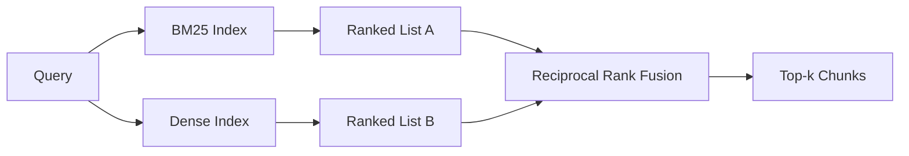

# BM25 和密集Embedding的混合检索

> 词汇和语义检索在相反的查询分布上失败。具有倒数排名融合的混合检索不会插值，而是投票 - 并且投票在每个查询类上获胜。

**Type:** Build
**Languages:** Python
**Prerequisites:** 第 11 阶段课程 04（Embedding）、06（RAG）；第 19 阶段 Track B 基础（第 20-29 课）；第 19 阶段第 64 课（分块策略）
**Time:** ~90 分钟

## 学习目标
- 根据 Robertson 和 Spark Jones 公式从头开始实施 BM25，具有字段加权、文档长度标准化以及可调 k1 和 b。
- 在确定性模拟Embedding之上构建密集检索器，以便循环离线运行。
- 完全按照 Cormack、Clarke 和 Buettcher 在 2009 年发表的那样实现倒数等级融合，并解释为什么它在分数加权插值中占主导地位。
- 调整 RRF k 常数和每种模态权重，并在小型 fixture 语料库上读取权衡。

## 问题

当查询携带语料库逐字包含的文字标识符时，词法搜索获胜。对 `AbortMultipartOnFail` 的查询会通过 BM25 以微秒为单位返回正确的 Go 函数。Embedding的相同查询位于三个相似性簇的边界，并且密集检索器将错误的文件排在第一位。

当查询被解释为远离语料库的文字token时，密集搜索就会获胜。用户询问“我们如何处理取消的上传”时从未输入过“abort”或“multipart”一词。 BM25 返回“上传大文件”的文档块，因为该页面包含单词“上传”。密集检索找到摘要提到取消的中止函数。

两者之间的选择并不是一成不变的。查询分布是变量。生产 RAG 系统从同一端点处理这两个类，因此检索必须同时处理这两个类。这就是混合检索。合并步骤是必须正确的部分。

## 概念



### BM25 一段话

BM25 通过对查询术语求和，将逆文档频率因子乘以包含长度归一化校正的饱和术语频率因子，对查询文档对进行评分。两个旋钮。 `k1` 控制词频饱和度；默认值 1.5 是已发布的建议，您不应在没有基准的情况下移动它。 `b` 控制文档长度的重要性；默认值 0.75 表示较长的文档会受到惩罚，但不是线性的。

IDF 公式使用平滑的 Robertson 和 Spark Jones 定义，即 `log((N - df + 0.5) / (df + 0.5) + 1)`。当某个术语出现在超过一半的语料库中时，日志中的加一会使 IDF 保持正值。这对于小型语料库来说很重要，因为从技术上来说，停用词很少见。

字段加权可让您告诉 BM25，符号名称上的匹配比正文中的匹配更重要。实施是索引过程中术语计数的乘数，而不是评分时的术语计数。这样可以保持数学相同，并避免每个领域有单独的分数。

### 一段中的密集检索

使用Embedding模型将每个块Embedding到固定维度Vector中。在查询时，Embedding查询，根据相似度对每个块进行余弦排名，并返回前 k 个。模型是决定质量的变量。检索算法本身就是两行：点积和排序。

本课程使用确定性的基于哈希的Embedding，因此您无需网络调用即可阅读融合数学。该哈希将token键控偏移量求和为 96 维Vector并进行归一化。余弦等级在运行中具有确定性，这是测试套件所需要的。

### 倒数秩融合，已公布的公式

两个排行榜。对于任一列表中出现的每个候选人，将其倒数排名贡献相加。 2009年的论文使用`1 / (k + rank)`，k等于60作为默认值。按总分排序。这就是整个算法。

公布的常数 k = 60 不是任意的。当 k = 60 时，排名 1 的贡献是 1 / 61，排名 10 的贡献是 1 / 70。贡献衰减缓慢，因此深度候选人仍然投票。较小的 k 使顶部结果占主导地位。 k 越大，贡献曲线就越平坦。

我们的实现中有两个可调旋钮。 `k` 常数。一对每种模态的权重，这样当您有事先证据表明其中一个在您的语料库上更好时，您就可以提高 BM25 或密集度。将排名贡献乘以权重是最简单的原理实现；它保留了等级衰减形状并保持无标度。

### 为什么融合优于分数加权插值

BM25 分数不受限制且依赖于语料库。余弦相似度限制在 -1 到 1 之间。线性组合 `alpha * bm25 + (1 - alpha) * cosine` 需要每个语料库 alpha 调整，并且每次重新索引时都会中断。基于等级的融合则不然。两个等级在不同模式下具有可比性。自 2010 年以来，已发布的 RRF 基线在每个公共 TREC 赛道上都击败了分数插值。这与您在 Vespa 和 Weaviate 文档中听到的有关 RankFusion 与 RRF 的论点相同。他们得出了相同的结论：除非你有非常有力的证据来插值，否则保持基于排名。

```figure
rrf-fusion
```

## 构建它

`code/main.py` 实现：

- `tokenize(text)` - 快速正则表达式token器。
- `BM25Index` - 场加权，带有 `add` 和 `search` 以及可调 k1，b。
- `mock_embed`、`DenseIndex` - 与第 64 课相同的确定性Embedding，因此块具有可比性。
- `rrf(rankings, k, weights)` - 已发布的Multimodal权重融合。
- `HybridRetriever` - 结合了BM25和密集。
- 一个演示 `main()`，加载一个小型 fixture 语料库，运行三个专门展示各检索器优缺点的查询，并打印每个模态生成的排名以及融合列表。

运行它：

```bash
python3 code/main.py
```

并排阅读演示输出。文字标识符查询位于 BM25 排名 1、密集排名 4、RRF 排名 1。释义查询位于 BM25 排名 6、密集排名 1、RRF 排名 1。模糊查询位于 BM25 排名 3、密集排名 3、RRF 排名 1。它是在每个查询类别上获胜的系统。

## 调整旋钮

|旋钮|默认|何时调高|何时调低|
|------|---------|----------------|------------------|
| BM25 k1 | 1.5 |文档中的术语会重复，且你希望频率更重要 |文档很短，术语重复主要是噪音 |
| BM25 b | 0.75 |长文档确实每个词携带的信息更少 |文档长度与主题无关 |
| RRF k | 60 |较深排名的候选仍应投票 |Top-1 应该占主导 |
| BM25 weight | 1.0 |语料库包含字面标识符，查询也按字面匹配 |查询多为用户改写 |
| Dense weight | 1.0 |查询多为改写或语义表达 |查询多为字面表达 |

通过在保留的查询集上重新运行第 68 课的评估工具来进行调整，而不是凭直觉。

## 演示将隐藏的故障模式

**词汇外token。** BM25 的 IDF 是根据语料库计算的，因此仅查询中的术语贡献为零。密集Embedding会产生同一项Vector的幻觉。对于语料库外标识符，密集模态返回看似合理但错误的邻居。融合吸收了这一点，因为 BM25 没有返回任何内容，并且排名贡献会下降，但前提是您按文档而不是按块去重复。

**停止token统治。** BM25 针对单词“the”在语料库中产生统一的排名。过滤索引器中的停止token或接受高 IDF 术语自然占主导地位。

**跨模态的内容相同。** 如果您的语料库足够小，以至于 BM25 的 top-1 也是密集的 top-1，则 RRF 会为您提供具有相同邻居的相同 top-1。这是正确的行为，而不是失败，但它使融合看起来不可见。在评估中添加对抗性查询对以验证融合是否确实有效。

## 使用它

生产模式：

- 索引 BM25 正在处理中；瓶颈是词频字典，而不是Vector。
- 在单独的存储中索引密集Vector（在本课中我们使用平面列表；在生产中您将使用 HNSW）。
- 并行运行两个查询；融合是对并集的恒定时间合并。
- 保留每个检索到的命中的模态，以便下游重新排序者可以看到哪种模态投票支持它。

## 发货

第 66 课采用本课中的融合 top-k 并使用交叉编码器重新排名。第 68 课使用精确度、召回率、MRR 和 nDCG 评估整个流程。本课中的混合检索器是第 69 课中端到端系统的第一阶段。

## 练习

1. 将 `mock_embed` 替换为提供商提供的真实模型。重新运行演示并报告仅密集排名在释义查询上的变化。
2. 添加第三种模式：单独索引的块摘要并融合为第三排名列表。测量增益。
3. 将 RRF k 扫过 10、30、60、100、200。绘制第 68 课中的recall@k 曲线。报告语料库中曲线峰值处的 k 值。
4. 正确实现 BM25F（每个字段长度标准化而不是乘数技巧）并在符号匹配最重要的语料库上进行比较。

## 关键术语

|术语 |人们怎么说|它实际上意味着什么 |
|------|-----------------|------------------------|
| BM25 | “词汇搜索” | idf x 饱和 tf x 长度归一化的概率排名 |
|参考文献 | “等级融合”|各个排名列表的 1 / (k + 排名) 之和； k = 60 默认 |
| k1 | “TF 饱和度” |控制重复术语停止添加更多分数的速度 |
|乙| “长度惩罚” | 0 表示忽略文档长度，1 表示完全标准化 |
|场加权 | “符号提升”|在索引期间重复token以增强该字段中的匹配|
|基于排名与基于分数的融合 | “为什么 RRF 优于线性”|不同模式下的排名具有可比性；分数不|

## 进一步阅读

- Cormack、Clarke、Buettcher，“倒数排名融合优于孔多塞和个人排名学习方法”，SIGIR 2009
- Robertson、Walker、Beaulieu、Gatford、Payne，“Okapi at TREC-3”（原始 BM25 论文）
- [Vespa：使用 BM25 和 Embeddings](https://docs.vespa.ai/en/tutorials/hybrid-search.html) 进行混合检索
- [Weaviate：混合搜索](https://weaviate.io/developers/weaviate/search/hybrid)
- 第 11 阶段第 06 课 - RAG 基础知识
- 第 19 阶段第 64 课 - 分块器的输出在此处编制索引
- 第 19 阶段第 66 课 - 消耗融合的 top-k 的交叉编码器重排序器
