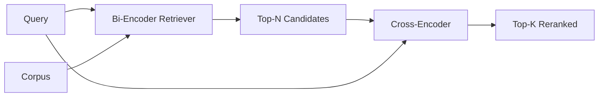

# 交叉编码器重排序

> 双编码器独立嵌入查询和文档。交叉编码器将它们连接起来并同时读取。交叉编码器是最聪明的阅读器，也是最慢的。用作双编码器 top-k 的第二级，它本身就物有所值。

**Type:** Build
**Languages:** Python
**Prerequisites:** 第11期第06课（RAG）、第11期第07课（高级RAG）；第 19 阶段 Track B 基础（第 20-29 课）；第 19 阶段第 65 课（混合检索喂养此阶段）
**Time:** ~90 分钟

## 学习目标
- 通过输入形状、参数计数和每次查询成本来区分双编码器检索器和跨编码器重排序器。
- 从头开始​​实现一个小型交叉编码器作为Transformer块，它消耗打包（查询、文档）序列并发出单个相关标量。
- 连接两阶段检索然后重新排序管道：使用廉价检索器检索前 N，使用交叉编码器将 N 重新排序为前 K，返回 K。
- 在小型fixture语料库上衡量延迟与质量的权衡，并针对给定的延迟预算选择正确的 N。

## 问题

双编码器将查询和文档映射到相同的向量空间并按余弦排名。这两种编码永远不会看到对方。该模型必须将文档中所有有用的内容压缩到单个向量中，而不考虑查询。这是快速的——索引时每个文档一次嵌入，查询时每个查询一次嵌入——并且这是在语料库规模上排名的唯一方法。

代价就是精度。具有相同整体主题的两个文档可以具有几乎相同的嵌入，即使其中一个回答了查询而另一个没有回答。双编码器无法区分它们。

交叉编码器通过一起读取查询和文档来解决这个问题。该模型接收 `[query] [SEP] [document]` 作为单个序列，在整个连接中运行充分的注意力，并生成一个相关标量。文档的每个token都可以参与查询的每个token。模型根据完整的上下文来决定分数。

成本就是吞吐量。双编码器嵌入一次并永久查询的情况下，交叉编码器每个（查询，文档）对运行一次。对于包含 1000 万个文档的语料库，每个查询需要进行 1000 万次前向传递。在请求预算中无法运行。

解决方案是分阶段。使用双编码器检索前 N 个。使用交叉编码器将 N 重新排序为 top-K。 N 很小（50 到 200），交叉编码器的质量提升集中在重要的地方。总延迟保持在请求预算内。总质量是交叉编码器的质量，其上限是双编码器在 N 处的召回率。

## 概念



### 交叉编码器的输入形状

标准包装为`[CLS] query_tokens [SEP] document_tokens [SEP]`。 CLS 位置输出被馈送到输出相关标量的单个线性头。一些实现使用均值池而不是 CLS；差异很小。要点是该模型每对生成一个数字。

22M参数交叉编码器（已发布的`ms-marco-MiniLM-L-6-v2`权重等级）是典型的生产点。较小的模型损失质量的速度比节省延迟的速度快。较大的模型（例如 568M 参数的 `bge-reranker-v2-m3`）保留用于离线重新排名或 K 较小的首页重新排名。

### 为什么这节课训练的是小孩子

真正的交叉编码器是经过微调的编码器Transformer。在生产中，您加载一个检查点并运行它。在本课程中，我们的目标是向您展示模型的形状和延迟质量曲线的形状，而不是训练最先进的排序器。因此，我们构建了一个小型 `nn.Module`，其中包含一个Transformer块、多头注意力（默认情况下为 4 个头）和一个回归头。它是从种子确定性地初始化的，因此演示可以重现，无需磁盘上的权重。

玩具模型从固定语料库中学习正确的形状：相关的查询-文档对比不相关的对具有更高的预测分数。端到端管道对双编码器的输出进行重新排序，并且重新排序的 top-k 与黄金标签相关。

### 延迟与质量

两阶段管道有一个可调参数：N。在保留的查询集上将 N 从 5 扫描到 100，即可得到曲线。

|N |第 2 阶段的 recall@1 |每个查询的交叉编码器前向传递 |延迟 |
|---|--------------------|---------------------------------------|---------|
| 5 | 0.62 | 0.62 5 |低|
| 20 | 0.81 | 0.81 20 |中等|
| 50 | 50 0.86 | 0.86 50 | 50高|
| 100 | 100 0.86 | 0.86 100 | 100非常高|

上面的数字只是说明形状，而不是该fixture 的测量值。形状是真实的。总有 20 到 50 名候选人左右的拐点，使重新排序提升达到饱和。过了膝盖，你就无需付出任何代价。

从评估曲线中选择 N 加上延迟预算。交叉编码器无法将 N 处的召回率提高到高于双编码器的召回率，因此低 N 限制质量，而不仅仅是延迟。

## 构建它

`code/main.py` 实现：

- `CrossEncoder` - 一个小的 `torch.nn.Module`：token嵌入，一个具有多头注意力和前馈的 Transformer块，产生一个标量的均值池头。
- `tokenize_pair(query, document)` - 将两个字符串打包成一个 id 序列，其类型 id token边界、确定性和 stdlib。
- `train_tiny(pairs)` - 对手工 token 化的（查询、文档、相关性）三元列表进行一次监督训练，因此模型能在 fixture 上产生合理分数。
- `rerank(query, candidates, top_k)` - 生产接口。
- `pipeline(query, retriever, top_n, top_k)` - 两级流。
- 演示 `main()`，从第 65 课的模式加载语料库，检索前 N 个，重新排名到前 K 个，并排打印两个列表，并报告每个阶段的延迟。

运行它：

```bash
python3 code/main.py
```

输出显示双编码器的 top-N、交叉编码器的 top-K 以及时序摘要。交叉编码器每次调用需要更长的时间，但不会在完整的语料库上运行。当选择双编码器排名第二或第三的答案时，两阶段总数保持在请求预算范围内。

## 演示将隐藏的故障模式

**交叉编码器不对称。** `rerank(q, d)` 和 `rerank(d, q)` 是不同的分数。始终首先提供查询。如果你不小心交换了，记忆就会崩溃。

**N 太低，无法暴露该 bug。** 如果设置 N = K，交叉编码器无法重新排序；它只能重新称重。电梯看起来为零。选择 N 至少三倍 K。

**训练数据泄漏到评估中。**如果手工token 的训练对包含评估查询，则重新排名看起来很神奇。严格分开训练和评估，即使在fixture上也是如此。

**生产权重很密集。** 22M 参数交叉编码器在 float32 时为 88MB。在承诺低于 100 毫秒的 p95 之前规划模型服务器的内存。

**批处理很重要。** 真正的交叉编码器在一批中运行 N 个候选。本课程在 `_batch_encode` 中执行此操作，它使用 `torch.tensor(...)` 构建批量 id 和 type-id 张量并运行一次前向传递。跳过批处理，延迟会乘以 N。

## 使用它

生产模式：

- 将双编码器、交叉编码器和 N 连接在一起。更改任何一项都会使评估无效。
- 通过 (query, document_id) 哈希缓存重排器的输出。稳定语料库上的相同查询会重排成相同顺序；缓存命中可以免费降低延迟。
- 记录排名第 1 的交叉编码器分数。top-1 分数低于语料库特定阈值的查询是域外命中；让 LLM 表达“我不确定”。

## 发货

第 68 课端到端评估这个两阶段管道。第 69 课将此重排器接在第 65 课的混合检索器之后、答案生成器之前。重排是端到端系统的第二阶段。

## 练习

1. 将 N 从 5 扫到 50，并绘制重排输出的 recall@1。找到该 fixture 上的拐点。
2. 将交叉编码器训练十个 epoch，而不是 1 个。测量每个时期正负对之间的分数差距。
3. 用 CLS token 头替换均值池。比较该 fixture 的收敛性。
4. 添加第二个交叉编码器头，用于预测二进制“文档中的答案是否如此”标签。使用两个头进行推理；一为排名，一为门槛。
5. 将确定性模拟双编码器替换为第 65 课中的双编码器，并将两个阶段链接起来。测量 top-K 与单独双编码器的变化。

## 关键术语

|术语 |人们怎么说|它实际上意味着什么 |
|------|-----------------|------------------------|
|双编码器 | “矢量检索器” |独立编码查询和文档；余弦对它们进行排名 |
|交叉编码器 | “重排” |联合编码(query, doc)；输出一个相关标量 |
|两级管道 | “检索并重排” |便宜的检索器返回 N，昂贵的重排器保留 K |
| N（候选预算）| “重新排列池” |每个查询交叉编码器得分的候选者数量 |
|平均池头 | “最后隐藏的平均值” |将编码器的最后一层输出平均为一个向量 |

## 进一步阅读

- Nogueira, Cho，“Passage Re-ranking with BERT”，2019 年 - 规范的交叉编码器排名论文
- Reimers, Gurevych，“Sentence-BERT：使用 Siamese BERT 网络的句子嵌入”，2019 年 - 关于双编码器与交叉编码器
- [SentenceTransformers 交叉编码器文档](https://www.sbert.net/examples/applications/cross-encoder/README.html)
- [BGE Reranker v2 模型卡](https://huggingface.co/BAAI/bge-reranker-v2-m3)
- 第 19 阶段第 65 课 - 混合检索器喂养此重新排序阶段
- 第 19 阶段第 68 课 - 衡量重新排名带来的提升的评估
