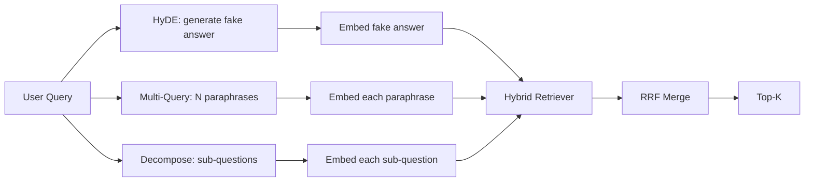

# 查询重写：HyDE、多查询和分解

> 用户输入的查询不是您的检索器想要的查询。重写弥补了检索之前的差距，因此索引看到的内容更接近答案。

**Type:** Build
**Languages:** Python
**Prerequisites:** 第 11 阶段课程 04（Embedding）、06（RAG）；第 19 阶段 Track B 基础（第 20-29 课）；第 19 阶段第 64 和 65 课
**Time:** ~90 分钟

## 学习目标
- 实现假设文档Embedding (HyDE)：生成一个假答案，Embedding它，根据该Vector而不是查询Vector进行检索。
- 实现多查询扩展：将一个查询重写为N个释义，逐个检索，通过倒数等级融合合并并集。
- 实现查询分解：将复杂问题拆分为子问题，按子问题检索，合并。
- 比较三位重写者在一场比赛中的表现，并解释每种策略何时获胜。
- 连接一个模拟 LLM，产生确定性的固定输出，以便重写器循环离线运行。

## 问题

用户输入“当上传失败且预算耗尽时，我们的团队会做什么？”。语料库里有一篇文档写着：“AbortMultipartOnFail 会中止进行中的 S3 分段上传，并在上传失败时减少每个 bucket 的重试预算”。查询和文档没有共享名词短语。BM25 未命中。双编码器把文档排在第三或第四，因为查询Vector落在Embedding空间中更偏向“取消任务”文档的区域，而不是“中止上传”文档的区域。如果答案已经进入前 N 名，第 66 课的两阶段重排可以救回来；但如果它根本没有进前 N 名，重排器就永远看不到它。

修复方法是在查询触及检索器之前重写查询。2023 年论文 “Precise Zero-Shot Dense Retrieval without Relevance Labels”（Gao 等人）介绍了 HyDE：要求 LLM 编写一篇能够回答查询的文档，Embedding这篇假设文档，并把它的Embedding用作检索Vector。假设文档会落在Embedding空间中正确的区域，因为它是用语料库的语气写出来的。原始查询Vector则不是。

两种近亲技术与 HyDE 相结合。多查询扩展（使用 Microsoft 的 GraphRAG 术语）生成查询的 N 个释义并检索每个释义，然后合并。分解（在 2024 年斯坦福 DSPy 工作中流行为“子查询分解”）将“当上传失败且预算耗尽时我们的团队会做什么”分为两个问题：“上传失败时会发生什么”和“重试预算耗尽时会发生什么”。两次检索，一次合并结果，两部分答案均可达。

本课程将实现这三个项目，并针对相同的固定语料库运行它们。

## 概念



### HyDE 详细信息

HyDE 用 LLM 编写的假设文档Vector替换用户的查询Vector。提示很短：

```text
You are a domain expert. Write a one-paragraph passage that answers the question
below. Use the same vocabulary and phrasing the documentation in this domain would
use. Do not refuse. Do not say you do not know.

Question: {user_query}

Passage:
```

LLM 的答案作为事实答案是错误的，因为 LLM 不知道你的语料库。那很好。检索器不关心事实正确性，只关心 token 分配。假设段落包含 “abort”、“multipart”、“bucket”、“budget” 等词语，因为这些词会出现在该主题的真实文档段落里。Embedding该段落。Vector会落在真实段落附近。

在生产中，您将假设的文档限制为两到三个句子。较长的假设会收集更多的噪音。较短的单词会失去 HyDE 所需的词汇信号。

### 多查询扩展详解

生成用户查询的 N 个释义。最简单的提示：

```text
Rewrite the following question in {N} different ways. Each rewrite must preserve
the original intent. Number them 1 to {N}. Do not add explanations.
```

检索每个释义的 top-k。将 N 个排名列表与 RRF 合并（与第 65 课中的算法相同）。廉价、并行、确定性。

当用户的措辞是提出问题的许多同样有效的方式之一时，多查询获胜，并且任何重写都会更好地提出它。当所有重写都同样糟糕时就会失败，因为原始版本同样糟糕。

### 详细分解

单一检索无法满足多方面的问题。分解要求 LLM 将问题拆成子问题，系统再检索每个子问题。提示：

```text
The following question may require information from multiple distinct topics.
Decompose it into a list of sub-questions. Each sub-question must be answerable
independently. If the question is already atomic, return it unchanged.

Question: {user_query}
```

检索每个子问题。合并。对于包含连词、多从句比较或两个不相关主题的问题，分解是正确的工具。原子问题的工具错误；分解器的工作是返回单个问题，而不是发明假子问题。

### 为什么这三个都存在

三者是互补的。HyDE 弥补查询 token 与语料库 token 之间的差距。多查询覆盖释义方差。分解覆盖多主题查询。生产系统会运行这三种策略，并为每个查询选择合适策略（第 69 课的端到端系统会展示选择器）。

## 模拟 LLM

该课程离线进行。模拟 LLM 是一个以用户查询为关键的小型查找表，以及未见过的查询的后备。查找表包含：

- 对于每个 fixture 查询：书面假设段落、三个释义和分解结果。
- 对于未知查询：确定性转换：获取查询的内容词，通过同义词映射对其进行扩展，然后返回结果。

模拟的形状才是重要的，而不是数据。在生产中，您将模拟替换为真实的模型调用。检索器不会改变。

```figure
cd-hyde-vector
```

## 构建它

`code/main.py` 实现：

- `MockLLM` - 上述确定性替代。
- `HyDERewriter` - 调用LLM编写假设文档，将重写器输出返回为`RewriteResult`，其中包含假设文本和检索器应使用的查询。
- `MultiQueryRewriter` - 调用LLM进行N个释义，返回查询列表。
- `DecomposeRewriter` - 调用LLM进行分解，返回子问题。
- `retrieve_with_rewriter` - 采用重写器和检索器，运行重写，融合结果。
- 一个演示，在fixture上运行三个重写器并打印哪个策略首先返回黄金答案文档。

重复使用第 65 课中的检索器形状（混合 BM25 + dense）。融合仍然是相同的 RRF。唯一的新形状是重写器接口，它很小。

运行它：

```bash
python3 code/main.py
```

输出是每个策略的排名和最终摘要。 HyDE 在措辞不匹配的查询中获胜。多查询在释义方差查询上获胜。分解在多主题查询上获胜。后备方案（无重写器）至少在三者之一上失败。

## 演示将隐藏的故障模式

**HyDE 对语料库特定标识符的幻觉是错误的。** 该模型发明了一个函数名称。右侧文档的假设 BM25 分数崩溃了，因为发明的名称现在是一个高权重token，未出现在索引中。限制融合中假设的长度和重量 BM25 较低。

**多查询重写全部收敛。**弱模型会产生三个几乎相同的释义。 N 次检索返回相同的 top-k。 RRF 合并并不比单个检索好。在重写提示中添加显式多样性指令并通过 Jaccard 检测重复项。

**分解过度分割。**分解器将原子问题变成列表。检索全部返回相同的文档，但排名降低。合并后的效果比原来的要差。在扇出之前通过“这些子问题是否足够独特”来检测这一点。

**延迟成倍增加。** HyDE 需要花费一次 LLM 通话费用。多查询花费一次 LLM 调用来生成 N 次重写，然后生成 N 次检索。分解需要一次 LLM 调用来分解，然后进行 M 次检索。检索并行进行； LLM 电话是发言权。

## 使用它

生产模式：

- 按查询长度选择每个查询策略：原子短查询得到多查询，复杂的多子句查询得到分解，行话重的查询得到 HyDE。
- 通过查询哈希缓存重写器输出。许多查询重复。
- 并行运行所有三个结果集，并使用 RRF 将三个结果集融合为一个。费用为3次LLM调用和1次融合；质量是所有三种策略覆盖范围的结合。

## 发货

第 69 课会把该重写器阶段接到第 65 课的检索器之前，并放在第 66 课的重排器之前。第 68 课评估重写器给检索 recall 带来的提升。

## 练习

1. 实现 RAG-Fusion（多查询的 2024 年变体），其中重写器的释义有意多样化，然后重新排序步骤（第 66 课）选择最终列表。
2. 添加第四种策略：step-back prompting（向 LLM 询问更一般的问题，检索该问题，然后再缩小范围）。在 fixture 上进行比较。
3. 通过添加“问题是原子的”头来训练分解器识别原子查询。测量前后的过分率。
4. 用真实的模型调用替换模拟 LLM。测量堆栈上每个策略的延迟。
5.为每次重写添加置信度分数。将重写降低到阈值以下。衡量对回忆的影响。

## 关键术语

|术语 |人们怎么说|它实际上意味着什么 |
|------|-----------------|------------------------|
|海德 | “伪造文件检索”| LLM写出答案；Embedding并检索它而不是查询 |
|多查询 | “释义扩展”| N次重写查询；检索N次，按RRF合并|
|分解 | “子查询分割” |多主题查询拆分为子问题，单独检索 |
|原子查询 | “单一主题” |如果不发明假子问题就无法分解 |
|后退一步| “抽象查询”|提出更一般性的问题，检索，然后缩小范围 |

## 进一步阅读

- 高、马、林、Callan，“无相关标签的精确零样本密集检索”（HyDE），2023
- 微软研究院，“检索的多查询扩展”
- 斯坦福大学 DSPy，“多跳 QA 的子查询分解”
- [LlamaIndex 查询转换文档](https://docs.llamaindex.ai/en/stable/optimizing/advanced_retrieval/query_transformations/)
- 第 11 阶段第 07 课 - 高级 RAG 模式
- 第 19 阶段第 65 课 - 重写器提供的检索器
- 第 19 阶段第 68 课 - 测量重写器提升的评估
