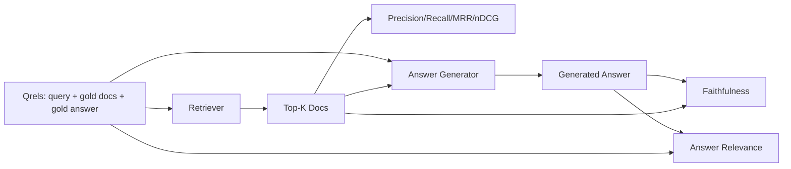

# RAG 评估：精确率、召回率、MRR、nDCG、忠实度、答案相关性

> 如果您无法同时对检索和答案进行评分，则无法运送系统。两者不是相同的指标，并且相同的提示在不同的轴上失败。

**Type:** Build
**Languages:** Python
**Prerequisites:** 第11期第06课（RAG）、10（评估）；第 19 阶段 Track B 基础（第 20-29 课）；第 19 阶段课程 64, 65, 66, 67
**Time:** ~90 分钟

## 学习目标
- 根据黄金 qrel 计算四个检索指标： precision@k、recall@k、MRR（平均倒数排名）和 nDCG@k。
- 计算两个答案等级指标：忠实度（每个主张都基于检索到的上下文）和答案相关性（答案解决了问题）。
- 构建一个由 eval 端到端读取的固定 qrels 文件（查询、黄金文档 ID、黄金答案文本）。
- 读取指标值以诊断管道出现故障的位置：检索、排名、生成或接地。

## 问题

RAG 系统至少有四个活动部分：分块器、检索器、重排序器、生成器。其中任何一个都可能导致错误答案。如果没有每个阶段的指标，你就会盲目前进。

用户报告错误答案。是因为分块器截断了答案跨度吗？是因为检索器没有把 chunk 放进 top-k 吗？是因为重排器把正确 chunk 推到了第一名之后吗？是因为生成器忽略该 chunk 并编造了内容吗？仅凭答案无法判断。你需要：

- 检索指标，用于对检索器的结果进行评分。
- 对指标进行排名，以对正确的块在顺序中的位置进行评分。
- 忠实地对生成器是否停留在检索到的上下文中进行评分。
- 答案与评分的相关性是否完全解决了问题。

本课程在 fixture qrels 文件之上构建所有六个指标。评估是离线且确定性的；在生产中，你会把模拟 LLM judge 换成真正的 judge。

## 概念



### 精度@k

在检索器返回的前 k 个文档中，黄金集中的比例是多少？如果 gold 有 3 个文档，并且 top-3 返回其中的两个文档和一个错误的文档，则 precision@3 为 2 / 3。当不相关的检索块的成本很高时（生成器在其上浪费token，或者该块破坏了答案），请使用精度。

### recall@k

在黄金文档中，top-k 占了多少部分？如果 gold 有 3 个文档，并且 top-5 包含所有这三个文档，则recall@5 为 1.0。当错过答案的成本很高时，请使用回忆（您宁愿看到一个额外的错误块，也不愿完全错过答案块）。

在生产 RAG 中，人们通常引用的指标是recall@k。生成可以很容易地删除不相关的块；它无法从它从未见过的块中发明出答案。

### MRR（平均倒数排名）

对于每个查询，找到排名列表中第一个相关文档的位置。排名的倒数为 1/位置。整个查询集的平均值。 MRR 是检索器将最佳答案置于顶部的程度的单个数字摘要。

MRR 对位置 1 的权重很大。黄金文档排名 1 的查询贡献 1.0。排名2贡献0.5。排名10贡献0.1。该指标以列表顶部为主。

### nDCG@k

标准化贴现累积收益。完整的公式为每个检索到的文档分配增益（通常为 1 表示相关，0 表示不相关），根据位置的对数进行折扣，求和，然后除以理想的 DCG（如果您排名完美，您将拥有的 DCG）。范围 0 到 1。

nDCG 适应分级相关性：黄金可以说“文档 A 是 3，文档 B 是 2，文档 C 是 1”。 MRR 和recall@k 将所有内容扁平化为二进制。当语料库每个查询有多个部分相关的文档时，请使用 nDCG。

### 忠诚

对于生成的答案中的每个声明，检查检索到的上下文是否支持该声明。标准实现使用 LLM 作为法官提示，该提示接受（声明、上下文）并返回“是”或“否”。该指标是通过的声明的比例。

忠诚度抓住了模型发明内容的生成器故障模式。即使检索器返回了正确的块，产生幻觉的生成器也会损坏。忠诚也称为基础、支持、归属。

本课程通过确定性模拟判断来实现忠实性，该判断检查每个声明的 token是否与检索到的上下文重叠阈值。在生产中，您切换到真实的模型调用。度量的形状是相同的。

### 答案相关性

答案是否真正解决了问题？忠诚问“答案是否基于上下文？”。答案相关性询问“答案是否基于问题？”。一个忠实但偏离主题的答案在忠诚度上得分较高，在相关性方面得分较低。一个简短的、切题的、忽略上下文的答案在相关性上得分很高，但在忠实度上得分很低。标准实现还使用LLM作为判断：采取（问题，答案）并询问答案是否解决了问题。本课实现了token重叠加判断替身。

## fixture qrel

```python
{
  "qid": "q1",
  "query": "what is the abort threshold for multipart uploads",
  "gold_doc_ids": ["d1", "d3"],
  "gold_answer_substring": "three failed parts",
  "graded_relevance": {"d1": 3, "d3": 2},
}
```

每个查询携带：
- 查询字符串，
- 一组黄金文档 ID（用于精确度/召回率/MRR），
- 分级相关性字典（对于 nDCG），
- 黄金答案子字符串（作为每个 qrel 的参考元数据保存；本课中的忠实度是通过根据检索到的上下文而不是此子字符串来判断提取的声明来计算的）。

在生产中，您可以对这些进行token。本课程提供了一个手工构建的 fixture，因此评估可以开箱即用。

```figure
ci-rag-metric-ladder
```

## 构建它

`code/main.py` 实现：

- `precision_at_k(retrieved, gold, k)` - 字面定义。
- `recall_at_k(retrieved, gold, k)` - 字面定义。
- `mean_reciprocal_rank(retrieved_list_of_lists, gold_list)` - 查询的平均值。
- `ndcg_at_k(retrieved, graded_relevance, k)` - DCG / IDCG 具有二进制或分级增益。
- `extract_claims(answer)` - 将答案分成句子形状的主张。
- `faithfulness(claims, context_texts, judge)` - 被判定支持的索赔的一部分。
- `answer_relevance(question, answer, judge)` - 判断答案是否解决问题。
- `MockJudge` - 确定性token重叠判断，以便评估离线运行。
- `evaluate_pipeline(pipeline_fn, qrels, ks)` - 运行每个指标的协调器。
- 针对 qrel 运行三种管道变体（分块基线、混合检索、混合 + 重新排名）并打印指标表的演示。

运行它：

```bash
python3 code/main.py
```

输出显示单个指标表中每个变体的 precision@k、recall@k、MRR、nDCG@k、忠实度和答案相关性。混合检索行在召回方面击败了分块器基线；重新排序行在 MRR 上击败了混合行。

## 读取指标来诊断故障

|症状|可能的原因 |修复什么问题 |
|---------|-------------|-------------|
|低召回率@k，低精度@k |分块剪切答案或检索器找不到它 |分块边界（第 64 课）或检索器模态（第 65 课） |
|不错的召回率@k，低 MRR |右块位于 top-k 中但不在位置 1 |重新排序（第 66 课）|
|高MRR，低忠诚度|尽管上下文正确，生成器仍然发明内容 |生成提示；强制引用或拒绝 |
|忠诚度高，相关性低 |答案有根据但偏离主题 |查询重写器（第 67 课）或生成提示 |
|均四高，用户仍抱怨|评估集不具有代表性 |使用真实用户查询扩展 qrels |

## 演示将隐藏的故障模式

**LLM-as-judge 偏差。**模型判断自己的输出时，往往会认为它比实际情况更忠实。使用与生成器不同的模型系列进行判断，或对样本进行手动分级。

**Qrel 腐烂。** 随着语料库的变化，黄金答案也会发生变化。 2024 年 1 月第一季度的黄金文档在 2024 年 10 月不再是正确答案，因为团队重新命名了该函数。安排季度 qrels 审查。

**忠诚度微观检查错过了宏观声明。** 每句话的忠诚度可能会通过，而整体答案的结构会产生误导。在自动化指标之上添加样本级定性审查。

**Recall@k 掩盖了每个查询的失败。** 90% 的平均召回率可以隐藏一个查询类总是丢失的情况。按查询类（文字、释义、多主题）对 qrel 进行切片并按切片报告。

## 使用它

生产模式：

- 对每个检索器或生成器更改运行评估。将recall@k回归视为测试失败。
- 保留每个查询的指标跟踪。当用户抱怨时，查找匹配的 qrels 条目，看看它是否会被捕获。
- 对 qrel 进行分层：在 CI 中运行的 20 个查询的烟雾集；每晚运行的 200 个回归集；每周运行 2000 个深组。

## 发货

第 69 课连接整个管道（分块器、检索器、重排器、生成器），并针对端到端系统运行此评估。

## 练习

1. 添加第五个检索指标：hit-rate@k。将其与recall@k 进行比较。当它们不同时进行解释。
2. 实行分级忠诚度：0（不支持）、1（部分支持）、2（完全支持）。相应地更新指标。
3. 用真实的模型调用替换模拟判断。衡量模拟裁判和真实裁判之间在比赛中的分歧。
4. 添加查询类切片（“字面”、“释义”、“多主题”）。报告每片指标。
5. 添加“答案长度”指标并将其与忠诚度相关联。绘制曲线。

## 关键术语

|术语 |人们怎么说|它实际上意味着什么 |
|------|-----------------|------------------------|
|精度@k | “命中率超过检索” | top-k 中黄金的比例 |
|recall@k | “命中了 gold 吗”| top-k 中包含 gold chunk 的比例 |
| MRR | “第一击位置”| 1 的平均值/第一个相关文档的排名 |
| nDCG@k | “分级排名质量”| top-k 上的 DCG 除以理想 DCG |
|诚信| “接地气” |检索到的上下文支持的答案声明的比例 |
|答案相关性 | “它解决了这个问题吗？” |答案是否符合问题的意图 |
|问题 | “金标”|带标签的查询集及其黄金文档和答案 |

## 进一步阅读

- Buckley, Voorhees，“评估评估测量稳定性”，SIGIR 2000 - 关于排名指标的规范论文
- Jarvelin、Kekalainen，“IR 技术的基于累积增益的评估” - nDCG 论文
- [Ragas：RAG 管道的自动评估](https://docs.ragas.io)
- [人择，评估 RAG](https://www.anthropic.com/news/evaluating-rag)
- 第 11 阶段第 10 课 - 评估框架基础
- 第 19 阶段课程 64-67 - 此处评估组件
- 第 19 阶段第 69 课 - 本次评估评分的端到端管道
