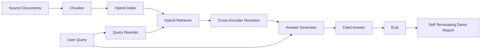

# 端到端 RAG 系统

> 组件的六课。一根管道。一个评估循环。一个自动终止的演示。这是您交付的系统。

**Type:** Build
**Languages:** Python
**Prerequisites:** 第11期第06课（RAG）、10（评估）；第 19 阶段 Track B 基础（第 20-29 课）；第 19 阶段课程 64, 65, 66, 67, 68
**Time:** ~90 分钟

## 学习目标
- 将分块器、混合检索器、查询重写器、跨编码器重排序器和答案生成器组合成单个端到端管道。
- 实现一个答案生成器，通过块锚点引用其声明，并具有低置信度拒绝回退功能。
- 针对组装好的管道运行第 68 课的评估，并证明分阶段构建在每个指标上都优于单独的相同组件。
- 构建一个自动终止的 CLI 演示，该演示会摄取固定语料库，运行固定的查询集，并以摘要报告退出零。

## 问题

孤立的六个成分不能证明什么。分块器可以在recall@5上战胜语料库，但在系统的recall@5上失败，因为检索器无法对分块器发出的内容进行排名。重排序器可以提高合成候选池上的 MRR，但无法处理真正的双编码器候选物，因为重排序预算下双编码器的召回率太低。查询重写器可以在单个查询上提升黄金文档，并在下一个查询上中断，因为 LLM 模拟返回退化假设。

集成测试是整个管道针对相同的 fixture qrel 端到端运行，具有相同的指标，并使用一个将所有内容连接在一起的编排器文件。这就是本课的内容。如果集成管道的指标优于每个阶段的独立演示的指标，则您已经证明了该系统。

## 概念



### 接线选择

管道是一个小图。每个阶段都是一个具有清晰签名的函数。

|舞台|输入|输出|
|-------|-------|--------|
|块块|文档正文 |块记录列表 |
|检索器 |查询字符串 | Top-N chunk 记录 |
|重写器（可选）|查询字符串 |重写列表+假设|
|重新排序 |查询，候选人 |带有交叉分数的 Top-K 块记录 |
|发电机|查询，top-K Chunk 记录 |带有引文的答案字符串 |

当每个签名稳定时，组合就很简单。本课程的 `Pipeline` 类包含五个阶段和按顺序运行它们的 `query` 方法。每个阶段都是可交换的：传入不同的分块器、检索器、重写器、重排器或生成器，管道仍然可以运行。

### 带引文的答案生成器

发电机是最后一级，也是最容易损坏的。本课程提供了一个确定性模拟生成器，该生成器：

1. 取出前 K 个重新排序的块。
2. 最多选择两个文本包含与查询重叠程度最高的内容 token 的块。
3. 发出一个答案，该答案是每个选定块中的一个句子的串联，每个句子后跟一个 `[doc_id:chunk_index]` 锚点。
4. 如果没有块重叠高于拒绝阈值，则发出“我不知道”且不带引用。

在生产中，您可以使用提示模板将模拟替换为真正的 LLM 调用：

```text
You are answering a question using only the snippets below.
Cite every claim with the anchor in parentheses.
If the snippets do not answer the question, say "I do not know".

Question: {query}

Snippets:
{enumerated chunks with anchors}

Answer:
```

低置信度拒绝路径是记录跨编码器排名 1 分数的全部原因。如果它低于语料库阈值，则生成器会拒绝。这是防止幻觉答案的安全阀。

### 自终止演示

该演示端到端地运行所有内容。它打印一个查询的每阶段细分，对四个固定 qrel 运行评估，打印指标表，如果第 68 课的所有指标都满足演示中设置的阈值，则以状态零退出。如果任何指标低于阈值，演示将退出并显示非零状态，并显示一条消息，指出失败的指标。

这就是 CI 冒烟测试的形式。该管道离线运行、快速、确定。fixture 的阈值故意严格，因此六节课程中任何一课的回归都会导致演示失败。

```figure
rag-pipeline-flow
```

## 构建它

`code/main.py` 实现：

- `Chunk` - 贯穿所有阶段的记录（使用 chunk_index 和源 doc_id 扩展第 64 课的形状）。
- `Chunker` - 从第 64 课中选择策略（默认递归分割）。
- `HybridIndex` - 捆绑 BM25 + 密集 + RRF 来自第 65 课。
- `Rewriter`（可选）- 根据查询长度和连词的存在从第 67 课中选择 HyDE、多查询、分解之一。
- `Reranker` - 第 66 课中训练过的交叉编码器，使用较小的 fixture 训练集，因此可以在几秒钟内收敛。
- `Generator` - 具有引用和低置信度拒绝的确定性模拟生成器。
- `Pipeline` - 使用返回 `Result(answer, top_k, latency_ms_per_stage)` 的 `query(question)` 方法组成五个阶段。
- `run_demo()` - 摄取语料库，运行三个 fixture 查询，运行评估，打印结果，并按阈值设置退出代码。

运行它：

```bash
python3 code/main.py
```

输出是一段打印的查询 trace、完整评估表和最终通过/失败状态。在默认 fixture 上返回退出代码 0。

## 演示将隐藏的故障模式

**分块器边界漂移。** 如果您在 eval qrels token过程和演示之间交换分块器策略，黄金文档 ID 不再排列。将 chunker 策略锁定在 qrels 文件中。该演示包含一个命名分块器的标头。

**Reranker 训练集泄漏到 eval 中。** 第 66 课中的 14 个训练三元组包括类似于 eval 查询的查询。在生产中，严格保留评估查询。该演示的评估查询故意与重新排序训练集脱节。

**模拟生成器隐藏了幻觉风险。** 模拟无法产生幻觉，因为它只从检索到的块中发出文本。本课程注意到了这一点，并指出了实际模型的生产换入路径。

**无流式传输。** 管道在每个阶段结束时返回完整答案。生产系统将传输发电机的输出。流媒体超出范围；无论哪种方式，答案等级指标都会对最终字符串起作用。

**延迟是离线的。** 模拟 LLM 调用是恒定时间。真正的LLM电话占主导地位。在请求范围内规划延迟预算；本课程的每阶段计时仅测量 CPU 工作。

## 使用它

生产模式：

- 将管道文件发送到具有明确阶段接口的一个编排器下。避免将布线分布在存储库中。
- 在每次涉及阶段的合并之前运行 eval。如果 eval 下降，则合并不会落地。
- 保留每次 CI 运行的指标跟踪，以便您可以将回归归因于阶段交换。
- 添加 20 个查询的烟雾集（回归集的子集），运行时间不超过 30 秒；完整的回归集每晚运行。

## 发货

本课程中的管道文件是第 19 阶段 Track F 课程其余部分所采用的形状。后续课程将添加摄取自动化、增量重新索引、遥测和顶部服务层。检索、重新排序、重写和评估部分已在此完成。

## 练习

1. 在重写器中添加每个查询策略选择器：第 67 课的启发式（长度、连词、行话比例）选择 HyDE、多查询或分解。
2. 在 env 标志后面添加对生成器的真正 LLM 调用。默认为模拟。测量延迟增量。
3. 扩展演示以获取加载真实语料库的 `--corpus path` 标志。重新运行评估和阈值检查。
4. 向分块器添加 `--strategy` 标志。衡量每个策略对端到端 recall 的贡献。
5. 添加流生成器接口并将其输入到 eval 中。确认忠实度是根据最终字符串而不是流式前缀计算的。

## 关键术语

|术语 |人们怎么说|它实际上意味着什么 |
|------|-----------------|------------------------|
|管道| “RAG 管道”|从摄取到引用答案的撰写阶段|
|引文锚| “来源链接” |每个声明附加的 (doc_id, chunk_index) 引用 |
|低置信度拒答| “我不知道” |当重排器 top-1 分数低于阈值时，生成器不返回答案 |
|smoke set | “CI 评估”|每次 PR 检查中运行的最小 qrels 子集 |
|阶段接口| “函数签名”|各个管道阶段的稳定输入输出类型 |

## 进一步阅读

- [人择、建筑搜索与检索](https://www.anthropic.com/news/contextual-retrieval)
- [Pinterest，MCP 内部搜索](https://medium.com/pinterest-engineering) - 参考生产架构
- [Ragas：RAG 管道的自动评估](https://docs.ragas.io)
- 第 11 阶段第 06 课 - RAG 基础知识
- 第 19 阶段课程 64-68 - 此处组成的组件
