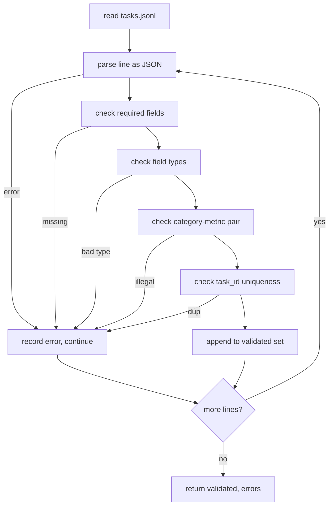

# 任务规范格式

> 评估安全带的好坏取决于其任务履行的合同。在编写单个评分函数之前，请冻结 JSONL 形状和度量词汇。

**Type:** Build
**Languages:** Python
**Prerequisites:** 19期B轨地基
**Time:** ~90 分钟

## 学习目标

- 定义一个 JSONL 任务记录模式，以一种形式涵盖算术、多项选择、代码执行、分类和自由文本摘要。
- 固定度量名称的封闭词汇表，以便下游课程 (71-73) 可以在单个字段上分派。
- 将少数样本示例和后处理规则指定为任务的一部分，而不是runner 的一部分，因此相同的提示会在模型之间产生相同的目标。
- 实施严格的验证器，在格式错误的记录到达运行器之前将其拒绝。
- 发布一个包含 10 个任务的 fixture集，用于测试规范的每个分支，以便验证器有一些真正的东西可以咀嚼。

```figure
ci-task-spec-gate
```

## 为什么要冻结规格

研究代码库积累 eval 脚本的速度比积累测试的速度还要快。六个月后，每个笔记本都有自己的 JSON 形状，每个指标都被重新实现两次，并且无法在运行之间进行比较。修复很无聊。选择一个模式。编写一个验证器。拒绝其他一切。这就是本课的作用。

该形状借鉴了 BIG-bench、HELM 和 lm-eval 风格线束的想法，但字段名称是我们的。每个字段都有一个所有者。runner读取任务。指标读取目标。后处理步骤使生成正常化。管道中没有字段是可变的。

## 记录形状

任务是单行上的 JSON 对象。线束读取 `tasks.jsonl` 并独立验证每条线。坏线会中止该记录，而不是运行。

```json
{
  "task_id": "arith_001",
  "category": "arithmetic",
  "prompt": "Compute the result. Question: 17 + 24\nAnswer:",
  "targets": ["41"],
  "metric_name": "exact_match",
  "few_shot_examples": [
    {"prompt": "Question: 2 + 2\nAnswer:", "completion": "4"}
  ],
  "post_process": "strip_whitespace",
  "metadata": {"difficulty": "easy"}
}
```

必填字段为 `task_id`、`category`、`prompt`、`targets`、`metric_name`、`post_process`。 `few_shot_examples` 和 `metadata` 是可选的。未知的顶级字段验证失败。

## 字段规则

`task_id` 是一个没有空格的字符串。验证器强制整个文件的唯一性。

`category` 是 `arithmetic`、`mcq`、`code_exec`、`classification`、`summary` 之一。该类别限制了哪个度量和后处理对是合法的。对于单字母目标，`code_exec` 任务必须使用 `metric_name = code_exec`，`mcq` 任务必须使用 `metric_name = exact_match`。

`prompt` 是一个非空字符串。验证器禁止尾随空格并拒绝提示正文中已包含少数镜头块的记录。少镜头渲染发生在runner身上，而不是作者身上。

`targets` 是一个非空字符串列表。对于 `exact_match`，任何匹配的元素都会计入。对于`f1`和`rouge_l`，得分最高的目标获胜。对于 `mcq`，列表仅包含一个元素。

`metric_name` 是 `exact_match`、`f1`、`bleu_4`、`rouge_l`、`accuracy`、`code_exec` 之一。词汇是封闭的。新的指标需要新的教训和新的条目。

`few_shot_examples` 是 `{prompt, completion}` 对的列表。验证器将列表限制为八个条目，以限制提示。

`post_process` 是 `none`、`strip_whitespace`、`lower`、`extract_letter`、`extract_code_block`、`extract_first_line` 之一。每个规则都有一个确定性行为。验证器禁止组合规则。

## 验证器行为



验证器返回两个列表：已验证记录和错误记录，其中包含违规行、违反规则和错误字段。如果错误列表非空，则运行器拒绝启动，除非设置了显式 `--allow-bad-tasks` 标志。

## 少镜头渲染

runner将提示前面的几个示例与空行分隔符连接起来。每个模型都运行相同的代码路径，因此唯一的差异来源是模型本身。作者编写一次示例，而不是每个提供者编写一次。

```python
def render(task):
    parts = []
    for ex in task.get("few_shot_examples", []):
        parts.append(ex["prompt"] + " " + ex["completion"])
    parts.append(task["prompt"])
    return "\n\n".join(parts)
```

## 后处理规则

后处理步骤在生成之后、指标之前运行。它是确定性的和无状态的。

- `none` 返回字符串不变。
- `strip_whitespace` 去除前导和尾随空白。
- `lower` 小写字符串。
- `extract_letter` 返回与 `[A-E]` 匹配的第一个字符，用于 MCQ。
- `extract_code_block` 返回第一个三重反引号隔离块的主体，用于代码执行。
- `extract_first_line` 返回第一个非空行，用于汇总分类。

需要此列表之外的规则的任务属于新课程。

## 本课不做什么

它不得分。它不调用模型。它不运行代码。这些内容出现在第 71、72 和 75 课中。本课冻结了他们所有人都遵守的合同。

10 个任务 fixture 覆盖两个算术项、两个 MCQ 项、两个代码执行项、两个分类项和两个摘要项。验证器通过所有 10 条规则。一个单独的 fixture (`tasks_bad.jsonl`) 会触发每条规则，并且验证器返回的错误数量恰好与这些错误相同。

## 如何阅读代码

`main.py` 定义了 `TaskSpec`、`validate_task`、`validate_file` 和 CLI 入口点。fixture 加载器是 `load_fixtures`。渲染和后处理 helper 位于验证逻辑旁边，因此第 75 课中的 runner 只需导入单个模块。

从上到下阅读 `main.py`。然后读取 `code/tests/test_spec.py`。测试会固定每个验证规则和每个后处理行为。`main.py` 底部的演示会验证捆绑的 fixture 并打印摘要。

## 更进一步

真正的评估套件以模式增长列的方式增长类别。清醒的举动是拒绝添加类别而不添加指标、后处理规则和至少一个固定任务。将规范视为数据库迁移。每项更改都会经过审核、版本控制并进行测试。本课中的验证器是门。
