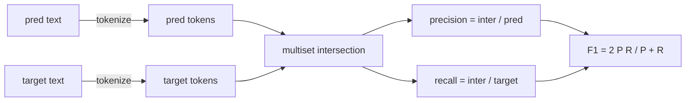
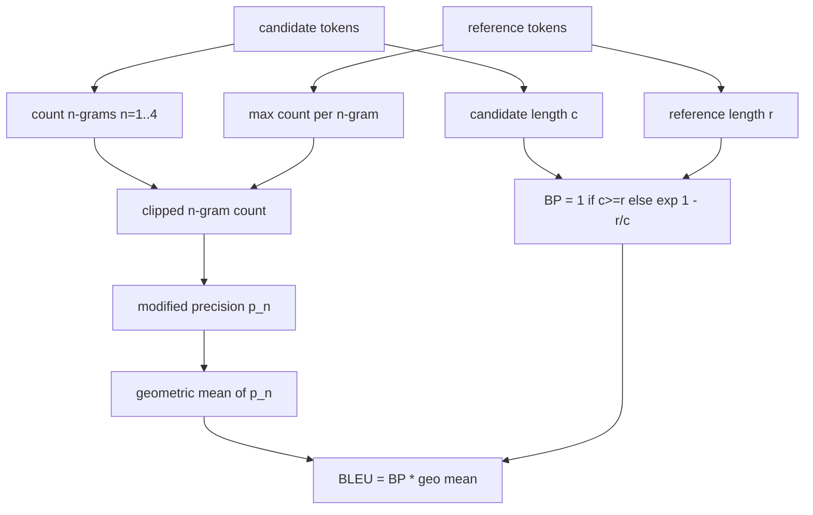

# 经典指标

> BLEU、ROUGE-L、F1、精确匹配、准确率。五个指标仍然占据大多数已发布的 LLM 评估数字。从第一性原理实现每个指标，这样你才知道数字的含义。

**Type:** Build
**Languages:** Python
**Prerequisites:** 第 19 期 Track B 基础，第 70 课
**Time:** ~90 分钟

## 学习目标

- 通过明确的 token化规则实现token级精确匹配、F1 和准确性。
- 从头开始​​实施 BLEU-4：修改 n 元语法精度，n 的几何平均值等于 1 到 4，简洁性损失。
- 使用最长公共子序列以及精度和召回率的 F-beta 组合来实现 ROUGE-L。
- 调度第 70 课中的 metric_name 字段，以便runner保持与指标无关的状态。
- 使用从工作示例而不是第三方库中提取的参考Vector来固定行为。

```figure
cd-bleu-overlap
```

## 为什么要重新实现

您将阅读报告 BLEU 28.3 的论文和另一篇报告 BLEU 0.283 的论文。您会发现两个库的 ROUGE-L 分数相差 10 分，因为一个库截断为小写，而另一个库则不截断。停止混淆的最快方法是自己编写指标，然后指向决定token器的行和应用平滑的行。之后，比较论文之间的数字就变成了阅读度量设置的问题，而不是争论图书馆。

Stdlib加上numpy就足够了。 BLEU 是计数和钳位。 ROUGE-L 是动态规划。 F1 是token上的集合交集。最困难的部分是选择token器并致力于它。

## token化

Tokenizer是 `re.findall(r"\w+", text.lower())`。小写、字母数字运行、删除标点符号。本课程中的每个指标都使用这个精确的Tokenizer。runner没有选择权。如果您交换Tokenizer，您将运行不同的基准测试。

```python
TOKEN_RE = re.compile(r"\w+", re.UNICODE)
def tokenize(text):
    return TOKEN_RE.findall(text.lower())
```

这是有意的简化。生产设置将关心 CJK、缩写和代码标识符。本课的要点是，token生成器是一个合约，而不是一个旋钮。

## 精确匹配

```python
def exact_match(pred, targets):
    return float(any(pred.strip() == t.strip() for t in targets))
```

每个任务返回 1.0 或 0.0。数据集的聚合就是平均值。这是算术、MCQ 和短分类任务的主力。

## token级F1

设置用于预测和目标的 token多重集。精度是多重集交集除以预测的多重集。召回率是相同的交集除以目标的多重集。 F1 是调和平均值。该实现处理空预测和空目标边缘情况。



对于多目标任务，我们在目标列表中选择最好的 F1。这与文献中广泛报道的 SQuAD 式行为相符。

## BLEU-4

BLEU 是规范的机器翻译指标，它仍然出现在摘要工作中。我们使用的公式是语料库级别的 BLEU-4，具有标准简洁性惩罚和对修改后的 n 元语法计数进行加法一平滑，因此单个缺失的 4 元语法不会将分数推至零。

对于每个候选-参考对，我们对 n 等于 1、2、3、4 时的修改后的 n 元语法精度进行计数。修改后的精度通过任何参考中该 n 元语法的最大计数来剪辑候选 n 元语法计数，因此候选者不能通过重复一个短语来膨胀。四个精度的几何平均值受到简洁性惩罚的影响。



平滑规则是 Lin 和 Och 所说的方法 1：在取对数之前，将每个 n 元精度的分子和分母都加 1。当引用没有匹配的 4-gram 并保持接近长候选的未平滑值时，这可以避免 `log 0`。

## 胭脂-L

ROUGE-L 比较候选token序列和参考token序列的最长公共子序列。 LCS 捕获词序而不强制连续性，这就是为什么它是默认的摘要度量。我们使用标准动态规划表计算 LCS 长度，然后导出召回率 `lcs / reference length`，精度为 `lcs / candidate length`，并与 F-beta 结合，其中对称 F1 形式的 beta 等于 1。

```python
def lcs_length(a, b):
    n, m = len(a), len(b)
    dp = numpy.zeros((n + 1, m + 1), dtype=int)
    for i in range(n):
        for j in range(m):
            if a[i] == b[j]:
                dp[i+1, j+1] = dp[i, j] + 1
            else:
                dp[i+1, j+1] = max(dp[i+1, j], dp[i, j+1])
    return int(dp[n, m])
```

numpy 表使实现清晰易读；纯 Python 列表也可以工作。选择 ROUGE-L 的任务为每个任务支付 O(n m) 成本。对于保持在毫秒以下的典型摘要长度。

## 准确度

对于多目标分类任务，准确性会降低到与单个标准化目标的精确匹配。我们将其公开为单独的函数，以便调度程序可以在 `metric_name` 上进行调度，而无需在runner内进行字符串比较。

## 派遣合同

单一入口点是 `score(metric_name, prediction, targets)`。它返回 `[0, 1]` 中的浮点数。runner不会根据指标名称进行分支。它会转交呼叫并写入结果。这是第 75 课将粘合到第 70 课的任务规范的表面。

```python
def score(metric_name, pred, targets):
    if metric_name == "exact_match":
        return exact_match(pred, targets)
    if metric_name == "f1":
        return max(f1_score(pred, t) for t in targets)
    if metric_name == "bleu_4":
        return max(bleu4(pred, t) for t in targets)
    if metric_name == "rouge_l":
        return max(rouge_l(pred, t) for t in targets)
    if metric_name == "accuracy":
        return accuracy(pred, targets)
    raise ValueError(f"unknown metric_name: {metric_name}")
```

`code_exec` 在第 72 课中处理并插入那里的调度程序中。

## 本课不做什么

它不调用模型。它并没有使代标准化超出第 70 课中的后处理规则已经做到的范围。它不计算置信区间。它不执行 BLEURT 或 BERTScore（它们需要模型并且位于不同的课程中）。重点是底层：五个指标、一个token器、一个调度表。

## 如何阅读代码

`main.py` 将每个指标定义为一个自由函数加上调度程序。参考Vector位于文件底部的 `_reference_examples` 块中。该演示针对八个示例运行调度程序并打印每个指标的分数。 `code/tests/test_metrics.py` 中的测试固定参考Vector并强调每个边缘情况（空预测、空参考、无共享token、精确匹配、重复短语剪辑）。

从上到下阅读 `main.py`。这些功能按复杂程度排序。精确匹配和准确度各占一行。 F1是六行。 BLEU 和 ROUGE-L 是重点部分，它们包括对平滑规则和 LCS 递归的详细注释。

## 更进一步

经典指标是必要的，但还不够。他们奖励表面重叠而忽略意义。一旦您信任经典底层，解决方法就是将基于模型的指标分层（BLEURT、BERTScore、GEval）。那是后面的课了。现在：使这五个工作正常，通过测试固定它们，然后您就拥有了一个可审计、快速且可重复的指标堆栈。
