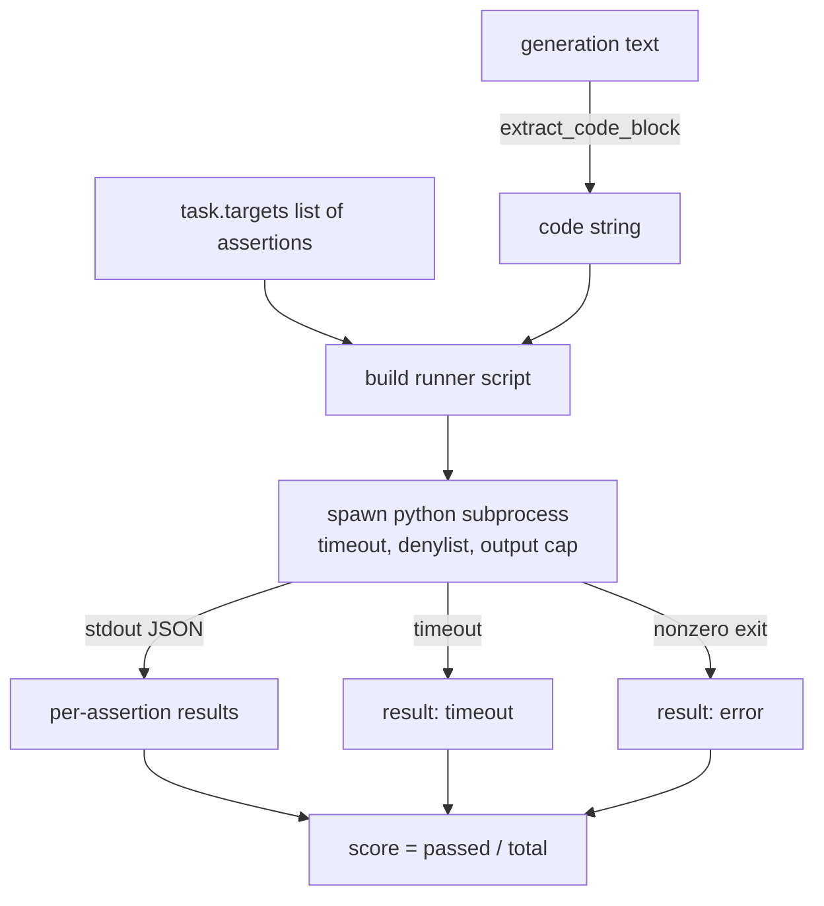
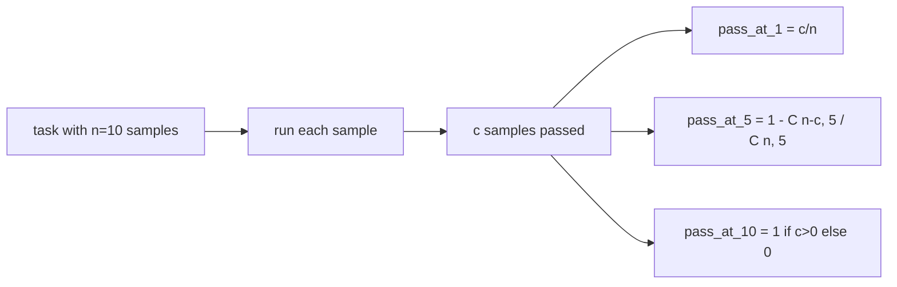

# 代码执行指标

> 生成的代码通过测试后是正确的。评估工具必须提取代码，在不使主机崩溃的情况下运行它，并诚实地统计通过率。本课将构建这个表面。

**Type:** Build
**Languages:** Python
**Prerequisites:** 第 19 期 Track B 基础，第 70 和 71 课
**Time:** ~90 分钟

## 学习目标

- 以与第 70 课中的后处理规则相匹配的方式从自由格式生成中提取代码块。
- 在具有挂钟超时、输出上限和导入拒绝列表的隔离子进程中执行候选代码。
- 根据所提供的断言字符串中通过候选者的分数来对任务进行评分。
- 计算从一个模型进行多代采样的任务的 pass-at-k。
- 将沙箱崩溃、语法错误和超时视为一流的失败模式，并具有runner可以记录的不同退出代码。

```figure
sandbox-runner
```

## 为什么需要一个孤立的子进程

内联`exec`存在安全和稳定性隐患。生成的 `while True: pass` 永远阻止 eval。生成的 `import shutil; shutil.rmtree('/')` 确实像听起来一样灾难性。解决方法是为每个候选生成一个新的 Python 解释器，在 stdin 上传递代码，将断言结果写入 stdout，并在溢出时终止该进程。主机 eval 进程继续运行。

HumanEval、MBPP、BigCodeBench 和 LiveCodeBench 等真正的评估都使用子进程沙箱。某些层 Docker 位于顶部。我们在子进程上停下来是有原因的：它是可移植的，它是 stdlib，并且它捕获了对教育评估至关重要的故障模式。生产部署添加了 seccomp、网络隔离和只读文件系统。关于强化的下一个教训是在这条轨道之外。

## 代码执行任务的形状

`code_exec` 任务携带 `targets` 中的断言字符串。运行器从生成中提取受隔离的代码块，围绕它构建测试工具，然后运行结果。



分数是 `[0, 1]` 中的分数。具有三个断言的任务，其中两次通过得分为 0.667。无论发生什么故障，runner都会返回相同的形状：子进程崩溃会映射到标准化错误代码，而不是向上冒泡到线束的 Python 回溯。

## 拒绝名单

拒绝列表是基于导入的。在运行候选代码之前，runner脚本会将危险模块的导入重写到引发 `ImportError("denied")` 的存根中。该列表故意保守：`os.system`、`subprocess`、`socket`、`requests`、`urllib`、`urllib.request`、`urllib.error`、`urllib.parse`、`ctypes`、`shutil`、 `http.client`、`asyncio.subprocess`。

我们不会假装这是刀枪不入的。确定的对抗性代码可以逃脱 Python 中的任何进程内沙箱。拒绝名单是一个后盾。挂钟超时和输出上限是负载控制。

```python
DENIED = {
    "os.system": True,
    "subprocess": True,
    "socket": True,
    "shutil": True,
    "requests": True,
    "urllib": True,
    "ctypes": True,
}
```

我们通过在前面添加 `import sys` 和一个通过猴子补丁 `os.system` 来引发的守卫来包装候选者。完整模板位于 `main.py` 中。

## 挂钟超时

每个子进程都有一个三挂钟秒的默认预算。runner使用`subprocess.run(..., timeout=t)`。如果超时，runner将捕获 `TimeoutExpired`，终止进程，并记录任务的 `timeout` 退出原因。该任务的分数为零。runner继续前进。

每个任务的超时可通过 `task.metadata.timeout_s` 进行配置。长时间运行的单元测试可能会要求更多；第 70 课中的验证器将该值限制为 30 秒，以保持套件的边界。

## 输出上限

子进程可能会淹没标准输出，耗尽主机内存。runner将 stdout 流式传输到缓冲区中，并在运行总数超过 256 KB 时立即终止子进程。结果记录为 `exit_code = error`，详细信息字符串为 `"output overflow"`。当一代人不小心编写了一个打印的无限循环时，这在实践中就会出现。

## 通过-k

Pass-at-k 是 HumanEval 和朋友使用的无偏估计器。给定每个任务的 `n` 独立样本和其中的 `c` 通过，来自 `n` 的大小为 `k` 的样本包含至少一个通过解决方案的概率为：

```text
pass_at_k(n, c, k) = 1 - C(n - c, k) / C(n, k)
```

当 `n - c < k` 时，分子未定义，值为 `1`。该实现直接处理边缘情况。我们在第 74 课中公开了 `pass_at_k(n, c, k)` 供排行榜层使用。



## 退出代码

runner返回每个任务的五个结果之一：

- 当每个断言通过时为 `pass`。
- `assertion_fail` 当代码运行但至少有一个断言失败时。
- `syntax_error` 当代码未导入或有语法错误时。
- `timeout` 当挂钟到期时。
- `error` 用于任何其他崩溃，包括拒绝列表命中和输出溢出（带有详细信息 `"output overflow"` 的溢出表面）。

分数仍然是零头。退出代码是元数据。下游课程可以决定是否将超时计为零或丢失数据。

## 本课不做什么

它不会给你一个真正的沙箱。它不会运行来自开放网络的不受信任的代码。它不处理有状态任务，例如文件 I/O 或网络调用。这些需要容器或 microVM。本课的重点是契约：一个独立的子进程、拒绝列表、超时、输出上限、干净的退出代码词汇和 pass-at-k 数学。

## 如何阅读代码

`main.py` 定义了 `extract_code`、`run_candidate`、`score_code_exec` 和 `pass_at_k`。子进程runner脚本构建为字符串，并作为 `-c` 传递给新的 Python 解释器。 `code/tests/test_exec.py` 中的测试针对从 HumanEval 风格中提取的工作示例执行了四个退出代码以及 pass-at-k。

从上到下阅读 `main.py`。流道模板是承重件。盯着断言循环，直到您可以预测它写回父进程的 JSON 信封。

## 更进一步

一旦子流程形状起作用，下一个问题就是可移植性。不同的 Python 版本在 Windows 上处理 SIGKILL 的方式不同。最干净的解决方法是将运行器放入 Docker 镜像中。接下来的事情是用真实的单元测试文件替换断言字符串，以便 eval 与生产 CI 的功能相匹配。此时停止调用断言字符串测试；它们是玩具测试，并且有玩具故障模式。
