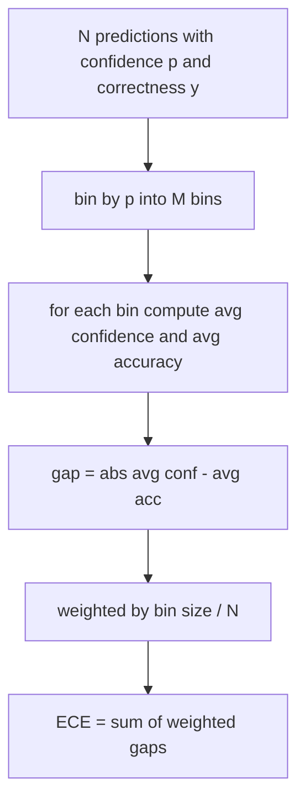
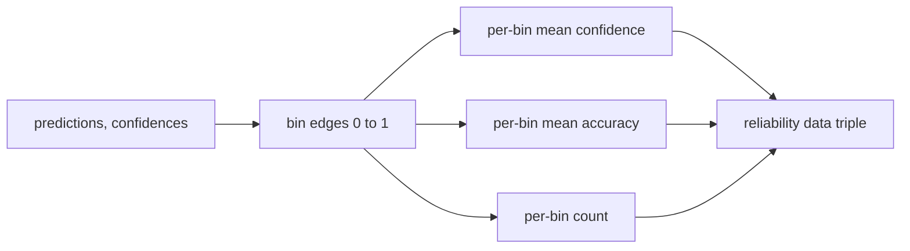

# 困惑度和校准

> 如果您的模型对 1000 个答案表示有 90% 的置信度，并且正确回答了 600 个，则表明它没有经过很好的校准。校准是值得信赖的评估的一半。另一半是困惑度，它告诉你模型是否认为保留的文本是可信的。

**Type:** Build
**Languages:** Python
**Prerequisites:** 第 19 期 Track B 基础，第 70 和 71 课
**Time:** ~90 分钟

## 学习目标

- 根据模型适配器提供的 token负对数概率计算保留语料库上的 token级困惑度。
- 根据分箱预测概率计算分类器或多项选择评估的预期校准误差 (ECE)。
- 计算 Brier 分数（针对正确性指标的均方误差）并解释它何时执行了 ECE 不执行的操作。
- 构建绘制置信度与准确度曲线所需的可靠性图数据。
- 将所有三个连接到评估线束中，以便runner可以将 `perplexity`、`ece` 和 `brier` 编号附加到模型报告中。

```figure
cd-reliability-diagram
```

## 困惑告诉你什么

困惑度是每个token 的指数平均负对数似然。越低越好。困惑度为 1 意味着模型为每个实际token分配概率 1。词汇量大小的困惑意味着模型是统一的并且没有学到任何东西。实际数字介于两者之间：WikiText-103 上的强大 2026 年基本模型大约为 8 到 12。同一文本上的一个坏的则为五十多。

该工具本身并不计算对数概率。这些来自模型适配器。该工具聚合：它获取每个token对数概率的列表、每个序列的 token计数列表，并返回语料库困惑度。

```python
def perplexity(neg_log_probs, token_counts):
    total_nll = sum(neg_log_probs)
    total_tokens = sum(token_counts)
    return math.exp(total_nll / total_tokens)
```

该实现处理零token边缘情况并断言负对数概率是非负的。一个常见的错误是忘记否定：返回 `log p` 而不是 `-log p` 的适配器会产生低于 1 的困惑度，这是不可能的。该函数将其视为违反合同行为。

## ECE 措施是什么

预期校准误差根据置信度将预测分组到固定数量的箱中，然后测量各箱的置信度和准确度之间的平均差距，并按箱大小加权。



标准公式在 `[0, 1]` 上使用 10 个等宽的 bin。该实现支持任何正整数计数。我们公开一个 `bins` 参数，以便运行者可以在发布约定 (10) 和比较约定 (15) 之间进行选择。

ECE 因箱数和样本大小而存在偏差。使用 10 个 bin 和 100 个预测，您无法区分 0.02 ECE 和随机噪声。该实现会返回填充的 bin 数量以及 ECE，因此运行者可以拒绝报告太少样本的单个数字。

## Brier 分数是 ECE 没有的

ECE只关心平均差距。如果模型对一半的数据箱过于自信，而对另一半的数据箱信心不足，则其 ECE 可能较低，同时本地校准也很差。 Brier 分数衡量每个预测的真实结果的平方误差，因此它直接惩罚传播。

对于二元结果，Brier 是 `mean((p_i - y_i)^2)`。它分解为可靠性、分辨率和不确定性。我们计算分数和分解。runner报告标量，但记录仪表板的分解。

```python
def brier(p, y):
    return float(np.mean((p - y) ** 2))
```

## 可靠性图数据

可靠性图根据每个箱中的经验准确性绘制了预测置信度。对角线是完美的校准。该函数返回三个数组：每个 bin 平均置信度、每个 bin 平均准确度和每个 bin 计数。绘图代码位于下游；本课停在数据形状上。



返回的元组是调用层绘制绘图或计算自定义 ECE 变体（自适应 ECE、扫描 ECE 等）所需的元组。我们返回 numpy 数组，因此下游代码不必进行转换。

## 置信来源

该工具不假设置信度来自 softmax。每次预测它接受 `[0, 1]` 中的任何数字。对于多项选择任务，自然置信度是 `softmax over option log-likelihoods`。对于自由文本，自然置信度是模型的自我报告概率或平均对数似然的指数。 eval 只是消耗数字。它从哪里来是适配器的工作。

## 边缘情况

- 所有预测都是错误的：ECE 是平均置信度，Brier 是高值，困惑度是模型对文本的看法。
- 所有预测均以高置信度正确：ECE 接近于零，Brier 接近于零。
- p=0.5 时完全不确定的预测因子：ECE 为 0.5 减去准确度，Brier 为 0.25 减去校正项。
- 空输入：ECE、Brier 和可靠性返回 `0.0`（或零填充数组）。对于零token情况，Perplexity 返回 `NaN`。这些路径均不会发出警告；runner检查这些值并决定是否报告或跳过。

这些案例被纳入测试中。真实基准测试中的真实模型不会击中它们，但有缺陷的适配器或小样本会击中它们，并且运行器不应该崩溃。

## 调度

校准不像 F1 那样是针对每个任务的指标。这是每个模型的报告。runner在整个评估过程中累积 `(confidence, correct)` 对，并计算一次 ECE、Brier 和可靠性数据。困惑度是在保留的文本语料库上计算的，与逐个任务的评分分开。

界面是：

```python
report = CalibrationReport.from_predictions(confidences, correct)
report.ece          # float
report.brier        # float
report.reliability  # tuple of three numpy arrays
report.populated_bins  # int
```

`PerplexityResult.from_token_nll(neg_log_probs, token_counts)` 返回每个token 的困惑度和平均负对数似然。

## 本课不做什么

它不调用模型。它没有实现softmax。它不估计输出token 的置信度；这是适配器的工作。它不进行温度缩放或普拉特缩放；这些是事后修复，存在于不同的课程中。本课的重点是让三个数字（困惑度、ECE、Brier）变得可信且可重复。

## 如何阅读代码

`main.py` 定义 `perplexity`、`expected_calibration_error`、`brier_score`、`reliability_diagram` 和 `CalibrationReport` / `PerplexityResult` 数据类。该演示运行在已知基本事实的综合预测上：一个校准良好的模型、一个过度自信的模型和一个不够自信的模型。 `code/tests/test_calibration.py` 中的测试固定每个边缘情况以及综合预测变量的参考值。

从上到下阅读 `main.py`。函数排序从标量到Vector进行报告。每个函数都有一个简短的文档字符串，其中包含数学和合同。

## 更进一步

校准是已发布的评估中最容易被忽视的轴。大多数排行榜都会报告一个准确度数字并称其为完成。一个在准确性上获胜而在 Brier 上失败的模型是比在准确性上得分低一些但可靠地报告其不确定性的模型更糟糕的生产部署。一旦校准管道就位，在保留的验证切片上添加温度缩放，重新计算 ECE，并观察间隙缩小。这是一个单独的课程，但地板就在这里。
