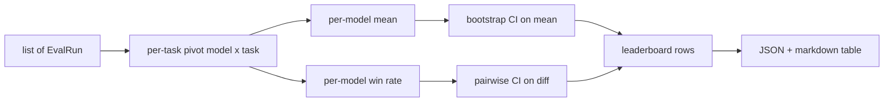
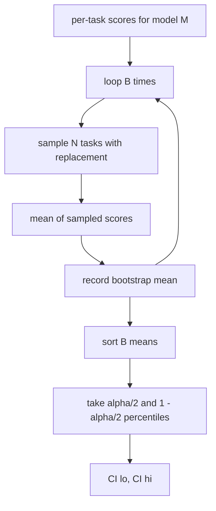

# 排行榜聚合

> 每个任务的分数很容易。跨异构任务的每个模型排名更加困难。千人预测排行榜上的统计显着性是每个人都会跳过的部分。本课不会跳过它。

**Type:** Build
**Languages:** Python
**Prerequisites:** 第19期B轨基础，第70、71、73课
**Time:** ~90 分钟

## 学习目标

- 将多个模型和多个任务的每个任务分数聚合到一个整洁的每个模型行中。
- 标准化异质分数，以便通过率和 BLEU 值不会过度影响总计。
- 按平均值和胜率对模型进行排名，并解释每个模型何时是正确的总结。
- 计算每个模型的平均得分和成对差异的引导置信区间。
- 将排行榜输出为 JSON 报告和 Markdown 表，第 75 课中的 runner可以将其粘贴到 CI 评论中。

```figure
ci-leaderboard-ci
```

## 输入的形状

聚合器使用 `EvalRun` 记录列表：

```python
@dataclass
class EvalRun:
    model_id: str
    task_id: str
    metric_name: str
    score: float          # in [0, 1]
    category: str
```

第 75 课中的 runner为每个 `(model, task)` 对发出一条记录。聚合器不关心分数是如何产生的。它期望标准化已经发生：每个分数都在 `[0, 1]` 中。

## 输出

出来三张表：



排行榜行包含：`model_id`、`mean_score`、`mean_ci_lo`、`mean_ci_hi`、`win_rate`、`tasks_completed` 以及用于每个类别平均值的可选 `categories` 地图。

## 标准化

如果一个任务的得分为 `[0, 1]`，另一个任务的得分为 `[0, 100]`，则第二个任务默默地主导平均值。聚合器验证每个输入分数是否位于 `[0, 1]` 中，否则拒绝运行。修复位于上游：该指标应该已经返回一个分数。第 71 至 73 课强制执行该契约。

## 平均值和胜率

这两种排名方案服务于不同的目标。

平均分数是一个模型每项任务分数的平均值。这是标题数字排行榜报告。它对异常值和任务不平衡很敏感。

胜率计算模型在同一任务上击败其他所有模型的频率。对于每项任务，得分最高的模型获胜（平分）。获胜率等于获胜次数除以模型得分的任务数量。它对异常值和尺度差异不太敏感，但会丢失信息。

```python
def win_rate(model_id, runs_by_task, all_models):
    wins, total = 0, 0
    for task_id, runs in runs_by_task.items():
        scores = {r.model_id: r.score for r in runs if r.model_id in all_models}
        if model_id not in scores:
            continue
        total += 1
        best = max(scores.values())
        if scores[model_id] >= best:
            wins += 1
    return wins / total if total else 0.0
```

harness 会同时报告两者。第 75 课中的 runner 默认按平均排名排序；胜率的 Markdown 列也保留在那里，以便用户偏好这种视角时使用。

## 自举置信区间

每个模型均值具有通过对任务进行引导重采样估计的置信区间。我们通过替换对任务 ID 进行重新采样，计算重新采样集的平均值，重复 `B` 次，并在 `alpha` 级别获取百分位间隔。



对于成对比较，我们引导每个任务的差异 `score_A - score_B`，获取百分位数间隔并报告它。用户读出间隔是否不包括零。如果确实如此，则差异在 alpha 水平上显着。如果没有，排行榜会将模型视为平局。

低级助手（`bootstrap_mean_ci`、`bootstrap_pairwise_diff`）默认为`B=1000`；公共聚合器（`aggregate`、`pairwise_diffs`）默认为 `b=500`，因此演示和测试保持快速。默认 alpha 值为 0.05。本课程使引导程序保持纯 numpy，而不是 scipy。

## 类别

如果设置了 `EvalRun.category`，聚合器还会报告每个类别的平均值。这是每个排行榜上的一栏，上面写着 `math`、`reasoning`、`code`、`safety`。它可以让runner发现模型是否整体良好但代码薄弱，这是标题平均值隐藏的信息。

## Markdown 渲染

排行榜呈现为 Markdown 表：

```text
| Rank | Model | Mean | 95% CI | Win rate | Tasks |
|------|-------|------|--------|----------|-------|
| 1    | gpt   | 0.78 | 0.74-0.82 | 0.62 | 50 |
| 2    | claude| 0.75 | 0.71-0.79 | 0.34 | 50 |
| 3    | random| 0.10 | 0.07-0.13 | 0.04 | 50 |
```

该表按平均分排序。 CI 保留两位小数。长模型 ID 被截断为 20 个字符。

## 本课不做什么

它不运行模型。它不调用度量层。它不实现自适应 ECE 或其他校准变体；这些是第 73 课。它没有实施任务加权。在这里，每项任务都同等重要。生产排行榜权重任务；我们通过 `weight` 字段将该钩子保持打开状态，但在聚合器中忽略它。如果需要，可以在后续课程中添加权重。

## 如何阅读代码

`main.py` 定义了 `EvalRun`、`LeaderboardRow`、`aggregate`、`bootstrap_mean_ci`、`bootstrap_pairwise_diff` 和 `render_markdown`。该演示构建了一个由三个模型和十二个任务组成的综合套件，聚合并打印排行榜以及成对差异表。`code/tests/test_leaderboard.py` 中的测试固定了 bootstrap、Markdown 渲染、获胜率边缘情况和空输入行为。

从上到下阅读 `main.py`。数据形状（`EvalRun`、`LeaderboardRow`）首先出现，其次是聚合器，第三是 bootstrap，最后是渲染。每个 function 都有一个聚焦的 contract。

## 更进一步

自然的下一步是配对任务重要性，而不是不配对的引导程序。如果模型 A 和 B 都运行相同的一百个任务，则适当的测试是我们实现的针对逐个任务差异的配对引导程序。除此之外，您还需要一个尊重任务系列的分层引导程序（数学问题不是相互独立的；算术错误模式会影响其中的十个）。这是后续行动。本课的重点是正确发言，以便评估报告您可以防守的数字。
