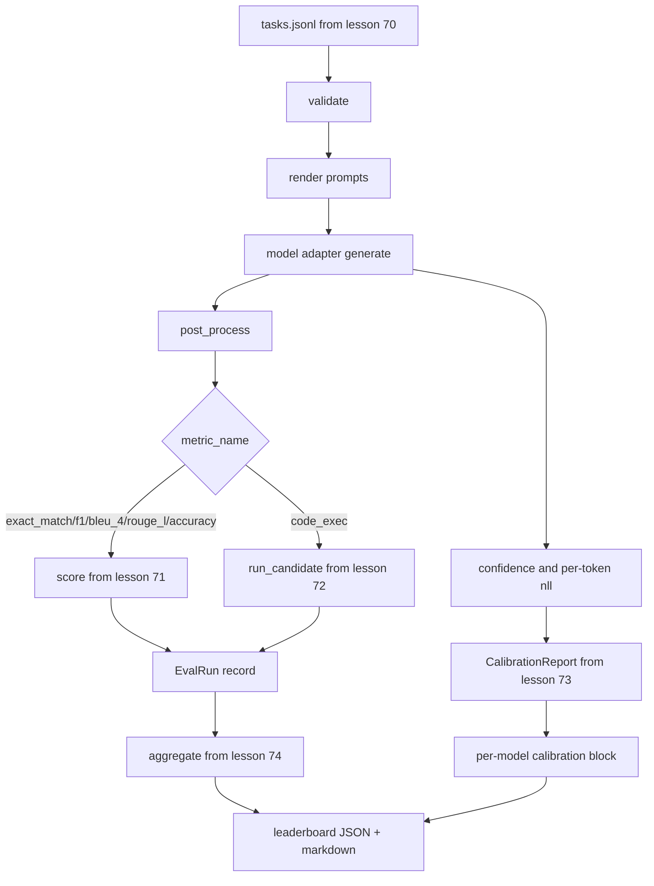

# 端到端评估运行器

> 五堂管道安装课，一堂胶水课。runner读取第 70 课中的任务规范，通过适配器调用模型，对第 71 课和第 72 课进行评分，附加第 73 课中的校准报告，并发出第 74 课中的排行榜。演示自行终止。

**Type:** Build
**Languages:** Python
**Prerequisites:** 第 19 期 Track B 基础，第 70 至 74 课
**Time:** ~90 分钟

## 学习目标

- 定义任何模型（模拟、本地、API）都可以通过小方法表面满足的 `ModelAdapter` 接口。
- 在固定 JSONL 文件上运行评估，并在工作池中并行执行任务。
- 一次性将度量层（exact_match、F1、BLEU-4、ROUGE-L、code_exec）与校准层组合在一起。
- 发出每个模型的 `EvalRun` 记录并将其直接输入排行榜聚合器。
- 同时输出 JSON 报告和 Markdown 表；在干净运行时以退出零自终止，在验证或运行时失败时以非零退出。

## 管道



runner是整合点。第 70 到 74 课中的每一课都有一个由runner编写的模块。runner不会复制这些模块中的任何逻辑：它会导入它们。

## 适配器接口

适配器是 runner 和任何模型之间的接口。接口故意很小。

```python
class ModelAdapter:
    model_id: str

    def generate(self, prompt: str, task: TaskSpec) -> Generation: ...
```

`Generation` 是一个数据类，具有：

- `text`：模型的自由格式输出
- `confidence`：`[0, 1]` 中的浮点数，表示模型自我报告的答案概率
- `token_nll`：生成token 的可选负对数似然总和
- `token_count`：生成token 的可选数量

运行器中的模拟适配器提供三种风格：`RuleBasedAdapter`（确定性，近乎完美），`NoisyAdapter`（过度自信，经常错误）和`BiasedAdapter`（擅长一个类别，糟糕于另一个类别）。该演示在第 70 课的 fixture 中运行了所有三个。

## 并行执行

runner使用 `concurrent.futures.ThreadPoolExecutor` 按模型并行运行任务。工作线程数默认为 8 和任务数中的较小者。线程就足够了，因为实际模型调用的瓶颈是网络 I/O。代码执行路径在任务内生成自己的子进程，执行器仅安排等待。

对于确定性测试，runner会公开 `run_eval(adapters, tasks, parallel=False)`，以便测试可以确定执行顺序。

## 单遍评分循环

对于每个任务：

1. 渲染提示（few-shot 前缀加上提示正文）。
2. 呼叫适配器并为呼叫计时。
3. 根据任务规则对生成进行后处理。
4. 调度到度量层。
5. 使用分数和指标元数据构建 `EvalRun` 记录。
6. 将 `(confidence, correct)` 对附加到校准缓冲区。

对于精确匹配样式指标（`exact_match`、`accuracy`、`code_exec`），`correct` 信号是 `score >= 1.0`，对于分级指标，`score >= 0.5` 信号是 `score >= 0.5`。阈值位于 `_correct_from_score` 中，并且运行器不会公开公共覆盖。

## 聚合

每个任务获得结果后，runner会调用第 74 课中的 `aggregate` 和 `pairwise_diffs` 以及第 73 课中的 `CalibrationReport.from_predictions`。输出是一个 JSON 信封：

```json
{
  "leaderboard": [...],
  "pairwise": [...],
  "calibration": {
    "model_id_a": {"ece": 0.04, "brier": 0.10, "populated_bins": 8, ...},
    ...
  },
  "summary": {
    "tasks": 10,
    "models": 3,
    "wall_seconds": 1.2
  }
}
```

runner还将 Markdown 表写入标准输出，以便用户可以将结果粘贴到 PR 评论中。

## 自终止演示

该演示会在第 70 课的十个 fixture 任务上运行三个模拟适配器。wall-clock 时间应少于十秒。干净运行时退出代码为零。

清洁运行标准是：

- 第 70 课中验证的每项任务。
- 第 71 课和第 72 课中的每项任务均计分。
- 第 73 课下汇总的校准报告没有错误。
- 排行榜将基于规则的适配器严格排在随机适配器之上。

如果其中任何一个中断，runner将以非零值退出，并在 JSON 信封中出现结构化错误。

## 本课不做什么

它不调用真实模型。它不实现 API 密钥流或速率限制处理。它不实现流式或部分生成；适配器每次调用都会返回一代。它不进行重试或缓存。这些问题存在于适配器层；runner与指标和提供者无关。

## 如何阅读代码

`main.py` 是集成。它通过一个小型 `_load_sibling` 帮助程序从其他五个课程模块导入，该帮助程序通过相对路径解析它们。数据类 `Generation`、`EvalReport` 和 `ModelAdapter` 是本地定义的。模拟适配器位于文件的底部。

从上到下阅读 `main.py`。浏览进口，然后查看 `run_eval`，然后是 `_score_one`，然后是适配器。最后的演示是切入点。

`code/tests/test_runner.py` 中的测试固定适配器接口、单通道循环、并行与顺序等效、校准缓冲区和 JSON 包络形状。

## 更进一步

这个runner就是地板。生产评估系统添加了：由 `(task_id, model_id, model_version)` 键控的结果缓存、跟踪每次运行的美元和token 的成本分类账、回退速率限制的重试层、pass-at-k 任务的采样策略以及长套件的流输出格式。其中每一个都是一个单独的关注点，它包装了运行器，而无需更改指标或聚合层。这种分离是合同的重点。

模拟工作后，为真正的提供程序添加适配器。选择一个免费等级，写三十行胶水，看着排行榜亮起。然后添加第二个提供程序并让线束完成工作。
