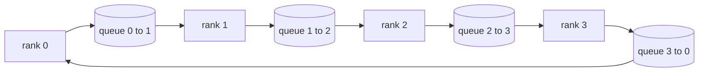

# 从零实现 Collective Ops

> 将分布式训练结合在一起的四个集体操作是allreduce、broadcast、allgather 和reduce_scatter。训练框架提供的所有其他原语都是这些原语的包装。在 `multiprocessing.Queue` 网格上构建一次它们，根据参考实现验证它们，轨道的其余部分就变成了管道。

**Type:** Build
**Languages:** Python
**Prerequisites:** 第 19 阶段 Track C 课程 42-49
**Time:** ~90 分钟

## 学习目标

- 在两次传递中实现环 allreduce（先reduce_scatter，然后allgather）并证明每列通信量为每个元素 2(N-1)/N 字节。
- 在 `multiprocessing.Queue` 上的点对点发送之上构建广播、allgather 和 reduce_scatter。
- 根据相同输入的 `torch.distributed` gloo 参考验证每个原语。
- 在集群形状、延迟下限和带宽上限方面捍卫环与树的选择。

## 问题

N 级上的简单 allreduce 将张量 N 次发送到根并广播 N 次。每个rank的带宽缩放为O(N)，根成为瓶颈，并且挂钟楼层是最慢的链接乘以N。Ring allreduce将其展平为大小为T/N的2(N-1)块，因此每个rank字节下降到2T(N-1)/N，与集群大小无关。 Tree allreduce 在小 N 和高延迟链路上获胜，因为深度是 log2(N) 跳而不是 2(N-1)。为集群形状选择错误的拓扑，最慢的 GPU 决定步骤时间。

您将在本教程中阅读的每个分布式训练框架都取决于这四个原语。 PyTorch DDP 将梯度与每个参数桶的一个 allreduce 同步。 ZeRO 通过 reduce_scatter 对优化器状态进行分片，并通过 allgather 广播更新的参数。 FSDP将fullforward变成了allgather加上reduce_scatter。管道并行需要广播以跨阶段组激活。如果您无法实现这四个集合，您就无法推理为什么训练会停止，为什么梯度不匹配会出现在第 3 级，或者为什么在交换拓扑时管道泡沫会加倍。

## 概念



### 分两遍进行 allreduce

将张量拆分为 N 个相等的块，索引为 0..N-1。每个rank 拥有与其rank 相等的块索引。第 1 遍，reduce_scatter，运行 N-1 步骤。在步骤 s，rank r 发送 chunk (r - s) mod N 到rank (r + 1) mod N，并从rank (r - 1) mod N 接收 chunk (r - s - 1) mod N，将接收到的 chunk 累积到其本地副本中。经过 N-1 步后，等级 r 拥有块 r 的全部总和。第 2 遍，全部收集，再运行 N-1 个步骤，并围绕环旋转完成的块，直到每个等级都保存每个块的全部总和。

|原语|每 rank 字节 |步骤|何时使用 |
|-----------|---------------|-------|-------------|
|Ring allreduce| 2T(N-1)/N | 2(N-1) |大 T、fat-pipe 同构集群 |
|Tree allreduce | T log2(N) | 2 log2(N) |小 T 或高延迟链路 |
|广播| T | log2(N) 树 |参数初始化，标量配置|
|allgather| T(N-1)/N | N-1 |分片转发，ZeRO 取消分片 |
|reduce_scatter | T(N-1)/N | N-1 | ZeRO 梯度分片 |

### 队列网格作为 NCCL 的替代品

NCCL 在 PCIe 和 NVLink 上运行，并减少了硬件卸载。在CPU上你没有这个。每个环边的 `multiprocessing.Queue` 为您提供与单个生产者和单个消费者的订购点对点交付。减少发生在用户空间中，因此您需要支付 Python 开销，但接线模式与 NCCL 环 allreduce 相同。关于队列版本和集群行为的正确性的原因如下。

### 针对 gloo 进行验证

每个原语都会进行单元测试，将其输出与在相同世界大小的相同张量上使用 gloo 后端初始化的 `torch.distributed` 进行比较。如果您的ring allreduce 与gloo 的偏差超过float32 epsilon，则测试失败。针对参考实现的验证是不可协商的；如果没有它，基元在实际训练运行的第 10000 步之前看起来都是正确的。

## 构建它

`code/main.py` 实现：

- `Mesh` 类，将 N 个 `multiprocessing.Queue` 实例连接到环中，并按等级公开 `send(dst, tensor)` 和 `recv(src)`。
- `ring_allreduce(mesh, rank, world_size, tensor)` 运行两遍算法。
- 对数树上的 `broadcast(mesh, rank, world_size, tensor, src)`。
- `allgather(mesh, rank, world_size, tensor)` 使用 N-1 轮换。
- `reduce_scatter(mesh, rank, world_size, tensor)`作为allreduce 的前半部分。
- `_gloo_reference(op, world_size, tensor)` 通过 `torch.distributed` 运行相同的输入，并使用 gloo 进行字节相等比较。

运行它：

```bash
python3 code/main.py
```

输出：比较队列网格和 gloo 输出的每个基元验证表，后面跟着一个证明 2T(N-1)/N 缩放的每列字节计数器。

## 野外生产模式

三种模式使基元足够坚固，可以交付。

**在 allreduce 之前对梯度进行分桶。** 1B 参数模型具有数万个梯度张量。每个张量进行一次 allreduce 会支付 N 倍的延迟下限。 DDP 将梯度存储为约 25 MB 的块，并为每个存储桶发出一个 allreduce；小张量骑在大张量的后面。如果不分桶，延迟开销将占据主导地位。

**通信与计算重叠。** Backward 以相反的顺序逐层计算梯度。当最后一层的梯度准备好时，开始其 allreduce，同时下一层继续计算。 PyTorch DDP 将其与桶就绪挂钩连接起来。当网络有闲置时，重叠会使可见的通信时间减半。

**根据消息大小而不是宗教来选择环或树。** NCCL 提供了一个拓扑检测器，可以为高于 ~1 MB 的消息选择环，为低于 1 MB 的消息选择树。交叉是带宽与延迟：超过 1 MB，带宽项 2T(N-1)/N 占主导地位，环获胜；低于 1 MB，log2(N) 跳数获胜。对一种拓扑进行硬编码会降低错误消息大小的吞吐量。

## 使用它

生产模式：

- **PyTorch DDP。** 在向后调用分桶梯度上的 `dist.all_reduce`。铲斗大小可调；对于 100Gbit 以太网，默认 25 MB 是合理的。
- **DeepSpeed ZeRO。** 发出reduce_scatter 来对梯度进行分片，并在转发之前进行allgather 来重建完整参数。本课程的原语正是 ZeRO 所做的调用。
- **FSDP.** 前向从 allgather 开始对层进行取消分片，计算，然后使用 reduce_scatter 进行缩减并丢弃取消分片。相同的原语，不同的时间表。

## 发货

使用第 77-81 课中的队列网格原语。第77课电线全部简化为DDP。第 78 课将 reduce_scatter 连接到 ZeRO。第 79 课将广播连接到管道激活中。第 81 课将所有四个内容组成了端到端演示。

## 练习

1.添加tree allreduce变体，并根据消息大小在环和树之间切换。测量交叉。
2. 添加 `recv_timeout_ms`，以便停滞的排名会出现截止日期错误，而不是永远挂起。
3. 将四个原语的 `multiprocessing.Queue` 替换为 TCP 套接字。相同的测试，真线。
4. 添加带宽检测挂钩，以便将每列字节计数器记录到 JSONL。
5. 比较大小为 1KB、1MB、16MB 的张量的 4 个等级上的环与树的挂钟时间。凭经验捍卫交叉。

## 关键术语

|术语 |人们怎么说|它实际上意味着什么 |
|------|----------------|------------------------|
|allreduce| “跨等级总和”|调用后，每个等级都保留相同的简化张量 |
|戒指| “快速拓扑”| N-1 个大小为 T/N 的块绕周期流动两次 |
|树| “日志拓扑”|归约遵循二叉树；深度为 log2(N) 跳 |
|allgather| “连接碎片”|每个等级都以其他等级的碎片结束 |
|reduce_scatter | “平分总和”|每个排名仅以一个块的总和结束 |
|桶| “融合小张量”|将N个小的全部合并为一个大的|

## 进一步阅读

- [PyTorch 分布式：NCCL 集体](https://pytorch.org/docs/stable/distributed.html#collective-functions)
- [Horovod环全减纸](https://arxiv.org/abs/1802.05799)
- 【NCCL拓扑和算法选择](https://docs.nvidia.com/deeplearning/nccl/user-guide/docs/index.html)
- [Patarasuk 和 Yuan，带宽最优 allreduce 算法](https://www.cs.fsu.edu/~xyuan/paper/09jpdc.pdf)
- 第 10 阶段第 05 课 - 分布式训练概述
- 第 19 阶段第 77 课 - DDP 连接在这些原语之上
