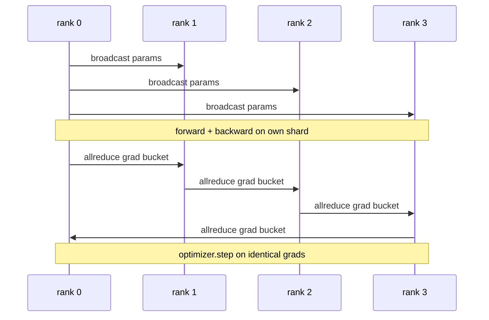

# 从头开始的数据并行 DDP

> DistributedDataParallel 是 allreduce 之上的一个钩子。包装一个模型，从 0 级开始广播初始参数，这样每个等级都开始相同，在每个发出梯度 allreduce 的参数上安装一个向后钩子，剩下的就是Gradient Descent。整个图案有200行。

**Type:** Build
**Languages:** Python
**Prerequisites:** 第 19 期 Track C 课程 42-49
**Time:** ~90 分钟

## 学习目标

- 连接一个 `DistributedDataParallel` 形状的包装器，该包装器广播初始参数并在向后后减少梯度。
- Spawn N CPU 在基于文件的会合的 gloo 后端上排名为 `torch.multiprocessing.spawn`。
- 通过在相同数据上顺序训练相同模​​型并显示每步参数等效性来证明梯度同步的正确性。
- 捍卫存储桶（梯度融合）和重叠（向后通信）的使用，将其作为将工作 DDP 转变为生产 DDP 的两个更改。

## 问题

具有 12 GB 激活量的 10 亿参数模型不适合一个消费级 GPU。即使合适，训练也需要数周时间。数据并行将批次分成 N 个等级，每个等级计算其分片上的前向和后向，并且在每一步中，每个等级的梯度都会相加，以便所有 N 个副本保持相同。求和梯度就是Optimizer所采用的。

如果没有梯度同步，N 个副本会在第 2 步发生分歧。该模型不再是“在更多数据上训练的一个模型”，而是碰巧共享初始权重的 N 个独立模型。如果梯度同步做得不好（每个参数一个 allreduce，没有重叠，没有分桶），网络就会成为瓶颈，GPU 会空闲等待线路。 DDP 的技术使梯度同步相对于计算来说几乎是免费的。规范的 PyTorch DDP 通过存储梯度、将 allreduce 与下一层的向后重叠以及在 NVLink 上使用 NCCL 来实现这一点。我们可以使用 gloo 在 CPU 上完成所有这三个任务，并吸取相同的教训。

## 概念



### DDP需要的三个操作

|舞台|集体|为什么 |
|-------|-----------|-----|
|初始化|从排名 0 开始广播 |每个排名都以相同的参数开始 |
|后退|各梯度的 allreduce |平均梯度是Optimizer所采用的 |
|有时|缓冲区广播| Batchnorm 运行统计数据保持同步 |

### 为什么是平均值而不是总和

Allreduce-SUM 除以 world_size 得出平均梯度。均值对于 world_size 是不变的：在一级调整的学习率在四级时有效，因为每步梯度幅度不会改变。不带除法的 Allreduce-SUM 会强制您在每次更改簇大小时重新调整学习率。 DDP 包装 SUM 并进行除法；在课程中做同样的事情。

### 为什么要使用桶梯度

Transformer有数千个参数张量。每个张量的一次 allreduce 会支付 gloo 延迟下限数千倍的费用。 DDP 将梯度分组到约 25 MB 的存储桶中，并为每个存储桶发出一个 allreduce。相同的总字节数在线路上移动，但延迟在存储桶上分摊。对于本课程的小模型，我们将所有内容分组到一个桶中；结构是承载的。

### 为什么要固定种子

每个rank必须调用`torch.manual_seed(seed + rank)`进行洗牌，但调用`torch.manual_seed(seed)`进行参数初始化。单个共享种子意味着每个等级都看到相同的批次顺序（击败数据并行）；参数的特定于等级的种子意味着初始参数与 float epsilon 不一致，并且梯度同步不再使副本相同。获得正确的种子模式，否则参数等效性测试将在步骤 1 中失败。

```figure
ci-ddp-grad-sync
```

## 构建它

`code/main.py` 实现：

- `MiniMLP`：3 层 MLP，小到足以在几秒钟内收敛，大到足以暴露布线。
- `DistributedDataParallel(model, world_size)`：在构造时广播参数，返回一个包装器，其 `sync_grads` 将累积的 allreduce 求和梯度除以 world_size。
- `worker(rank, world_size, ...)`：通过 Gloo、前进、后退、同步、步进进行 `torch.distributed` init 的完整训练循环。
- `_reference_single_process_loop(...)`：在一个等级上按顺序在相同数据上训练相同模​​型，用于在每一步之后测试字节相等参数等效性。

运行它：

```bash
python3 code/main.py
```

输出：每步训练表，将单进程损失和参数校验和与在 4 个等级上运行的 DDP 进行比较。两条路径对浮动 epsilon 产生相同的损耗曲线，证明梯度同步是正确的。

## 野外生产模式

三种模式使 DDP 硬化到足以发货。

**查找未使用的参数。** 某些转发路径有条件地跳过参数（提前退出、专家混合路由器）。跳过的参数没有梯度，但DDP的bucket-ready钩子仍然等待它们并且allreduce死锁。 `find_unused_parameters=True` 告诉 DDP 在减少之前查看哪些参数获得了梯度。成本是每一步的图形行走，所以除非你的前向分支，否则不要考虑它。

**静态图优化。** 当转发跨步骤稳定时，`static_graph=True` 让 DDP 预先计算存储桶调度。优化在规模上很重要：预计算每一步节省了几毫秒，这在 10000 个步骤中复合。

**梯度累积需要小心。** 在 K 个微批次上累积梯度而不同步每个微批次可实现 10 倍的吞吐量提升。 DDP 将 `no_sync()` 公开为上下文管理器，用于暂停后向 allreduce。忘了经理，你就白白减少了K次；吞吐量下降到最低点。

## 使用它

生产模式：

- **PyTorch DDP。** 规范的实现。 `torch.nn.parallel.DistributedDataParallel(model)` 连接分桶、重叠和 no_sync 上下文。
- **HuggingFace Accelerate。** 添加一个处理 `torchrun` 环境变量和模型包装的启动器。底层的 DDP 相同。
- **Megatron-LM 数据并行。** 将 DDP 与张量并行结合起来用于大型模型；数据并行部分是相同的 allreduce-after-backward 模式。

## 发货

第 78 课（ZeRO 分片）将每个参数的 allreduce 替换为 reduce_scatter，因此每个等级仅存储其Optimizer状态的分片。第 81 课将 DDP 与 ZeRO 组合成端到端演示。

## 练习

1. 添加可配置大小的梯度桶，并在更深的模型上测量与每个参数一个 allreduce 的加速比。
2. 将 `no_sync()` 实现为上下文管理器，并验证梯度累积与 K 个微批次上的单进程基线相匹配。
3.添加`find_unused_parameters`模式，其中前向有时会跳过其中一个MLP层；如果没有该标志，运行将陷入僵局。
4.将gloo替换为`torch.distributed.barrier()`-only同步，感受一下基于allreduce 的同步和基于barrier的同步的区别。
5. 测量批量大小为 1、16、256 的梯度同步开销作为步长时间的一部分，并解释缩放比例。

## 关键术语

|术语 |人们怎么说|它实际上意味着什么 |
|------|----------------|------------------------|
|DDP | “数据并行” |广播参数并减少每一步梯度的包装器 |
|桶| “保险丝梯度”| N组小都化为一大|
|重叠| “隐藏通讯” |当后面的层仍在向后计算时发出 allreduce |
|无同步 | 「积累」|跳过后向 allreduce 进行梯度累积 |
|查找未使用的 | “分支前进”|减少之前检测无梯度的参数 |

## 进一步阅读

- [PyTorch 分布式数据并行文档](https://pytorch.org/docs/stable/generated/torch.nn.parallel.DistributedDataParallel.html)
- 【PyTorch DDP内部教程](https://pytorch.org/tutorials/intermediate/ddp_tutorial.html)
- [Li等人，PyTorch分布式：加速数据并行训练的经验](https://arxiv.org/abs/2006.15704)
- 第 19 阶段第 76 课 - DDP 所建立的集体
- 第 19 阶段第 78 课 - ZeRO 分片将每个参数的 allreduce 替换为 reduce_scatter
